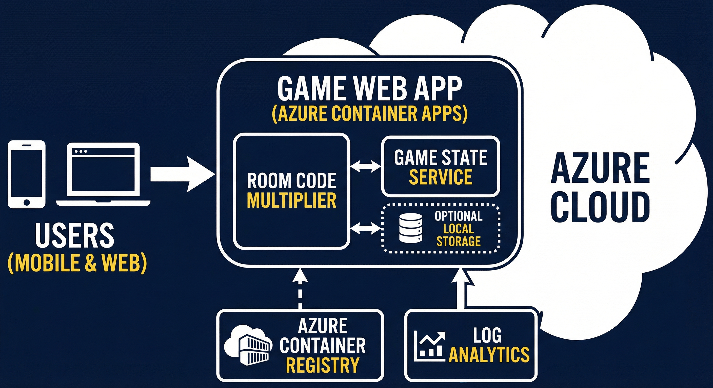
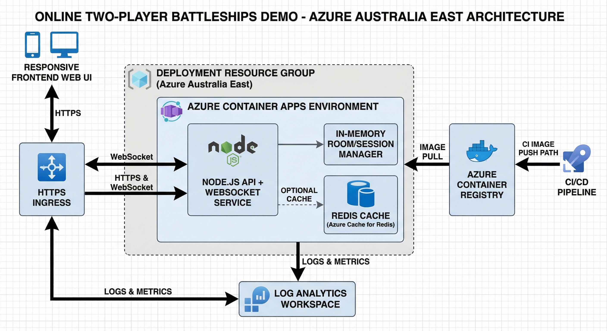

# Battleships Demo App — Detailed Design

## 1. Overview
This document defines the detailed design for a two-player online Battleships demo app targeting Azure Australia East, with responsive web/mobile UX and low operating cost.

## 2. System Context
- Clients: Mobile and desktop browsers
- Backend: Node.js service exposing HTTP + WebSocket
- Platform: Azure Container Apps
- Container source: Azure Container Registry (Basic)
- Observability: Log Analytics Workspace

## 3. Diagrams

### 3.1 Simple Architecture Diagram


### 3.2 Technical Architecture Diagram


## 4. Component Design

### 4.1 Frontend
- Single-page web interface
- Responsive layout for phone and desktop
- Two boards: own fleet board + target board
- Room code create/join flow
- Real-time turn and result updates

### 4.2 Backend API + Realtime
- REST endpoints for room creation/join bootstrap
- WebSocket channel for gameplay actions/events
- In-memory session store for demo rooms
- Server-authoritative game state transitions

### 4.3 Game Engine
- Ship placement validation (bounds/overlap)
- Turn enforcement
- Hit/miss/sunk detection
- Win condition when all ships of opponent are sunk

## 5. Data Model (demo)
- Room { id, createdAt, status, players[] }
- Player { id, name?, board, ready }
- GameState { turn, shots, sunkShips, winner }

## 6. API / Event Contracts (example)
- `createRoom` -> `{ roomCode }`
- `joinRoom(roomCode)` -> `{ playerSlot }`
- `placeShips(layout)` -> `ack | validation error`
- `fire(cell)` -> `{ result: hit|miss|sunk, nextTurn }`
- `stateUpdate` broadcast on each valid move

## 7. Security & Reliability
- TLS/HTTPS ingress only
- Input/schema validation on all actions
- Rate limit room creation attempts
- Basic anti-cheat: authoritative server checks
- Graceful reconnect handling by room token/session

## 8. Deployment Design
- Azure Resource Group: `rg-mat-ttt-demo-aue`
- Container App in Australia East
- CPU/memory minimal for demo
- Min replicas 0, max replicas 1 (or 2 if needed)
- Image builds via ACR build and deploy by image tag

## 9. Testing Strategy
- Unit tests for game rules
- Integration tests for room lifecycle
- Smoke tests for mobile and desktop flows
- Basic latency and reconnect checks

## 10. Operations Runbook (summary)
- Deploy: build image -> update container app image
- Rollback: redeploy prior image tag
- Observe: query app logs in Log Analytics
- Cost control: keep scale-to-zero and low log retention

## 11. Open Issues / Future Enhancements
- Persistent game sessions (Redis/DB)
- Optional auth/player profiles
- Match history and leaderboard
- Bot opponent mode

## 12. Step-by-Step Manual Rebuild & Install Guide

### 12.1 Environment
- Machine: `DESKTOP-A4E586N`
- Environment: WSL Linux shell
- Azure login required: `az login`

### 12.2 Prerequisites
```bash
# Azure CLI + Container Apps extension available
az --version

# Verify subscription
az account show
```

### 12.3 Create project files
```bash
mkdir -p /home/mat/.openclaw/workspace/battleships-demo/public
cd /home/mat/.openclaw/workspace/battleships-demo
# Add: package.json, server.js, public/index.html, Dockerfile, .dockerignore
```

### 12.4 Azure resource setup (one-time)
```bash
RG="rg-mat-ttt-demo-aue"
LOC="australiaeast"
ENVN="env-mat-ttt-demo"
ACR="mattttdemoacr02280946"

az group create -n "$RG" -l "$LOC"
```

### 12.5 Build and push image
```bash
TAG="battleships-demo:$(date +%Y%m%d%H%M%S)"
az acr build -r "$ACR" -t "$TAG" /home/mat/.openclaw/workspace/battleships-demo
```

### 12.6 Deploy to Container Apps
```bash
APP="mat-battleships-demo"
USERN=$(az acr credential show -n "$ACR" --query username -o tsv)
PASS=$(az acr credential show -n "$ACR" --query passwords[0].value -o tsv)

# Create (first time)
az containerapp create -g "$RG" -n "$APP" \
  --environment "$ENVN" \
  --image "$ACR.azurecr.io/$TAG" \
  --target-port 3000 \
  --ingress external \
  --registry-server "$ACR.azurecr.io" \
  --registry-username "$USERN" \
  --registry-password "$PASS" \
  --cpu 0.25 --memory 0.5Gi --min-replicas 0 --max-replicas 1

# Update (subsequent deploys)
az containerapp registry set -g "$RG" -n "$APP" \
  --server "$ACR.azurecr.io" \
  --username "$USERN" \
  --password "$PASS"

az containerapp update -g "$RG" -n "$APP" --image "$ACR.azurecr.io/$TAG"
```

### 12.7 Get live URL
```bash
az containerapp show -g "$RG" -n "$APP" --query properties.configuration.ingress.fqdn -o tsv
```

### 12.8 Rollback procedure
```bash
# Find older tag
az acr repository show-tags -n "$ACR" --repository battleships-demo --orderby time_desc --top 10 -o table

# Redeploy a previous tag
OLD_TAG="battleships-demo:<previous-tag>"
az containerapp update -g "$RG" -n "$APP" --image "$ACR.azurecr.io/$OLD_TAG"
```

### 12.9 Optional teardown
```bash
az group delete -n "$RG" --yes --no-wait
```
