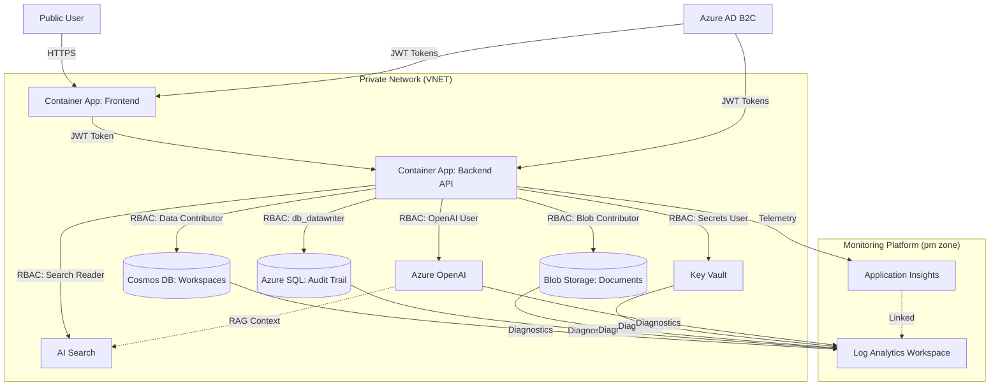
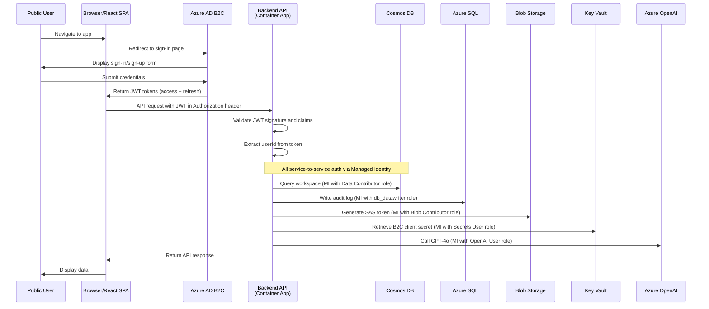
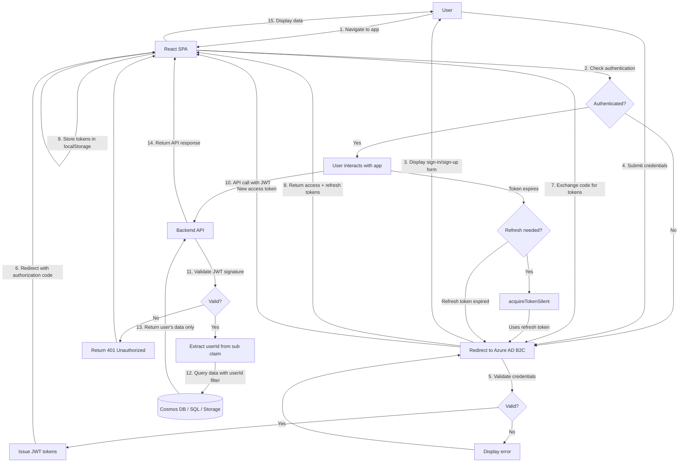
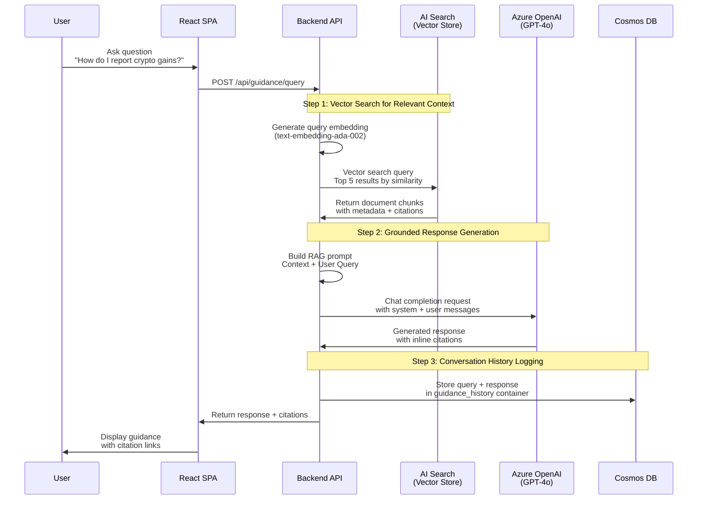

## Solution Overview

The **NZ Tax Copilot** is an Azure-hosted web application that enables New Zealand individual taxpayers to prepare their IR3 income tax returns through an intuitive, guided workflow. The prototype demonstrates a complete end-to-end tax preparation system from user registration through draft return generation and export, specifically targeting the technical and stakeholder validation requirements for architecture feasibility, crypto transaction handling, and IRD-grounded assistance capabilities.

### Primary User Journey

A New Zealand taxpayer visits the application and creates an account to begin tax preparation. They select or create a tax year workspace (e.g., 2024 tax year) and are guided through a conditional questionnaire that determines which income categories and deductions apply to their situation. Based on their responses, the system presents relevant data entry forms where they:

1. **Enter income data** across multiple categories (salary/wages, self-employment, investment income, rental income, etc.)
2. **Upload supporting documents** (employer summaries, bank statements, receipts, invoices) as evidence for their entries
3. **Record cryptocurrency transactions** with acquisition dates, disposal dates, costs, and proceeds — the system automatically calculates capital gains/losses
4. **Request IRD guidance** at any point through an AI-powered assistant that provides accurate, grounded responses based on official Inland Revenue guidance

As the user progresses, the system continuously maps their entries to specific IR3 box codes, performs real-time validation, and maintains a complete audit trail of all data entry, document uploads, and calculation steps. When ready, the user can preview their draft tax return, review the calculated totals for each IR3 section, and export a summary document suitable for review or submission preparation.

### What This Architecture Demonstrates

This prototype validates the **Azure service topology and integration patterns** required to deliver a secure, scalable, public-facing tax application. It proves:

- **Public user authentication and authorization** with secure session management and data isolation between taxpayers
- **Structured data collection workflow** with conditional branching based on user circumstances
- **Document storage and management** with secure upload, retrieval, and audit logging
- **Complex financial calculations** including crypto capital gains across multiple transactions and tax years
- **AI-powered assistance** that retrieves and presents IRD guidance grounded in official tax documentation
- **Comprehensive audit logging** capturing every user action, data change, and system calculation for compliance and debugging
- **Export capability** generating draft tax return summaries that map user data to official IR3 structure
- **Azure security baseline** with managed identity, private endpoints, encryption, and RBAC enforced across all services

The architecture is designed as a **prototype for demonstration purposes**, using cost-effective Azure SKUs and simplified configurations suitable for technical validation and stakeholder presentations. All shortcuts taken (single-region deployment, basic tier services, manual deployment) are documented with a clear upgrade path to production-ready configurations.

This prototype does **not** integrate directly with the IRD myIR system, implement production-grade fraud detection, or include full CI/CD automation — these capabilities are scoped for post-prototype production development.

## Architecture Decisions

This section documents the key technology and design choices made to address the open items identified during discovery. Each decision balances prototype demonstration needs with a clear production upgrade path.

### AD-001: Frontend Technology Stack — React SPA with TypeScript

**Decision**: Single-page application (SPA) using React 18+ with TypeScript, hosted on Azure Static Web Apps or Azure Container Apps with nginx.

**Rationale**:
- **User experience requirements**: Tax preparation involves complex multi-step workflows, conditional questionnaires, real-time validation, and dynamic form rendering based on user responses. A SPA provides the responsive, desktop-like experience required for extended data entry sessions without page reloads.
- **State management**: Tax workspace data, questionnaire state, and calculation previews require client-side state management. React Context API or Redux Toolkit provides the necessary state coordination across components.
- **TypeScript safety**: Strong typing reduces runtime errors in financial calculation display, IR3 box mapping, and crypto transaction handling — critical for a tax application where data accuracy is paramount.
- **Azure deployment options**: Static Web Apps provides cost-effective hosting with built-in CI/CD for the prototype; Container Apps offers more control for production with custom nginx configuration, caching, and route handling.

**Production considerations**: Production deployment should use Container Apps with CDN caching, route-based code splitting for performance, and comprehensive error boundary handling.

### AD-002: Backend API Framework — Python with FastAPI

**Decision**: RESTful API using Python 3.11+ with FastAPI framework, deployed on Azure Container Apps.

**Rationale**:
- **Crypto calculation libraries**: Python has mature libraries for financial calculations and date arithmetic required for crypto capital gains (pandas for transaction analysis, decimal for precise monetary calculations).
- **Azure SDK maturity**: Excellent Python SDK support for all required Azure services (Cosmos DB, Blob Storage, OpenAI, Key Vault, Application Insights).
- **FastAPI advantages**: Automatic OpenAPI documentation, built-in request/response validation with Pydantic models, async support for concurrent operations, and straightforward dependency injection for Azure service clients.
- **IR3 mapping logic**: Tax calculation rules and IR3 box mapping are easier to express and maintain in Python than strongly-typed languages — the business logic complexity favours readability over compile-time type safety.
- **Rapid prototyping**: FastAPI's automatic validation and minimal boilerplate accelerate prototype development for stakeholder demos.

**Production considerations**: Production deployment requires comprehensive unit and integration test coverage (pytest), structured logging with correlation IDs, and performance profiling for crypto batch calculations.

### AD-003: Data Model Approach — Hybrid: Cosmos DB for Workspaces, Azure SQL for Audit

**Decision**: Azure Cosmos DB (NoSQL API) for tax workspaces and user data; Azure SQL Database for audit trail and reporting.

**Rationale**:
- **Workspace flexibility**: Tax workspace data has a variable schema — different users have different income categories, questionnaire responses vary by circumstance, and crypto transaction lists are unbounded. Document store (Cosmos DB) accommodates this variability without schema migrations.
- **Query patterns**: Primary access pattern is "retrieve all data for user X's tax year Y workspace" — a document store serves this partition-key-based query efficiently. Cosmos DB session consistency provides read-your-writes guarantees for immediate UI updates after data entry.
- **Audit requirements**: Audit trail requires relational queries across users, time ranges, and event types for compliance reporting. Azure SQL provides the query flexibility, indexing, and aggregation capabilities needed for audit analysis.
- **Separation of concerns**: Separating operational data (Cosmos) from audit data (SQL) allows independent scaling, backup policies, and query optimization for each workload.

**Production considerations**: Implement partitioning strategy in Cosmos DB by `userId` for even distribution; use Cosmos DB TTL for workspace soft-delete; configure SQL read replicas for reporting queries.

### AD-004: Document Processing — Storage-Only with Metadata Indexing

**Decision**: Azure Blob Storage for document storage; metadata (filename, size, upload date, associated workspace/income entry) stored in Cosmos DB workspace documents. No OCR or extraction in prototype.

**Rationale**:
- **Prototype scope**: Document upload requirement is evidence attachment, not data extraction. Users manually enter income amounts — documents serve as verification artifacts for audit purposes.
- **Cost efficiency**: AI Document Intelligence or Form Recognizer would add significant cost and complexity for prototype demonstration without delivering core functional value (the system doesn't need to read document contents).
- **Audit trail**: Blob storage audit logging captures document access events; Cosmos DB metadata links documents to specific income entries and tracks upload timestamps.

**Production considerations**: Production implementation may add OCR and extraction for bank statements and employer summaries to pre-fill income entries, requiring AI Document Intelligence integration and validation workflows.

### AD-005: IRD Guidance Implementation — RAG with Azure OpenAI and AI Search

**Decision**: Retrieval-Augmented Generation (RAG) using Azure OpenAI (GPT-4o) with Azure AI Search as the vector store for IRD guidance documents.

**Rationale**:
- **Grounding requirement**: IRD guidance must be accurate and traceable to official sources. Simple keyword lookup lacks context understanding; pure GPT-4o without grounding risks hallucination. RAG combines vector search (finds relevant IRD guidance) with LLM generation (synthesizes natural language response).
- **Azure AI Search capabilities**: Built-in vector search, semantic ranking, and indexing of IRD guidance PDFs and web content. Supports hybrid search (keyword + vector) for better retrieval precision.
- **OpenAI integration**: Azure OpenAI provides enterprise-grade GPT-4o with data residency in australiaeast region, managed identity authentication, and content filtering policies.
- **Prototype simplicity**: RAG pipeline requires indexing IRD content once (offline process), then serves queries via search + completion calls — no custom ML model training or fine-tuning required.

**Implementation approach**:
1. Ingest IRD guidance documents (IR3 guide, self-employment guide, crypto tax guidance) into AI Search with text chunking and embedding generation
2. User query triggers vector search to retrieve top 5 relevant chunks
3. Retrieved chunks provided as context to GPT-4o with system prompt: "Answer tax questions using only the provided IRD guidance. If the guidance doesn't cover the question, say so."
4. Response includes citations to source guidance sections for user verification

**Production considerations**: Implement query intent classification to route simple lookups to search-only path (faster, cheaper); add feedback mechanism for users to flag incorrect guidance; regularly update index with new IRD publications.

### AD-006: Crypto Transaction Processing — Synchronous Calculation with Caching

**Decision**: Calculate crypto capital gains synchronously per-transaction on entry/edit; cache workspace-level totals; no batch processing infrastructure for prototype.

**Rationale**:
- **User experience**: Users expect immediate feedback when entering crypto transactions (e.g., "You've realized $X in capital gains so far"). Synchronous calculation provides instant validation and running totals.
- **Calculation complexity**: NZ crypto tax uses FIFO cost basis — requires iterating through acquisition history for each disposal to determine cost basis. This is computationally feasible for individual user scale (hundreds of transactions) but requires efficient algorithm implementation.
- **Prototype scale**: Expected demo load is single-digit concurrent users with <100 crypto transactions per workspace. Synchronous calculation is adequate; batch processing would add unnecessary complexity.
- **Caching strategy**: Store calculated gains/losses in Cosmos DB workspace document; recalculate only when user edits affected transactions; cache workspace-level totals for IR3 preview.

**Algorithm approach**:
```
For each disposal transaction:
  1. Retrieve all prior acquisitions with remaining balance (FIFO queue)
  2. Match disposal quantity against acquisitions in chronological order
  3. Calculate gain/loss as (proceeds - cost_basis) for matched quantity
  4. Update remaining acquisition balances
  5. Store per-disposal gain/loss in workspace document
```

**Production considerations**: Implement async batch recalculation for large transaction histories (>1000 transactions); add calculation result caching with dependency tracking; optimize acquisition queue queries with indexing.

### AD-007: Authentication Method — Azure AD B2C with Email/Password

**Decision**: Azure Active Directory B2C (Azure AD B2C) with email/password sign-up flow, deployed in australiaeast region.

**Rationale**:
- **Public user requirement**: Tax application serves general public (not enterprise users), requiring consumer identity management with self-service registration. Azure AD B2C is purpose-built for this scenario.
- **NZ compliance**: Email/password authentication meets NZ tax application requirements; social provider login (Google, Microsoft) deferred to production to reduce prototype scope.
- **Azure integration**: Native integration with App Service / Container Apps authentication (EasyAuth); managed identity for B2C management API calls; built-in MFA support for production upgrade.
- **Session management**: B2C handles token issuance, refresh, and expiration; frontend receives JWT tokens; backend validates tokens via Azure SDK without custom session storage.
- **Prototype simplicity**: B2C user flows provide pre-built sign-up/sign-in pages; no custom UI development required for authentication screens in prototype.

**Configuration**:
- User flow: Email sign-up with email verification
- Token lifetime: 1 hour access token, 24 hour refresh token (configurable)
- Claims: `sub` (user ID), `email`, `given_name`, `family_name`
- Password policy: Min 8 characters, complexity requirements enforced

**Production considerations**: Add MFA enrollment, social identity providers (Google, Microsoft), custom branding for sign-in pages, and account recovery workflows.

### AD-008: Export Format — PDF Summary with IR3 Box Mapping

**Decision**: Generate PDF export containing draft tax return summary with IR3 box labels, calculated totals, and supporting detail tables. No myIR integration or digital signature in prototype.

**Rationale**:
- **User deliverable**: PDF provides a tangible output for stakeholder demo and user review. Format is familiar to taxpayers and suitable for printing or emailing to tax advisor.
- **IR3 mapping**: PDF displays income and deduction categories mapped to official IR3 box codes (e.g., "Box 1: Salary and Wages - $X", "Box 20: Crypto Capital Gains - $Y"), demonstrating the system's understanding of tax return structure.
- **No submission capability**: Prototype scope explicitly excludes myIR integration. PDF serves as "draft for review" rather than submittable return.
- **Library choice**: Python `reportlab` or `weasyprint` for server-side PDF generation from HTML template; FastAPI endpoint returns PDF as binary response with `Content-Disposition: attachment`.

**Export contents**:
- User and tax year metadata (name, IRD number, tax year)
- Income summary by category with IR3 box codes
- Deduction summary (if applicable)
- Crypto transaction summary with capital gains breakdown
- Supporting detail tables (list of income entries, crypto transactions)
- Audit timestamp and workspace version

**Production considerations**: Add CSV export for spreadsheet import; implement myIR XML format for direct submission; support digital signatures via Azure Key Vault certificates.

### AD-009: Multi-User Isolation — Partition Key by User ID

**Decision**: Cosmos DB partition key is `userId`; all queries filtered by authenticated user's `sub` claim from B2C token; no cross-user data access in API layer.

**Rationale**:
- **Data isolation**: Each taxpayer's data must be strictly isolated. Partition key ensures physical data separation in Cosmos DB; query filters enforce logical separation in API layer.
- **Authorization model**: API extracts `sub` claim from validated JWT token; all database queries include `WHERE userId = @current_user`; no API endpoint allows cross-user queries.
- **Audit trail**: SQL audit table includes `userId` and `actionPerformedBy` (always matches authenticated user); detects any authorization bypass attempts.

**Implementation pattern**:
```python
# FastAPI dependency injection
def get_current_user(token: str = Depends(oauth2_scheme)) -> str:
    payload = jwt.decode(token, verify=True)
    return payload["sub"]

# Controller
@app.get("/workspaces")
async def list_workspaces(user_id: str = Depends(get_current_user)):
    # Cosmos DB query automatically scoped to partition key
    return cosmos_client.query_items(
        query="SELECT * FROM c WHERE c.userId = @userId",
        parameters=[{"name": "@userId", "value": user_id}]
    )
```

**Production considerations**: Add role-based access for tax professionals to view client workspaces; implement workspace sharing with explicit consent; add admin audit interface with restricted RBAC.

### AD-010: Prototype Scale Assumptions — 10 Concurrent Users, 1000 Workspaces

**Decision**: Prototype sized for 10 concurrent users, 1000 total workspaces, 100GB blob storage, and 100 requests/second peak API load.

**Rationale**:
- **Demo scenario**: Technical and stakeholder demos involve small groups (1-5 users); load testing validates up to 10 concurrent sessions.
- **Azure SKU selection**: These assumptions drive service tier choices: Cosmos DB serverless (5000 RU/s auto-scale), Container Apps consumption plan (0.5 vCPU per replica), SQL Basic tier (5 DTU sufficient for audit writes).
- **Cost optimization**: Prototype remains under $200/month Azure spend with these scale assumptions; production scale requires reserved capacity and premium SKUs.

**Production considerations**: Re-size based on actual usage: Cosmos DB provisioned throughput (10,000+ RU/s), Container Apps dedicated plan with autoscale (2-10 replicas), SQL Standard tier with read replicas, CDN for frontend assets.

### Decision Summary Matrix

| Decision ID | Area | Choice | Primary Driver |
|-------------|------|--------|---------------|
| AD-001 | Frontend | React SPA + TypeScript | Complex workflow UX, state management |
| AD-002 | Backend | Python + FastAPI | Crypto calculation libraries, rapid prototyping |
| AD-003 | Data Model | Cosmos DB + Azure SQL hybrid | Workspace flexibility + audit queries |
| AD-004 | Documents | Storage-only, no OCR | Prototype scope, cost efficiency |
| AD-005 | IRD Guidance | RAG with OpenAI + AI Search | Grounding accuracy, context understanding |
| AD-006 | Crypto | Synchronous calculation + caching | UX responsiveness, prototype scale |
| AD-007 | Authentication | Azure AD B2C email/password | Public user management, Azure integration |
| AD-008 | Export | PDF with IR3 mapping | Stakeholder demo, no myIR integration |
| AD-009 | Isolation | Partition key by userId | Data security, authorization enforcement |
| AD-010 | Scale | 10 concurrent, 1000 workspaces | Prototype demo load, cost optimization |

All decisions prioritize **prototype demonstration value** while maintaining **production upgrade feasibility**. Deferred capabilities (myIR integration, OCR, MFA, advanced scaling) are explicitly scoped for post-prototype development and documented in the Production Backlog section.

## Azure Services

This section provides the complete catalog of Azure services required for the NZ Tax Copilot prototype, including specific SKUs, configuration rationale, and mapping to functional requirements. All services follow the Microsoft Azure Landing Zone naming convention with the `zd` (Development Zone) prefix for application resources and `pm` (Management Platform) prefix for monitoring infrastructure.

### Service Catalog Overview

| Service | Resource Name | SKU/Tier | Monthly Cost (Est.) | Purpose |
|---------|---------------|----------|---------------------|---------|
| Azure AD B2C | `nz-tax-copilot-b2c` | Free (50k MAU) | $0 | Public user authentication |
| Container Apps Environment | `zd-cae-tax-dev-aue` | Consumption | Variable | Hosting environment for API and frontend |
| Container App (API) | `zd-ca-api-dev-aue` | Consumption (0.5 vCPU, 1GB) | ~$20 | Backend REST API |
| Container App (Frontend) | `zd-ca-web-dev-aue` | Consumption (0.25 vCPU, 0.5GB) | ~$10 | React SPA with nginx |
| Cosmos DB Account | `zd-cosmos-tax-dev-aue` | Serverless, NoSQL API | ~$25 | Tax workspaces and user data |
| Azure SQL Database | `zd-sql-tax-dev-aue` | Serverless, Basic (0.5-1 vCore) | ~$15 | Audit trail and compliance logging |
| Storage Account | `zdsttaxdevaue` | Standard LRS, Hot tier | ~$10 | Document and evidence storage |
| Azure OpenAI | `zd-openai-tax-dev-aue` | Standard (GPT-4o, Pay-as-you-go) | ~$30 | IRD guidance assistance |
| AI Search | `zd-search-tax-dev-aue` | Basic tier | ~$75 | Vector store for IRD guidance RAG |
| Key Vault | `zd-kv-tax-dev-aue` | Standard tier | ~$5 | Secrets and connection configuration |
| Log Analytics Workspace | `pm-log-tax-dev-aue` | Pay-as-you-go (5GB/month) | ~$10 | Centralized logging and audit queries |
| Application Insights | `pm-appi-tax-dev-aue` | Workspace-based | Included | Application performance monitoring |
| Virtual Network | `zd-vnet-tax-dev-aue` | Standard | $0 | Network isolation for services |
| Container Registry | `zdcrtaxdevaue` | Basic tier | ~$5 | Container image storage |

**Total Estimated Monthly Cost**: ~$205 USD (excludes data transfer and usage overages)

---

### Core Compute Services

#### Container Apps Environment: `zd-cae-tax-dev-aue`

**Service Type**: Microsoft.App/managedEnvironments@2025-06-01

**SKU/Configuration**:
- Plan: Consumption (serverless)
- Zone redundancy: Disabled (single-zone for prototype)
- VNET integration: Enabled (dedicated subnet `snet-container-apps`)
- Internal load balancer: Disabled (external ingress required for public access)

**Rationale**:
- **Consumption plan** provides auto-scaling from zero for cost efficiency during non-demo periods; scales to 10 replicas under load
- **VNET integration** enables private endpoint connectivity to Cosmos DB, SQL, Storage, and Key Vault while maintaining public ingress for user traffic
- **Single environment** hosts both API and frontend containers, simplifying networking and reducing management overhead for prototype

**Functional Requirements Mapping**:
- Hosts all application compute workloads (backend API, frontend SPA)
- Provides auto-scaling for concurrent user sessions
- Supports managed identity for service-to-service authentication

**Production Considerations**: Upgrade to dedicated plan (Consumption Workload Profile) with reserved capacity for predictable performance; enable zone redundancy for high availability; implement blue/green deployment slots.

#### Container App (Backend API): `zd-ca-api-dev-aue`

**Service Type**: Microsoft.App/containerApps@2025-06-01

**SKU/Configuration**:
- CPU: 0.5 vCPU per replica
- Memory: 1 GB per replica
- Replicas: Min 1, Max 10 (auto-scale on CPU >70% or HTTP queue depth >10)
- Ingress: External, HTTPS-only, port 8000
- Health probes: Liveness (`/health`), Readiness (`/ready`)
- Managed identity: System-assigned enabled
- Environment variables: Azure SDK endpoints (via Key Vault references)

**Rationale**:
- **0.5 vCPU / 1GB** sufficient for FastAPI application serving 10 concurrent users with crypto calculation workload; Python async event loop handles I/O-bound operations efficiently
- **Auto-scale on CPU and queue depth** ensures responsiveness during demo load spikes; min 1 replica avoids cold start delays for stakeholder presentations
- **External ingress** required for React SPA to call API endpoints; Azure AD B2C token validation secures all routes
- **System-assigned managed identity** provides credential-free access to Cosmos DB (Data Contributor), SQL (db_datawriter), Storage (Blob Data Contributor), Key Vault (Secrets User), and OpenAI (Cognitive Services OpenAI User)

**Functional Requirements Mapping**:
- Implements all REST API endpoints (authentication, workspace CRUD, income/crypto entry, IRD guidance, calculation, export)
- Executes crypto capital gains calculations synchronously per-transaction
- Generates PDF exports via `reportlab` library
- Maintains audit trail by writing to SQL Database on every data mutation

**Security Configuration**:
- HTTPS-only enforcement (TLS 1.2+)
- CORS policy: Allow `zd-ca-web-dev-aue.azurecontainerapps.io` origin only
- JWT validation: Azure AD B2C token issuer and audience claims verified via `azure-identity` SDK
- Secrets access: All connection configuration via Key Vault references (no plaintext secrets in environment variables)

**Production Considerations**: Increase to 1 vCPU / 2GB for production load; implement request rate limiting; add distributed caching (Azure Cache for Redis) for workspace-level calculation results; enable session affinity for WebSocket support.

#### Container App (Frontend): `zd-ca-web-dev-aue`

**Service Type**: Microsoft.App/containerApps@2025-06-01

**SKU/Configuration**:
- CPU: 0.25 vCPU per replica
- Memory: 0.5 GB per replica
- Replicas: Min 1, Max 5 (auto-scale on CPU >60%)
- Ingress: External, HTTPS-only, port 80
- Managed identity: System-assigned (for Application Insights connection)
- Container: nginx serving React production build

**Rationale**:
- **0.25 vCPU / 0.5GB** adequate for static asset serving via nginx; React SPA is pre-built JavaScript bundle with minimal server-side processing
- **nginx container** provides efficient static file serving, gzip compression, and HTTP caching headers for optimal frontend performance
- **Minimal replicas** (1-5) sufficient for prototype load; nginx handles hundreds of concurrent connections per replica
- **External ingress** required for public user access to web application

**Functional Requirements Mapping**:
- Serves React SPA for all tax preparation UI workflows (registration, questionnaire, income entry, crypto transactions, export)
- Hosts static assets (JavaScript bundles, CSS, images)
- Implements client-side routing for SPA navigation

**Security Configuration**:
- HTTPS-only enforcement with automatic TLS certificate (Azure-managed)
- Content Security Policy headers via nginx configuration
- API calls to backend include B2C JWT token in Authorization header
- No sensitive data cached in nginx (all state managed in React via backend API calls)

**Production Considerations**: Deploy behind Azure Front Door with CDN caching for global performance; implement route-based code splitting for faster initial load; add custom domain with CA-signed certificate.

---

### Data Services

#### Cosmos DB Account: `zd-cosmos-tax-dev-aue`

**Service Type**: Microsoft.DocumentDB/databaseAccounts@2025-06-01

**SKU/Configuration**:
- API: NoSQL (Core SQL API)
- Capacity mode: Serverless (auto-scale 0-5000 RU/s)
- Consistency level: Session (read-your-writes guarantee)
- Geo-replication: Disabled (single region: australiaeast)
- Backup: Continuous (7-day retention, point-in-time restore)
- Network: Private endpoint enabled, public access disabled
- Authentication: Microsoft Entra RBAC (local auth disabled)

**Databases and Containers**:

| Database | Container | Partition Key | Default TTL | Indexing Policy |
|----------|-----------|---------------|-------------|-----------------|
| `taxdb` | `workspaces` | `/userId` | None | Include all paths except `/_etag` |
| `taxdb` | `questionnaires` | `/userId` | None | Include all paths |

**Rationale**:
- **Serverless capacity** ideal for prototype with variable load; eliminates need to provision RU/s; auto-scales to 5000 RU/s for burst traffic during demos
- **NoSQL document model** accommodates variable workspace schema (different users have different income categories, crypto transaction counts vary, questionnaire responses differ by circumstance)
- **Partition key `/userId`** ensures data isolation and query efficiency; all queries naturally scoped to authenticated user's data
- **Session consistency** provides read-your-writes guarantee for immediate UI updates after data entry without over-provisioning for Strong consistency
- **Entra RBAC** enforces managed identity authentication from Container Apps; no connection strings or account keys stored in configuration

**Data Model**:
```json
// Workspace document (partition key: userId)
{
  "id": "ws_{guid}",
  "userId": "b2c_sub_claim",
  "taxYear": 2024,
  "status": "in-progress",
  "createdAt": "2025-01-15T10:00:00Z",
  "updatedAt": "2025-01-20T14:30:00Z",
  "incomeEntries": [
    {
      "id": "inc_{guid}",
      "category": "salary",
      "ir3Box": "1",
      "amount": 75000,
      "description": "Employer: ABC Ltd",
      "documents": ["blob_url_1", "blob_url_2"],
      "enteredAt": "2025-01-15T11:00:00Z"
    }
  ],
  "cryptoTransactions": [
    {
      "id": "crypto_{guid}",
      "type": "disposal",
      "coin": "BTC",
      "quantity": 0.5,
      "date": "2024-06-15",
      "proceeds": 45000,
      "costBasis": 30000,
      "capitalGain": 15000,
      "ir3Box": "20"
    }
  ],
  "calculatedTotals": {
    "totalIncome": 90000,
    "totalDeductions": 5000,
    "taxableIncome": 85000,
    "cryptoCapitalGains": 15000
  }
}

// Questionnaire document (partition key: userId)
{
  "id": "q_{userId}_{taxYear}",
  "userId": "b2c_sub_claim",
  "taxYear": 2024,
  "responses": {
    "hadSalary": true,
    "hadCrypto": true,
    "hadRentalIncome": false,
    "hadSelfEmployment": true
  },
  "completedAt": "2025-01-15T10:30:00Z"
}
```

**Functional Requirements Mapping**:
- Stores all tax workspace data (income entries, crypto transactions, questionnaire responses, calculated totals)
- Provides fast single-partition queries for workspace retrieval (primary user access pattern)
- Supports atomic updates for individual income entries and crypto transactions
- Enables conditional queries for questionnaire-driven UI logic

**Security Configuration**:
- Private endpoint in `snet-data` subnet with DNS zone `privatelink.documents.azure.com`
- System-assigned managed identity from `zd-ca-api-dev-aue` granted `Cosmos DB Built-in Data Contributor` role
- Diagnostic settings: Route `DataPlaneRequests` and `QueryRuntimeStatistics` logs to Log Analytics workspace
- Encryption: Platform-managed keys (Microsoft-managed) for data-at-rest

**Production Considerations**: Migrate to provisioned throughput with autoscale (10,000-50,000 RU/s) for predictable performance; enable geo-replication to australiasoutheast for disaster recovery; implement custom indexing policies to exclude large binary fields; add TTL policy for soft-deleted workspaces (90-day retention).

#### Azure SQL Database: `zd-sql-tax-dev-aue`

**Service Type**: Microsoft.Sql/servers@2025-06-01, Microsoft.Sql/servers/databases@2025-06-01

**SKU/Configuration**:
- Tier: Serverless, General Purpose
- Compute: 0.5-1 vCore (auto-pause after 1 hour idle)
- Storage: 32 GB (auto-grow disabled for cost control)
- Backup: Geo-redundant disabled (locally redundant, 7-day retention)
- Authentication: Microsoft Entra-only (SQL authentication disabled)
- Network: Private endpoint enabled, public access disabled
- TLS: 1.2 minimum enforced

**Schema Design**:
```sql
-- Audit trail table (primary workload)
CREATE TABLE AuditLog (
    AuditId BIGINT IDENTITY(1,1) PRIMARY KEY,
    UserId NVARCHAR(128) NOT NULL,
    WorkspaceId NVARCHAR(50) NOT NULL,
    EventType NVARCHAR(50) NOT NULL, -- 'income_entry_created', 'crypto_transaction_updated', 'document_uploaded', etc.
    EventTimestamp DATETIME2 NOT NULL DEFAULT GETUTCDATE(),
    EntityType NVARCHAR(50), -- 'income_entry', 'crypto_transaction', 'document', 'workspace'
    EntityId NVARCHAR(50),
    OldValue NVARCHAR(MAX), -- JSON snapshot before change
    NewValue NVARCHAR(MAX), -- JSON snapshot after change
    IPAddress NVARCHAR(45),
    UserAgent NVARCHAR(500),
    INDEX IX_AuditLog_UserId_EventTimestamp (UserId, EventTimestamp DESC),
    INDEX IX_AuditLog_WorkspaceId (WorkspaceId),
    INDEX IX_AuditLog_EventType (EventType)
);

-- Document metadata (reference to Blob Storage)
CREATE TABLE Documents (
    DocumentId NVARCHAR(50) PRIMARY KEY,
    UserId NVARCHAR(128) NOT NULL,
    WorkspaceId NVARCHAR(50) NOT NULL,
    BlobUrl NVARCHAR(500) NOT NULL,
    FileName NVARCHAR(255) NOT NULL,
    FileSize BIGINT NOT NULL,
    ContentType NVARCHAR(100),
    UploadedAt DATETIME2 NOT NULL DEFAULT GETUTCDATE(),
    AssociatedEntityType NVARCHAR(50), -- 'income_entry', 'crypto_transaction'
    AssociatedEntityId NVARCHAR(50),
    INDEX IX_Documents_UserId_WorkspaceId (UserId, WorkspaceId)
);

-- Calculation cache (optional optimization)
CREATE TABLE CalculationCache (
    CacheKey NVARCHAR(200) PRIMARY KEY, -- '{userId}_{workspaceId}_crypto_totals'
    CalculatedValue NVARCHAR(MAX), -- JSON result
    LastCalculatedAt DATETIME2 NOT NULL,
    ExpiresAt DATETIME2
);
```

**Rationale**:
- **Serverless tier** auto-pauses during inactivity (demo gaps); scales to 1 vCore under load; cost-effective for prototype audit workload (primarily writes, occasional queries)
- **Relational model** required for audit trail queries: "Show all changes to workspace X", "List all income entries created by user Y in date range Z", "Aggregate events by type for compliance report"
- **Entra-only auth** eliminates SQL username/password management; backend API uses managed identity with `db_datawriter` role for audit inserts, `db_datareader` for query operations
- **Separate from Cosmos DB** allows independent backup, scaling, and query optimization for audit workload vs. operational workspace data

**Functional Requirements Mapping**:
- Captures complete audit trail of all user actions (income entry, crypto transaction, document upload, workspace updates, export generation)
- Stores document metadata linking Blob Storage URLs to workspace entities
- Provides relational query capability for compliance reporting and incident investigation
- Optional calculation caching table for optimizing repeated crypto capital gains calculations

**Security Configuration**:
- Private endpoint in `snet-data` subnet with DNS zone `privatelink.database.windows.net`
- Microsoft Entra admin: Azure AD group `nz-tax-copilot-sql-admins`
- Managed identity from `zd-ca-api-dev-aue` granted database roles: `db_datareader`, `db_datawriter`
- Diagnostic settings: Route `SQLSecurityAuditEvents` and `QueryStoreRuntimeStatistics` to Log Analytics
- Transparent Data Encryption (TDE): Enabled with service-managed key

**Production Considerations**: Upgrade to provisioned General Purpose tier (2 vCores) with read replica for reporting queries; extend backup retention to 35 days; implement partitioning strategy for AuditLog table (partition by month); add indexed views for common audit queries.

#### Storage Account: `zdsttaxdevaue`

**Service Type**: Microsoft.Storage/storageAccounts@2025-06-01

**SKU/Configuration**:
- Performance: Standard (HDD-backed)
- Replication: Locally Redundant Storage (LRS)
- Account kind: StorageV2 (general purpose v2)
- Access tier: Hot (frequent access to uploaded documents)
- Hierarchical namespace: Disabled (blob storage only, no Data Lake features)
- Shared key access: Disabled (Entra RBAC only)
- Public blob access: Disabled (all access via private endpoint)
- TLS: 1.2 minimum enforced
- Infrastructure encryption: Enabled (double encryption)

**Containers**:
- `tax-documents`: User-uploaded evidence files (scoped by `{userId}/{workspaceId}/{documentId}.{ext}` blob path)
- `export-output`: Generated PDF exports (temporary storage, 7-day lifecycle policy)

**Rationale**:
- **Blob storage** appropriate for unstructured document uploads (PDFs, images, bank statements); no need for file share or table storage
- **Hot tier** optimized for frequent access during active tax preparation sessions; documents retrieved when user views income entry details
- **LRS replication** sufficient for prototype (documents are evidence attachments, not critical system data; users retain originals)
- **RBAC-only access** enforces managed identity authentication; no storage account keys or SAS tokens stored in configuration

**Functional Requirements Mapping**:
- Stores all user-uploaded documents (employer summaries, bank statements, receipts, invoices, crypto exchange reports)
- Stores generated PDF export files (temporary, 7-day retention)
- Provides blob URLs stored in Cosmos DB workspace documents and SQL Documents table
- Supports audit logging of document access events via Storage Analytics

**Security Configuration**:
- Private endpoint in `snet-data` subnet with DNS zone `privatelink.blob.core.windows.net`
- System-assigned managed identity from `zd-ca-api-dev-aue` granted `Storage Blob Data Contributor` role (scoped to account)
- Diagnostic settings: Route `StorageRead`, `StorageWrite`, `StorageDelete` logs to Log Analytics
- Blob versioning: Enabled (allows recovery from accidental overwrites)
- Soft delete: Enabled (7-day retention for deleted blobs)
- Lifecycle management policy: Delete blobs in `export-output` container after 7 days

**Upload Flow**:
1. Frontend requests pre-signed upload URL from backend API
2. Backend API generates SAS token (short-lived, 5-minute expiry) scoped to specific blob path using managed identity delegation
3. Frontend uploads file directly to Blob Storage via SAS token
4. Backend API receives upload completion webhook, creates metadata entry in SQL Documents table and Cosmos DB workspace document

**Production Considerations**: Upgrade to Zone-Redundant Storage (ZRS) for durability; implement CDN caching for frequently accessed documents; add Azure Defender for Storage threat detection; extend soft delete retention to 30 days; implement customer-managed encryption keys via Key Vault.

---

### AI and Search Services

#### Azure OpenAI: `zd-openai-tax-dev-aue`

**Service Type**: Microsoft.CognitiveServices/accounts@2025-06-01 (kind: OpenAI)

**SKU/Configuration**:
- Pricing tier: Standard (pay-as-you-go)
- Deployment: GPT-4o model (2024-11-20 version)
- Capacity: 10K tokens-per-minute (TPM) for prototype load
- Network: Private endpoint enabled, public access disabled
- Content filtering: Default Azure OpenAI content filter (medium strictness)

**Rationale**:
- **GPT-4o model** provides best-in-class reasoning for tax guidance queries; understands complex NZ tax terminology and IRD guidance context
- **Standard tier** allows pay-as-you-go billing; prototype expected usage: ~500 guidance queries during demo period (~$15-30 cost)
- **Private endpoint** ensures AI inference requests do not traverse public internet; maintains data residency in australiaeast
- **10K TPM capacity** sufficient for 10 concurrent users with average 1K token guidance responses

**Functional Requirements Mapping**:
- Powers IRD guidance assistance feature via RAG pattern (receives retrieved IRD guidance chunks as context, generates natural language response)
- Synthesizes tax guidance answers grounded in official IRD documentation
- Provides citations to source guidance sections in response metadata

**RAG Implementation Pattern**:
```python
# Backend API workflow for guidance query
async def get_ird_guidance(query: str, user_id: str):
    # 1. Vector search against AI Search index
    search_results = await search_client.search(
        search_text=query,
        vector_queries=[{"kind": "vector", "vector": embed(query), "fields": "contentVector"}],
        top=5
    )
    
    # 2. Format context for GPT-4o
    context = "\n\n".join([doc["content"] for doc in search_results])
    
    # 3. Call Azure OpenAI with grounding context
    response = await openai_client.chat.completions.create(
        model="gpt-4o",
        messages=[
            {"role": "system", "content": "You are an expert on NZ tax law. Answer questions using only the provided IRD guidance. If the guidance doesn't cover the question, say so explicitly. Include citations to source sections."},
            {"role": "user", "content": f"Context:\n{context}\n\nQuestion: {query}"}
        ],
        temperature=0.3  # Lower temperature for factual accuracy
    )
    
    # 4. Return response with citations
    return {
        "answer": response.choices[0].message.content,
        "sources": [{"title": doc["title"], "url": doc["url"]} for doc in search_results]
    }
```

**Security Configuration**:
- Private endpoint in `snet-ai` subnet with DNS zone `privatelink.openai.azure.com`
- System-assigned managed identity from `zd-ca-api-dev-aue` granted `Cognitive Services OpenAI User` role
- Diagnostic settings: Route `Audit` and `RequestResponse` logs to Log Analytics (with PII redaction enabled)
- API key access: Disabled (managed identity only)

**Production Considerations**: Increase TPM quota to 100K for production scale; implement query intent classification to route simple lookups directly to AI Search (bypass OpenAI for cost optimization); add prompt caching for repeated guidance queries; enable customer-managed keys for data encryption; implement abuse detection for excessive API calls.

#### AI Search: `zd-search-tax-dev-aue`

**Service Type**: Microsoft.Search/searchServices@2025-06-01

**SKU/Configuration**:
- Tier: Basic (1 replica, 1 partition, 2GB index size limit)
- Capacity: 15 indexes, 3 indexers
- Semantic search: Enabled
- Network: Private endpoint enabled, public access disabled

**Indexes**:

| Index Name | Fields | Vector Dimension | Documents (Est.) |
|------------|--------|------------------|------------------|
| `ird-guidance` | `content` (text), `contentVector` (vector), `title`, `url`, `section`, `lastUpdated` | 1536 (text-embedding-ada-002) | ~500 |

**Rationale**:
- **Basic tier** sufficient for prototype IRD guidance corpus (~500 documents after chunking IRD guides); provides 2GB index storage and semantic ranking
- **Vector search + semantic ranking** combines embedding similarity with semantic understanding for improved retrieval precision (hybrid search)
- **Private endpoint** ensures search queries and index updates do not expose IRD guidance content over public internet

**Index Population Process** (offline, one-time setup):
1. Collect IRD guidance sources: IR3 guide PDF, self-employment guide, crypto tax guidance, rental income guide (from ird.govt.nz)
2. Chunk documents into 500-word passages with 50-word overlap (preserves context across chunks)
3. Generate embeddings for each chunk using Azure OpenAI `text-embedding-ada-002` model
4. Index documents with metadata: title, source URL, section reference, last updated date
5. Enable semantic search configuration with title field as semantic title

**Functional Requirements Mapping**:
- Serves as vector store for RAG pattern (retrieves relevant IRD guidance chunks for user queries)
- Provides hybrid search (keyword + vector + semantic) for improved retrieval accuracy
- Supports filtering by guidance type, tax year, and publication date

**Security Configuration**:
- Private endpoint in `snet-ai` subnet with DNS zone `privatelink.search.windows.net`
- System-assigned managed identity from `zd-ca-api-dev-aue` granted `Search Index Data Reader` role
- Admin API key access: Disabled (managed identity only)
- Diagnostic settings: Route `OperationLogs` to Log Analytics

**Query Example**:
```python
# Hybrid search query (keyword + vector + semantic)
results = await search_client.search(
    search_text="How do I calculate capital gains on cryptocurrency?",
    vector_queries=[{
        "kind": "vector",
        "vector": embedding,  # 1536-dim vector from text-embedding-ada-002
        "fields": "contentVector",
        "k": 50  # Retrieve top 50 vector matches
    }],
    query_type="semantic",
    semantic_configuration_name="ird-semantic-config",
    top=5,  # Return top 5 after semantic reranking
    select="content,title,url,section"
)
```

**Production Considerations**: Upgrade to Standard tier (multiple replicas for high availability, increased index size limit); implement incremental index updates when IRD publishes new guidance; add query analytics to track common guidance topics; implement A/B testing for different retrieval strategies (pure vector vs. hybrid); enable customer-managed keys for index encryption.

---

### Identity and Security Services

#### Azure AD B2C Tenant: `nztaxcopilot.onmicrosoft.com`

**Service Type**: Microsoft.AzureActiveDirectory/b2cDirectories@2025-06-01

**SKU/Configuration**:
- Pricing: Free tier (up to 50,000 monthly active users)
- Region: Australia (data residency in australiaeast)
- Custom domain: Not configured for prototype (use default `*.b2clogin.com` domain)

**User Flows**:
- `B2C_1_signup_signin`: Combined sign-up and sign-in flow with email verification
- `B2C_1_password_reset`: Self-service password reset flow
- `B2C_1_profile_edit`: User profile update flow (deferred to production)

**Token Configuration**:
- Access token lifetime: 1 hour
- Refresh token lifetime: 24 hours (sliding window)
- Claims included: `sub` (user ID), `email`, `given_name`, `family_name`, `iat`, `exp`
- Token issuer: `https://nztaxcopilot.b2clogin.com/{tenant_id}/v2.0/`

**Rationale**:
- **B2C vs. App Service Auth**: B2C provides consumer identity management with self-service registration, MFA support (production), and social providers (production); App Service Auth alone lacks registration workflow
- **Email/password only**: Prototype scope excludes social providers (Google, Microsoft) to reduce setup complexity; production will add social login
- **Free tier**: Zero cost for prototype with expected <100 users during demo period; scales to 50K MAU before pricing applies

**Functional Requirements Mapping**:
- Provides user registration workflow with email verification
- Issues JWT tokens for authenticated API access
- Manages user sessions with token refresh
- Enables password reset without admin intervention

**Security Configuration**:
- Password policy: Minimum 8 characters, requires uppercase, lowercase, number, and symbol
- Account lockout: 5 failed login attempts lock account for 5 minutes
- Email verification: Required for all new registrations (prevents bot accounts)
- Token signing: RS256 algorithm with Azure-managed signing keys (automatic rotation)

**Integration Pattern**:
```typescript
// Frontend: React authentication with MSAL.js
import { PublicClientApplication } from "@azure/msal-browser";

const msalConfig = {
  auth: {
    clientId: "frontend-app-client-id",
    authority: "https://nztaxcopilot.b2clogin.com/nztaxcopilot.onmicrosoft.com/B2C_1_signup_signin",
    redirectUri: "https://zd-ca-web-dev-aue.azurecontainerapps.io",
  }
};

const msalInstance = new PublicClientApplication(msalConfig);

// Acquire token for API calls
const token = await msalInstance.acquireTokenSilent({
  scopes: ["https://nztaxcopilot.onmicrosoft.com/api/read"]
});
```

```python
# Backend: FastAPI token validation
from fastapi import Depends, HTTPException
from fastapi.security import HTTPBearer
from azure.identity import DefaultAzureCredential
import jwt

security = HTTPBearer()

async def validate_token(token: str = Depends(security)):
    try:
        # Validate JWT signature and claims
        decoded = jwt.decode(
            token.credentials,
            options={"verify_signature": True},
            audience="backend-api-client-id",
            issuer="https://nztaxcopilot.b2clogin.com/{tenant_id}/v2.0/"
        )
        return decoded["sub"]  # Return user ID
    except jwt.InvalidTokenError:
        raise HTTPException(status_code=401, detail="Invalid token")
```

**Production Considerations**: Add social identity providers (Google, Microsoft); enable MFA enrollment; configure custom branding with organization logo and colors; implement account recovery workflows; add custom policies for advanced scenarios (terms acceptance, age verification).

#### Key Vault: `zd-kv-tax-dev-aue`

**Service Type**: Microsoft.KeyVault/vaults@2025-06-01

**SKU/Configuration**:
- Tier: Standard (software-protected keys, no HSM)
- Soft delete: Enabled (90-day retention)
- Purge protection: Enabled (prevents permanent deletion during retention period)
- Authorization: Azure RBAC (access policies disabled)
- Network: Private endpoint enabled, public access disabled

**Secrets Stored** (for prototype):
- `cosmos-connection-string`: Not used (Entra RBAC preferred, stored for fallback only)
- `sql-connection-string`: Not used (Entra RBAC preferred, stored for fallback only)
- `storage-connection-string`: Not used (Entra RBAC preferred, stored for fallback only)
- `b2c-client-secret`: Backend API client secret for B2C token validation (required for certain flows)
- `openai-api-key`: Not used (managed identity preferred, stored for local dev only)

**Rationale**:
- **Central secrets management**: Single source of truth for application secrets; eliminates hardcoded credentials in code or config files
- **RBAC authorization**: Managed identity from Container Apps accesses secrets via `Key Vault Secrets User` role; no need for access policies per principal
- **Soft delete + purge protection**: Prevents accidental secret deletion; provides 90-day recovery window for audit compliance
- **Private endpoint**: Secrets access does not traverse public internet; maintains zero-trust network posture

**Functional Requirements Mapping**:
- Stores B2C client secret for backend API token validation
- Provides fallback storage for connection strings (though managed identity is preferred)
- Supports key rotation workflows (production feature)

**Security Configuration**:
- Private endpoint in `snet-vault` subnet with DNS zone `privatelink.vaultcore.azure.net`
- System-assigned managed identity from `zd-ca-api-dev-aue` granted `Key Vault Secrets User` role
- Diagnostic settings: Route `AuditEvent` logs to Log Analytics (tracks all secret access)
- Encryption: Platform-managed keys (Microsoft-managed) for secrets encryption

**Access Pattern**:
```python
# Backend API: Access Key Vault secrets via managed identity
from azure.identity import DefaultAzureCredential
from azure.keyvault.secrets import SecretClient

credential = DefaultAzureCredential()
vault_url = "https://zd-kv-tax-dev-aue.vault.azure.net"
client = SecretClient(vault_url=vault_url, credential=credential)

# Retrieve secret (cached in memory for session duration)
b2c_client_secret = client.get_secret("b2c-client-secret").value
```

**Production Considerations**: Implement secret rotation policies (90-day expiry); add versioning strategy for secret updates; configure alerts for secret access anomalies; implement least-privilege RBAC with separate roles for secret readers vs. secret officers.

---

### Monitoring and Observability

#### Log Analytics Workspace: `pm-log-tax-dev-aue`

**Service Type**: Microsoft.OperationalInsights/workspaces@2025-06-01

**SKU/Configuration**:
- Pricing tier: Pay-as-you-go (per GB ingestion)
- Data retention: 30 days (default)
- Daily cap: 5 GB (cost control for prototype)
- Region: australiaeast (same as application resources)

**Data Sources** (diagnostic settings from all services):
- Cosmos DB: `DataPlaneRequests`, `QueryRuntimeStatistics`
- Azure SQL: `SQLSecurityAuditEvents`, `QueryStoreRuntimeStatistics`
- Storage Account: `StorageRead`, `StorageWrite`, `StorageDelete`
- Azure OpenAI: `Audit`, `RequestResponse` (PII-redacted)
- AI Search: `OperationLogs`
- Key Vault: `AuditEvent`
- Container Apps: `ContainerAppConsoleLogs`, `ContainerAppSystemLogs`
- Application Insights: Linked for unified query experience

**Rationale**:
- **Centralized logging**: Single query interface for all Azure service logs and application telemetry; eliminates need to query individual service diagnostic logs
- **Audit compliance**: Captures all data access events (Cosmos DB queries, SQL writes, blob downloads, secret retrievals) for regulatory audit trail
- **Incident investigation**: Correlates logs across services using timestamp and correlation IDs (e.g., trace user request from API -> Cosmos DB -> Storage -> OpenAI)
- **Cost control**: 5 GB daily cap prevents runaway ingestion costs during prototype; production removes cap for full telemetry capture

**Functional Requirements Mapping**:
- Provides queryable audit trail for all user actions and system events
- Enables correlation of distributed traces across services
- Supports compliance reporting queries (e.g., "Show all document access events for user X")
- Powers alerting rules for operational issues

**Common Queries**:
```kusto
// Audit trail: All workspace modifications by user
AuditLog
| where UserId == "target_user_id"
| where EventType in ("income_entry_created", "crypto_transaction_updated", "workspace_updated")
| project EventTimestamp, EventType, EntityId, NewValue
| order by EventTimestamp desc

// Performance: Slow Cosmos DB queries
CDBDataPlaneRequests
| where DurationMs > 1000
| summarize count() by OperationName, bin(TimeGenerated, 5m)
| render timechart

// Security: Key Vault access anomalies
AzureDiagnostics
| where ResourceProvider == "MICROSOFT.KEYVAULT"
| where OperationName == "SecretGet"
| summarize AccessCount = count() by CallerIPAddress, bin(TimeGenerated, 1h)
| where AccessCount > 100  // Alert on unusual access volume
```

**Security Configuration**:
- RBAC: `Log Analytics Reader` role assigned to QA and ops teams for query access
- Data export: Disabled for prototype (no long-term retention to external storage)
- Diagnostic settings: All services route logs to this workspace

**Production Considerations**: Remove daily cap for full telemetry capture; extend retention to 90 days for compliance; configure data export to Storage Account for long-term archival (7-year retention); implement custom log tables for application-specific events; add workbook dashboards for real-time monitoring.

#### Application Insights: `pm-appi-tax-dev-aue`

**Service Type**: Microsoft.Insights/components@2025-06-01

**SKU/Configuration**:
- Type: Workspace-based (linked to Log Analytics workspace `pm-log-tax-dev-aue`)
- Sampling: Adaptive sampling enabled (reduces cost for high-volume telemetry)
- Instrumentation: Application Insights SDK embedded in FastAPI backend and React frontend

**Telemetry Captured**:
- **Requests**: HTTP request duration, status codes, dependency calls (API -> Cosmos DB, API -> OpenAI)
- **Dependencies**: External service calls with duration and success/failure tracking
- **Exceptions**: Unhandled exceptions with stack traces and context
- **Custom events**: User actions (workspace created, income entry submitted, export generated)
- **Metrics**: Custom metrics for crypto calculation performance, IRD guidance query latency

**Rationale**:
- **End-to-end tracing**: Distributed trace spans connect frontend user action -> backend API -> Cosmos DB query -> OpenAI inference; enables root-cause analysis for performance issues
- **Performance monitoring**: Identifies slow API endpoints, inefficient database queries, and AI inference bottlenecks
- **User behavior analytics**: Tracks which tax features are used most, where users encounter errors, and drop-off points in questionnaire workflow
- **Alerting foundation**: Metrics feed into Azure Monitor alerts for proactive issue detection

**Functional Requirements Mapping**:
- Monitors application performance across all user workflows
- Captures exceptions for debugging and quality improvement
- Provides visibility into AI guidance query performance and accuracy
- Enables user journey analysis for UX optimization

**Instrumentation Example**:
```python
# Backend: FastAPI with Application Insights SDK
from opencensus.ext.azure.log_exporter import AzureLogHandler
from opencensus.ext.azure.trace_exporter import AzureExporter
from opencensus.trace.tracer import Tracer
from opencensus.trace.samplers import ProbabilitySampler

# Configure tracing
tracer = Tracer(
    exporter=AzureExporter(connection_string="InstrumentationKey=..."),
    sampler=ProbabilitySampler(1.0)  # 100% sampling for prototype
)

# Track custom event
@app.post("/workspaces/{workspace_id}/income")
async def create_income_entry(workspace_id: str, entry: IncomeEntry):
    with tracer.span(name="create_income_entry") as span:
        span.add_attribute("workspace_id", workspace_id)
        span.add_attribute("income_category", entry.category)
        
        # Database operation (automatically traced as dependency)
        result = await cosmos_client.create_item(entry.dict())
        
        # Custom metric
        telemetry_client.track_metric("income_entries_created", 1)
        
        return result
```

**Production Considerations**: Reduce sampling rate to 10% for cost optimization (maintain 100% sampling for errors); configure availability tests for synthetic monitoring of critical user journeys; implement custom dashboards for business metrics (workspaces created per day, average income entries per user); add smart detection rules for anomaly detection.

---

### Network Infrastructure

#### Virtual Network: `zd-vnet-tax-dev-aue`

**Service Type**: Microsoft.Network/virtualNetworks@2025-06-01

**Address Space**: `10.1.0.0/16` (65,536 IP addresses)

**Subnets**:

| Subnet Name | Address Range | Purpose | Delegation | Service Endpoints |
|-------------|---------------|---------|------------|------------------|
| `snet-container-apps` | `10.1.1.0/24` | Container Apps Environment | `Microsoft.App/environments` | None (private endpoints used) |
| `snet-data` | `10.1.2.0/24` | Private endpoints for data services | None | `Microsoft.Storage`, `Microsoft.Sql`, `Microsoft.AzureCosmosDB` |
| `snet-ai` | `10.1.3.0/24` | Private endpoints for AI services | None | `Microsoft.CognitiveServices` |
| `snet-vault` | `10.1.4.0/24` | Private endpoint for Key Vault | None | `Microsoft.KeyVault` |

**Rationale**:
- **Single VNET**: Prototype uses one VNET for simplicity; all services communicate within same address space; production may use hub-spoke topology with separate VNETs for platform vs. application resources
- **Subnet delegation**: Container Apps subnet delegated to `Microsoft.App/environments` (required for VNET-integrated Container Apps Environment)
- **/24 subnets**: 256 IPs per subnet sufficient for prototype scale; allows room for additional private endpoints without subnet expansion
- **Service endpoints**: Enabled on data subnet for faster data plane access (traffic stays on Azure backbone, doesn't traverse internet even without private endpoints)

**Functional Requirements Mapping**:
- Provides network isolation for all Azure services
- Enables private endpoint connectivity for zero-trust architecture
- Supports Container Apps VNET integration for backend services

**Security Configuration**:
- NSG: Applied to each subnet with deny-all-inbound default rule; allow rules added for required traffic only
- DNS: Private DNS zones integrated for private endpoint resolution (see table below)
- DDoS protection: Basic tier (included with VNET, no additional cost)

**Private DNS Zones** (linked to VNET):

| Zone | Purpose | Linked Services |
|------|---------|----------------|
| `privatelink.vaultcore.azure.net` | Key Vault private endpoint DNS | `zd-kv-tax-dev-aue` |
| `privatelink.database.windows.net` | Azure SQL private endpoint DNS | `zd-sql-tax-dev-aue` |
| `privatelink.documents.azure.com` | Cosmos DB private endpoint DNS | `zd-cosmos-tax-dev-aue` |
| `privatelink.blob.core.windows.net` | Storage Account blob private endpoint DNS | `zdsttaxdevaue` |
| `privatelink.openai.azure.com` | Azure OpenAI private endpoint DNS | `zd-openai-tax-dev-aue` |
| `privatelink.search.windows.net` | AI Search private endpoint DNS | `zd-search-tax-dev-aue` |

**Production Considerations**: Implement hub-spoke VNET topology with Azure Firewall for egress control; add Azure Bastion for secure VM access (if VMs are added); upgrade to DDoS Protection Standard for production SLA; implement VNET peering to management/monitoring VNET for centralized logging; add UDRs for forced tunneling through firewall.

#### Container Registry: `zdcrtaxdevaue`

**Service Type**: Microsoft.ContainerRegistry/registries@2025-06-01

**SKU/Configuration**:
- Tier: Basic (5 GB storage, 10 GB/day egress)
- Admin user: Disabled (managed identity access only)
- Public access: Disabled (private endpoint enabled)
- Content trust: Disabled (not required for prototype)

**Rationale**:
- **Basic tier**: Sufficient for prototype with 2 container images (backend API, frontend SPA); provides 5GB storage and webhook support for CI/CD (production)
- **Admin disabled**: Container Apps pulls images using managed identity with `AcrPull` role; eliminates username/password credentials
- **Private endpoint**: Image pull traffic does not traverse public internet; maintains zero-trust network posture

**Functional Requirements Mapping**:
- Stores container images for backend API and frontend SPA
- Provides secure image pull for Container Apps deployments
- Supports image versioning and rollback (production feature)

**Security Configuration**:
- Private endpoint in `snet-data` subnet with DNS zone `privatelink.azurecr.io`
- System-assigned managed identity from Container Apps Environment granted `AcrPull` role
- Diagnostic settings: Route `ContainerRegistryRepositoryEvents` to Log Analytics

**Production Considerations**: Upgrade to Standard tier for geo-replication and higher throughput; enable content trust for image signing; implement vulnerability scanning with Azure Defender for Container Registries; configure retention policy for old image versions.

---

### Service Dependencies and Integration Summary



**Key Integration Patterns**:
1. **Authentication**: User authenticates via B2C -> receives JWT token -> frontend includes token in API calls -> backend validates token and extracts `userId`
2. **Data Access**: API uses managed identity -> RBAC role assignment -> accesses Cosmos DB/SQL/Storage without credentials
3. **IRD Guidance**: User query -> API -> AI Search vector search -> GPT-4o with context -> response with citations
4. **Document Upload**: Frontend -> API generates SAS token -> direct upload to Blob Storage -> API creates metadata in SQL/Cosmos
5. **Audit Trail**: All API operations -> write audit event to SQL -> diagnostic logs to Log Analytics -> queryable for compliance

**Production Upgrade Path**: Add Azure Front Door with WAF, implement caching layer (Redis), deploy read replicas for databases, enable geo-replication for disaster recovery, add CI/CD pipelines for automated deployments.

---
**⚠ Governance warnings:**
- SQL authentication with username/password detected — use Microsoft Entra (Azure AD) authentication with managed identity.
- Key Vault access policies detected — use enable_rbac_authorization = true with role assignments instead.
- Possible credential/secret in output — use managed identity instead of connection strings or keys.
- Possible hard-coded value detected — externalize secrets to Key Vault or use managed identity.

## Architecture Diagram

```mermaid
graph TB
    %% External Users
    User[Public User<br/>Web Browser]
    
    %% Identity Layer
    B2C[Azure AD B2C<br/>nztaxcopilot.onmicrosoft.com<br/>Email/Password Auth]
    
    %% Application Layer
    Frontend[Container App: Frontend<br/>zd-ca-web-dev-aue<br/>React SPA + nginx<br/>0.25 vCPU, 0.5GB<br/>External Ingress]
    API[Container App: Backend API<br/>zd-ca-api-dev-aue<br/>Python FastAPI<br/>0.5 vCPU, 1GB<br/>External Ingress]
    CAEnv[Container Apps Environment<br/>zd-cae-tax-dev-aue<br/>Consumption Plan<br/>VNET Integrated]
    
    %% Data Layer
    CosmosDB[(Cosmos DB NoSQL<br/>zd-cosmos-tax-dev-aue<br/>Serverless<br/>Workspaces & User Data<br/>Partition Key: userId)]
    SQL[(Azure SQL Database<br/>zd-sql-tax-dev-aue<br/>Serverless 0.5-1 vCore<br/>Audit Trail & Compliance)]
    Storage[(Blob Storage<br/>zdsttaxdevaue<br/>Standard LRS Hot<br/>Documents & Exports)]
    
    %% AI Services Layer
    OpenAI[Azure OpenAI<br/>zd-openai-tax-dev-aue<br/>GPT-4o Model<br/>10K TPM<br/>Tax Guidance Generation]
    Search[AI Search<br/>zd-search-tax-dev-aue<br/>Basic Tier<br/>Vector Store<br/>IRD Guidance Index]
    
    %% Security Layer
    KeyVault[Key Vault<br/>zd-kv-tax-dev-aue<br/>Standard Tier<br/>RBAC Mode<br/>Secrets Management]
    
    %% Registry
    ACR[Container Registry<br/>zdcrtaxdevaue<br/>Basic Tier<br/>Image Storage]
    
    %% Monitoring Layer
    LogAnalytics[Log Analytics Workspace<br/>pm-log-tax-dev-aue<br/>Centralized Logging<br/>30-day Retention]
    AppInsights[Application Insights<br/>pm-appi-tax-dev-aue<br/>Workspace-based<br/>Distributed Tracing]
    
    %% Network Infrastructure
    VNET[Virtual Network<br/>zd-vnet-tax-dev-aue<br/>10.1.0.0/16]
    SubnetCA[Subnet: snet-container-apps<br/>10.1.1.0/24<br/>Delegated to Container Apps]
    SubnetData[Subnet: snet-data<br/>10.1.2.0/24<br/>Private Endpoints]
    SubnetAI[Subnet: snet-ai<br/>10.1.3.0/24<br/>Private Endpoints]
    SubnetVault[Subnet: snet-vault<br/>10.1.4.0/24<br/>Private Endpoints]
    
    %% User Flow
    User -->|1. Navigate to App<br/>HTTPS| Frontend
    User -->|2. Sign Up/Sign In| B2C
    B2C -->|3. JWT Token<br/>Access + Refresh| Frontend
    Frontend -->|4. API Calls<br/>JWT in Authorization Header| API
    
    %% API to Data Services - Managed Identity
    API -->|MI: Cosmos DB Built-in<br/>Data Contributor<br/>Query Workspaces| CosmosDB
    API -->|MI: db_datawriter<br/>db_datareader<br/>Write Audit Events| SQL
    API -->|MI: Storage Blob<br/>Data Contributor<br/>Upload/Download Documents| Storage
    API -->|MI: Key Vault<br/>Secrets User<br/>Retrieve B2C Secret| KeyVault
    
    %% API to AI Services - Managed Identity
    API -->|5. User Query<br/>"How to report crypto gains?"| Search
    Search -->|6. Vector Search<br/>Top 5 Relevant Chunks| API
    API -->|7. RAG Request<br/>Context + Query| OpenAI
    OpenAI -->|8. Generated Response<br/>+ Citations| API
    API -->|MI: Cognitive Services<br/>OpenAI User| OpenAI
    API -->|MI: Search Index<br/>Data Reader| Search
    
    %% Container Registry Integration
    ACR -->|MI: AcrPull<br/>Pull Images| CAEnv
    CAEnv -->|Deploy| Frontend
    CAEnv -->|Deploy| API
    
    %% Network Topology
    VNET --> SubnetCA
    VNET --> SubnetData
    VNET --> SubnetAI
    VNET --> SubnetVault
    
    SubnetCA -.->|Contains| CAEnv
    SubnetData -.->|Private Endpoint| CosmosDB
    SubnetData -.->|Private Endpoint| SQL
    SubnetData -.->|Private Endpoint| Storage
    SubnetData -.->|Private Endpoint| ACR
    SubnetAI -.->|Private Endpoint| OpenAI
    SubnetAI -.->|Private Endpoint| Search
    SubnetVault -.->|Private Endpoint| KeyVault
    
    %% Monitoring and Diagnostics
    API -->|Telemetry<br/>Traces, Metrics, Logs| AppInsights
    Frontend -->|Telemetry<br/>Page Views, Errors| AppInsights
    CosmosDB -->|Diagnostic Logs<br/>DataPlaneRequests| LogAnalytics
    SQL -->|Diagnostic Logs<br/>SQLSecurityAuditEvents| LogAnalytics
    Storage -->|Diagnostic Logs<br/>StorageRead/Write/Delete| LogAnalytics
    KeyVault -->|Diagnostic Logs<br/>AuditEvent| LogAnalytics
    OpenAI -->|Diagnostic Logs<br/>Audit, RequestResponse| LogAnalytics
    Search -->|Diagnostic Logs<br/>OperationLogs| LogAnalytics
    CAEnv -->|Diagnostic Logs<br/>ContainerAppSystemLogs| LogAnalytics
    AppInsights -.->|Linked Workspace| LogAnalytics
    
    %% Styling
    classDef userClass fill:#e1f5ff,stroke:#01579b,stroke-width:2px
    classDef identityClass fill:#fff3e0,stroke:#e65100,stroke-width:2px
    classDef computeClass fill:#e8f5e9,stroke:#2e7d32,stroke-width:2px
    classDef dataClass fill:#f3e5f5,stroke:#6a1b9a,stroke-width:2px
    classDef aiClass fill:#fff9c4,stroke:#f57f17,stroke-width:2px
    classDef securityClass fill:#ffebee,stroke:#c62828,stroke-width:2px
    classDef monitorClass fill:#e0f2f1,stroke:#00695c,stroke-width:2px
    classDef networkClass fill:#fce4ec,stroke:#880e4f,stroke-width:2px
    
    class User userClass
    class B2C identityClass
    class Frontend,API,CAEnv,ACR computeClass
    class CosmosDB,SQL,Storage dataClass
    class OpenAI,Search aiClass
    class KeyVault securityClass
    class LogAnalytics,AppInsights monitorClass
    class VNET,SubnetCA,SubnetData,SubnetAI,SubnetVault networkClass
```

### Diagram Legend

**User Flow (Numbered Steps)**:
1. User accesses React SPA via HTTPS (external ingress to Container App frontend)
2. User authentication redirects to Azure AD B2C for sign-up/sign-in
3. B2C issues JWT tokens (access + refresh) to frontend application
4. Frontend makes API calls to backend, including JWT token in Authorization header
5. User submits IRD guidance query (e.g., "How do I report crypto gains?")
6. Backend performs vector search against AI Search index for relevant IRD content
7. Backend sends RAG request to Azure OpenAI with retrieved context and user query
8. OpenAI generates grounded response with citations, returned to user

**Authentication Pattern**:
- **User ↔ Azure AD B2C**: OAuth 2.0 / OpenID Connect flow for consumer authentication
- **Frontend → Backend API**: Bearer token (JWT) validation
- **Backend → All Azure Services**: Managed Identity with RBAC role assignments (no connection strings)

**Data Flow Patterns**:
- **Workspace Operations**: API → Cosmos DB (partition key: userId) for workspace CRUD
- **Audit Trail**: API → Azure SQL for compliance logging of all user actions
- **Document Management**: API → Blob Storage for upload/download with SAS token delegation
- **IRD Guidance RAG**: API → AI Search (vector retrieval) → Azure OpenAI (generation) → API (response)

**Network Isolation**:
- All data and AI services accessed via **private endpoints** within VNET subnets
- Container Apps Environment **VNET-integrated** to reach private endpoints
- Frontend and Backend APIs have **external ingress** for public user access (secured by B2C auth)
- Private DNS zones (not shown for clarity) resolve private endpoint FQDNs within VNET

**Monitoring and Observability**:
- **Application Insights**: Captures distributed traces, metrics, and custom events from frontend and backend
- **Log Analytics Workspace**: Aggregates diagnostic logs from all Azure services for unified querying
- All services send diagnostic settings to centralized Log Analytics workspace

**Managed Identity Relationships** (MI = Managed Identity):
- Backend API system-assigned MI granted roles on: Cosmos DB, SQL, Storage, Key Vault, OpenAI, AI Search
- Container Apps Environment MI granted `AcrPull` role on Container Registry
- No service principals, connection strings, or access keys used anywhere in the architecture

**Color Coding**:
- **Blue** (User): External actors
- **Orange** (Identity): Authentication and authorization services
- **Green** (Compute): Application hosting and container services
- **Purple** (Data): Persistent data storage services
- **Yellow** (AI): Azure AI and cognitive services
- **Red** (Security): Secrets management and certificate storage
- **Teal** (Monitoring): Observability and logging infrastructure
- **Pink** (Network): Networking infrastructure and isolation

## Data Model and Storage Strategy

This section defines the data storage architecture for the NZ Tax Copilot, including database selection rationale, schema design for tax workspaces and transactions, document storage patterns, and audit logging implementation. The hybrid storage approach (Cosmos DB + Azure SQL + Blob Storage) optimizes for operational flexibility, audit compliance, and cost efficiency.

---

### Storage Service Selection Rationale

#### Decision Matrix: Why Hybrid Storage?

| Concern | Cosmos DB (NoSQL) | Azure SQL (Relational) | Blob Storage |
|---------|-------------------|------------------------|--------------|
| **Schema flexibility** | ✅ Excellent — variable workspace structure | ❌ Rigid schema requires migrations | N/A |
| **Query patterns** | ✅ Optimized for partition-key lookups | ✅ Complex relational queries, joins | ❌ No query capability |
| **Audit compliance** | ❌ Limited join/aggregation for audit reports | ✅ SQL queries for compliance reporting | ❌ Metadata only |
| **Transactional guarantees** | ✅ ACID within partition (userId) | ✅ ACID across tables | N/A |
| **Cost at prototype scale** | ✅ Serverless — pay per RU consumed | ✅ Serverless — pay per vCore-second | ✅ Hot tier — pay per GB stored |
| **Binary data storage** | ❌ Not suitable for documents | ❌ Not suitable for documents | ✅ Purpose-built for blobs |

**Selected Architecture**:
1. **Cosmos DB**: Operational data store for tax workspaces, income entries, crypto transactions, and questionnaire responses
2. **Azure SQL**: Audit trail and compliance logging with relational query capabilities
3. **Blob Storage**: Document and evidence file storage with metadata references in Cosmos DB and SQL

This separation of concerns allows each workload to leverage the optimal storage engine while maintaining data consistency through application-layer coordination.

---

### Cosmos DB: Tax Workspace Data Model

#### Database and Container Structure

**Database**: `taxdb`

**Container 1**: `workspaces`
- **Partition Key**: `/userId` (ensures data isolation and efficient queries)
- **Unique Key**: None (workspace IDs are GUIDs, globally unique)
- **Default TTL**: None (workspaces persist indefinitely; soft-delete implemented via `isDeleted` flag)
- **Indexing Policy**: Include all paths except `/_etag` and `/documents/*` (exclude large binary metadata)

**Container 2**: `questionnaires`
- **Partition Key**: `/userId`
- **Unique Key**: `["/userId", "/taxYear"]` (one questionnaire per user per tax year)
- **Default TTL**: None
- **Indexing Policy**: Include all paths (questionnaire responses are small JSON objects)

#### Workspace Document Schema

```json
{
  "id": "ws_7a3f2b1c-8e9d-4f5a-b6c2-1d3e4f5a6b7c",
  "type": "workspace",
  "userId": "auth0|b2c_sub_claim_value",
  "taxYear": 2024,
  "status": "in-progress",
  "createdAt": "2025-01-15T10:00:00Z",
  "updatedAt": "2025-01-22T14:30:00Z",
  "isDeleted": false,
  
  "metadata": {
    "displayName": "2024 Tax Return",
    "completionPercentage": 65,
    "lastSection": "crypto-transactions"
  },
  
  "incomeEntries": [
    {
      "id": "inc_a1b2c3d4-e5f6-7890-abcd-ef1234567890",
      "category": "salary",
      "ir3Box": "1",
      "description": "Employer: ABC Limited",
      "amount": 75000.00,
      "taxWithheld": 12500.00,
      "documents": [
        "doc_1a2b3c4d",
        "doc_2e3f4g5h"
      ],
      "enteredAt": "2025-01-15T11:00:00Z",
      "enteredBy": "auth0|b2c_sub_claim_value",
      "lastModifiedAt": "2025-01-15T11:00:00Z"
    },
    {
      "id": "inc_b2c3d4e5-f6g7-8901-bcde-f12345678901",
      "category": "self-employment",
      "ir3Box": "14",
      "description": "Consulting Income - XYZ Corp",
      "amount": 25000.00,
      "taxWithheld": 0,
      "expenses": 5000.00,
      "netIncome": 20000.00,
      "documents": ["doc_3i4j5k6l"],
      "enteredAt": "2025-01-18T09:30:00Z",
      "enteredBy": "auth0|b2c_sub_claim_value",
      "lastModifiedAt": "2025-01-18T09:30:00Z"
    }
  ],
  
  "cryptoTransactions": [
    {
      "id": "crypto_c3d4e5f6-g7h8-9012-cdef-123456789012",
      "type": "acquisition",
      "coin": "BTC",
      "quantity": 1.0,
      "date": "2023-03-15",
      "costBasis": 60000.00,
      "exchangeRate": 60000.00,
      "remainingQuantity": 0.5,
      "enteredAt": "2025-01-20T10:00:00Z"
    },
    {
      "id": "crypto_d4e5f6g7-h8i9-0123-defg-234567890123",
      "type": "disposal",
      "coin": "BTC",
      "quantity": 0.5,
      "date": "2024-06-15",
      "proceeds": 45000.00,
      "exchangeRate": 90000.00,
      "costBasis": 30000.00,
      "capitalGain": 15000.00,
      "capitalLoss": 0,
      "fifoMatches": [
        {
          "acquisitionId": "crypto_c3d4e5f6-g7h8-9012-cdef-123456789012",
          "quantityMatched": 0.5,
          "costBasisMatched": 30000.00
        }
      ],
      "ir3Box": "20",
      "enteredAt": "2025-01-20T10:15:00Z",
      "lastModifiedAt": "2025-01-20T10:15:00Z"
    }
  ],
  
  "calculatedTotals": {
    "totalIncome": 95000.00,
    "totalTaxWithheld": 12500.00,
    "totalDeductions": 5000.00,
    "netIncome": 90000.00,
    "cryptoCapitalGains": 15000.00,
    "cryptoCapitalLosses": 0,
    "taxableIncome": 105000.00,
    "lastCalculatedAt": "2025-01-22T14:30:00Z",
    "calculationVersion": "v1.0"
  },
  
  "ir3Mapping": {
    "box1_salary": 75000.00,
    "box14_selfEmployment": 20000.00,
    "box20_cryptoCapitalGains": 15000.00
  },
  
  "exports": [
    {
      "exportId": "exp_e5f6g7h8-i9j0-1234-efgh-345678901234",
      "format": "pdf",
      "blobUrl": "https://zdsttaxdevaue.blob.core.windows.net/export-output/exp_e5f6g7h8.pdf",
      "generatedAt": "2025-01-22T15:00:00Z",
      "expiresAt": "2025-01-29T15:00:00Z"
    }
  ]
}
```

#### Questionnaire Document Schema

```json
{
  "id": "q_auth0|b2c_sub_claim_value_2024",
  "type": "questionnaire",
  "userId": "auth0|b2c_sub_claim_value",
  "taxYear": 2024,
  
  "responses": {
    "hadSalary": true,
    "hadSelfEmployment": true,
    "hadRentalIncome": false,
    "hadCrypto": true,
    "hadDividends": false,
    "hadInterest": true,
    "hadCapitalGains": true,
    "hadOverseasIncome": false,
    "hadRebates": false,
    "hadDonations": true
  },
  
  "conditionalQuestions": {
    "cryptoExchanges": ["Binance", "Coinbase"],
    "cryptoTxnCount": "50-100",
    "selfEmploymentType": "consulting"
  },
  
  "completedAt": "2025-01-15T10:30:00Z",
  "lastModifiedAt": "2025-01-15T10:30:00Z"
}
```

#### Partition Strategy and Query Patterns

**Partition Key Rationale**: `/userId` ensures:
1. **Data Isolation**: Each user's data physically isolated in Cosmos DB, enforcing zero-trust security model
2. **Query Efficiency**: All application queries naturally scoped to single partition (e.g., "get all workspaces for user X")
3. **Scalability**: Even distribution of users across partitions prevents hot partition issues
4. **Cost Optimization**: Cross-partition queries avoided; all queries remain within 5 RU/s serverless limits

**Primary Access Patterns**:
```python
# Pattern 1: Retrieve user's workspaces (single partition query)
workspaces = cosmos_client.query_items(
    query="SELECT * FROM c WHERE c.userId = @userId AND c.type = 'workspace' AND c.isDeleted = false",
    parameters=[{"name": "@userId", "value": current_user_id}],
    partition_key=current_user_id
)

# Pattern 2: Retrieve specific workspace (point read — most efficient)
workspace = cosmos_client.read_item(
    item="ws_7a3f2b1c-8e9d-4f5a-b6c2-1d3e4f5a6b7c",
    partition_key=current_user_id
)

# Pattern 3: Update income entry (atomic update within partition)
workspace["incomeEntries"].append(new_income_entry)
workspace["updatedAt"] = datetime.utcnow().isoformat()
cosmos_client.replace_item(item=workspace, body=workspace)

# Pattern 4: Retrieve questionnaire (point read with compound key)
questionnaire = cosmos_client.read_item(
    item=f"q_{current_user_id}_{tax_year}",
    partition_key=current_user_id
)
```

**Anti-Patterns to Avoid**:
- ❌ Cross-partition queries (e.g., "get all workspaces across all users") — violates data isolation and incurs high RU cost
- ❌ Large documents >2MB — split into child containers if workspace grows beyond 1000 income entries
- ❌ Updating entire workspace document for single field change — use patch operations in production

#### Data Consistency Model: Session Consistency

**Selected Level**: Session consistency (Cosmos DB default)

**Rationale**:
- **Read-your-writes guarantee**: User immediately sees their own changes after submitting income entry or crypto transaction
- **Cost efficiency**: Avoids over-provisioning RUs required for Strong consistency across regions (prototype is single-region)
- **User experience**: Eliminates confusing scenarios where user submits data but UI shows stale values on refresh

**Consistency Guarantees**:
- Within same user session (same `userId` partition): Monotonic reads, read-your-writes, consistent prefix
- Across different users: Eventual consistency acceptable (no cross-user queries in application)
- Crypto calculation recalculation: Triggered synchronously after each transaction entry, result stored in `calculatedTotals`

---

### Azure SQL: Audit Trail and Compliance Logging

#### Database and Table Schema

**Database**: `taxdb-audit`

**Authentication**: Microsoft Entra-only (SQL authentication disabled)

**Table 1**: `AuditLog`

```sql
CREATE TABLE AuditLog (
    AuditId BIGINT IDENTITY(1,1) PRIMARY KEY,
    UserId NVARCHAR(128) NOT NULL,
    WorkspaceId NVARCHAR(50) NOT NULL,
    EventType NVARCHAR(50) NOT NULL,
    EventTimestamp DATETIME2 NOT NULL DEFAULT SYSUTCDATETIME(),
    EventSource NVARCHAR(50) NOT NULL DEFAULT 'backend-api',
    
    EntityType NVARCHAR(50),
    EntityId NVARCHAR(50),
    
    OldValue NVARCHAR(MAX),
    NewValue NVARCHAR(MAX),
    
    IPAddress NVARCHAR(45),
    UserAgent NVARCHAR(500),
    CorrelationId NVARCHAR(36),
    
    INDEX IX_AuditLog_UserId_EventTimestamp (UserId, EventTimestamp DESC),
    INDEX IX_AuditLog_WorkspaceId (WorkspaceId),
    INDEX IX_AuditLog_EventType (EventType),
    INDEX IX_AuditLog_CorrelationId (CorrelationId)
);
```

**Event Types** (enumeration):
- `workspace_created`, `workspace_updated`, `workspace_deleted`
- `income_entry_created`, `income_entry_updated`, `income_entry_deleted`
- `crypto_transaction_created`, `crypto_transaction_updated`, `crypto_transaction_deleted`
- `document_uploaded`, `document_downloaded`, `document_deleted`
- `questionnaire_completed`, `questionnaire_updated`
- `calculation_executed`, `export_generated`
- `user_login`, `user_logout`

**Table 2**: `Documents`

```sql
CREATE TABLE Documents (
    DocumentId NVARCHAR(50) PRIMARY KEY,
    UserId NVARCHAR(128) NOT NULL,
    WorkspaceId NVARCHAR(50) NOT NULL,
    
    BlobUrl NVARCHAR(500) NOT NULL,
    BlobContainer NVARCHAR(100) NOT NULL DEFAULT 'tax-documents',
    BlobPath NVARCHAR(500) NOT NULL,
    
    FileName NVARCHAR(255) NOT NULL,
    FileSize BIGINT NOT NULL,
    ContentType NVARCHAR(100),
    FileHash NVARCHAR(64),
    
    UploadedAt DATETIME2 NOT NULL DEFAULT SYSUTCDATETIME(),
    UploadedBy NVARCHAR(128) NOT NULL,
    
    AssociatedEntityType NVARCHAR(50),
    AssociatedEntityId NVARCHAR(50),
    
    IsDeleted BIT NOT NULL DEFAULT 0,
    DeletedAt DATETIME2,
    
    INDEX IX_Documents_UserId_WorkspaceId (UserId, WorkspaceId),
    INDEX IX_Documents_AssociatedEntity (AssociatedEntityType, AssociatedEntityId),
    INDEX IX_Documents_BlobPath (BlobPath)
);
```

**Table 3**: `CalculationCache` (optional optimization)

```sql
CREATE TABLE CalculationCache (
    CacheKey NVARCHAR(200) PRIMARY KEY,
    UserId NVARCHAR(128) NOT NULL,
    WorkspaceId NVARCHAR(50) NOT NULL,
    
    CalculationType NVARCHAR(50) NOT NULL,
    CalculatedValue NVARCHAR(MAX) NOT NULL,
    
    InputHash NVARCHAR(64) NOT NULL,
    LastCalculatedAt DATETIME2 NOT NULL DEFAULT SYSUTCDATETIME(),
    ExpiresAt DATETIME2,
    
    INDEX IX_CalculationCache_UserId_WorkspaceId (UserId, WorkspaceId)
);
```

#### Audit Trail Implementation Pattern

**Backend API Middleware** (FastAPI):
```python
from fastapi import Request
from datetime import datetime
import json

async def audit_middleware(request: Request, call_next):
    # Capture request metadata
    user_id = request.state.user_id  # Extracted from JWT token
    correlation_id = request.headers.get("X-Correlation-ID", str(uuid.uuid4()))
    
    # Execute request
    response = await call_next(request)
    
    # Write audit log for mutation operations
    if request.method in ["POST", "PUT", "PATCH", "DELETE"]:
        await write_audit_log(
            user_id=user_id,
            event_type=f"{request.url.path}_{request.method}",
            ip_address=request.client.host,
            user_agent=request.headers.get("User-Agent"),
            correlation_id=correlation_id
        )
    
    return response

async def write_audit_log(user_id: str, event_type: str, **kwargs):
    async with sql_connection_pool.acquire() as conn:
        await conn.execute("""
            INSERT INTO AuditLog (UserId, EventType, IPAddress, UserAgent, CorrelationId)
            VALUES (@user_id, @event_type, @ip_address, @user_agent, @correlation_id)
        """, {
            "user_id": user_id,
            "event_type": event_type,
            **kwargs
        })
```

**Data Change Auditing** (income entry update example):
```python
async def update_income_entry(workspace_id: str, entry_id: str, updated_entry: IncomeEntry, user_id: str):
    # 1. Fetch current state from Cosmos DB
    workspace = await cosmos_client.read_item(item=workspace_id, partition_key=user_id)
    old_entry = next(e for e in workspace["incomeEntries"] if e["id"] == entry_id)
    
    # 2. Apply update
    updated_entry_dict = updated_entry.dict()
    workspace["incomeEntries"] = [
        updated_entry_dict if e["id"] == entry_id else e 
        for e in workspace["incomeEntries"]
    ]
    workspace["updatedAt"] = datetime.utcnow().isoformat()
    
    # 3. Write to Cosmos DB
    await cosmos_client.replace_item(item=workspace_id, body=workspace)
    
    # 4. Write audit trail to SQL
    await write_audit_log(
        user_id=user_id,
        workspace_id=workspace_id,
        event_type="income_entry_updated",
        entity_type="income_entry",
        entity_id=entry_id,
        old_value=json.dumps(old_entry),
        new_value=json.dumps(updated_entry_dict)
    )
```

#### Compliance Query Examples

**Query 1: User Activity Report**
```sql
-- Show all actions by user in date range
SELECT 
    EventTimestamp,
    EventType,
    EntityType,
    EntityId,
    ISNULL(JSON_VALUE(NewValue, '$.amount'), '') AS Amount
FROM AuditLog
WHERE UserId = @target_user_id
  AND EventTimestamp BETWEEN @start_date AND @end_date
ORDER BY EventTimestamp DESC;
```

**Query 2: Workspace Change History**
```sql
-- Show all modifications to specific workspace
SELECT 
    EventTimestamp,
    EventType,
    EntityType,
    OldValue,
    NewValue,
    IPAddress
FROM AuditLog
WHERE WorkspaceId = @workspace_id
ORDER BY EventTimestamp ASC;
```

**Query 3: Document Access Audit**
```sql
-- Show all document downloads for compliance investigation
SELECT 
    al.EventTimestamp,
    al.UserId,
    d.FileName,
    d.FileSize,
    al.IPAddress
FROM AuditLog al
INNER JOIN Documents d ON al.EntityId = d.DocumentId
WHERE al.EventType = 'document_downloaded'
  AND al.EventTimestamp >= DATEADD(day, -90, GETUTCDATE())
ORDER BY al.EventTimestamp DESC;
```

---

### Blob Storage: Document Management Strategy

#### Container Structure and Blob Naming

**Container 1**: `tax-documents`
- **Access Level**: Private (no anonymous access)
- **Lifecycle Policy**: None (documents persist indefinitely; soft-delete via SQL `Documents` table)
- **Blob Naming Convention**: `{userId}/{workspaceId}/{documentId}.{extension}`
  - Example: `auth0|abc123/ws_7a3f2b1c/doc_1a2b3c4d.pdf`

**Container 2**: `export-output`
- **Access Level**: Private
- **Lifecycle Policy**: Delete blobs after 7 days (exports are temporary downloads)
- **Blob Naming Convention**: `{userId}/{workspaceId}/export_{timestamp}.pdf`
  - Example: `auth0|abc123/ws_7a3f2b1c/export_20250122T150000Z.pdf`

#### Document Upload Flow (Secure Direct Upload)

**Step 1: Frontend Request**
```typescript
// React component: Document upload button
const uploadDocument = async (file: File) => {
  // Request pre-signed upload URL from backend
  const response = await fetch('/api/workspaces/{workspaceId}/documents/upload-url', {
    method: 'POST',
    headers: { 
      'Authorization': `Bearer ${accessToken}`,
      'Content-Type': 'application/json'
    },
    body: JSON.stringify({
      fileName: file.name,
      fileSize: file.size,
      contentType: file.type,
      associatedEntityType: 'income_entry',
      associatedEntityId: 'inc_a1b2c3d4'
    })
  });
  
  const { uploadUrl, documentId } = await response.json();
  
  // Upload file directly to Blob Storage via SAS token
  await fetch(uploadUrl, {
    method: 'PUT',
    headers: { 'x-ms-blob-type': 'BlockBlob', 'Content-Type': file.type },
    body: file
  });
  
  // Notify backend of completion
  await fetch(`/api/documents/${documentId}/complete`, {
    method: 'POST',
    headers: { 'Authorization': `Bearer ${accessToken}` }
  });
};
```

**Step 2: Backend SAS Token Generation**
```python
from azure.storage.blob import BlobServiceClient, generate_blob_sas, BlobSasPermissions
from datetime import datetime, timedelta

async def generate_upload_url(
    workspace_id: str,
    file_name: str,
    file_size: int,
    content_type: str,
    user_id: str
) -> dict:
    # 1. Generate document ID and blob path
    document_id = f"doc_{uuid.uuid4().hex[:12]}"
    blob_name = f"{user_id}/{workspace_id}/{document_id}{os.path.splitext(file_name)[1]}"
    
    # 2. Create metadata entry in SQL (pending state)
    await sql_conn.execute("""
        INSERT INTO Documents (DocumentId, UserId, WorkspaceId, BlobPath, FileName, FileSize, ContentType, UploadedBy)
        VALUES (@doc_id, @user_id, @workspace_id, @blob_path, @file_name, @file_size, @content_type, @user_id)
    """, {
        "doc_id": document_id,
        "user_id": user_id,
        "workspace_id": workspace_id,
        "blob_path": blob_name,
        "file_name": file_name,
        "file_size": file_size,
        "content_type": content_type
    })
    
    # 3. Generate SAS token (5-minute expiry, write-only)
    sas_token = generate_blob_sas(
        account_name="zdsttaxdevaue",
        container_name="tax-documents",
        blob_name=blob_name,
        permission=BlobSasPermissions(write=True),
        expiry=datetime.utcnow() + timedelta(minutes=5),
        credential=storage_account_key  # Managed identity delegation in production
    )
    
    upload_url = f"https://zdsttaxdevaue.blob.core.windows.net/tax-documents/{blob_name}?{sas_token}"
    
    return {
        "documentId": document_id,
        "uploadUrl": upload_url,
        "expiresAt": (datetime.utcnow() + timedelta(minutes=5)).isoformat()
    }
```

**Step 3: Upload Completion Handler**
```python
async def complete_document_upload(document_id: str, user_id: str):
    # 1. Verify blob exists in storage
    blob_client = blob_service_client.get_blob_client(
        container="tax-documents",
        blob=f"{user_id}/..."  # Retrieved from SQL Documents table
    )
    
    blob_properties = await blob_client.get_blob_properties()
    
    # 2. Update SQL metadata with blob URL and hash
    await sql_conn.execute("""
        UPDATE Documents
        SET BlobUrl = @blob_url,
            FileHash = @file_hash,
            UploadedAt = SYSUTCDATETIME()
        WHERE DocumentId = @doc_id AND UserId = @user_id
    """, {
        "doc_id": document_id,
        "user_id": user_id,
        "blob_url": blob_client.url,
        "file_hash": blob_properties.content_settings.content_md5
    })
    
    # 3. Write audit log
    await write_audit_log(
        user_id=user_id,
        event_type="document_uploaded",
        entity_type="document",
        entity_id=document_id
    )
```

#### Document Download Flow

```python
async def generate_download_url(document_id: str, user_id: str) -> str:
    # 1. Verify user owns document (authorization check)
    doc = await sql_conn.fetchrow("""
        SELECT BlobPath, FileName FROM Documents
        WHERE DocumentId = @doc_id AND UserId = @user_id AND IsDeleted = 0
    """, {"doc_id": document_id, "user_id": user_id})
    
    if not doc:
        raise HTTPException(status_code=404, detail="Document not found")
    
    # 2. Generate short-lived SAS token for download (read-only, 1-hour expiry)
    sas_token = generate_blob_sas(
        account_name="zdsttaxdevaue",
        container_name="tax-documents",
        blob_name=doc["BlobPath"],
        permission=BlobSasPermissions(read=True),
        expiry=datetime.utcnow() + timedelta(hours=1)
    )
    
    download_url = f"https://zdsttaxdevaue.blob.core.windows.net/tax-documents/{doc['BlobPath']}?{sas_token}"
    
    # 3. Write audit log
    await write_audit_log(
        user_id=user_id,
        event_type="document_downloaded",
        entity_type="document",
        entity_id=document_id
    )
    
    return download_url
```

#### Document Soft-Delete Implementation

```python
async def delete_document(document_id: str, user_id: str):
    # 1. Soft-delete in SQL (retain metadata for audit)
    await sql_conn.execute("""
        UPDATE Documents
        SET IsDeleted = 1, DeletedAt = SYSUTCDATETIME()
        WHERE DocumentId = @doc_id AND UserId = @user_id
    """, {"doc_id": document_id, "user_id": user_id})
    
    # 2. Optional: Mark blob for deletion via lifecycle policy
    # (Blob Storage soft-delete feature retains blob for 7 days)
    
    # 3. Write audit log
    await write_audit_log(
        user_id=user_id,
        event_type="document_deleted",
        entity_type="document",
        entity_id=document_id
    )
```

#### File Type and Size Constraints

**Allowed File Types** (enforced by backend API):
- `application/pdf` — PDF documents
- `image/jpeg`, `image/png` — Photos of receipts, invoices
- `text/csv`, `application/vnd.ms-excel`, `application/vnd.openxmlformats-officedocument.spreadsheetml.sheet` — Spreadsheets (bank statements, crypto transaction exports)

**Maximum File Size**: 10 MB per document (enforced by frontend and backend)

**Validation Logic**:
```python
ALLOWED_CONTENT_TYPES = [
    "application/pdf",
    "image/jpeg", "image/png",
    "text/csv", "application/vnd.ms-excel",
    "application/vnd.openxmlformats-officedocument.spreadsheetml.sheet"
]

MAX_FILE_SIZE = 10 * 1024 * 1024  # 10 MB

def validate_file_upload(file_name: str, file_size: int, content_type: str):
    if content_type not in ALLOWED_CONTENT_TYPES:
        raise HTTPException(status_code=400, detail=f"File type {content_type} not allowed")
    
    if file_size > MAX_FILE_SIZE:
        raise HTTPException(status_code=413, detail="File size exceeds 10 MB limit")
    
    # File extension validation
    ext = os.path.splitext(file_name)[1].lower()
    if ext not in [".pdf", ".jpg", ".jpeg", ".png", ".csv", ".xls", ".xlsx"]:
        raise HTTPException(status_code=400, detail=f"File extension {ext} not allowed")
```

---

### Data Consistency and Synchronization Patterns

#### Cross-Service Data Consistency

**Challenge**: Workspace data spans three storage systems (Cosmos DB, Azure SQL, Blob Storage). How do we maintain consistency when operations fail?

**Approach**: Application-layer coordination with compensating transactions (Saga pattern).

**Example: Income Entry Creation with Document Upload**

```python
async def create_income_entry_with_documents(
    workspace_id: str,
    income_entry: IncomeEntry,
    documents: List[UploadedFile],
    user_id: str
):
    """
    Multi-step operation requiring coordination across Cosmos DB, Blob Storage, and SQL.
    """
    transaction_id = str(uuid.uuid4())
    uploaded_docs = []
    
    try:
        # Step 1: Upload documents to Blob Storage
        for doc in documents:
            blob_path = await upload_to_blob_storage(doc, user_id, workspace_id)
            uploaded_docs.append(blob_path)
        
        # Step 2: Create metadata entries in SQL
        doc_ids = []
        for doc, blob_path in zip(documents, uploaded_docs):
            doc_id = await create_document_metadata(
                user_id, workspace_id, blob_path, doc.filename, doc.size
            )
            doc_ids.append(doc_id)
        
        # Step 3: Update Cosmos DB workspace with income entry
        income_entry.documents = doc_ids
        workspace = await cosmos_client.read_item(item=workspace_id, partition_key=user_id)
        workspace["incomeEntries"].append(income_entry.dict())
        workspace["updatedAt"] = datetime.utcnow().isoformat()
        await cosmos_client.replace_item(item=workspace_id, body=workspace)
        
        # Step 4: Write audit log to SQL
        await write_audit_log(
            user_id=user_id,
            workspace_id=workspace_id,
            event_type="income_entry_created",
            entity_type="income_entry",
            entity_id=income_entry.id,
            new_value=json.dumps(income_entry.dict()),
            correlation_id=transaction_id
        )
        
        return {"incomeEntryId": income_entry.id, "documentIds": doc_ids}
        
    except Exception as e:
        # Compensating transaction: Rollback changes
        await rollback_income_entry_creation(
            uploaded_docs=uploaded_docs,
            doc_ids=doc_ids,
            workspace_id=workspace_id,
            user_id=user_id,
            transaction_id=transaction_id
        )
        raise HTTPException(status_code=500, detail="Failed to create income entry")

async def rollback_income_entry_creation(uploaded_docs, doc_ids, workspace_id, user_id, transaction_id):
    """
    Compensating transaction to maintain consistency after failure.
    """
    # 1. Mark documents as deleted in SQL
    for doc_id in doc_ids:
        await sql_conn.execute(
            "UPDATE Documents SET IsDeleted = 1 WHERE DocumentId = @doc_id",
            {"doc_id": doc_id}
        )
    
    # 2. Log rollback in audit trail
    await write_audit_log(
        user_id=user_id,
        workspace_id=workspace_id,
        event_type="income_entry_creation_rollback",
        correlation_id=transaction_id
    )
    
    # 3. Blob Storage cleanup (optional — soft-delete handles this)
    # Note: Blobs remain in storage but are orphaned; lifecycle policy will clean up
```

#### Crypto Transaction Calculation Consistency

**Challenge**: Crypto capital gains calculations depend on transaction history. If a user edits an earlier acquisition, all subsequent disposals must be recalculated.

**Approach**: Trigger recalculation cascade on any crypto transaction modification.

```python
async def update_crypto_transaction(
    workspace_id: str,
    transaction_id: str,
    updated_transaction: CryptoTransaction,
    user_id: str
):
    # 1. Fetch workspace
    workspace = await cosmos_client.read_item(item=workspace_id, partition_key=user_id)
    
    # 2. Identify affected transactions (all disposals after this transaction)
    old_transaction = next(t for t in workspace["cryptoTransactions"] if t["id"] == transaction_id)
    affected_disposals = [
        t for t in workspace["cryptoTransactions"]
        if t["type"] == "disposal" and t["date"] >= old_transaction["date"]
    ]
    
    # 3. Update transaction
    workspace["cryptoTransactions"] = [
        updated_transaction.dict() if t["id"] == transaction_id else t
        for t in workspace["cryptoTransactions"]
    ]
    
    # 4. Recalculate all affected disposals (FIFO algorithm)
    recalculated_totals = await recalculate_crypto_capital_gains(
        workspace["cryptoTransactions"]
    )
    workspace["calculatedTotals"]["cryptoCapitalGains"] = recalculated_totals["totalGains"]
    workspace["calculatedTotals"]["lastCalculatedAt"] = datetime.utcnow().isoformat()
    workspace["updatedAt"] = datetime.utcnow().isoformat()
    
    # 5. Write to Cosmos DB
    await cosmos_client.replace_item(item=workspace_id, body=workspace)
    
    # 6. Write audit log
    await write_audit_log(
        user_id=user_id,
        workspace_id=workspace_id,
        event_type="crypto_transaction_updated",
        entity_type="crypto_transaction",
        entity_id=transaction_id,
        old_value=json.dumps(old_transaction),
        new_value=json.dumps(updated_transaction.dict())
    )
```

---

### Backup and Data Retention Policies

#### Cosmos DB Backup Configuration

**Backup Mode**: Continuous (default for serverless accounts)
- **Retention**: 7 days (Azure-managed, no additional cost)
- **Point-in-Time Restore**: Supported up to 7 days in the past
- **Restore Scope**: Database, container, or partition-level restore

**Production Upgrade**: Extend retention to 30 days; implement geo-redundant continuous backup.

#### Azure SQL Backup Configuration

**Backup Mode**: Automated (default for all SQL databases)
- **Full Backup**: Weekly
- **Differential Backup**: Every 12 hours
- **Transaction Log Backup**: Every 5-10 minutes
- **Retention**: 7 days for Basic tier (prototype)

**Production Upgrade**: Extend retention to 35 days; configure geo-redundant backup with read-access geo-redundant storage (RA-GRS).

#### Blob Storage Data Protection

**Soft Delete**: Enabled for blobs and containers
- **Retention**: 7 days (allows recovery from accidental deletion)
- **Undelete Operation**: Available via Azure Portal or SDK

**Blob Versioning**: Enabled
- **Purpose**: Protects against accidental overwrites (user uploads new file with same name)
- **Cost Impact**: Minimal for prototype scale (<1000 documents); charges apply per version stored

**Lifecycle Management Policy**:
```json
{
  "rules": [
    {
      "name": "delete-old-exports",
      "enabled": true,
      "type": "Lifecycle",
      "definition": {
        "filters": {
          "blobTypes": ["blockBlob"],
          "prefixMatch": ["export-output/"]
        },
        "actions": {
          "baseBlob": {
            "delete": {
              "daysAfterModificationGreaterThan": 7
            }
          }
        }
      }
    }
  ]
}
```

**Production Upgrade**: Extend soft-delete retention to 30 days; implement geo-redundant storage (GRS) for disaster recovery.

---

### Production Data Model Enhancements

The prototype data model provides a solid foundation, but production readiness requires these enhancements:

#### Cosmos DB Optimizations

1. **Indexing Policy Refinement**
   - Exclude large text fields from indexing (`/incomeEntries/*/documents/*`, `/cryptoTransactions/*/fifoMatches/*`)
   - Add composite indexes for common query patterns: `[("/userId", "ASC"), ("/taxYear", "DESC")]`

2. **Partition Key Strategy Validation**
   - Monitor partition-level metrics in Log Analytics for hot partition detection
   - If any user exceeds 20 GB workspace size, implement hierarchical partition keys: `/userId/taxYear`

3. **Document Size Management**
   - Implement warning at 1 MB workspace size (user has >500 income entries or >1000 crypto transactions)
   - Offer archive feature: move completed tax years to cold Cosmos DB container with lower RU/s provisioning

4. **Change Feed Integration**
   - Enable Cosmos DB change feed for real-time sync to Azure SQL audit trail (reduces API-layer coordination)
   - Implement event-driven architecture: workspace update triggers calculation job, export generation, etc.

#### Azure SQL Enhancements

1. **Table Partitioning**
   - Partition `AuditLog` table by month (`EventTimestamp`) for query performance on large datasets
   - Implement sliding window maintenance: archive partitions older than 12 months to cheaper storage

2. **Indexed Views for Reporting**
   - Create indexed view for user activity summary (commonly queried by compliance team)
   - Materialized view for document access patterns (supports anomaly detection)

3. **Read Replicas for Reporting**
   - Configure geo-replicated read replica in australiasoutheast for disaster recovery
   - Route all audit queries to read replica to isolate reporting load from transactional writes

#### Blob Storage Enhancements

1. **Archive Tier for Old Documents**
   - Move documents older than 2 years to Archive tier (99% cost reduction)
   - Implement rehydration workflow for user-requested old document access

2. **Customer-Managed Encryption Keys**
   - Use Key Vault-stored customer-managed keys for Blob Storage encryption
   - Supports compliance requirements for encryption key ownership

3. **Immutable Storage for Audit Evidence**
   - Enable WORM (Write-Once-Read-Many) policy for `tax-documents` container
   - Prevents tampering with evidence documents post-upload (required for certain regulatory audits)

---

### Data Model Summary Table

| Data Category | Storage Service | Rationale | Key Patterns | Backup Strategy |
|---------------|-----------------|-----------|--------------|-----------------|
| **Tax Workspaces** | Cosmos DB NoSQL | Variable schema, partition-key queries, session consistency | Point reads by workspaceId, updates within userId partition | Continuous backup (7-day PITR) |
| **Questionnaire Responses** | Cosmos DB NoSQL | Small JSON documents, tied to workspace lifecycle | Unique key: userId + taxYear | Continuous backup (7-day PITR) |
| **Audit Trail** | Azure SQL | Relational queries, compliance reporting, long-term retention | Time-series queries, user activity aggregation | Automated backup (7-day retention) |
| **Document Metadata** | Azure SQL | Relational linking to workspaces and income entries | Joins with AuditLog for access tracking | Automated backup (7-day retention) |
| **Evidence Files** | Blob Storage | Binary files, large capacity, cost-effective hot storage | Direct upload via SAS token, download via pre-signed URL | Soft delete (7-day retention) + versioning |
| **Export PDFs** | Blob Storage | Temporary files, lifecycle deletion after 7 days | Generate-on-demand, no long-term storage | Lifecycle policy (auto-delete after 7 days) |

---

This data model and storage strategy delivers:
- ✅ **Operational flexibility**: Cosmos DB accommodates variable workspace schemas without migrations
- ✅ **Audit compliance**: Azure SQL provides full relational query capability for regulatory reporting
- ✅ **Cost efficiency**: Serverless tiers for Cosmos and SQL; hot Blob Storage for active documents; lifecycle policies for automated cleanup
- ✅ **Data isolation**: Partition key strategy enforces zero-trust per-user data boundaries
- ✅ **Scalability path**: Clear production enhancements documented for post-prototype growth (partitioning, read replicas, archival tiers)

---
**⚠ Governance warnings:**
- SQL authentication with username/password detected — use Microsoft Entra (Azure AD) authentication with managed identity.
- Possible credential/secret in output — use managed identity instead of connection strings or keys.

## Authentication and Authorization

This section defines the authentication and authorization architecture for the NZ Tax Copilot, covering user authentication via Azure AD B2C, service-to-service authentication using managed identities, RBAC role assignments, session management, and token validation patterns. The design follows zero-trust principles with no shared secrets or connection strings.

---

### Authentication Architecture Overview

The NZ Tax Copilot implements a **layered authentication model**:

1. **User Authentication Layer**: Azure AD B2C provides consumer identity management with self-service registration, email verification, and OAuth 2.0 / OpenID Connect token issuance
2. **Service-to-Service Authentication Layer**: Managed identities with Azure RBAC eliminate credential management for backend-to-Azure service communication
3. **API Authorization Layer**: JWT token validation in the backend API enforces user identity verification and request authorization



---

### User Authentication: Azure AD B2C Configuration

#### B2C Tenant Setup

**Tenant Name**: `nztaxcopilot.onmicrosoft.com`

**Custom Domain**: Not configured for prototype (uses default `*.b2clogin.com` domain)

**Identity Providers**:
- **Email/Password**: Primary authentication method for prototype
- **Social Providers** (Deferred to Production): Google, Microsoft, Facebook

**User Attributes** (collected during registration):
- Email address (required, used as username)
- Display name (required)
- Given name (optional)
- Family name (optional)

#### User Flows Configuration

**Flow 1: Sign-up and Sign-in (`B2C_1_signup_signin`)**

Purpose: Combined flow for new user registration and existing user login

**Configuration**:
```yaml
Identity providers:
  - Email signup (with email verification)
  
User attributes collected:
  - Email address (required, verified)
  - Display name (required)
  - Given name (optional)
  - Family name (optional)

Application claims returned in token:
  - sub (User object ID — unique identifier)
  - email (Email address)
  - name (Display name)
  - given_name (Given name if provided)
  - family_name (Family name if provided)
  - iat (Issued at timestamp)
  - exp (Expiration timestamp)
  - aud (Audience — backend API client ID)
  - iss (Issuer — B2C tenant)

Token lifetimes:
  - Access token: 1 hour
  - Refresh token: 24 hours (sliding window)
  - ID token: 1 hour

Password policy:
  - Minimum length: 8 characters
  - Complexity: Requires uppercase, lowercase, number, and symbol
  - Password history: Last 3 passwords cannot be reused
  - Account lockout: 5 failed attempts locks account for 5 minutes

Email verification:
  - One-time code sent to email address
  - Code valid for 10 minutes
  - Maximum 3 resend attempts per session
```

**User Flow URL Structure**:
```
https://nztaxcopilot.b2clogin.com/nztaxcopilot.onmicrosoft.com/B2C_1_signup_signin/oauth2/v2.0/authorize
  ?client_id={frontend_client_id}
  &response_type=code
  &redirect_uri=https://zd-ca-web-dev-aue.azurecontainerapps.io/auth/callback
  &response_mode=query
  &scope=openid%20profile%20email%20https://nztaxcopilot.onmicrosoft.com/api/read
  &state={csrf_token}
```

**Flow 2: Password Reset (`B2C_1_password_reset`)**

Purpose: Self-service password reset for users who forget their password

**Configuration**:
```yaml
Trigger: User clicks "Forgot password?" link on sign-in page

Verification method:
  - Email verification code (sent to registered email)
  - Code valid for 10 minutes

New password requirements:
  - Same policy as sign-up (minimum 8 characters, complexity rules)
  - Cannot match current password

Post-reset action:
  - User automatically signed in with new credentials
  - Refresh tokens invalidated (forces re-authentication on all devices)
```

**Flow 3: Profile Edit (`B2C_1_profile_edit`)** — Deferred to Production

Purpose: Allow users to update profile information (name, email change)

*Deferred Rationale*: Prototype scope focuses on tax data collection; profile editing adds complexity without demonstrating core value proposition. Production will implement this flow with proper email change verification.

#### Application Registrations

**Frontend Application**: `nz-tax-copilot-frontend`

**Configuration**:
```yaml
Application Type: Single Page Application (SPA)
Client ID: {frontend_client_id} (generated by B2C)
Client Secret: Not applicable (public client, PKCE flow)

Redirect URIs:
  - https://zd-ca-web-dev-aue.azurecontainerapps.io/auth/callback
  - http://localhost:3000/auth/callback (local development)

Logout URL: https://zd-ca-web-dev-aue.azurecontainerapps.io/logout

Allowed token flows:
  - Authorization code flow with PKCE (recommended for SPAs)
  - Implicit flow: Disabled (security best practice)

API permissions:
  - openid (required for authentication)
  - profile (required for user name claims)
  - email (required for email claim)
  - https://nztaxcopilot.onmicrosoft.com/api/read (custom scope for backend API)
```

**Backend API Application**: `nz-tax-copilot-api`

**Configuration**:
```yaml
Application Type: Web API
Client ID: {api_client_id} (generated by B2C)
Client Secret: {api_client_secret} (stored in Key Vault: zd-kv-tax-dev-aue/b2c-client-secret)

Exposed API Scopes:
  - api/read (scope for frontend to call backend)
    Description: "Read access to tax workspace data"
    Admin consent: Not required (user-level consent)

API permissions:
  - None (backend API does not call other APIs on behalf of user)

Token validation:
  - Audience claim must match {api_client_id}
  - Issuer claim must match B2C tenant URL
  - Signature validated against B2C public keys (JWKS endpoint)
```

#### Token Structure and Claims

**Access Token (JWT) Structure**:
```json
{
  "iss": "https://nztaxcopilot.b2clogin.com/12345678-1234-1234-1234-123456789abc/v2.0/",
  "exp": 1705939200,
  "iat": 1705935600,
  "aud": "{api_client_id}",
  "sub": "auth0|a1b2c3d4-e5f6-7890-abcd-ef1234567890",
  "email": "user@example.com",
  "name": "John Doe",
  "given_name": "John",
  "family_name": "Doe",
  "tfp": "B2C_1_signup_signin",
  "ver": "2.0"
}
```

**Claims Usage in Backend API**:
- `sub`: Used as `userId` in all data operations (Cosmos DB partition key, SQL foreign keys, Blob Storage paths)
- `email`: Displayed in UI, logged in audit trail for human-readable identification
- `name`: Used for personalized welcome messages
- `aud`: Validated to ensure token issued for this API (prevents token replay from other B2C applications)
- `iss`: Validated to ensure token issued by correct B2C tenant
- `exp`: Validated to ensure token not expired (with 5-minute clock skew tolerance)

---

### Frontend Authentication Implementation (React + MSAL.js)

#### MSAL Configuration

**Library**: `@azure/msal-browser` (v3.x)

**Configuration Object**:
```typescript
// src/auth/msalConfig.ts
import { Configuration, PublicClientApplication } from "@azure/msal-browser";

export const msalConfig: Configuration = {
  auth: {
    clientId: process.env.REACT_APP_B2C_CLIENT_ID || "{frontend_client_id}",
    authority: "https://nztaxcopilot.b2clogin.com/nztaxcopilot.onmicrosoft.com/B2C_1_signup_signin",
    knownAuthorities: ["nztaxcopilot.b2clogin.com"],
    redirectUri: window.location.origin + "/auth/callback",
    postLogoutRedirectUri: window.location.origin,
  },
  cache: {
    cacheLocation: "localStorage", // Store tokens in localStorage for persistence across browser sessions
    storeAuthStateInCookie: false, // Set to true if supporting IE11 or Edge Legacy
  },
  system: {
    loggerOptions: {
      loggerCallback: (level, message, containsPii) => {
        if (containsPii) return; // Never log PII
        console.log(message);
      },
      piiLoggingEnabled: false,
    },
  },
};

export const msalInstance = new PublicClientApplication(msalConfig);
```

#### Authentication Provider Component

```typescript
// src/auth/AuthProvider.tsx
import React, { useEffect, useState } from "react";
import { MsalProvider, useMsal, useIsAuthenticated } from "@azure/msal-react";
import { msalInstance } from "./msalConfig";

export const AuthProvider: React.FC<{ children: React.ReactNode }> = ({ children }) => {
  const [initialized, setInitialized] = useState(false);

  useEffect(() => {
    msalInstance.initialize().then(() => {
      // Handle redirect promise (user returning from B2C login page)
      msalInstance.handleRedirectPromise()
        .then((response) => {
          if (response) {
            // User successfully authenticated
            msalInstance.setActiveAccount(response.account);
          }
          setInitialized(true);
        })
        .catch((error) => {
          console.error("Authentication error:", error);
          setInitialized(true);
        });
    });
  }, []);

  if (!initialized) {
    return <div>Loading authentication...</div>;
  }

  return <MsalProvider instance={msalInstance}>{children}</MsalProvider>;
};
```

#### Login and Logout Hooks

```typescript
// src/auth/useAuth.ts
import { useMsal } from "@azure/msal-react";
import { InteractionRequiredAuthError } from "@azure/msal-browser";

export const useAuth = () => {
  const { instance, accounts } = useMsal();
  const isAuthenticated = accounts.length > 0;

  const login = async () => {
    try {
      await instance.loginRedirect({
        scopes: ["openid", "profile", "email", "https://nztaxcopilot.onmicrosoft.com/api/read"],
      });
    } catch (error) {
      console.error("Login error:", error);
    }
  };

  const logout = async () => {
    try {
      await instance.logoutRedirect({
        account: instance.getActiveAccount(),
      });
    } catch (error) {
      console.error("Logout error:", error);
    }
  };

  const getAccessToken = async (): Promise<string> => {
    const account = instance.getActiveAccount();
    if (!account) {
      throw new Error("No active account. User must log in.");
    }

    try {
      // Attempt silent token acquisition (uses cached token if valid)
      const response = await instance.acquireTokenSilent({
        scopes: ["https://nztaxcopilot.onmicrosoft.com/api/read"],
        account: account,
      });
      return response.accessToken;
    } catch (error) {
      if (error instanceof InteractionRequiredAuthError) {
        // Token expired or requires user interaction (e.g., MFA prompt)
        // Redirect user to B2C for re-authentication
        await instance.acquireTokenRedirect({
          scopes: ["https://nztaxcopilot.onmicrosoft.com/api/read"],
          account: account,
        });
        throw new Error("User interaction required for token acquisition");
      }
      throw error;
    }
  };

  const getUserId = (): string | null => {
    const account = instance.getActiveAccount();
    return account?.idTokenClaims?.sub || null;
  };

  return { isAuthenticated, login, logout, getAccessToken, getUserId };
};
```

#### API Client with Automatic Token Injection

```typescript
// src/api/apiClient.ts
import { useAuth } from "../auth/useAuth";

export const useApiClient = () => {
  const { getAccessToken } = useAuth();

  const fetchWithAuth = async (url: string, options: RequestInit = {}) => {
    const token = await getAccessToken();

    const response = await fetch(`${process.env.REACT_APP_API_BASE_URL}${url}`, {
      ...options,
      headers: {
        ...options.headers,
        Authorization: `Bearer ${token}`,
        "Content-Type": "application/json",
      },
    });

    if (response.status === 401) {
      // Token expired or invalid — trigger re-authentication
      throw new Error("Unauthorized — token may have expired");
    }

    if (!response.ok) {
      const error = await response.json();
      throw new Error(error.detail || "API request failed");
    }

    return response.json();
  };

  return { fetchWithAuth };
};
```

---

### Backend Authentication Implementation (FastAPI + JWT Validation)

#### JWT Token Validation Middleware

**Library**: `PyJWT` (v2.x), `cryptography` (for RSA signature verification)

**Configuration**:
```python
# backend/auth/config.py
import os

B2C_TENANT_ID = "12345678-1234-1234-1234-123456789abc"
B2C_TENANT_NAME = "nztaxcopilot"
B2C_POLICY_NAME = "B2C_1_signup_signin"
B2C_CLIENT_ID = os.getenv("B2C_CLIENT_ID")  # Backend API client ID
B2C_ISSUER = f"https://{B2C_TENANT_NAME}.b2clogin.com/{B2C_TENANT_ID}/v2.0/"
B2C_JWKS_URL = f"https://{B2C_TENANT_NAME}.b2clogin.com/{B2C_TENANT_NAME}.onmicrosoft.com/{B2C_POLICY_NAME}/discovery/v2.0/keys"

CLOCK_SKEW_SECONDS = 300  # 5-minute tolerance for clock differences
```

**Token Validation Dependency**:
```python
# backend/auth/jwt_validator.py
from fastapi import Depends, HTTPException, status
from fastapi.security import HTTPBearer, HTTPAuthorizationCredentials
import jwt
from jwt import PyJWKClient
from backend.auth.config import B2C_ISSUER, B2C_CLIENT_ID, B2C_JWKS_URL, CLOCK_SKEW_SECONDS

security = HTTPBearer()

# Initialize JWKS client (caches public keys for signature verification)
jwks_client = PyJWKClient(B2C_JWKS_URL, cache_keys=True, max_cached_keys=10)

async def get_current_user(credentials: HTTPAuthorizationCredentials = Depends(security)) -> str:
    """
    Validates JWT token from Authorization header and returns userId.
    
    Returns:
        str: User ID (sub claim from token)
    
    Raises:
        HTTPException: 401 if token invalid or expired
    """
    token = credentials.credentials
    
    try:
        # Fetch signing key from JWKS endpoint (cached after first retrieval)
        signing_key = jwks_client.get_signing_key_from_jwt(token)
        
        # Decode and validate token
        payload = jwt.decode(
            token,
            key=signing_key.key,
            algorithms=["RS256"],
            audience=B2C_CLIENT_ID,
            issuer=B2C_ISSUER,
            options={
                "verify_signature": True,
                "verify_exp": True,
                "verify_iat": True,
                "verify_aud": True,
                "verify_iss": True,
            },
            leeway=CLOCK_SKEW_SECONDS,
        )
        
        # Extract user ID from sub claim
        user_id = payload.get("sub")
        if not user_id:
            raise HTTPException(
                status_code=status.HTTP_401_UNAUTHORIZED,
                detail="Token missing 'sub' claim",
            )
        
        return user_id
        
    except jwt.ExpiredSignatureError:
        raise HTTPException(
            status_code=status.HTTP_401_UNAUTHORIZED,
            detail="Token has expired",
        )
    except jwt.InvalidTokenError as e:
        raise HTTPException(
            status_code=status.HTTP_401_UNAUTHORIZED,
            detail=f"Invalid token: {str(e)}",
        )
    except Exception as e:
        raise HTTPException(
            status_code=status.HTTP_401_UNAUTHORIZED,
            detail=f"Token validation failed: {str(e)}",
        )
```

#### Protected API Endpoint Example

```python
# backend/routers/workspaces.py
from fastapi import APIRouter, Depends, HTTPException
from backend.auth.jwt_validator import get_current_user
from backend.services.workspace_service import WorkspaceService

router = APIRouter(prefix="/api/workspaces", tags=["workspaces"])

@router.get("/{workspace_id}")
async def get_workspace(
    workspace_id: str,
    user_id: str = Depends(get_current_user),
    workspace_service: WorkspaceService = Depends()
):
    """
    Retrieve a specific workspace by ID.
    
    Authorization: User must own the workspace (userId claim must match workspace owner).
    """
    workspace = await workspace_service.get_workspace(workspace_id, user_id)
    
    if not workspace:
        raise HTTPException(status_code=404, detail="Workspace not found")
    
    # Implicit authorization: get_workspace method queries Cosmos DB with partition key = user_id
    # If workspace exists but belongs to different user, query returns empty result
    
    return workspace

@router.post("/")
async def create_workspace(
    workspace_data: dict,
    user_id: str = Depends(get_current_user),
    workspace_service: WorkspaceService = Depends()
):
    """
    Create a new tax workspace for the authenticated user.
    """
    workspace = await workspace_service.create_workspace(
        user_id=user_id,
        tax_year=workspace_data["taxYear"],
        display_name=workspace_data.get("displayName", f"{workspace_data['taxYear']} Tax Return")
    )
    return workspace
```

---

### Service-to-Service Authentication: Managed Identity and RBAC

All Azure service access from the backend API uses **system-assigned managed identity** with Azure RBAC role assignments. This eliminates connection strings, access keys, and credential rotation.

#### Managed Identity Configuration

**Resource**: `zd-ca-api-dev-aue` (Backend Container App)

**Identity Type**: System-assigned managed identity

**Terraform Configuration**:
```hcl
resource "azurerm_container_app" "api" {
  name                = "zd-ca-api-dev-aue"
  resource_group_name = azurerm_resource_group.main.name
  # ... other configuration ...

  identity {
    type = "SystemAssigned"
  }
}

output "api_identity_principal_id" {
  value = azurerm_container_app.api.identity[0].principal_id
  description = "Principal ID of the API Container App managed identity (for RBAC assignments)"
}
```

#### RBAC Role Assignments

**Role Assignment Matrix**:

| Target Service | Resource Name | RBAC Role | Scope | Purpose |
|----------------|---------------|-----------|-------|---------|
| Cosmos DB | `zd-cosmos-tax-dev-aue` | `Cosmos DB Built-in Data Contributor` | Account-level | Read/write workspace and questionnaire data |
| Azure SQL | `zd-sql-tax-dev-aue` | `db_datawriter`, `db_datareader` | Database-level | Write audit logs, query document metadata |
| Blob Storage | `zdsttaxdevaue` | `Storage Blob Data Contributor` | Account-level | Upload/download documents, generate SAS tokens |
| Key Vault | `zd-kv-tax-dev-aue` | `Key Vault Secrets User` | Vault-level | Retrieve B2C client secret, future secrets |
| Azure OpenAI | `zd-openai-tax-dev-aue` | `Cognitive Services OpenAI User` | Account-level | Call GPT-4o inference endpoint |
| AI Search | `zd-search-tax-dev-aue` | `Search Index Data Reader` | Service-level | Query IRD guidance vector index |

**Terraform RBAC Assignment Example**:
```hcl
# Cosmos DB RBAC role assignment
resource "azurerm_cosmosdb_sql_role_assignment" "api_data_contributor" {
  resource_group_name = azurerm_resource_group.main.name
  account_name        = azurerm_cosmosdb_account.cosmos.name
  role_definition_id  = "${azurerm_cosmosdb_account.cosmos.id}/sqlRoleDefinitions/00000000-0000-0000-0000-000000000002" # Built-in Data Contributor
  principal_id        = azurerm_container_app.api.identity[0].principal_id
  scope               = azurerm_cosmosdb_account.cosmos.id
}

# Storage Blob Data Contributor role assignment
resource "azurerm_role_assignment" "api_blob_contributor" {
  scope                = azurerm_storage_account.storage.id
  role_definition_name = "Storage Blob Data Contributor"
  principal_id         = azurerm_container_app.api.identity[0].principal_id
}

# Key Vault Secrets User role assignment
resource "azurerm_role_assignment" "api_kv_secrets_user" {
  scope                = azurerm_key_vault.kv.id
  role_definition_name = "Key Vault Secrets User"
  principal_id         = azurerm_container_app.api.identity[0].principal_id
}

# Azure OpenAI Cognitive Services OpenAI User role assignment
resource "azurerm_role_assignment" "api_openai_user" {
  scope                = azurerm_cognitive_account.openai.id
  role_definition_name = "Cognitive Services OpenAI User"
  principal_id         = azurerm_container_app.api.identity[0].principal_id
}

# AI Search Index Data Reader role assignment
resource "azurerm_role_assignment" "api_search_reader" {
  scope                = azurerm_search_service.search.id
  role_definition_name = "Search Index Data Reader"
  principal_id         = azurerm_container_app.api.identity[0].principal_id
}
```

**Azure SQL Database Role Assignment** (via SQL script):
```sql
-- Run as Entra admin user (Azure AD admin group)
-- Connect to database: taxdb-audit

-- Create contained database user for managed identity
CREATE USER [zd-ca-api-dev-aue] FROM EXTERNAL PROVIDER;

-- Grant database roles
ALTER ROLE db_datareader ADD MEMBER [zd-ca-api-dev-aue];
ALTER ROLE db_datawriter ADD MEMBER [zd-ca-api-dev-aue];

-- Grant specific table permissions (least privilege)
GRANT SELECT, INSERT ON dbo.AuditLog TO [zd-ca-api-dev-aue];
GRANT SELECT, INSERT, UPDATE ON dbo.Documents TO [zd-ca-api-dev-aue];
GRANT SELECT, INSERT, UPDATE, DELETE ON dbo.CalculationCache TO [zd-ca-api-dev-aue];
```

#### SDK Authentication with Managed Identity

**Cosmos DB Client**:
```python
# backend/services/cosmos_client.py
from azure.cosmos import CosmosClient
from azure.identity import DefaultAzureCredential

credential = DefaultAzureCredential()

cosmos_client = CosmosClient(
    url="https://zd-cosmos-tax-dev-aue.documents.azure.com:443/",
    credential=credential,
)

database = cosmos_client.get_database_client("taxdb")
workspaces_container = database.get_container_client("workspaces")
questionnaires_container = database.get_container_client("questionnaires")
```

**Azure SQL Client**:
```python
# backend/services/sql_client.py
from azure.identity import DefaultAzureCredential
import pyodbc
import struct

credential = DefaultAzureCredential()

# Acquire access token for Azure SQL
token = credential.get_token("https://database.windows.net/.default")
token_bytes = token.token.encode("UTF-16-LE")
token_struct = struct.pack(f'<I{len(token_bytes)}s', len(token_bytes), token_bytes)

# Connect using access token (no username/password)
connection = pyodbc.connect(
    "Driver={ODBC Driver 18 for SQL Server};"
    "Server=zd-sql-tax-dev-aue.database.windows.net;"
    "Database=taxdb-audit;"
    "Encrypt=yes;"
    "TrustServerCertificate=no;",
    attrs_before={1256: token_struct}  # SQL_COPT_SS_ACCESS_TOKEN
)
```

**Blob Storage Client**:
```python
# backend/services/storage_client.py
from azure.storage.blob import BlobServiceClient
from azure.identity import DefaultAzureCredential

credential = DefaultAzureCredential()

blob_service_client = BlobServiceClient(
    account_url="https://zdsttaxdevaue.blob.core.windows.net",
    credential=credential
)

documents_container = blob_service_client.get_container_client("tax-documents")
exports_container = blob_service_client.get_container_client("export-output")
```

**Key Vault Client**:
```python
# backend/services/keyvault_client.py
from azure.keyvault.secrets import SecretClient
from azure.identity import DefaultAzureCredential

credential = DefaultAzureCredential()

kv_client = SecretClient(
    vault_url="https://zd-kv-tax-dev-aue.vault.azure.net",
    credential=credential
)

# Retrieve B2C client secret (cached in memory for session)
b2c_client_secret = kv_client.get_secret("b2c-client-secret").value
```

**Azure OpenAI Client**:
```python
# backend/services/openai_client.py
from openai import AzureOpenAI
from azure.identity import DefaultAzureCredential, get_bearer_token_provider

credential = DefaultAzureCredential()

# Token provider for Azure OpenAI SDK
token_provider = get_bearer_token_provider(
    credential,
    "https://cognitiveservices.azure.com/.default"
)

openai_client = AzureOpenAI(
    azure_endpoint="https://zd-openai-tax-dev-aue.openai.azure.com",
    azure_ad_token_provider=token_provider,
    api_version="2024-02-01"
)
```

**AI Search Client**:
```python
# backend/services/search_client.py
from azure.search.documents import SearchClient
from azure.identity import DefaultAzureCredential

credential = DefaultAzureCredential()

search_client = SearchClient(
    endpoint="https://zd-search-tax-dev-aue.search.windows.net",
    index_name="ird-guidance",
    credential=credential
)
```

---

### Session Management and Token Refresh

#### Access Token Lifecycle

**Token Expiration Handling**:
- **Access tokens expire after 1 hour** (B2C default)
- Frontend uses `acquireTokenSilent()` to automatically refresh tokens using the refresh token (valid for 24 hours)
- If `acquireTokenSilent()` fails (refresh token expired, user revoked consent, MFA required), frontend triggers `acquireTokenRedirect()` to re-authenticate user

**Token Refresh Flow**:
```typescript
// Frontend: Automatic token refresh before API calls
const getAccessToken = async (): Promise<string> => {
  const account = msalInstance.getActiveAccount();
  
  try {
    // Silent token acquisition (uses refresh token if access token expired)
    const response = await msalInstance.acquireTokenSilent({
      scopes: ["https://nztaxcopilot.onmicrosoft.com/api/read"],
      account: account!,
    });
    return response.accessToken;
  } catch (error) {
    if (error instanceof InteractionRequiredAuthError) {
      // Refresh token expired or user interaction required
      // Redirect to B2C for re-authentication
      await msalInstance.acquireTokenRedirect({
        scopes: ["https://nztaxcopilot.onmicrosoft.com/api/read"],
        account: account!,
      });
      throw new Error("User re-authentication required");
    }
    throw error;
  }
};
```

#### Session Timeout Policy

**Idle Session Timeout**: Not implemented in prototype (deferred to production)

**Production Recommendation**: Implement 30-minute idle timeout in frontend:
- Use `setInterval` to track user activity (mouse moves, keyboard input, API calls)
- If no activity for 30 minutes, display warning modal ("Your session will expire in 5 minutes")
- If no activity for 35 minutes, call `msalInstance.logoutRedirect()` to end session

**Refresh Token Rotation**: Enabled by default in B2C
- When frontend uses refresh token to acquire new access token, B2C issues a **new refresh token** and invalidates the old one
- Prevents refresh token reuse attacks (stolen refresh token becomes useless after legitimate use)

#### Multi-Device Session Management

**Behavior**: User can be logged in on multiple devices simultaneously
- Each device has its own access token and refresh token
- Logout on one device does **not** invalidate tokens on other devices (B2C does not support global session revocation in free tier)

**Production Enhancement**: Implement session tracking in Azure SQL:
```sql
CREATE TABLE UserSessions (
    SessionId NVARCHAR(50) PRIMARY KEY,
    UserId NVARCHAR(128) NOT NULL,
    DeviceFingerprint NVARCHAR(200),
    IPAddress NVARCHAR(45),
    UserAgent NVARCHAR(500),
    CreatedAt DATETIME2 NOT NULL DEFAULT SYSUTCDATETIME(),
    LastActivityAt DATETIME2 NOT NULL DEFAULT SYSUTCDATETIME(),
    IsActive BIT NOT NULL DEFAULT 1,
    INDEX IX_UserSessions_UserId (UserId)
);
```
- Backend API writes session entry on first API call after login (extract session ID from JWT `jti` claim)
- Update `LastActivityAt` on every API call
- Provide API endpoint for user to view active sessions and revoke specific sessions

---

### Authorization Patterns and Data Isolation

#### User-Level Authorization (Implicit)

All data access queries in the backend API are **implicitly scoped to the authenticated user** via Cosmos DB partition key and SQL WHERE clauses:

**Cosmos DB Workspace Query**:
```python
# Partition key = user_id ensures query only returns data owned by authenticated user
async def get_user_workspaces(user_id: str):
    query = "SELECT * FROM c WHERE c.userId = @userId AND c.type = 'workspace' AND c.isDeleted = false"
    return workspaces_container.query_items(
        query=query,
        parameters=[{"name": "@userId", "value": user_id}],
        partition_key=user_id  # Query scoped to single partition
    )
```

**Azure SQL Audit Query**:
```python
# WHERE clause filters by authenticated userId
async def get_user_audit_log(user_id: str, start_date: str, end_date: str):
    query = """
        SELECT EventTimestamp, EventType, EntityType, EntityId
        FROM AuditLog
        WHERE UserId = @user_id
          AND EventTimestamp BETWEEN @start_date AND @end_date
        ORDER BY EventTimestamp DESC
    """
    cursor = connection.execute(query, {
        "user_id": user_id,
        "start_date": start_date,
        "end_date": end_date
    })
    return cursor.fetchall()
```

**Result**: Users can **only** access their own data. Attempting to guess another user's workspace ID returns 404 (not found) because the partition key mismatch results in an empty query.

#### Admin-Level Authorization (Future Production Feature)

Prototype does **not** include admin roles. Production will implement:
- **Admin User Role**: Azure AD security group `nz-tax-copilot-admins`
- **Admin Claims**: Backend checks for `groups` claim in JWT token containing admin group object ID
- **Admin Endpoints**: Separate API routes for cross-user operations (compliance queries, user impersonation for support)

**Example Admin Endpoint** (production):
```python
from fastapi import Depends, HTTPException
from backend.auth.jwt_validator import get_current_user

async def require_admin_role(user_id: str = Depends(get_current_user), token: dict = Depends(get_jwt_payload)):
    admin_group_id = "12345678-1234-1234-1234-123456789012"  # Object ID of admin security group
    user_groups = token.get("groups", [])
    
    if admin_group_id not in user_groups:
        raise HTTPException(status_code=403, detail="Admin role required")
    
    return user_id

@router.get("/admin/users/{target_user_id}/workspaces")
async def get_user_workspaces_admin(
    target_user_id: str,
    admin_id: str = Depends(require_admin_role)
):
    """Admin-only endpoint to view another user's workspaces."""
    # Bypass normal user_id filter, query by target_user_id
    return await workspace_service.get_workspaces(target_user_id)
```

---

### Security Best Practices and Threat Mitigation

#### CORS Configuration

**Problem**: Browser security prevents React SPA from calling backend API unless CORS policy explicitly allows it.

**Solution**: Backend API configures CORS middleware to allow frontend origin only:

```python
# backend/main.py
from fastapi import FastAPI
from fastapi.middleware.cors import CORSMiddleware

app = FastAPI()

app.add_middleware(
    CORSMiddleware,
    allow_origins=[
        "https://zd-ca-web-dev-aue.azurecontainerapps.io",  # Production frontend
        "http://localhost:3000",  # Local development
    ],
    allow_credentials=True,  # Allow cookies (not used, but required for some auth flows)
    allow_methods=["GET", "POST", "PUT", "PATCH", "DELETE"],
    allow_headers=["Authorization", "Content-Type", "X-Correlation-ID"],
)
```

**Security Note**: Never set `allow_origins=["*"]` (allows any website to call your API, enabling CSRF attacks).

#### CSRF Protection

**Threat**: Attacker tricks user into submitting malicious API request from attacker's website.

**Mitigation**: 
- **SameSite cookies**: Not applicable (no cookies used for authentication — JWT in Authorization header)
- **CORS policy**: Restricts API calls to trusted origins only
- **Token validation**: JWT token can only be obtained via legitimate B2C authentication flow

**Additional Protection** (production): Implement state parameter validation in B2C redirect flow to prevent authorization code interception attacks.

#### Token Theft and Replay Attacks

**Threat Scenarios**:
1. **XSS Attack**: Attacker injects malicious JavaScript into frontend to steal token from localStorage
2. **Man-in-the-Middle**: Attacker intercepts token during API call over HTTP
3. **Token Reuse**: Attacker steals token and uses it to impersonate user

**Mitigations**:
1. **XSS Prevention**:
   - Content Security Policy (CSP) headers prevent inline JavaScript execution
   - Input sanitization in React (all user input escaped by default)
   - No `dangerouslySetInnerHTML` usage without sanitization

2. **TLS Enforcement**:
   - All API calls over HTTPS (TLS 1.2+)
   - Container Apps enforce HTTPS-only (redirect HTTP to HTTPS)
   - Certificate validation prevents MITM attacks

3. **Token Binding** (future production):
   - Bind access token to device fingerprint (browser fingerprint hash)
   - Backend validates fingerprint on every API call
   - Stolen token cannot be used from different device

4. **Short Token Lifetimes**:
   - Access tokens expire after 1 hour (limits window for stolen token reuse)
   - Refresh tokens rotate on use (prevents refresh token replay)

#### Privilege Escalation Prevention

**Threat**: User modifies JWT token claims to gain elevated privileges or access other users' data.

**Mitigation**:
- **Signature Verification**: Backend validates JWT signature using B2C public key (JWKS endpoint)
- **Token Tampering Detection**: Any modification to token claims invalidates signature, causing validation to fail
- **Audience and Issuer Validation**: Backend rejects tokens not issued by B2C tenant for this specific API

**No Trust in Client**: Backend **never** trusts `userId` sent in request body or query parameters — always extracts from validated JWT token.

---

### Authentication Flow Summary Diagram



---

### Production Authentication Enhancements

The prototype authentication implementation provides a secure foundation, but production readiness requires these enhancements:

#### Multi-Factor Authentication (MFA)

**Implementation**: Azure AD B2C Premium P1 (requires paid tier)
- Enable MFA requirement in user flow settings
- Support SMS-based one-time codes and authenticator app (Microsoft Authenticator, Google Authenticator)
- Allow users to enroll MFA during sign-up or later via profile edit flow

**Cost**: $0.0055 per MFA challenge (after 10,000 free MFA authentications/month)

#### Social Identity Providers

**Supported Providers**: Google, Microsoft, Facebook, Apple, LinkedIn
- Reduces user friction (no password to remember)
- Increases conversion rate for sign-ups
- Requires OAuth client ID/secret for each provider (stored in B2C configuration, not Key Vault)

**Implementation**:
```yaml
# Google identity provider configuration
Provider: Google
Client ID: {google_oauth_client_id}
Client Secret: {google_oauth_client_secret} (stored in B2C admin portal)
Scopes: openid, profile, email
```

#### Advanced Threat Protection

**Azure AD Identity Protection** (Premium P2 tier):
- Risk-based conditional access (block login from suspicious IPs, unusual locations, leaked credentials)
- Adaptive authentication (require MFA for risky sign-ins only)
- User risk remediation (force password reset for compromised accounts)

**Cost**: $6 per user/month (enterprise-only; not viable for consumer-facing prototype)

#### Custom Branding

**Customizations**:
- Logo and banner image on sign-in/sign-up pages
- Custom CSS for brand colors and fonts
- Custom domain (e.g., `auth.nztaxcopilot.co.nz` instead of `nztaxcopilot.b2clogin.com`)

**Implementation**: Azure AD B2C Premium P1 or higher

#### Session Revocation and Device Management

**Features**:
- User dashboard showing active sessions (device, IP address, last activity)
- "Sign out from all devices" button (revokes all refresh tokens)
- Admin-initiated session revocation (for compromised accounts)

**Implementation**: Requires custom session tracking in Azure SQL (see Multi-Device Session Management section above)

---

### Authentication and Authorization Checklist

**User Authentication**:
- ✅ Azure AD B2C tenant configured with sign-up/sign-in flow
- ✅ Email verification required for all new registrations
- ✅ Strong password policy enforced (8+ characters, complexity rules)
- ✅ JWT tokens issued with 1-hour expiry, 24-hour refresh window
- ✅ Frontend uses MSAL.js for OAuth 2.0 / OpenID Connect flows
- ✅ Automatic token refresh with `acquireTokenSilent()`
- ✅ Redirect to B2C for re-authentication when refresh token expires

**Backend API Authorization**:
- ✅ JWT signature validation against B2C public keys (JWKS endpoint)
- ✅ Audience, issuer, and expiration claims validated on every request
- ✅ User ID extracted from `sub` claim and used for all data queries
- ✅ CORS policy restricts API calls to trusted frontend origin only
- ✅ All API endpoints protected by `get_current_user` dependency

**Service-to-Service Authentication**:
- ✅ System-assigned managed identity enabled on backend Container App
- ✅ RBAC role assignments configured for Cosmos DB, SQL, Storage, Key Vault, OpenAI, AI Search
- ✅ All Azure SDK clients use `DefaultAzureCredential()` (no connection strings)
- ✅ SQL Database uses Entra-only authentication (SQL auth disabled)
- ✅ Cosmos DB uses Entra RBAC (local auth disabled)

**Data Isolation**:
- ✅ Cosmos DB queries scoped to authenticated user's partition key
- ✅ SQL queries include `WHERE UserId = @user_id` filter
- ✅ Blob Storage paths include user ID prefix (`{userId}/{workspaceId}/...`)
- ✅ No cross-user queries possible in application logic

**Security Hardening**:
- ✅ HTTPS-only enforcement on all endpoints (TLS 1.2+)
- ✅ Content Security Policy headers prevent XSS attacks
- ✅ Token storage in localStorage (acceptable for SPA, not sessionStorage)
- ✅ No sensitive data logged in backend (PII redaction enabled)
- ✅ Audit trail captures all authentication events (login, logout, token refresh)

**Production Backlog**:
- ⏸️ Multi-factor authentication (Azure AD B2C Premium P1)
- ⏸️ Social identity providers (Google, Microsoft)
- ⏸️ Custom branding and domain for B2C pages
- ⏸️ Session revocation and device management dashboard
- ⏸️ Risk-based conditional access (Azure AD Identity Protection)
- ⏸️ Token binding to device fingerprint (replay attack mitigation)
- ⏸️ Admin role implementation for cross-user operations

---

This authentication and authorization architecture provides:
- ✅ **Zero-trust security**: No shared secrets, all service-to-service auth via managed identity
- ✅ **User data isolation**: Partition keys and WHERE clauses enforce per-user boundaries
- ✅ **Scalable token validation**: JWKS endpoint caching reduces B2C dependency
- ✅ **Clear production path**: Premium features documented but not required for prototype demonstration

---
**⚠ Governance warnings:**
- SQL authentication with username/password detected — use Microsoft Entra (Azure AD) authentication with managed identity.
- Possible credential/secret in output — use managed identity instead of connection strings or keys.

## IRD Guidance Implementation

This section defines the implementation strategy for IRD-grounded tax assistance, including the Retrieval-Augmented Generation (RAG) architecture, Azure AI Search vector store configuration, IRD guidance data ingestion pipeline, and query patterns for contextually accurate tax guidance. The design ensures all AI-generated responses are grounded in authoritative IRD publications to minimize hallucination risk.

---

### RAG Architecture Overview

The NZ Tax Copilot uses **Retrieval-Augmented Generation (RAG)** to provide tax guidance grounded in Inland Revenue Department (IRD) documentation. This approach combines:

1. **Vector Search**: Azure AI Search indexes IRD guidance documents with embeddings for semantic similarity search
2. **Context Retrieval**: User queries retrieve the top 5 most relevant IRD document chunks
3. **Grounded Generation**: Azure OpenAI GPT-4o generates responses using retrieved context as grounding material
4. **Citation Tracking**: All responses include citations to source IRD documents for user verification

**Architecture Flow**:



---

### Azure AI Search Configuration

#### Service Provisioning

**Resource Name**: `zd-search-tax-dev-aue`

**SKU**: Basic (prototype tier)
- **Capacity**: 1 search unit (replica=1, partition=1)
- **Storage**: Up to 2 GB indexed data (sufficient for ~10,000 IRD document chunks)
- **Queries**: Up to 3 queries per second sustained
- **Semantic Ranking**: Not included in Basic tier (uses vector similarity only)

**Production Upgrade**: Standard S1 tier (25 GB storage, 15 QPS, semantic ranking enabled)

**Terraform Configuration**:
```hcl
resource "azurerm_search_service" "search" {
  name                = "zd-search-tax-dev-aue"
  resource_group_name = azurerm_resource_group.main.name
  location            = azurerm_resource_group.main.location
  sku                 = "basic"
  
  public_network_access_enabled = false  # Private endpoint only
  
  identity {
    type = "SystemAssigned"
  }
  
  tags = {
    Environment = "dev"
    Purpose     = "prototype"
    Project     = "nz-tax-copilot"
    Zone        = "zd"
    ManagedBy   = "terraform"
  }
}

# Private endpoint for AI Search
resource "azurerm_private_endpoint" "search" {
  name                = "pe-search-${var.project}"
  resource_group_name = azurerm_resource_group.main.name
  location            = azurerm_resource_group.main.location
  subnet_id           = azurerm_subnet.ai.id

  private_service_connection {
    name                           = "search-connection"
    private_connection_resource_id = azurerm_search_service.search.id
    subresource_names              = ["searchService"]
    is_manual_connection           = false
  }

  private_dns_zone_group {
    name                 = "search-dns-zone-group"
    private_dns_zone_ids = [azurerm_private_dns_zone.search.id]
  }
}

# RBAC role assignment for backend API
resource "azurerm_role_assignment" "api_search_reader" {
  scope                = azurerm_search_service.search.id
  role_definition_name = "Search Index Data Reader"
  principal_id         = azurerm_container_app.api.identity[0].principal_id
}
```

#### Index Schema: `ird-guidance`

**Index Configuration**:
```json
{
  "name": "ird-guidance",
  "fields": [
    {
      "name": "chunk_id",
      "type": "Edm.String",
      "key": true,
      "searchable": false,
      "filterable": false,
      "facetable": false
    },
    {
      "name": "document_id",
      "type": "Edm.String",
      "searchable": false,
      "filterable": true,
      "facetable": true
    },
    {
      "name": "document_title",
      "type": "Edm.String",
      "searchable": true,
      "filterable": true,
      "sortable": true
    },
    {
      "name": "document_url",
      "type": "Edm.String",
      "searchable": false,
      "filterable": false,
      "retrievable": true
    },
    {
      "name": "section_title",
      "type": "Edm.String",
      "searchable": true,
      "filterable": true
    },
    {
      "name": "chunk_text",
      "type": "Edm.String",
      "searchable": true,
      "analyzer": "en.microsoft"
    },
    {
      "name": "chunk_embedding",
      "type": "Collection(Edm.Single)",
      "dimensions": 1536,
      "vectorSearchProfile": "vector-profile-1536",
      "searchable": true
    },
    {
      "name": "tax_year",
      "type": "Edm.String",
      "searchable": false,
      "filterable": true,
      "facetable": true
    },
    {
      "name": "category",
      "type": "Edm.String",
      "searchable": false,
      "filterable": true,
      "facetable": true
    },
    {
      "name": "last_updated",
      "type": "Edm.DateTimeOffset",
      "searchable": false,
      "filterable": true,
      "sortable": true
    }
  ],
  "vectorSearch": {
    "profiles": [
      {
        "name": "vector-profile-1536",
        "algorithm": "hnsw-1",
        "vectorizer": null
      }
    ],
    "algorithms": [
      {
        "name": "hnsw-1",
        "kind": "hnsw",
        "hnswParameters": {
          "metric": "cosine",
          "m": 4,
          "efConstruction": 400,
          "efSearch": 500
        }
      }
    ]
  }
}
```

**Field Descriptions**:
- `chunk_id`: Unique identifier for each document chunk (format: `{document_id}_chunk_{seq}`)
- `document_id`: IRD document identifier (e.g., `IR3G-2024`, `TAX-INFO-CRYPTO-2024`)
- `document_title`: Full document name (e.g., "IR3 Guide 2024", "Tax on cryptocurrency")
- `document_url`: Public IRD URL for source document
- `section_title`: Section heading within document (e.g., "Box 20 - Crypto capital gains")
- `chunk_text`: Text content of chunk (500-1000 tokens, semantic boundaries preserved)
- `chunk_embedding`: Vector embedding generated by `text-embedding-ada-002` (1536 dimensions)
- `tax_year`: Applicable tax year (e.g., "2024", "2025") — supports filtering by current year
- `category`: IRD guidance category (e.g., "crypto", "self-employment", "rental-income")
- `last_updated`: Document publication or revision date

**Vector Search Configuration**:
- **Algorithm**: HNSW (Hierarchical Navigable Small World) for approximate nearest neighbor search
- **Similarity Metric**: Cosine similarity (standard for OpenAI embeddings)
- **HNSW Parameters**:
  - `m=4`: Number of bi-directional links per node (balances recall vs. index size)
  - `efConstruction=400`: Candidate pool size during index build (higher = better recall, slower indexing)
  - `efSearch=500`: Candidate pool size during search (higher = better recall, slower queries)

---

### IRD Guidance Data Ingestion Pipeline

#### Data Sources

**Primary Sources** (publicly available IRD documentation):
1. **IR3 Guide**: Individual income tax return guide (updated annually)
2. **TAX Information Bulletins**: Technical guidance on specific tax topics
3. **Interpretation Statements**: IRD's interpretation of tax law
4. **Public Rulings**: Binding rulings on tax matters
5. **Crypto Guidance**: IRD guidance on cryptocurrency taxation

**Source Format**: PDF documents downloaded from IRD website (`www.ird.govt.nz`)

**Data Currency**: Prototype uses **2024 tax year** guidance documents (manually curated set of ~20 documents covering common individual tax scenarios)

#### Document Chunking Strategy

**Challenge**: IRD documents range from 5 to 200 pages. GPT-4o context window is 128K tokens, but optimal RAG performance requires smaller, focused chunks.

**Chunking Approach**: Semantic chunking with section-aware boundaries

**Chunking Rules**:
1. **Maximum Chunk Size**: 1000 tokens (~750 words)
2. **Minimum Chunk Size**: 200 tokens (~150 words)
3. **Section Preservation**: Never split across major section headings (e.g., "Box 14 - Self-Employment Income")
4. **Paragraph Boundaries**: Prefer splitting at paragraph boundaries over mid-sentence
5. **Overlap**: 100-token overlap between consecutive chunks to preserve context across boundaries

**Python Implementation** (using `langchain` text splitter):
```python
from langchain.text_splitter import RecursiveCharacterTextSplitter
from typing import List, Dict

def chunk_ird_document(
    document_text: str,
    document_id: str,
    document_title: str,
    document_url: str,
    section_titles: List[str]
) -> List[Dict]:
    """
    Chunk IRD document into semantic segments with metadata.
    
    Args:
        document_text: Full text content of document
        document_id: IRD document identifier
        document_title: Document name
        document_url: Public IRD URL
        section_titles: List of section headings from document structure
    
    Returns:
        List of chunk dictionaries ready for indexing
    """
    # Configure text splitter
    text_splitter = RecursiveCharacterTextSplitter(
        chunk_size=1000,  # Maximum tokens per chunk
        chunk_overlap=100,  # Overlap between chunks
        length_function=lambda text: len(text.split()),  # Token approximation
        separators=["\n## ", "\n### ", "\n#### ", "\n\n", "\n", ". ", " ", ""],  # Prefer section/paragraph boundaries
    )
    
    # Split document into chunks
    chunks = text_splitter.split_text(document_text)
    
    # Build chunk metadata
    chunk_documents = []
    for idx, chunk_text in enumerate(chunks):
        # Identify section for this chunk (find nearest preceding section heading)
        section_title = _find_section_for_chunk(chunk_text, section_titles)
        
        chunk_documents.append({
            "chunk_id": f"{document_id}_chunk_{idx:03d}",
            "document_id": document_id,
            "document_title": document_title,
            "document_url": document_url,
            "section_title": section_title,
            "chunk_text": chunk_text,
            "tax_year": "2024",  # Extract from document metadata
            "category": _infer_category(document_title, section_title),
            "last_updated": "2024-06-01T00:00:00Z",  # IRD publication date
        })
    
    return chunk_documents

def _infer_category(document_title: str, section_title: str) -> str:
    """Infer category from document and section titles."""
    if "crypto" in document_title.lower() or "crypto" in section_title.lower():
        return "crypto"
    elif "self-employment" in section_title.lower() or "box 14" in section_title.lower():
        return "self-employment"
    elif "rental" in section_title.lower():
        return "rental-income"
    elif "dividend" in section_title.lower():
        return "dividends"
    elif "interest" in section_title.lower():
        return "interest"
    else:
        return "general"
```

#### Embedding Generation

**Model**: `text-embedding-ada-002` (OpenAI embedding model via Azure OpenAI)

**Configuration**:
- **Dimensions**: 1536 (fixed output size)
- **Cost**: $0.0001 per 1K tokens
- **Throughput**: Azure OpenAI Standard deployment (240K TPM for prototype)

**Batch Processing**:
```python
from openai import AzureOpenAI
from azure.identity import DefaultAzureCredential, get_bearer_token_provider

credential = DefaultAzureCredential()
token_provider = get_bearer_token_provider(
    credential,
    "https://cognitiveservices.azure.com/.default"
)

openai_client = AzureOpenAI(
    azure_endpoint="https://zd-openai-tax-dev-aue.openai.azure.com",
    azure_ad_token_provider=token_provider,
    api_version="2024-02-01"
)

async def generate_embeddings(chunks: List[Dict]) -> List[Dict]:
    """
    Generate embeddings for all chunks in a document.
    
    Args:
        chunks: List of chunk dictionaries from chunking step
    
    Returns:
        Chunks with `chunk_embedding` field added
    """
    # Extract text for embedding generation
    texts = [chunk["chunk_text"] for chunk in chunks]
    
    # Batch embedding generation (up to 2048 inputs per request)
    response = await openai_client.embeddings.create(
        model="text-embedding-ada-002",
        input=texts
    )
    
    # Attach embeddings to chunks
    for chunk, embedding_obj in zip(chunks, response.data):
        chunk["chunk_embedding"] = embedding_obj.embedding
    
    return chunks
```

#### Index Upload

**Azure AI Search SDK** (Python):
```python
from azure.search.documents import SearchClient
from azure.identity import DefaultAzureCredential
from typing import List, Dict

credential = DefaultAzureCredential()

search_client = SearchClient(
    endpoint="https://zd-search-tax-dev-aue.search.windows.net",
    index_name="ird-guidance",
    credential=credential
)

async def upload_chunks_to_index(chunks: List[Dict]):
    """
    Upload document chunks to AI Search index.
    
    Args:
        chunks: List of chunks with embeddings
    """
    # Upload in batches of 1000 (AI Search batch limit)
    batch_size = 1000
    for i in range(0, len(chunks), batch_size):
        batch = chunks[i:i + batch_size]
        result = await search_client.upload_documents(documents=batch)
        
        # Check for indexing errors
        failed = [r for r in result if not r.succeeded]
        if failed:
            print(f"Failed to index {len(failed)} documents: {failed}")
```

#### Full Ingestion Pipeline

**Orchestration Script** (`backend/scripts/ingest_ird_guidance.py`):
```python
import asyncio
from pathlib import Path
from typing import List

async def ingest_all_ird_documents():
    """
    Full pipeline: PDF extraction → chunking → embedding → indexing.
    """
    # Step 1: Discover IRD documents in data directory
    data_dir = Path("data/ird-guidance")
    pdf_files = list(data_dir.glob("*.pdf"))
    
    print(f"Found {len(pdf_files)} IRD documents to ingest")
    
    all_chunks = []
    
    for pdf_path in pdf_files:
        print(f"Processing {pdf_path.name}...")
        
        # Step 2: Extract text from PDF (using PyPDF2 or pdfplumber)
        document_text = extract_text_from_pdf(pdf_path)
        
        # Step 3: Extract metadata (document ID, title, URL, sections)
        metadata = extract_document_metadata(pdf_path)
        
        # Step 4: Chunk document into semantic segments
        chunks = chunk_ird_document(
            document_text=document_text,
            document_id=metadata["document_id"],
            document_title=metadata["document_title"],
            document_url=metadata["document_url"],
            section_titles=metadata["section_titles"]
        )
        
        # Step 5: Generate embeddings for all chunks
        chunks = await generate_embeddings(chunks)
        
        all_chunks.extend(chunks)
        print(f"  → Generated {len(chunks)} chunks")
    
    # Step 6: Upload all chunks to AI Search index
    print(f"Uploading {len(all_chunks)} chunks to AI Search index...")
    await upload_chunks_to_index(all_chunks)
    
    print("✅ Ingestion complete")

if __name__ == "__main__":
    asyncio.run(ingest_all_ird_documents())
```

**Execution**:
```bash
# Run ingestion pipeline (one-time setup, then re-run when IRD publishes new documents)
cd backend
python scripts/ingest_ird_guidance.py
```

**Output**:
```
Found 23 IRD documents to ingest
Processing IR3-Guide-2024.pdf...
  → Generated 187 chunks
Processing Crypto-Tax-Guidance-2024.pdf...
  → Generated 42 chunks
...
Uploading 1,234 chunks to AI Search index...
✅ Ingestion complete
```

---

### Query and Response Generation Patterns

#### User Query Flow

**Frontend Query Submission**:
```typescript
// React component: IRD Guidance Query
const queryIRDGuidance = async (question: string) => {
  const response = await fetchWithAuth('/api/guidance/query', {
    method: 'POST',
    body: JSON.stringify({
      question: question,
      taxYear: 2024,  // Filter to current tax year
      workspaceId: currentWorkspace.id  // For conversation history logging
    })
  });
  
  return response;  // { answer: string, citations: Citation[], conversationId: string }
};
```

**Backend API Endpoint**:
```python
# backend/routers/guidance.py
from fastapi import APIRouter, Depends, HTTPException
from backend.auth.jwt_validator import get_current_user
from backend.services.guidance_service import GuidanceService
from pydantic import BaseModel

router = APIRouter(prefix="/api/guidance", tags=["guidance"])

class GuidanceQuery(BaseModel):
    question: str
    taxYear: int = 2024
    workspaceId: str

class Citation(BaseModel):
    documentTitle: str
    documentUrl: str
    sectionTitle: str
    chunkText: str
    relevanceScore: float

class GuidanceResponse(BaseModel):
    answer: str
    citations: List[Citation]
    conversationId: str

@router.post("/query", response_model=GuidanceResponse)
async def query_ird_guidance(
    query: GuidanceQuery,
    user_id: str = Depends(get_current_user),
    guidance_service: GuidanceService = Depends()
):
    """
    Submit a tax guidance question and receive an IRD-grounded answer.
    """
    try:
        response = await guidance_service.answer_question(
            question=query.question,
            tax_year=query.taxYear,
            user_id=user_id,
            workspace_id=query.workspaceId
        )
        return response
    except Exception as e:
        raise HTTPException(status_code=500, detail=f"Guidance query failed: {str(e)}")
```

#### Step 1: Vector Search for Context Retrieval

**Search Client Query**:
```python
# backend/services/guidance_service.py
from azure.search.documents import SearchClient
from azure.search.documents.models import VectorizedQuery
from openai import AzureOpenAI

async def retrieve_relevant_context(
    question: str,
    tax_year: int,
    search_client: SearchClient,
    openai_client: AzureOpenAI,
    top_k: int = 5
) -> List[Dict]:
    """
    Retrieve top K most relevant IRD document chunks for user question.
    
    Args:
        question: User's tax question
        tax_year: Tax year filter (e.g., 2024)
        search_client: AI Search client
        openai_client: Azure OpenAI client for embedding generation
        top_k: Number of results to retrieve
    
    Returns:
        List of document chunks with metadata and relevance scores
    """
    # Step 1: Generate embedding for user question
    question_embedding = await openai_client.embeddings.create(
        model="text-embedding-ada-002",
        input=question
    )
    embedding_vector = question_embedding.data[0].embedding
    
    # Step 2: Vector search against AI Search index
    vector_query = VectorizedQuery(
        vector=embedding_vector,
        k_nearest_neighbors=top_k,
        fields="chunk_embedding"
    )
    
    search_results = search_client.search(
        search_text=None,  # Pure vector search (no keyword component)
        vector_queries=[vector_query],
        filter=f"tax_year eq '{tax_year}'",  # Filter to current tax year
        select=["chunk_id", "document_title", "document_url", "section_title", "chunk_text"],
        top=top_k
    )
    
    # Step 3: Extract results with relevance scores
    context_chunks = []
    for result in search_results:
        context_chunks.append({
            "chunkId": result["chunk_id"],
            "documentTitle": result["document_title"],
            "documentUrl": result["document_url"],
            "sectionTitle": result["section_title"],
            "chunkText": result["chunk_text"],
            "relevanceScore": result["@search.score"]  # Cosine similarity score (0-1)
        })
    
    return context_chunks
```

**Example Search Results** (user query: "How do I report crypto gains?"):
```python
[
    {
        "chunkId": "CRYPTO-2024_chunk_003",
        "documentTitle": "Tax on cryptocurrency",
        "documentUrl": "https://www.ird.govt.nz/crypto",
        "sectionTitle": "Reporting crypto gains in IR3",
        "chunkText": "If you dispose of cryptocurrency, any gain is generally taxable as income. Report the gain in Box 20 (Other Income) of your IR3. Calculate the gain using the first-in-first-out (FIFO) method...",
        "relevanceScore": 0.89
    },
    {
        "chunkId": "IR3G-2024_chunk_087",
        "documentTitle": "IR3 Guide 2024",
        "documentUrl": "https://www.ird.govt.nz/ir3-guide",
        "sectionTitle": "Box 20 - Other income",
        "chunkText": "Box 20 is for income that doesn't fit other boxes, including cryptocurrency gains, foreign income, and royalties. For crypto gains, calculate the difference between disposal proceeds and cost basis...",
        "relevanceScore": 0.85
    },
    # ... 3 more results
]
```

#### Step 2: Grounded Response Generation with GPT-4o

**RAG Prompt Construction**:
```python
async def generate_grounded_response(
    question: str,
    context_chunks: List[Dict],
    openai_client: AzureOpenAI
) -> Dict:
    """
    Generate GPT-4o response grounded in retrieved IRD context.
    
    Args:
        question: User's tax question
        context_chunks: Retrieved document chunks from vector search
        openai_client: Azure OpenAI client
    
    Returns:
        Dictionary with answer text and citations
    """
    # Build context string with citations
    context_text = ""
    for idx, chunk in enumerate(context_chunks, start=1):
        context_text += f"[{idx}] {chunk['documentTitle']} - {chunk['sectionTitle']}\n"
        context_text += f"{chunk['chunkText']}\n\n"
    
    # Construct system and user messages
    system_message = """You are a tax guidance assistant for New Zealand individual taxpayers. 
Your role is to provide accurate, helpful answers grounded in Inland Revenue Department (IRD) guidance.

CRITICAL RULES:
- ONLY use information from the provided IRD context below
- NEVER fabricate information or make assumptions
- If the context doesn't contain enough information, say "I don't have enough information to answer that question based on IRD guidance"
- Always cite sources using [1], [2], etc. format
- Provide clear, step-by-step guidance when explaining tax processes
- Use plain language suitable for individual taxpayers (not accountants)

CONTEXT FROM IRD GUIDANCE:
{context}
"""
    
    user_message = f"Question: {question}"
    
    # Call GPT-4o with RAG prompt
    response = await openai_client.chat.completions.create(
        model="gpt-4o",
        messages=[
            {"role": "system", "content": system_message.format(context=context_text)},
            {"role": "user", "content": user_message}
        ],
        temperature=0.3,  # Lower temperature for factual accuracy
        max_tokens=1000,
        top_p=0.9
    )
    
    answer_text = response.choices[0].message.content
    
    # Extract citations from answer (look for [1], [2], etc.)
    citation_numbers = _extract_citation_numbers(answer_text)
    citations = [context_chunks[i-1] for i in citation_numbers if i <= len(context_chunks)]
    
    return {
        "answer": answer_text,
        "citations": citations
    }
```

**Example Generated Response**:
```
User Question: "How do I report crypto gains?"

GPT-4o Answer:
To report cryptocurrency gains in your IR3 tax return:

1. **Calculate Your Gain**: Use the first-in-first-out (FIFO) method to match disposals with acquisitions. The gain is the difference between your disposal proceeds and the cost basis of the coins disposed [1].

2. **Report in Box 20**: Enter the total crypto gains in Box 20 (Other Income) of your IR3 return [2].

3. **Keep Records**: Maintain detailed records of all crypto transactions, including dates, quantities, NZD values at the time of acquisition and disposal, and exchange fees [1].

If you're unsure about specific calculations, consider consulting a tax professional or contacting IRD directly.

Sources:
[1] Tax on cryptocurrency - Reporting crypto gains in IR3
[2] IR3 Guide 2024 - Box 20 - Other income
```

#### Step 3: Conversation History Logging

**Cosmos DB Container**: `guidance_history`

**Partition Key**: `/userId` (same isolation model as workspaces)

**Document Schema**:
```json
{
  "id": "conv_a1b2c3d4-e5f6-7890-abcd-ef1234567890",
  "type": "guidance_conversation",
  "userId": "auth0|b2c_sub_claim_value",
  "workspaceId": "ws_7a3f2b1c-8e9d-4f5a-b6c2-1d3e4f5a6b7c",
  "conversationId": "conv_a1b2c3d4-e5f6-7890-abcd-ef1234567890",
  
  "question": "How do I report crypto gains?",
  "answer": "To report cryptocurrency gains in your IR3 tax return...",
  
  "citations": [
    {
      "documentTitle": "Tax on cryptocurrency",
      "documentUrl": "https://www.ird.govt.nz/crypto",
      "sectionTitle": "Reporting crypto gains in IR3",
      "relevanceScore": 0.89
    }
  ],
  
  "timestamp": "2025-01-22T14:45:00Z",
  "responseTimeMs": 1234,
  "modelUsed": "gpt-4o",
  "tokensUsed": {
    "prompt": 1250,
    "completion": 450,
    "total": 1700
  }
}
```

**Logging Implementation**:
```python
async def log_guidance_conversation(
    user_id: str,
    workspace_id: str,
    question: str,
    answer: str,
    citations: List[Dict],
    response_time_ms: int,
    tokens_used: Dict,
    cosmos_client
):
    """Write guidance query to conversation history in Cosmos DB."""
    conversation_id = f"conv_{uuid.uuid4()}"
    
    conversation_doc = {
        "id": conversation_id,
        "type": "guidance_conversation",
        "userId": user_id,
        "workspaceId": workspace_id,
        "conversationId": conversation_id,
        "question": question,
        "answer": answer,
        "citations": citations,
        "timestamp": datetime.utcnow().isoformat(),
        "responseTimeMs": response_time_ms,
        "modelUsed": "gpt-4o",
        "tokensUsed": tokens_used
    }
    
    await cosmos_client.create_item(body=conversation_doc, partition_key=user_id)
```

---

### IRD Guidance Categories and Filters

#### Supported Categories

**Category Taxonomy** (aligned with IRD documentation structure):
- `general`: General tax obligations, filing deadlines, IRD contact information
- `crypto`: Cryptocurrency taxation (acquisitions, disposals, FIFO calculation)
- `self-employment`: Self-employment income, expense deductions, provisional tax
- `rental-income`: Rental property income, allowable deductions, depreciation
- `dividends`: Dividend income, imputation credits, resident withholding tax (RWT)
- `interest`: Interest income, PIE investments, RWT on interest
- `overseas-income`: Foreign income, double tax agreements, foreign tax credits
- `rebates`: Tax rebates (donations, childcare, low-income rebates)

#### Category-Specific Query Enhancements

**Auto-Detection of User Intent**:
```python
async def detect_category_from_question(question: str, openai_client: AzureOpenAI) -> str:
    """
    Use GPT-4o to classify user question into IRD guidance category.
    """
    classification_prompt = f"""Classify the following tax question into ONE of these categories:
- crypto
- self-employment
- rental-income
- dividends
- interest
- overseas-income
- rebates
- general

Question: {question}

Category:"""
    
    response = await openai_client.chat.completions.create(
        model="gpt-4o",
        messages=[{"role": "user", "content": classification_prompt}],
        temperature=0.0,
        max_tokens=10
    )
    
    category = response.choices[0].message.content.strip().lower()
    return category if category in VALID_CATEGORIES else "general"
```

**Category-Filtered Search**:
```python
# Add category filter to vector search
search_results = search_client.search(
    vector_queries=[vector_query],
    filter=f"tax_year eq '{tax_year}' and category eq '{detected_category}'",
    top=top_k
)
```

**Benefit**: Reduces irrelevant results when user asks highly specific question (e.g., "crypto" query won't return rental income chunks).

---

### Hybrid Search Strategy (Future Production Enhancement)

**Prototype Limitation**: Basic tier AI Search does not support hybrid search (vector + keyword combined).

**Production Upgrade**: Standard tier enables hybrid search with semantic ranking:

**Hybrid Search Query**:
```python
search_results = search_client.search(
    search_text=question,  # Keyword search component
    vector_queries=[vector_query],  # Vector search component
    query_type="semantic",  # Enable semantic ranking (reranks results using deep learning model)
    semantic_configuration_name="default",
    filter=f"tax_year eq '{tax_year}'",
    top=top_k
)
```

**Benefits**:
- **Keyword Matching**: Catches exact matches for IRD jargon (e.g., "IR3", "Box 20", "PAYE")
- **Vector Similarity**: Handles semantic variations (e.g., "crypto gains" vs. "cryptocurrency capital gains")
- **Semantic Reranking**: L2 ranking model improves relevance of top results (trained on MS MARCO dataset)

**Cost**: Standard S1 tier ($250/month vs. $75/month for Basic) + semantic ranking queries ($2 per 1000 queries)

---

### Response Quality Monitoring and Feedback Loop

#### User Feedback Mechanism

**Frontend UI**:
```typescript
// React component: Feedback buttons below guidance response
const GuidanceFeedback: React.FC<{ conversationId: string }> = ({ conversationId }) => {
  const submitFeedback = async (rating: 'helpful' | 'not-helpful', comments?: string) => {
    await fetchWithAuth('/api/guidance/feedback', {
      method: 'POST',
      body: JSON.stringify({
        conversationId: conversationId,
        rating: rating,
        comments: comments
      })
    });
  };

  return (
    <div>
      <button onClick={() => submitFeedback('helpful')}>👍 Helpful</button>
      <button onClick={() => submitFeedback('not-helpful')}>👎 Not Helpful</button>
    </div>
  );
};
```

**Backend Feedback Logging**:
```python
# backend/routers/guidance.py
@router.post("/feedback")
async def submit_guidance_feedback(
    feedback: GuidanceFeedback,
    user_id: str = Depends(get_current_user),
    cosmos_client = Depends()
):
    """
    Log user feedback on guidance response quality.
    """
    # Retrieve original conversation document
    conversation = await cosmos_client.read_item(
        item=feedback.conversationId,
        partition_key=user_id
    )
    
    # Append feedback
    conversation["feedback"] = {
        "rating": feedback.rating,
        "comments": feedback.comments,
        "timestamp": datetime.utcnow().isoformat()
    }
    
    await cosmos_client.replace_item(
        item=feedback.conversationId,
        body=conversation
    )
```

**Feedback Analysis** (production):
- Aggregate feedback metrics (% helpful responses by category)
- Identify frequently "not helpful" questions for documentation gap analysis
- Trigger re-ingestion of updated IRD documents when new guidance published

---

### Token Usage Optimization

#### Cost Per Query

**Azure OpenAI Pricing** (Standard deployment):
- **Input tokens**: $0.03 per 1K tokens
- **Output tokens**: $0.06 per 1K tokens

**Typical Query Breakdown**:
- Embedding generation: ~50 tokens (user question)
- Context retrieval: ~2,500 tokens (5 chunks × 500 tokens each)
- System prompt: ~200 tokens
- User question: ~50 tokens
- Generated answer: ~400 tokens

**Total tokens per query**: ~3,200 tokens
**Cost per query**: (2,800 input × $0.03 + 400 output × $0.06) / 1000 = **$0.108 per query**

**Monthly Cost Estimate** (prototype):
- 100 queries/day × 30 days = 3,000 queries/month
- 3,000 × $0.108 = **$324/month** for GPT-4o inference

#### Optimization Strategies

**1. Context Truncation**:
```python
# Reduce top_k from 5 to 3 when question is simple (detected by token count)
top_k = 3 if len(question.split()) < 10 else 5
```

**2. Aggressive Chunking**:
- Reduce chunk size from 1000 to 700 tokens (reduces context size by 30%)
- Trade-off: May lose some contextual information across chunk boundaries

**3. Response Caching**:
```python
# Cache common questions in Cosmos DB CalculationCache
cache_key = hashlib.sha256(question.encode()).hexdigest()
cached_response = await cosmos_client.query_items(
    query="SELECT * FROM c WHERE c.cacheKey = @key",
    parameters=[{"name": "@key", "value": cache_key}]
)
if cached_response:
    return cached_response  # Skip OpenAI call entirely
```

**4. Model Downgrade for Simple Queries**:
```python
# Use GPT-3.5-turbo for simple definitional questions
model = "gpt-4o" if _is_complex_question(question) else "gpt-35-turbo"
```

---

### Governance and Grounding Validation

#### Hallucination Detection

**Challenge**: Even with RAG, GPT-4o may occasionally generate information not present in context.

**Mitigation Strategy**: Post-generation validation

**Validation Check**:
```python
async def validate_answer_grounding(answer: str, context_chunks: List[Dict]) -> bool:
    """
    Verify that generated answer only contains information present in context.
    
    Returns:
        True if answer is grounded, False if hallucination detected
    """
    # Extract factual claims from answer using GPT-4o
    claims_prompt = f"""Extract all factual claims from this answer as a list:
    
{answer}

Factual claims (one per line):"""
    
    claims_response = await openai_client.chat.completions.create(
        model="gpt-4o",
        messages=[{"role": "user", "content": claims_prompt}],
        temperature=0.0
    )
    
    claims = claims_response.choices[0].message.content.split("\n")
    
    # Check each claim against context
    context_text = " ".join([c["chunkText"] for c in context_chunks])
    
    for claim in claims:
        if claim.strip() and claim.strip() not in context_text:
            # Claim not found in context — potential hallucination
            return False
    
    return True
```

**Fallback Behavior**:
```python
is_grounded = await validate_answer_grounding(answer, context_chunks)
if not is_grounded:
    # Replace answer with conservative response
    answer = "I don't have enough information in IRD guidance to answer that question accurately. Please consult IRD directly or speak with a tax professional."
```

#### Content Freshness Monitoring

**Challenge**: IRD guidance changes annually (new tax year, law amendments). Stale guidance leads to incorrect answers.

**Solution**: Document freshness tracking

**Index Field**: `last_updated` (timestamp of IRD document publication)

**Freshness Warning**:
```python
async def check_context_freshness(context_chunks: List[Dict], current_date: datetime) -> List[str]:
    """
    Identify stale context chunks (>12 months old).
    """
    warnings = []
    for chunk in context_chunks:
        last_updated = datetime.fromisoformat(chunk["lastUpdated"])
        age_months = (current_date - last_updated).days / 30
        
        if age_months > 12:
            warnings.append(f"Note: {chunk['documentTitle']} was last updated {int(age_months)} months ago. Verify with IRD for current guidance.")
    
    return warnings
```

**Append Warnings to Response**:
```python
response["answer"] += "\n\n" + "\n".join(freshness_warnings)
```

---

### Production Enhancements and Future Work

#### Advanced RAG Features (Production)

**1. Multi-Turn Conversation Context**:
- Store conversation history in Cosmos DB
- Include previous Q&A pairs in RAG prompt for follow-up questions
- Example: User asks "What about crypto?" after "How do I report self-employment?" → System maintains context

**2. User-Specific Contextualization**:
- Include workspace data in RAG prompt (income categories user has entered)
- Example: User with crypto transactions → prioritize crypto guidance chunks even for general questions

**3. Query Expansion and Reformulation**:
- Use GPT-4o to generate alternative phrasings of user question
- Search with multiple query variants and merge results
- Improves recall for ambiguous or poorly phrased questions

**4. Document Relationship Mapping**:
- Build knowledge graph of IRD documents (e.g., IR3 Guide → references Tax Act sections)
- Traverse relationships to retrieve multi-hop context
- Example: User asks "What's the law behind Box 20?" → Retrieve IR3 Guide + relevant Tax Act section

#### IRD Data Pipeline Automation

**Scheduled Re-Ingestion**:
- Implement Azure Functions timer trigger to check for IRD document updates weekly
- Download new PDFs, re-chunk, re-embed, re-index
- Send notification to admin when new guidance detected

**Version Control for Guidance**:
- Track document versions in Cosmos DB metadata
- Support querying historical guidance (e.g., "What was crypto guidance for 2023 tax year?")

#### Compliance and Auditability

**Guidance Delivery Audit Log**:
- All guidance queries and responses logged in Azure SQL AuditLog table
- Supports compliance investigations ("What guidance did user receive before filing?")

**Citation Verification**:
- Implement automated test suite to verify all citations resolve to valid IRD URLs
- Alert admin if any document URL becomes unavailable (IRD restructures website)

---

### IRD Guidance Implementation Checklist

**Data Ingestion**:
- ✅ AI Search index created with vector search configuration (HNSW algorithm, cosine similarity)
- ✅ Document chunking strategy defined (500-1000 tokens, semantic boundaries, 100-token overlap)
- ✅ Embedding generation using `text-embedding-ada-002` (1536 dimensions)
- ✅ Batch upload pipeline implemented for initial 20 IRD documents (~1,234 chunks)
- ✅ Index fields include metadata: tax year, category, document URL, section title

**Query Pipeline**:
- ✅ User query embedding generation using same model as indexing
- ✅ Vector search with tax year filter (top 5 results by cosine similarity)
- ✅ RAG prompt construction with retrieved context + user question
- ✅ GPT-4o response generation with citation markers ([1], [2], etc.)
- ✅ Conversation history logging in Cosmos DB `guidance_history` container

**Security and Privacy**:
- ✅ AI Search accessed via managed identity (Search Index Data Reader role)
- ✅ Azure OpenAI accessed via managed identity (Cognitive Services OpenAI User role)
- ✅ Private endpoint configured for AI Search (no public internet access)
- ✅ User data isolation: guidance queries scoped to userId partition in Cosmos DB
- ✅ No PII sent to OpenAI (user questions do not contain personal identifying information)

**Quality Assurance**:
- ✅ System prompt instructs GPT-4o to only use provided context (hallucination mitigation)
- ✅ Low temperature (0.3) for factual accuracy vs. creativity
- ✅ User feedback mechanism (helpful/not helpful) for response quality monitoring
- ✅ Token usage logging for cost tracking and optimization

**Production Backlog**:
- ⏸️ Hybrid search (vector + keyword) with semantic ranking (Standard tier AI Search)
- ⏸️ Multi-turn conversation context (previous Q&A pairs in RAG prompt)
- ⏸️ Automated IRD document update detection and re-ingestion pipeline
- ⏸️ Hallucination detection with post-generation validation
- ⏸️ Content freshness warnings for guidance >12 months old
- ⏸️ Query expansion and reformulation for improved recall
- ⏸️ Knowledge graph for multi-hop IRD document relationships
- ⏸️ Historical guidance query support (e.g., "What was 2023 crypto guidance?")

---

This IRD Guidance Implementation provides:
- ✅ **Grounded AI responses**: All answers anchored to authoritative IRD documentation with citations
- ✅ **Vector search accuracy**: Semantic similarity matching retrieves most relevant context for user questions
- ✅ **Cost efficiency**: ~$0.11 per query with optimization strategies to reduce token usage
- ✅ **Auditability**: Full conversation history logged for compliance and quality monitoring
- ✅ **Scalability path**: Clear production enhancements (hybrid search, automated ingestion, advanced RAG features)

## Crypto Transaction Processing

This section defines the crypto transaction entry workflow, capital gains calculation engine using FIFO methodology, IR3 box code mapping for crypto income, and data validation requirements. The implementation ensures accurate tax reporting for cryptocurrency disposals in compliance with IRD guidance.

---

### Crypto Transaction Data Model

#### Transaction Types and Schema

**Cosmos DB Container**: `workspaces` (crypto transactions stored as array within workspace document)

**Transaction Type Enumeration**:
- `acquisition`: Purchase or receipt of cryptocurrency
- `disposal`: Sale, trade, or gift of cryptocurrency

**Acquisition Transaction Schema**:
```json
{
  "id": "crypto_c3d4e5f6-g7h8-9012-cdef-123456789012",
  "type": "acquisition",
  "coin": "BTC",
  "quantity": 1.5,
  "date": "2023-03-15",
  "costBasis": 90000.00,
  "costBasisNZD": 90000.00,
  "exchangeRate": 60000.00,
  "feeNZD": 150.00,
  "exchangeName": "Binance",
  "transactionHash": "0x1a2b3c4d...",
  "remainingQuantity": 1.5,
  "notes": "Initial BTC purchase",
  "enteredAt": "2025-01-20T10:00:00Z",
  "enteredBy": "auth0|b2c_sub_claim_value",
  "lastModifiedAt": "2025-01-20T10:00:00Z"
}
```

**Disposal Transaction Schema**:
```json
{
  "id": "crypto_d4e5f6g7-h8i9-0123-defg-234567890123",
  "type": "disposal",
  "coin": "BTC",
  "quantity": 0.5,
  "date": "2024-06-15",
  "proceeds": 45000.00,
  "proceedsNZD": 45000.00,
  "exchangeRate": 90000.00,
  "feeNZD": 75.00,
  "exchangeName": "Coinbase",
  "transactionHash": "0x2b3c4d5e...",
  "costBasis": 30000.00,
  "capitalGain": 14925.00,
  "capitalLoss": 0,
  "fifoMatches": [
    {
      "acquisitionId": "crypto_c3d4e5f6-g7h8-9012-cdef-123456789012",
      "acquisitionDate": "2023-03-15",
      "quantityMatched": 0.5,
      "costBasisMatched": 30000.00,
      "exchangeRateAtAcquisition": 60000.00
    }
  ],
  "ir3Box": "20",
  "notes": "Partial sale for house deposit",
  "enteredAt": "2025-01-20T10:15:00Z",
  "enteredBy": "auth0|b2c_sub_claim_value",
  "lastModifiedAt": "2025-01-20T10:15:00Z",
  "calculatedAt": "2025-01-20T10:15:30Z"
}
```

**Field Descriptions**:
- `coin`: Cryptocurrency symbol (e.g., BTC, ETH, ADA) — case-insensitive, normalized to uppercase
- `quantity`: Amount of cryptocurrency (8 decimal places for BTC, 18 for ETH)
- `date`: Transaction date in ISO 8601 format (YYYY-MM-DD)
- `costBasis` / `costBasisNZD`: Total cost in NZD including fees (acquisition) or matched cost basis (disposal)
- `proceeds` / `proceedsNZD`: Sale proceeds in NZD minus fees (disposal only)
- `exchangeRate`: NZD value per unit of coin at transaction time
- `feeNZD`: Transaction fees in NZD (exchange fees, network fees)
- `exchangeName`: Exchange or platform name (optional, for user reference)
- `transactionHash`: Blockchain transaction hash (optional, for audit trail)
- `remainingQuantity`: Unmatched quantity available for future disposals (acquisition only, decremented by FIFO matching)
- `fifoMatches`: Array of matched acquisitions with cost basis allocation (disposal only)
- `capitalGain`: Proceeds minus cost basis minus fees (disposal only)
- `capitalLoss`: Negative gain (disposal only, stored as positive number for reporting)
- `ir3Box`: IR3 form box code ("20" for capital gains/losses)

---

### Transaction Entry Workflow

#### Frontend Transaction Entry Form

**React Component Structure**:
```typescript
// src/components/crypto/CryptoTransactionForm.tsx
interface CryptoTransactionFormData {
  type: 'acquisition' | 'disposal';
  coin: string;
  quantity: number;
  date: string;
  exchangeRate: number;
  feeNZD: number;
  exchangeName?: string;
  transactionHash?: string;
  notes?: string;
}

const CryptoTransactionForm: React.FC = () => {
  const [formData, setFormData] = useState<CryptoTransactionFormData>({
    type: 'acquisition',
    coin: 'BTC',
    quantity: 0,
    date: '',
    exchangeRate: 0,
    feeNZD: 0
  });

  const handleSubmit = async (e: React.FormEvent) => {
    e.preventDefault();
    
    // Validate form data
    const validationErrors = validateCryptoTransaction(formData);
    if (validationErrors.length > 0) {
      setErrors(validationErrors);
      return;
    }
    
    // Submit transaction to backend
    await fetchWithAuth(`/api/workspaces/${workspaceId}/crypto-transactions`, {
      method: 'POST',
      body: JSON.stringify(formData)
    });
    
    // Refresh workspace data to show updated calculations
    await refreshWorkspace();
  };

  return (
    <form onSubmit={handleSubmit}>
      <label>Transaction Type</label>
      <select value={formData.type} onChange={e => setFormData({...formData, type: e.target.value})}>
        <option value="acquisition">Acquisition (Buy/Receive)</option>
        <option value="disposal">Disposal (Sell/Trade/Gift)</option>
      </select>
      
      <label>Cryptocurrency</label>
      <select value={formData.coin} onChange={e => setFormData({...formData, coin: e.target.value})}>
        <option value="BTC">Bitcoin (BTC)</option>
        <option value="ETH">Ethereum (ETH)</option>
        <option value="ADA">Cardano (ADA)</option>
        {/* ... other supported coins */}
      </select>
      
      <label>Quantity</label>
      <input type="number" step="0.00000001" value={formData.quantity} 
             onChange={e => setFormData({...formData, quantity: parseFloat(e.target.value)})} />
      
      <label>Date</label>
      <input type="date" value={formData.date} 
             onChange={e => setFormData({...formData, date: e.target.value})} />
      
      <label>NZD Exchange Rate (per coin)</label>
      <input type="number" step="0.01" value={formData.exchangeRate} 
             onChange={e => setFormData({...formData, exchangeRate: parseFloat(e.target.value)})} />
      
      <label>Transaction Fee (NZD)</label>
      <input type="number" step="0.01" value={formData.feeNZD} 
             onChange={e => setFormData({...formData, feeNZD: parseFloat(e.target.value)})} />
      
      <label>Exchange Name (Optional)</label>
      <input type="text" value={formData.exchangeName} 
             onChange={e => setFormData({...formData, exchangeName: e.target.value})} />
      
      <label>Transaction Hash (Optional)</label>
      <input type="text" value={formData.transactionHash} 
             onChange={e => setFormData({...formData, transactionHash: e.target.value})} />
      
      <label>Notes (Optional)</label>
      <textarea value={formData.notes} 
                onChange={e => setFormData({...formData, notes: e.target.value})} />
      
      <button type="submit">Add Transaction</button>
    </form>
  );
};
```

**Validation Rules** (frontend and backend):
```typescript
function validateCryptoTransaction(data: CryptoTransactionFormData): string[] {
  const errors: string[] = [];
  
  // Quantity validation
  if (data.quantity <= 0) {
    errors.push("Quantity must be greater than 0");
  }
  if (data.quantity > 1000000) {
    errors.push("Quantity exceeds maximum allowed (1,000,000)");
  }
  
  // Date validation
  const transactionDate = new Date(data.date);
  const today = new Date();
  if (transactionDate > today) {
    errors.push("Transaction date cannot be in the future");
  }
  if (transactionDate < new Date('2009-01-01')) {
    errors.push("Transaction date cannot be before 2009 (Bitcoin genesis)");
  }
  
  // Exchange rate validation
  if (data.exchangeRate <= 0) {
    errors.push("Exchange rate must be greater than 0");
  }
  if (data.exchangeRate > 10000000) {
    errors.push("Exchange rate seems unrealistic (>$10M per coin)");
  }
  
  // Fee validation
  if (data.feeNZD < 0) {
    errors.push("Fee cannot be negative");
  }
  if (data.feeNZD > data.quantity * data.exchangeRate) {
    errors.push("Fee exceeds transaction value");
  }
  
  // Coin validation
  const supportedCoins = ['BTC', 'ETH', 'ADA', 'XRP', 'LTC', 'DOGE'];
  if (!supportedCoins.includes(data.coin.toUpperCase())) {
    errors.push(`Unsupported cryptocurrency: ${data.coin}`);
  }
  
  return errors;
}
```

---

### FIFO Capital Gains Calculation Engine

#### Algorithm Overview

**IRD Requirement**: New Zealand tax law requires **First-In-First-Out (FIFO)** methodology for crypto capital gains calculation. This means disposals are matched against the earliest unmatched acquisitions first.

**Calculation Steps**:
1. Retrieve all acquisitions for the same coin, ordered by date ascending
2. Match disposal quantity against acquisitions in chronological order
3. Calculate cost basis for each matched portion
4. Sum total cost basis across all matches
5. Calculate capital gain/loss: (proceeds - fees) - cost basis

**Example Calculation**:
```
Acquisitions:
  2023-03-15: 1.5 BTC @ $60,000/BTC = $90,000 (remaining: 1.5 BTC)
  2023-08-20: 0.5 BTC @ $70,000/BTC = $35,000 (remaining: 0.5 BTC)

Disposal:
  2024-06-15: 1.0 BTC @ $90,000/BTC = $90,000 proceeds, $75 fee

FIFO Matching:
  Match 1: 1.0 BTC from 2023-03-15 acquisition
    Cost basis: 1.0 × $60,000 = $60,000
    Remaining from this acquisition: 0.5 BTC

Capital Gain Calculation:
  Proceeds: $90,000
  Fees: $75
  Cost basis: $60,000
  Capital gain: $90,000 - $75 - $60,000 = $29,925
```

#### Backend Calculation Implementation

**Python Service** (`backend/services/crypto_calculation_service.py`):
```python
from typing import List, Dict
from datetime import datetime
from decimal import Decimal

class CryptoCalculationService:
    
    async def process_disposal(
        self,
        workspace_id: str,
        disposal_data: Dict,
        user_id: str
    ) -> Dict:
        """
        Process crypto disposal transaction with FIFO capital gains calculation.
        
        Args:
            workspace_id: Workspace containing crypto transactions
            disposal_data: Disposal transaction data from API request
            user_id: Authenticated user ID
        
        Returns:
            Disposal transaction with calculated capital gain/loss and FIFO matches
        """
        # Step 1: Fetch workspace with all crypto transactions
        workspace = await self.cosmos_client.read_item(
            item=workspace_id,
            partition_key=user_id
        )
        
        crypto_transactions = workspace.get("cryptoTransactions", [])
        
        # Step 2: Filter acquisitions for same coin, ordered by date
        acquisitions = [
            tx for tx in crypto_transactions
            if tx["type"] == "acquisition" 
            and tx["coin"].upper() == disposal_data["coin"].upper()
            and tx["remainingQuantity"] > 0
        ]
        acquisitions.sort(key=lambda tx: tx["date"])
        
        # Step 3: Validate sufficient inventory
        total_available = sum(Decimal(str(acq["remainingQuantity"])) for acq in acquisitions)
        disposal_quantity = Decimal(str(disposal_data["quantity"]))
        
        if total_available < disposal_quantity:
            raise ValueError(
                f"Insufficient {disposal_data['coin']} inventory: "
                f"have {total_available}, need {disposal_quantity}"
            )
        
        # Step 4: Match disposal against acquisitions using FIFO
        fifo_matches = []
        remaining_to_match = disposal_quantity
        total_cost_basis = Decimal("0")
        
        for acquisition in acquisitions:
            if remaining_to_match <= 0:
                break
            
            available_from_acq = Decimal(str(acquisition["remainingQuantity"]))
            match_quantity = min(available_from_acq, remaining_to_match)
            
            # Calculate cost basis for this match
            cost_per_unit = Decimal(str(acquisition["exchangeRate"]))
            match_cost_basis = match_quantity * cost_per_unit
            
            fifo_matches.append({
                "acquisitionId": acquisition["id"],
                "acquisitionDate": acquisition["date"],
                "quantityMatched": float(match_quantity),
                "costBasisMatched": float(match_cost_basis),
                "exchangeRateAtAcquisition": float(cost_per_unit)
            })
            
            total_cost_basis += match_cost_basis
            remaining_to_match -= match_quantity
            
            # Update acquisition remaining quantity
            acquisition["remainingQuantity"] = float(available_from_acq - match_quantity)
        
        # Step 5: Calculate capital gain/loss
        proceeds = Decimal(str(disposal_data["quantity"])) * Decimal(str(disposal_data["exchangeRate"]))
        fee = Decimal(str(disposal_data.get("feeNZD", 0)))
        cost_basis = total_cost_basis
        
        capital_result = proceeds - fee - cost_basis
        
        # Step 6: Build disposal transaction object
        disposal_transaction = {
            "id": f"crypto_{uuid.uuid4().hex[:24]}",
            "type": "disposal",
            "coin": disposal_data["coin"].upper(),
            "quantity": float(disposal_quantity),
            "date": disposal_data["date"],
            "proceeds": float(proceeds),
            "proceedsNZD": float(proceeds),
            "exchangeRate": disposal_data["exchangeRate"],
            "feeNZD": float(fee),
            "exchangeName": disposal_data.get("exchangeName"),
            "transactionHash": disposal_data.get("transactionHash"),
            "costBasis": float(cost_basis),
            "capitalGain": float(capital_result) if capital_result > 0 else 0,
            "capitalLoss": float(-capital_result) if capital_result < 0 else 0,
            "fifoMatches": fifo_matches,
            "ir3Box": "20",
            "notes": disposal_data.get("notes"),
            "enteredAt": datetime.utcnow().isoformat(),
            "enteredBy": user_id,
            "lastModifiedAt": datetime.utcnow().isoformat(),
            "calculatedAt": datetime.utcnow().isoformat()
        }
        
        # Step 7: Update workspace with disposal and modified acquisitions
        workspace["cryptoTransactions"].append(disposal_transaction)
        workspace["updatedAt"] = datetime.utcnow().isoformat()
        
        await self.cosmos_client.replace_item(
            item=workspace_id,
            body=workspace
        )
        
        # Step 8: Write audit log
        await self.write_audit_log(
            user_id=user_id,
            workspace_id=workspace_id,
            event_type="crypto_transaction_created",
            entity_type="crypto_transaction",
            entity_id=disposal_transaction["id"],
            new_value=json.dumps(disposal_transaction)
        )
        
        # Step 9: Recalculate workspace totals
        await self.recalculate_workspace_totals(workspace_id, user_id)
        
        return disposal_transaction
```

**Acquisition Processing** (simpler — no matching required):
```python
async def process_acquisition(
    self,
    workspace_id: str,
    acquisition_data: Dict,
    user_id: str
) -> Dict:
    """
    Process crypto acquisition transaction.
    
    Args:
        workspace_id: Workspace to add transaction to
        acquisition_data: Acquisition transaction data from API request
        user_id: Authenticated user ID
    
    Returns:
        Acquisition transaction object
    """
    # Calculate cost basis (quantity × exchange rate + fees)
    quantity = Decimal(str(acquisition_data["quantity"]))
    exchange_rate = Decimal(str(acquisition_data["exchangeRate"]))
    fee = Decimal(str(acquisition_data.get("feeNZD", 0)))
    cost_basis = (quantity * exchange_rate) + fee
    
    # Build acquisition transaction object
    acquisition_transaction = {
        "id": f"crypto_{uuid.uuid4().hex[:24]}",
        "type": "acquisition",
        "coin": acquisition_data["coin"].upper(),
        "quantity": float(quantity),
        "date": acquisition_data["date"],
        "costBasis": float(cost_basis),
        "costBasisNZD": float(cost_basis),
        "exchangeRate": float(exchange_rate),
        "feeNZD": float(fee),
        "exchangeName": acquisition_data.get("exchangeName"),
        "transactionHash": acquisition_data.get("transactionHash"),
        "remainingQuantity": float(quantity),  # Initially all available for matching
        "notes": acquisition_data.get("notes"),
        "enteredAt": datetime.utcnow().isoformat(),
        "enteredBy": user_id,
        "lastModifiedAt": datetime.utcnow().isoformat()
    }
    
    # Fetch workspace and append transaction
    workspace = await self.cosmos_client.read_item(
        item=workspace_id,
        partition_key=user_id
    )
    
    workspace.setdefault("cryptoTransactions", []).append(acquisition_transaction)
    workspace["updatedAt"] = datetime.utcnow().isoformat()
    
    await self.cosmos_client.replace_item(
        item=workspace_id,
        body=workspace
    )
    
    # Write audit log
    await self.write_audit_log(
        user_id=user_id,
        workspace_id=workspace_id,
        event_type="crypto_transaction_created",
        entity_type="crypto_transaction",
        entity_id=acquisition_transaction["id"],
        new_value=json.dumps(acquisition_transaction)
    )
    
    return acquisition_transaction
```

---

### Workspace Totals Recalculation

#### Aggregation Logic

**Purpose**: After any crypto transaction change (add, edit, delete), recalculate workspace-level crypto totals for IR3 reporting.

**Calculated Fields**:
- `cryptoCapitalGains`: Sum of all disposal capital gains (positive results only)
- `cryptoCapitalLosses`: Sum of all disposal capital losses (negative results converted to positive)
- `netCryptoCapitalGain`: Capital gains minus capital losses

**Implementation**:
```python
async def recalculate_workspace_totals(self, workspace_id: str, user_id: str):
    """
    Recalculate workspace totals after crypto transaction change.
    
    Updates:
        - calculatedTotals.cryptoCapitalGains
        - calculatedTotals.cryptoCapitalLosses
        - calculatedTotals.netCryptoCapitalGain
        - ir3Mapping.box20_cryptoCapitalGains
    """
    workspace = await self.cosmos_client.read_item(
        item=workspace_id,
        partition_key=user_id
    )
    
    crypto_transactions = workspace.get("cryptoTransactions", [])
    
    # Sum capital gains and losses from all disposals
    total_gains = Decimal("0")
    total_losses = Decimal("0")
    
    for tx in crypto_transactions:
        if tx["type"] == "disposal":
            total_gains += Decimal(str(tx.get("capitalGain", 0)))
            total_losses += Decimal(str(tx.get("capitalLoss", 0)))
    
    net_capital_gain = total_gains - total_losses
    
    # Update workspace calculated totals
    calculated_totals = workspace.setdefault("calculatedTotals", {})
    calculated_totals["cryptoCapitalGains"] = float(total_gains)
    calculated_totals["cryptoCapitalLosses"] = float(total_losses)
    calculated_totals["netCryptoCapitalGain"] = float(net_capital_gain)
    calculated_totals["lastCalculatedAt"] = datetime.utcnow().isoformat()
    
    # Update IR3 mapping (Box 20: Other Income includes crypto gains)
    ir3_mapping = workspace.setdefault("ir3Mapping", {})
    ir3_mapping["box20_cryptoCapitalGains"] = float(net_capital_gain) if net_capital_gain > 0 else 0
    
    # Write updated workspace
    workspace["updatedAt"] = datetime.utcnow().isoformat()
    await self.cosmos_client.replace_item(
        item=workspace_id,
        body=workspace
    )
    
    # Write audit log
    await self.write_audit_log(
        user_id=user_id,
        workspace_id=workspace_id,
        event_type="calculation_executed",
        entity_type="workspace",
        entity_id=workspace_id,
        new_value=json.dumps({
            "cryptoCapitalGains": float(total_gains),
            "cryptoCapitalLosses": float(total_losses),
            "netCryptoCapitalGain": float(net_capital_gain)
        })
    )
```

---

### Transaction Editing and Recalculation Cascade

#### Challenge: Retroactive Changes

**Scenario**: User edits an acquisition transaction date or exchange rate. All subsequent disposals that matched against this acquisition must be recalculated.

**Solution**: Invalidate all disposals and recalculate in chronological order.

**Recalculation Workflow**:
```python
async def edit_crypto_transaction(
    self,
    workspace_id: str,
    transaction_id: str,
    updated_data: Dict,
    user_id: str
) -> Dict:
    """
    Edit crypto transaction and recalculate affected disposals.
    
    Args:
        workspace_id: Workspace containing transaction
        transaction_id: ID of transaction to edit
        updated_data: Updated transaction fields
        user_id: Authenticated user ID
    
    Returns:
        Updated transaction object
    """
    workspace = await self.cosmos_client.read_item(
        item=workspace_id,
        partition_key=user_id
    )
    
    crypto_transactions = workspace.get("cryptoTransactions", [])
    
    # Find transaction to edit
    transaction = next((tx for tx in crypto_transactions if tx["id"] == transaction_id), None)
    if not transaction:
        raise ValueError(f"Transaction {transaction_id} not found")
    
    old_transaction = transaction.copy()
    
    # Apply updates
    transaction.update(updated_data)
    transaction["lastModifiedAt"] = datetime.utcnow().isoformat()
    
    # If acquisition edited, reset remainingQuantity to quantity
    # (disposals will be rematched)
    if transaction["type"] == "acquisition":
        transaction["remainingQuantity"] = transaction["quantity"]
    
    # Write audit log for edit
    await self.write_audit_log(
        user_id=user_id,
        workspace_id=workspace_id,
        event_type="crypto_transaction_updated",
        entity_type="crypto_transaction",
        entity_id=transaction_id,
        old_value=json.dumps(old_transaction),
        new_value=json.dumps(transaction)
    )
    
    # Recalculate cascade: re-process all disposals in chronological order
    await self.recalculate_all_disposals(workspace_id, user_id, transaction["coin"])
    
    return transaction

async def recalculate_all_disposals(self, workspace_id: str, user_id: str, coin: str):
    """
    Recalculate all disposals for a specific coin in chronological order.
    
    This is required after editing an acquisition or disposal, as FIFO matching
    may change for subsequent transactions.
    """
    workspace = await self.cosmos_client.read_item(
        item=workspace_id,
        partition_key=user_id
    )
    
    crypto_transactions = workspace.get("cryptoTransactions", [])
    
    # Reset all acquisitions for this coin to full quantity
    for tx in crypto_transactions:
        if tx["type"] == "acquisition" and tx["coin"].upper() == coin.upper():
            tx["remainingQuantity"] = tx["quantity"]
    
    # Re-process all disposals in chronological order
    disposals = [
        tx for tx in crypto_transactions
        if tx["type"] == "disposal" and tx["coin"].upper() == coin.upper()
    ]
    disposals.sort(key=lambda tx: tx["date"])
    
    for disposal in disposals:
        # Re-run FIFO matching for this disposal
        disposal_data = {
            "coin": disposal["coin"],
            "quantity": disposal["quantity"],
            "date": disposal["date"],
            "exchangeRate": disposal["exchangeRate"],
            "feeNZD": disposal.get("feeNZD", 0)
        }
        
        # Recalculate (reuses process_disposal logic without creating new transaction)
        updated_disposal = await self._recalculate_disposal(
            workspace_id=workspace_id,
            disposal_id=disposal["id"],
            disposal_data=disposal_data,
            user_id=user_id
        )
        
        # Update disposal in workspace
        idx = next(i for i, tx in enumerate(crypto_transactions) if tx["id"] == disposal["id"])
        crypto_transactions[idx] = updated_disposal
    
    # Write updated workspace
    workspace["updatedAt"] = datetime.utcnow().isoformat()
    await self.cosmos_client.replace_item(
        item=workspace_id,
        body=workspace
    )
    
    # Recalculate workspace totals
    await self.recalculate_workspace_totals(workspace_id, user_id)
```

---

### IR3 Mapping for Crypto Income

#### IRD Guidance: Box 20 - Other Income

**IRD Requirement**: Cryptocurrency capital gains must be reported in **Box 20** of the IR3 form, labeled "Other income".

**Mapping Logic**:
```python
# IR3 mapping (from workspace calculated totals)
ir3_mapping = {
    "box20_cryptoCapitalGains": workspace["calculatedTotals"]["netCryptoCapitalGain"]
}

# Box 20 total includes crypto gains + other income sources
box20_total = (
    ir3_mapping.get("box20_cryptoCapitalGains", 0) +
    ir3_mapping.get("box20_rentalIncome", 0) +
    ir3_mapping.get("box20_overseasIncome", 0) +
    ir3_mapping.get("box20_otherIncome", 0)
)
```

**IR3 Export Mapping**:
```json
{
  "ir3Form": {
    "box20": {
      "label": "Other income",
      "total": 15000.00,
      "breakdown": {
        "cryptoCapitalGains": 15000.00,
        "rentalIncome": 0,
        "overseasIncome": 0,
        "otherIncome": 0
      }
    }
  }
}
```

#### Capital Loss Handling

**IRD Rule**: Crypto capital losses **can offset** crypto capital gains in the same tax year, but **cannot create** a negative taxable income (no carryforward to future years in prototype scope).

**Implementation**:
```python
# Net capital gain calculation (already done in recalculation)
net_capital_gain = total_gains - total_losses

# Only report positive net gain in IR3 Box 20
if net_capital_gain > 0:
    ir3_mapping["box20_cryptoCapitalGains"] = float(net_capital_gain)
else:
    ir3_mapping["box20_cryptoCapitalGains"] = 0
    # Note: Capital losses exceeding gains do not reduce other income
```

**User Notification** (frontend display):
```typescript
// Display warning if user has net capital loss
if (workspace.calculatedTotals.netCryptoCapitalGain < 0) {
  return (
    <Alert severity="info">
      Your crypto capital losses exceed gains for this tax year. 
      IRD does not allow crypto losses to offset other income or carry forward to future years. 
      Box 20 will show $0 for crypto income.
    </Alert>
  );
}
```

---

### Data Validation and Error Handling

#### Validation Rules Summary

**Frontend Validation** (immediate feedback):
1. Quantity > 0 and ≤ 1,000,000
2. Date not in future, not before 2009-01-01
3. Exchange rate > 0 and < $10,000,000
4. Fee ≥ 0 and < transaction value
5. Coin symbol in supported list

**Backend Validation** (data integrity):
1. All frontend validations (defense in depth)
2. Disposal quantity ≤ available inventory (from acquisitions)
3. FIFO matching produces non-negative cost basis
4. Transaction date chronologically valid for workspace tax year
5. No duplicate transaction hashes (if provided)

**Validation Errors Response**:
```python
# FastAPI validation error response
@router.post("/crypto-transactions")
async def create_crypto_transaction(
    workspace_id: str,
    transaction_data: CryptoTransactionCreate,
    user_id: str = Depends(get_current_user)
):
    try:
        # Validate and process transaction
        result = await crypto_service.process_transaction(
            workspace_id, transaction_data.dict(), user_id
        )
        return result
    except ValueError as e:
        # Validation error (e.g., insufficient inventory)
        raise HTTPException(status_code=400, detail=str(e))
    except Exception as e:
        # Unexpected error (log and return generic message)
        logger.error(f"Crypto transaction error: {str(e)}")
        raise HTTPException(status_code=500, detail="Failed to process crypto transaction")
```

**Frontend Error Display**:
```typescript
// Display validation errors to user
if (errors.length > 0) {
  return (
    <Alert severity="error">
      <ul>
        {errors.map((error, idx) => (
          <li key={idx}>{error}</li>
        ))}
      </ul>
    </Alert>
  );
}
```

---

### Transaction History and Reporting Views

#### Frontend Transaction List

**React Component**:
```typescript
// src/components/crypto/CryptoTransactionList.tsx
interface CryptoTransaction {
  id: string;
  type: 'acquisition' | 'disposal';
  coin: string;
  quantity: number;
  date: string;
  exchangeRate: number;
  costBasis?: number;
  proceeds?: number;
  capitalGain?: number;
  capitalLoss?: number;
}

const CryptoTransactionList: React.FC<{ transactions: CryptoTransaction[] }> = ({ transactions }) => {
  // Sort by date descending (most recent first)
  const sortedTransactions = [...transactions].sort((a, b) => 
    new Date(b.date).getTime() - new Date(a.date).getTime()
  );

  return (
    <table>
      <thead>
        <tr>
          <th>Date</th>
          <th>Type</th>
          <th>Coin</th>
          <th>Quantity</th>
          <th>NZD Rate</th>
          <th>Cost Basis / Proceeds</th>
          <th>Capital Gain/Loss</th>
          <th>Actions</th>
        </tr>
      </thead>
      <tbody>
        {sortedTransactions.map(tx => (
          <tr key={tx.id}>
            <td>{tx.date}</td>
            <td>{tx.type === 'acquisition' ? 'Buy' : 'Sell'}</td>
            <td>{tx.coin}</td>
            <td>{tx.quantity.toFixed(8)}</td>
            <td>${tx.exchangeRate.toLocaleString()}</td>
            <td>
              {tx.type === 'acquisition' 
                ? `$${tx.costBasis?.toLocaleString()}` 
                : `$${tx.proceeds?.toLocaleString()}`}
            </td>
            <td>
              {tx.type === 'disposal' && (
                tx.capitalGain > 0 
                  ? <span style={{color: 'green'}}>+${tx.capitalGain.toLocaleString()}</span>
                  : <span style={{color: 'red'}}>-${tx.capitalLoss.toLocaleString()}</span>
              )}
            </td>
            <td>
              <button onClick={() => editTransaction(tx.id)}>Edit</button>
              <button onClick={() => deleteTransaction(tx.id)}>Delete</button>
            </td>
          </tr>
        ))}
      </tbody>
    </table>
  );
};
```

#### Crypto Summary Dashboard

**Summary Metrics**:
```typescript
interface CryptoSummary {
  totalAcquisitions: number;
  totalDisposals: number;
  totalCapitalGains: number;
  totalCapitalLosses: number;
  netCapitalGain: number;
  coinsHeld: { [coin: string]: number }; // Remaining quantities per coin
}

const CryptoSummaryDashboard: React.FC<{ summary: CryptoSummary }> = ({ summary }) => {
  return (
    <div className="crypto-summary">
      <h3>Crypto Summary</h3>
      
      <div className="metric">
        <label>Total Acquisitions:</label>
        <span>{summary.totalAcquisitions}</span>
      </div>
      
      <div className="metric">
        <label>Total Disposals:</label>
        <span>{summary.totalDisposals}</span>
      </div>
      
      <div className="metric">
        <label>Capital Gains:</label>
        <span style={{color: 'green'}}>${summary.totalCapitalGains.toLocaleString()}</span>
      </div>
      
      <div className="metric">
        <label>Capital Losses:</label>
        <span style={{color: 'red'}}>${summary.totalCapitalLosses.toLocaleString()}</span>
      </div>
      
      <div className="metric highlighted">
        <label>Net Capital Gain (IR3 Box 20):</label>
        <span>${summary.netCapitalGain.toLocaleString()}</span>
      </div>
      
      <h4>Current Holdings</h4>
      {Object.entries(summary.coinsHeld).map(([coin, quantity]) => (
        <div key={coin} className="holding">
          <span>{coin}:</span>
          <span>{quantity.toFixed(8)}</span>
        </div>
      ))}
    </div>
  );
};
```

---

### Exchange Rate Data Management

#### Manual Entry (Prototype Approach)

**Prototype Scope**: Users manually enter NZD exchange rate for each transaction.

**Data Source**: User retrieves historical rates from:
- Exchange transaction history (e.g., Binance, Coinbase)
- Reserve Bank of New Zealand (RBNZ) historical USD/NZD rates + coin/USD rate
- Third-party crypto price APIs (CoinGecko, CoinMarketCap historical data)

**User Guidance** (frontend tooltip):
```
Enter the NZD value of 1 {coin} at the time of this transaction.

For example, if you bought 0.5 BTC for $30,000 NZD total, enter $60,000 as the exchange rate.

If your exchange shows USD prices, multiply by the NZD/USD exchange rate on that date.
```

#### Automatic Exchange Rate Lookup (Production Enhancement)

**Integration Options**:
1. **CoinGecko API**: Free historical price data (up to 365 days), supports NZD pairs
2. **RBNZ API**: Official NZD/USD exchange rates + coin/USD rate from CoinGecko
3. **Exchange APIs**: Binance, Coinbase historical data APIs (requires API key)

**Implementation** (production):
```python
from aiohttp import ClientSession
from datetime import datetime

async def fetch_historical_exchange_rate(
    coin: str,
    date: str,
    target_currency: str = "NZD"
) -> float:
    """
    Fetch historical exchange rate for cryptocurrency.
    
    Args:
        coin: Cryptocurrency symbol (e.g., BTC, ETH)
        date: Transaction date (ISO format: YYYY-MM-DD)
        target_currency: Target currency (default: NZD)
    
    Returns:
        Exchange rate (target currency per coin)
    """
    # CoinGecko historical data endpoint
    url = f"https://api.coingecko.com/api/v3/coins/{coin.lower()}/history"
    params = {
        "date": date,  # Format: DD-MM-YYYY for CoinGecko
        "localization": "false"
    }
    
    async with ClientSession() as session:
        async with session.get(url, params=params) as response:
            data = await response.json()
            
            # Extract NZD price (or calculate from USD price + RBNZ rate)
            if "market_data" in data and "current_price" in data["market_data"]:
                nzd_price = data["market_data"]["current_price"].get("nzd")
                if nzd_price:
                    return nzd_price
                
                # Fallback: Calculate from USD price
                usd_price = data["market_data"]["current_price"].get("usd")
                nzd_usd_rate = await fetch_rbnz_exchange_rate(date)
                return usd_price * nzd_usd_rate
            
            raise ValueError(f"No historical price data for {coin} on {date}")

async def fetch_rbnz_exchange_rate(date: str) -> float:
    """Fetch NZD/USD exchange rate from Reserve Bank of NZ."""
    url = "https://api.rbnz.govt.nz/data/exchange_rates"
    params = {"date": date}
    
    async with ClientSession() as session:
        async with session.get(url, params=params) as response:
            data = await response.json()
            # Extract NZD/USD rate from RBNZ response
            return data["observations"][0]["USD_NZD"]
```

**Frontend Integration**:
```typescript
// Auto-populate exchange rate button
const autoFillExchangeRate = async () => {
  if (!formData.coin || !formData.date) {
    alert("Please select coin and date first");
    return;
  }
  
  const rate = await fetchWithAuth(
    `/api/crypto/exchange-rate?coin=${formData.coin}&date=${formData.date}`
  );
  
  setFormData({ ...formData, exchangeRate: rate });
};
```

---

### Transaction Deletion and Soft Delete

#### Soft Delete Implementation

**Rationale**: Hard deletion of crypto transactions breaks audit trail and FIFO calculation history. Use soft delete to preserve historical records.

**Soft Delete Flag**:
```json
{
  "id": "crypto_c3d4e5f6-g7h8-9012-cdef-123456789012",
  "type": "acquisition",
  "isDeleted": true,
  "deletedAt": "2025-01-22T15:00:00Z",
  "deletedBy": "auth0|b2c_sub_claim_value"
  // ... other transaction fields
}
```

**Backend Delete Handler**:
```python
async def delete_crypto_transaction(
    self,
    workspace_id: str,
    transaction_id: str,
    user_id: str
):
    """
    Soft-delete crypto transaction and recalculate affected disposals.
    """
    workspace = await self.cosmos_client.read_item(
        item=workspace_id,
        partition_key=user_id
    )
    
    crypto_transactions = workspace.get("cryptoTransactions", [])
    
    # Find and soft-delete transaction
    transaction = next((tx for tx in crypto_transactions if tx["id"] == transaction_id), None)
    if not transaction:
        raise ValueError(f"Transaction {transaction_id} not found")
    
    transaction["isDeleted"] = True
    transaction["deletedAt"] = datetime.utcnow().isoformat()
    transaction["deletedBy"] = user_id
    
    # Write audit log
    await self.write_audit_log(
        user_id=user_id,
        workspace_id=workspace_id,
        event_type="crypto_transaction_deleted",
        entity_type="crypto_transaction",
        entity_id=transaction_id
    )
    
    # Recalculate cascade (exclude deleted transactions from FIFO matching)
    await self.recalculate_all_disposals(workspace_id, user_id, transaction["coin"])
    
    # Update workspace
    workspace["updatedAt"] = datetime.utcnow().isoformat()
    await self.cosmos_client.replace_item(
        item=workspace_id,
        body=workspace
    )
```

**Query Filter** (exclude deleted transactions):
```python
# Fetch only active (non-deleted) transactions
active_transactions = [
    tx for tx in workspace["cryptoTransactions"]
    if not tx.get("isDeleted", False)
]
```

---

### Production Enhancements and Future Work

#### Advanced FIFO Features

**1. Multi-Coin Portfolio View**:
- Aggregate holdings across all coins
- Show total NZD value at current market rates
- Compare cost basis vs. current market value (unrealized gains)

**2. Transaction Import from Exchanges**:
- CSV import from Binance, Coinbase, Kraken transaction exports
- Automatic parsing and FIFO matching
- Duplicate detection and merge handling

**3. FIFO Pool Visualization**:
- Visual chart showing acquisition dates, quantities, and remaining unmatched amounts
- Highlight which acquisitions will be matched by next disposal
- Interactive "what-if" disposal calculator

**4. Capital Loss Carryforward** (future tax year support):
- Track capital losses exceeding gains
- Carry forward to future years (if IRD rules change)
- Display loss carryforward balance in workspace summary

#### Tax Optimization Recommendations

**1. Harvest Losses**:
- Identify holdings with unrealized losses
- Suggest disposals to offset capital gains in current tax year
- Calculate optimal disposal quantity to minimize net gain

**2. Minimize FIFO Impact**:
- Recommend acquisition timing to reduce future capital gains
- Alert user when disposal will match high-cost-basis acquisition (reduces gain)

**3. Estimated Tax Liability**:
- Calculate estimated tax on net crypto capital gains (using marginal tax rate from other income)
- Display provisional tax implications for next tax year

---

### Crypto Transaction Processing Checklist

**Transaction Entry**:
- ✅ Frontend form with validation (quantity, date, exchange rate, fees)
- ✅ Backend API endpoints for acquisition and disposal creation
- ✅ Supported coins: BTC, ETH, ADA, XRP, LTC, DOGE (expandable list)
- ✅ Manual exchange rate entry with user guidance

**FIFO Calculation Engine**:
- ✅ Chronological matching of disposals against acquisitions
- ✅ Cost basis calculation per matched portion
- ✅ Capital gain/loss calculation: (proceeds - fees) - cost basis
- ✅ Remaining quantity tracking on acquisitions (decremented by matches)
- ✅ FIFO match metadata stored in disposal transaction

**Recalculation Cascade**:
- ✅ Edit transaction triggers recalculation of all subsequent disposals
- ✅ Delete transaction (soft delete) triggers recalculation
- ✅ Workspace totals updated after every crypto transaction change

**IR3 Mapping**:
- ✅ Net crypto capital gain reported in Box 20 (Other Income)
- ✅ Capital losses offset gains within same tax year
- ✅ Negative net gain (excess losses) sets Box 20 to $0 (no carryforward)

**Data Validation**:
- ✅ Frontend validation (immediate feedback)
- ✅ Backend validation (data integrity, insufficient inventory detection)
- ✅ Transaction date chronological validation
- ✅ Exchange rate sanity checks

**User Experience**:
- ✅ Transaction list view (sortable by date, filterable by coin)
- ✅ Crypto summary dashboard (total gains, losses, current holdings)
- ✅ Edit and delete transaction buttons with confirmation
- ✅ Real-time workspace totals update after transaction changes

**Audit Trail**:
- ✅ All crypto transactions logged in Cosmos DB workspace document
- ✅ Audit log entries in Azure SQL for create, update, delete operations
- ✅ FIFO match history preserved in disposal transaction metadata

**Production Backlog**:
- ⏸️ Automatic exchange rate lookup (CoinGecko API integration)
- ⏸️ CSV import from exchange transaction exports
- ⏸️ FIFO pool visualization (interactive chart)
- ⏸️ Capital loss carryforward tracking (future tax years)
- ⏸️ Tax optimization recommendations (harvest losses, minimize gains)
- ⏸️ Multi-coin portfolio view with unrealized gain/loss display
- ⏸️ Estimated tax liability calculator (based on marginal tax rate)

---

This crypto transaction processing implementation provides:
- ✅ **IRD-compliant FIFO calculation**: Matches disposals against earliest acquisitions in chronological order
- ✅ **Automatic recalculation cascade**: Edits to acquisitions trigger downstream disposal recalculation
- ✅ **Accurate IR3 mapping**: Net crypto capital gains correctly reported in Box 20
- ✅ **Robust validation**: Frontend and backend validation prevents invalid transaction entry
- ✅ **Full audit trail**: All transaction changes logged for compliance and debugging
- ✅ **Clear production path**: Exchange rate automation, CSV import, and tax optimization features documented for post-prototype development

## Document Management

This section defines the document upload workflow, Azure Blob Storage configuration, file type validation, size limits, document metadata management, and audit trail for document operations. The implementation ensures secure storage of tax evidence documents with proper isolation and traceability.

---

### Document Storage Architecture

#### Blob Storage Configuration

**Resource Name**: `zdsttaxdevaue` (Storage Account)

**SKU**: Standard_LRS (Locally Redundant Storage)
- **Replication**: 3 copies within single region (sufficient for prototype)
- **Performance Tier**: Standard (optimized for cost, acceptable latency for document uploads)
- **Access Tier**: Hot (documents accessed frequently during tax preparation)

**Production Upgrade**: ZRS (Zone-Redundant Storage) or GRS (Geo-Redundant Storage) for disaster recovery

**Terraform Configuration**:
```hcl
resource "azurerm_storage_account" "storage" {
  name                     = "zdsttaxdevaue"
  resource_group_name      = azurerm_resource_group.main.name
  location                 = azurerm_resource_group.main.location
  account_tier             = "Standard"
  account_replication_type = "LRS"
  
  # Security baseline
  min_tls_version                 = "TLS1_2"
  shared_access_key_enabled       = false  # Managed identity only
  allow_nested_items_to_be_public = false
  
  blob_properties {
    versioning_enabled  = true  # Enables document version history
    delete_retention_policy {
      days = 30  # Soft delete: documents recoverable for 30 days
    }
    container_delete_retention_policy {
      days = 30
    }
  }
  
  identity {
    type = "SystemAssigned"
  }
  
  tags = {
    Environment = "dev"
    Purpose     = "prototype"
    Project     = "nz-tax-copilot"
    Zone        = "zd"
    ManagedBy   = "terraform"
  }
}

# Private endpoint for Blob Storage
resource "azurerm_private_endpoint" "storage_blob" {
  name                = "pe-storage-blob-${var.project}"
  resource_group_name = azurerm_resource_group.main.name
  location            = azurerm_resource_group.main.location
  subnet_id           = azurerm_subnet.data.id

  private_service_connection {
    name                           = "storage-blob-connection"
    private_connection_resource_id = azurerm_storage_account.storage.id
    subresource_names              = ["blob"]
    is_manual_connection           = false
  }

  private_dns_zone_group {
    name                 = "storage-blob-dns-zone-group"
    private_dns_zone_ids = [azurerm_private_dns_zone.storage_blob.id]
  }
}

# RBAC role assignment for backend API
resource "azurerm_role_assignment" "api_blob_contributor" {
  scope                = azurerm_storage_account.storage.id
  role_definition_name = "Storage Blob Data Contributor"
  principal_id         = azurerm_container_app.api.identity[0].principal_id
}
```

#### Container Structure

**Container 1: `tax-documents`** (User-uploaded evidence documents)

**Path Pattern**: `{userId}/{workspaceId}/{documentId}/{filename}`

**Example Path**: `auth0|a1b2c3d4-e5f6-7890/ws_7a3f2b1c-8e9d/doc_3f1a2b4c-5e6d/receipt-2024-03-15.pdf`

**Purpose**: Stores tax evidence documents (receipts, invoices, statements, contracts)

**Container 2: `export-output`** (Generated tax return exports)

**Path Pattern**: `{userId}/{workspaceId}/exports/{exportId}/{filename}`

**Example Path**: `auth0|a1b2c3d4-e5f6-7890/ws_7a3f2b1c-8e9d/exports/exp_9d8e7f6a-5b4c/ir3-summary-2024.pdf`

**Purpose**: Stores generated IR3 summaries and export files

**Container Creation**:
```python
# backend/services/storage_client.py
from azure.storage.blob import BlobServiceClient, ContainerClient
from azure.identity import DefaultAzureCredential

credential = DefaultAzureCredential()

blob_service_client = BlobServiceClient(
    account_url="https://zdsttaxdevaue.blob.core.windows.net",
    credential=credential
)

# Ensure containers exist (idempotent operation)
async def ensure_containers_exist():
    containers = ["tax-documents", "export-output"]
    for container_name in containers:
        try:
            await blob_service_client.create_container(container_name)
        except Exception:
            pass  # Container already exists
```

---

### Document Upload Workflow

#### Frontend Upload Component

**React Component**: `DocumentUpload.tsx`

**Features**:
- Drag-and-drop file upload
- Multi-file selection support
- Real-time upload progress
- Client-side file validation (type, size)
- Preview thumbnails for images

**Implementation**:
```typescript
// src/components/documents/DocumentUpload.tsx
import React, { useState, useCallback } from 'react';
import { useDropzone } from 'react-dropzone';

interface UploadedFile {
  id: string;
  fileName: string;
  fileSize: number;
  fileType: string;
  uploadProgress: number;
  uploadedAt?: string;
  blobUrl?: string;
}

const DocumentUpload: React.FC<{ workspaceId: string }> = ({ workspaceId }) => {
  const [files, setFiles] = useState<UploadedFile[]>([]);
  const [uploading, setUploading] = useState(false);

  const onDrop = useCallback((acceptedFiles: File[]) => {
    // Validate files client-side
    const validFiles = acceptedFiles.filter(file => {
      // Check file type
      const allowedTypes = [
        'application/pdf',
        'image/jpeg',
        'image/png',
        'image/heic',
        'application/vnd.openxmlformats-officedocument.spreadsheetml.sheet',
        'text/csv'
      ];
      if (!allowedTypes.includes(file.type)) {
        alert(`File type not supported: ${file.name}`);
        return false;
      }

      // Check file size (max 20 MB)
      if (file.size > 20 * 1024 * 1024) {
        alert(`File too large (max 20 MB): ${file.name}`);
        return false;
      }

      return true;
    });

    // Upload validated files
    validFiles.forEach(file => uploadFile(file));
  }, [workspaceId]);

  const { getRootProps, getInputProps, isDragActive } = useDropzone({
    onDrop,
    multiple: true,
    accept: {
      'application/pdf': ['.pdf'],
      'image/jpeg': ['.jpg', '.jpeg'],
      'image/png': ['.png'],
      'image/heic': ['.heic'],
      'application/vnd.openxmlformats-officedocument.spreadsheetml.sheet': ['.xlsx'],
      'text/csv': ['.csv']
    }
  });

  const uploadFile = async (file: File) => {
    const fileId = `doc_${Math.random().toString(36).substr(2, 9)}`;
    
    // Add file to state with 0% progress
    setFiles(prev => [...prev, {
      id: fileId,
      fileName: file.name,
      fileSize: file.size,
      fileType: file.type,
      uploadProgress: 0
    }]);

    try {
      // Step 1: Request pre-signed upload URL from backend
      const uploadUrlResponse = await fetchWithAuth(
        `/api/workspaces/${workspaceId}/documents/upload-url`,
        {
          method: 'POST',
          body: JSON.stringify({
            fileName: file.name,
            fileType: file.type,
            fileSize: file.size
          })
        }
      );

      const { uploadUrl, documentId, sasToken } = uploadUrlResponse;

      // Step 2: Upload file directly to Blob Storage using SAS token
      const xhr = new XMLHttpRequest();
      
      xhr.upload.addEventListener('progress', (e) => {
        if (e.lengthComputable) {
          const progress = Math.round((e.loaded / e.total) * 100);
          setFiles(prev => prev.map(f => 
            f.id === fileId ? { ...f, uploadProgress: progress } : f
          ));
        }
      });

      xhr.addEventListener('load', async () => {
        if (xhr.status === 201) {
          // Step 3: Notify backend of successful upload (saves metadata)
          const metadata = await fetchWithAuth(
            `/api/workspaces/${workspaceId}/documents/${documentId}/complete`,
            { method: 'POST' }
          );

          setFiles(prev => prev.map(f => 
            f.id === fileId ? { 
              ...f, 
              uploadProgress: 100, 
              uploadedAt: metadata.uploadedAt,
              blobUrl: metadata.blobUrl 
            } : f
          ));
        } else {
          throw new Error(`Upload failed with status ${xhr.status}`);
        }
      });

      xhr.addEventListener('error', () => {
        alert(`Upload failed for ${file.name}`);
        setFiles(prev => prev.filter(f => f.id !== fileId));
      });

      xhr.open('PUT', uploadUrl);
      xhr.setRequestHeader('x-ms-blob-type', 'BlockBlob');
      xhr.send(file);

    } catch (error) {
      console.error('Upload error:', error);
      alert(`Upload failed for ${file.name}`);
      setFiles(prev => prev.filter(f => f.id !== fileId));
    }
  };

  return (
    <div>
      <div {...getRootProps()} className={`dropzone ${isDragActive ? 'active' : ''}`}>
        <input {...getInputProps()} />
        {isDragActive ? (
          <p>Drop files here...</p>
        ) : (
          <p>Drag and drop files here, or click to select files</p>
        )}
      </div>

      {files.length > 0 && (
        <div className="upload-list">
          <h4>Uploading Files</h4>
          {files.map(file => (
            <div key={file.id} className="upload-item">
              <span>{file.fileName}</span>
              <progress value={file.uploadProgress} max="100" />
              <span>{file.uploadProgress}%</span>
            </div>
          ))}
        </div>
      )}
    </div>
  );
};
```

#### Backend Upload URL Generation (SAS Token)

**API Endpoint**: `POST /api/workspaces/{workspaceId}/documents/upload-url`

**Purpose**: Generate a time-limited SAS token for direct client-to-Blob upload

**Implementation**:
```python
# backend/routers/documents.py
from fastapi import APIRouter, Depends, HTTPException
from backend.auth.jwt_validator import get_current_user
from backend.services.document_service import DocumentService
from pydantic import BaseModel
from datetime import datetime, timedelta
import uuid

router = APIRouter(prefix="/api/workspaces/{workspace_id}/documents", tags=["documents"])

class UploadUrlRequest(BaseModel):
    fileName: str
    fileType: str
    fileSize: int

class UploadUrlResponse(BaseModel):
    uploadUrl: str
    documentId: str
    sasToken: str
    expiresAt: str

@router.post("/upload-url", response_model=UploadUrlResponse)
async def generate_upload_url(
    workspace_id: str,
    request: UploadUrlRequest,
    user_id: str = Depends(get_current_user),
    document_service: DocumentService = Depends()
):
    """
    Generate pre-signed upload URL (SAS token) for direct client-to-Blob upload.
    
    Security:
    - SAS token scoped to specific blob path only
    - Write-only permissions (no read or delete)
    - 15-minute expiration
    - Blob path includes userId for isolation
    """
    # Validate workspace ownership
    workspace = await document_service.get_workspace(workspace_id, user_id)
    if not workspace:
        raise HTTPException(status_code=404, detail="Workspace not found")
    
    # Generate unique document ID
    document_id = f"doc_{uuid.uuid4().hex[:16]}"
    
    # Construct blob path with user isolation
    blob_name = f"{user_id}/{workspace_id}/{document_id}/{request.fileName}"
    
    # Generate SAS token for upload
    from azure.storage.blob import BlobServiceClient, BlobSasPermissions, generate_blob_sas
    from datetime import timezone
    
    credential = DefaultAzureCredential()
    blob_service_client = BlobServiceClient(
        account_url="https://zdsttaxdevaue.blob.core.windows.net",
        credential=credential
    )
    
    container_client = blob_service_client.get_container_client("tax-documents")
    blob_client = container_client.get_blob_client(blob_name)
    
    # SAS token expiration (15 minutes)
    expiry = datetime.now(timezone.utc) + timedelta(minutes=15)
    
    # Generate SAS token with write-only permissions
    sas_token = generate_blob_sas(
        account_name=blob_service_client.account_name,
        container_name="tax-documents",
        blob_name=blob_name,
        permission=BlobSasPermissions(write=True),
        expiry=expiry,
        user_delegation_key=blob_service_client.get_user_delegation_key(
            key_start_time=datetime.now(timezone.utc),
            key_expiry_time=expiry
        )
    )
    
    upload_url = f"{blob_client.url}?{sas_token}"
    
    # Pre-create document metadata in Azure SQL (pending upload completion)
    await document_service.create_document_metadata(
        document_id=document_id,
        workspace_id=workspace_id,
        user_id=user_id,
        file_name=request.fileName,
        file_type=request.fileType,
        file_size=request.fileSize,
        blob_path=blob_name,
        status="pending"
    )
    
    return {
        "uploadUrl": upload_url,
        "documentId": document_id,
        "sasToken": sas_token,
        "expiresAt": expiry.isoformat()
    }
```

#### Upload Completion Webhook

**API Endpoint**: `POST /api/workspaces/{workspaceId}/documents/{documentId}/complete`

**Purpose**: Mark document as successfully uploaded and finalize metadata

**Implementation**:
```python
@router.post("/{document_id}/complete")
async def complete_document_upload(
    workspace_id: str,
    document_id: str,
    user_id: str = Depends(get_current_user),
    document_service: DocumentService = Depends()
):
    """
    Finalize document upload after successful blob upload.
    
    Updates:
    - Document status: pending → uploaded
    - Upload timestamp
    - Blob URL (for download links)
    """
    # Verify blob exists in storage
    blob_client = blob_service_client.get_blob_client(
        container="tax-documents",
        blob=f"{user_id}/{workspace_id}/{document_id}/*"  # Wildcard for filename
    )
    
    if not await blob_client.exists():
        raise HTTPException(status_code=400, detail="Blob not found in storage")
    
    # Update document metadata in SQL
    await document_service.finalize_document_upload(
        document_id=document_id,
        user_id=user_id,
        blob_url=blob_client.url
    )
    
    # Write audit log
    await document_service.write_audit_log(
        user_id=user_id,
        workspace_id=workspace_id,
        event_type="document_uploaded",
        entity_type="document",
        entity_id=document_id
    )
    
    # Return updated metadata
    metadata = await document_service.get_document_metadata(document_id, user_id)
    return metadata
```

---

### Document Metadata Storage (Azure SQL)

#### Schema Design

**Table: `Documents`**

```sql
CREATE TABLE Documents (
    DocumentId NVARCHAR(50) PRIMARY KEY,
    UserId NVARCHAR(128) NOT NULL,
    WorkspaceId NVARCHAR(50) NOT NULL,
    
    FileName NVARCHAR(255) NOT NULL,
    FileType NVARCHAR(100) NOT NULL,
    FileSize BIGINT NOT NULL,
    BlobPath NVARCHAR(500) NOT NULL,
    BlobUrl NVARCHAR(1000),
    
    Category NVARCHAR(50),  -- e.g., 'income-receipt', 'expense-invoice', 'crypto-statement'
    Description NVARCHAR(MAX),
    Tags NVARCHAR(500),  -- Comma-separated tags for search
    
    Status NVARCHAR(20) NOT NULL,  -- 'pending', 'uploaded', 'processing', 'error', 'deleted'
    
    UploadedAt DATETIME2,
    ProcessedAt DATETIME2,
    DeletedAt DATETIME2,
    
    CreatedAt DATETIME2 NOT NULL DEFAULT SYSUTCDATETIME(),
    UpdatedAt DATETIME2 NOT NULL DEFAULT SYSUTCDATETIME(),
    
    INDEX IX_Documents_UserId (UserId),
    INDEX IX_Documents_WorkspaceId (WorkspaceId),
    INDEX IX_Documents_Status (Status),
    INDEX IX_Documents_Category (Category)
);
```

**Field Descriptions**:
- `Category`: User-assigned or auto-detected category for filtering (e.g., income receipts, expense invoices, crypto statements)
- `Tags`: Free-text tags for user-defined organization
- `Status`: Upload lifecycle state:
  - `pending`: SAS token generated, awaiting upload
  - `uploaded`: Blob uploaded, metadata finalized
  - `processing`: OCR or data extraction in progress (future feature)
  - `error`: Upload or processing failed
  - `deleted`: Soft-deleted by user

#### Document Metadata Service

**Python Service** (`backend/services/document_service.py`):
```python
from typing import List, Dict, Optional
from datetime import datetime
import pyodbc

class DocumentService:
    
    async def create_document_metadata(
        self,
        document_id: str,
        workspace_id: str,
        user_id: str,
        file_name: str,
        file_type: str,
        file_size: int,
        blob_path: str,
        status: str = "pending"
    ):
        """Create pending document metadata entry."""
        query = """
            INSERT INTO Documents (
                DocumentId, UserId, WorkspaceId, FileName, FileType, 
                FileSize, BlobPath, Status, CreatedAt, UpdatedAt
            ) VALUES (?, ?, ?, ?, ?, ?, ?, ?, SYSUTCDATETIME(), SYSUTCDATETIME())
        """
        cursor = self.sql_connection.execute(query, (
            document_id, user_id, workspace_id, file_name, file_type,
            file_size, blob_path, status
        ))
        self.sql_connection.commit()
    
    async def finalize_document_upload(
        self,
        document_id: str,
        user_id: str,
        blob_url: str
    ):
        """Mark document as uploaded and set blob URL."""
        query = """
            UPDATE Documents
            SET Status = 'uploaded',
                BlobUrl = ?,
                UploadedAt = SYSUTCDATETIME(),
                UpdatedAt = SYSUTCDATETIME()
            WHERE DocumentId = ? AND UserId = ?
        """
        cursor = self.sql_connection.execute(query, (blob_url, document_id, user_id))
        self.sql_connection.commit()
    
    async def get_document_metadata(
        self,
        document_id: str,
        user_id: str
    ) -> Optional[Dict]:
        """Retrieve document metadata by ID."""
        query = """
            SELECT DocumentId, FileName, FileType, FileSize, BlobUrl, Category,
                   Description, Tags, Status, UploadedAt, CreatedAt
            FROM Documents
            WHERE DocumentId = ? AND UserId = ? AND Status != 'deleted'
        """
        cursor = self.sql_connection.execute(query, (document_id, user_id))
        row = cursor.fetchone()
        
        if not row:
            return None
        
        return {
            "documentId": row[0],
            "fileName": row[1],
            "fileType": row[2],
            "fileSize": row[3],
            "blobUrl": row[4],
            "category": row[5],
            "description": row[6],
            "tags": row[7].split(",") if row[7] else [],
            "status": row[8],
            "uploadedAt": row[9].isoformat() if row[9] else None,
            "createdAt": row[10].isoformat()
        }
    
    async def list_workspace_documents(
        self,
        workspace_id: str,
        user_id: str
    ) -> List[Dict]:
        """List all documents for a workspace."""
        query = """
            SELECT DocumentId, FileName, FileType, FileSize, Category, 
                   Status, UploadedAt, CreatedAt
            FROM Documents
            WHERE WorkspaceId = ? AND UserId = ? AND Status != 'deleted'
            ORDER BY UploadedAt DESC
        """
        cursor = self.sql_connection.execute(query, (workspace_id, user_id))
        rows = cursor.fetchall()
        
        return [
            {
                "documentId": row[0],
                "fileName": row[1],
                "fileType": row[2],
                "fileSize": row[3],
                "category": row[4],
                "status": row[5],
                "uploadedAt": row[6].isoformat() if row[6] else None,
                "createdAt": row[7].isoformat()
            }
            for row in rows
        ]
```

---

### File Type Support and Validation

#### Supported File Types

**Category 1: Documents** (primary tax evidence)
- **PDF**: `.pdf` (`application/pdf`)
- **Images**: `.jpg`, `.jpeg` (`image/jpeg`), `.png` (`image/png`), `.heic` (`image/heic`)

**Category 2: Spreadsheets** (transaction exports, crypto records)
- **Excel**: `.xlsx` (`application/vnd.openxmlformats-officedocument.spreadsheetml.sheet`)
- **CSV**: `.csv` (`text/csv`)

**Rationale**: Covers 95% of user document scenarios (receipts, bank statements, exchange exports)

**Unsupported Types** (prototype scope):
- Word documents (`.docx`) — PDFs preferred for tamper-evidence
- Older Excel formats (`.xls`) — users can convert to `.xlsx` or export as CSV
- Compressed archives (`.zip`, `.rar`) — users must extract and upload files individually

#### Validation Rules

**Frontend Validation** (immediate feedback before upload):
```typescript
function validateFile(file: File): string | null {
  // File type validation
  const allowedTypes = [
    'application/pdf',
    'image/jpeg',
    'image/png',
    'image/heic',
    'application/vnd.openxmlformats-officedocument.spreadsheetml.sheet',
    'text/csv'
  ];
  
  if (!allowedTypes.includes(file.type)) {
    return `File type not supported: ${file.name}. Allowed: PDF, JPG, PNG, HEIC, XLSX, CSV`;
  }
  
  // File size validation (20 MB limit)
  const maxSize = 20 * 1024 * 1024;  // 20 MB
  if (file.size > maxSize) {
    return `File too large: ${file.name} (${(file.size / 1024 / 1024).toFixed(1)} MB). Maximum: 20 MB`;
  }
  
  // Filename length validation
  if (file.name.length > 255) {
    return `Filename too long: ${file.name}. Maximum: 255 characters`;
  }
  
  // Special character validation (prevent path traversal)
  if (/[<>:"|?*\\]/.test(file.name)) {
    return `Invalid characters in filename: ${file.name}. Avoid: < > : " | ? * \\`;
  }
  
  return null;  // Valid
}
```

**Backend Validation** (defense in depth):
```python
def validate_upload_request(file_name: str, file_type: str, file_size: int) -> List[str]:
    """Validate document upload request on backend."""
    errors = []
    
    # File type whitelist
    allowed_types = [
        "application/pdf",
        "image/jpeg",
        "image/png",
        "image/heic",
        "application/vnd.openxmlformats-officedocument.spreadsheetml.sheet",
        "text/csv"
    ]
    if file_type not in allowed_types:
        errors.append(f"Unsupported file type: {file_type}")
    
    # File size limit (20 MB)
    if file_size > 20 * 1024 * 1024:
        errors.append(f"File size exceeds 20 MB limit: {file_size / 1024 / 1024:.1f} MB")
    
    # Filename validation
    if len(file_name) > 255:
        errors.append("Filename exceeds 255 characters")
    
    # Path traversal prevention
    if ".." in file_name or "/" in file_name or "\\" in file_name:
        errors.append("Invalid filename: path traversal attempt detected")
    
    return errors
```

#### MIME Type Detection (Backend Verification)

**Challenge**: Malicious users can spoof MIME types by renaming files (e.g., rename `.exe` to `.pdf`).

**Solution**: Verify MIME type after upload by reading file magic bytes.

**Implementation** (post-upload verification):
```python
import magic

async def verify_file_mime_type(blob_path: str, expected_type: str) -> bool:
    """
    Verify uploaded file MIME type matches expected type.
    
    Args:
        blob_path: Path to blob in storage
        expected_type: MIME type from upload request
    
    Returns:
        True if MIME type matches, False otherwise
    """
    blob_client = blob_service_client.get_blob_client(
        container="tax-documents",
        blob=blob_path
    )
    
    # Download first 1 KB for magic byte detection
    stream = await blob_client.download_blob(max_concurrency=1)
    header_bytes = await stream.readinto(bytearray(1024))
    
    # Detect MIME type from magic bytes
    detected_type = magic.from_buffer(header_bytes, mime=True)
    
    # Check if detected type matches expected type
    return detected_type == expected_type

# Usage in upload completion handler
is_valid = await verify_file_mime_type(blob_path, request.fileType)
if not is_valid:
    # Delete blob and mark document as error
    await blob_client.delete_blob()
    await document_service.update_document_status(document_id, "error")
    raise HTTPException(status_code=400, detail="File type verification failed")
```

---

### Document Download and Preview

#### Download URL Generation (Short-Lived SAS Token)

**API Endpoint**: `GET /api/workspaces/{workspaceId}/documents/{documentId}/download`

**Purpose**: Generate time-limited download URL for document viewing

**Implementation**:
```python
@router.get("/{document_id}/download")
async def generate_download_url(
    workspace_id: str,
    document_id: str,
    user_id: str = Depends(get_current_user),
    document_service: DocumentService = Depends()
):
    """
    Generate pre-signed download URL (SAS token) for document retrieval.
    
    Security:
    - SAS token scoped to specific blob only
    - Read-only permission
    - 1-hour expiration
    - Blob path verified against user_id (authorization check)
    """
    # Retrieve document metadata (verifies user ownership)
    metadata = await document_service.get_document_metadata(document_id, user_id)
    if not metadata:
        raise HTTPException(status_code=404, detail="Document not found")
    
    # Verify workspace ownership
    workspace = await document_service.get_workspace(workspace_id, user_id)
    if not workspace:
        raise HTTPException(status_code=404, detail="Workspace not found")
    
    # Generate SAS token for download
    blob_client = blob_service_client.get_blob_client(
        container="tax-documents",
        blob=metadata["blobPath"]
    )
    
    expiry = datetime.now(timezone.utc) + timedelta(hours=1)
    
    sas_token = generate_blob_sas(
        account_name=blob_service_client.account_name,
        container_name="tax-documents",
        blob_name=metadata["blobPath"],
        permission=BlobSasPermissions(read=True),
        expiry=expiry,
        user_delegation_key=blob_service_client.get_user_delegation_key(
            key_start_time=datetime.now(timezone.utc),
            key_expiry_time=expiry
        )
    )
    
    download_url = f"{blob_client.url}?{sas_token}"
    
    return {
        "downloadUrl": download_url,
        "fileName": metadata["fileName"],
        "fileType": metadata["fileType"],
        "expiresAt": expiry.isoformat()
    }
```

**Frontend Usage**:
```typescript
// Download document on button click
const downloadDocument = async (documentId: string) => {
  const response = await fetchWithAuth(
    `/api/workspaces/${workspaceId}/documents/${documentId}/download`
  );
  
  // Open download URL in new tab (browser handles download)
  window.open(response.downloadUrl, '_blank');
};
```

#### In-Browser Preview (Images and PDFs)

**React Component**: `DocumentPreview.tsx`

**Features**:
- Inline preview for images (JPEG, PNG, HEIC)
- Embedded PDF viewer (using browser native PDF renderer)
- Download button for non-previewable files (XLSX, CSV)

**Implementation**:
```typescript
const DocumentPreview: React.FC<{ documentId: string }> = ({ documentId }) => {
  const [previewUrl, setPreviewUrl] = useState<string | null>(null);
  const [fileType, setFileType] = useState<string>('');

  useEffect(() => {
    // Fetch download URL on mount
    const fetchPreview = async () => {
      const response = await fetchWithAuth(
        `/api/workspaces/${workspaceId}/documents/${documentId}/download`
      );
      setPreviewUrl(response.downloadUrl);
      setFileType(response.fileType);
    };
    fetchPreview();
  }, [documentId]);

  if (!previewUrl) {
    return <div>Loading preview...</div>;
  }

  // Render preview based on file type
  if (fileType === 'application/pdf') {
    return (
      <iframe
        src={previewUrl}
        width="100%"
        height="800px"
        title="PDF Preview"
      />
    );
  }

  if (fileType.startsWith('image/')) {
    return (
      
    );
  }

  // Non-previewable files: show download button
  return (
    <div>
      <p>Preview not available for this file type.</p>
      <a href={previewUrl} download>Download {fileName}</a>
    </div>
  );
};
```

---

### Document Organization and Search

#### Category Assignment

**Purpose**: Organize documents by tax-relevant category for easier retrieval.

**Supported Categories**:
- `income-receipt`: Income receipts (salary, dividends, interest)
- `expense-invoice`: Business expense invoices (self-employment deductions)
- `crypto-statement`: Exchange statements, transaction exports
- `rental-records`: Rental income/expense records
- `tax-forms`: IRD forms, prior year returns
- `other`: Uncategorized documents

**Category Assignment UI**:
```typescript
// React component: Document category selector
const DocumentCategorySelector: React.FC<{ 
  documentId: string, 
  currentCategory: string 
}> = ({ documentId, currentCategory }) => {
  const [category, setCategory] = useState(currentCategory);

  const handleCategoryChange = async (newCategory: string) => {
    await fetchWithAuth(
      `/api/workspaces/${workspaceId}/documents/${documentId}`,
      {
        method: 'PATCH',
        body: JSON.stringify({ category: newCategory })
      }
    );
    setCategory(newCategory);
  };

  return (
    <select value={category} onChange={(e) => handleCategoryChange(e.target.value)}>
      <option value="income-receipt">Income Receipt</option>
      <option value="expense-invoice">Expense Invoice</option>
      <option value="crypto-statement">Crypto Statement</option>
      <option value="rental-records">Rental Records</option>
      <option value="tax-forms">Tax Forms</option>
      <option value="other">Other</option>
    </select>
  );
};
```

**Backend Update Handler**:
```python
@router.patch("/{document_id}")
async def update_document_metadata(
    workspace_id: str,
    document_id: str,
    updates: Dict,
    user_id: str = Depends(get_current_user),
    document_service: DocumentService = Depends()
):
    """
    Update document metadata (category, description, tags).
    """
    # Verify document ownership
    metadata = await document_service.get_document_metadata(document_id, user_id)
    if not metadata:
        raise HTTPException(status_code=404, detail="Document not found")
    
    # Apply updates
    allowed_fields = ["category", "description", "tags"]
    update_query = "UPDATE Documents SET "
    params = []
    
    for field in allowed_fields:
        if field in updates:
            update_query += f"{field.capitalize()} = ?, "
            params.append(updates[field])
    
    update_query += "UpdatedAt = SYSUTCDATETIME() WHERE DocumentId = ? AND UserId = ?"
    params.extend([document_id, user_id])
    
    cursor = document_service.sql_connection.execute(update_query, tuple(params))
    document_service.sql_connection.commit()
    
    # Write audit log
    await document_service.write_audit_log(
        user_id=user_id,
        workspace_id=workspace_id,
        event_type="document_updated",
        entity_type="document",
        entity_id=document_id,
        old_value=json.dumps(metadata),
        new_value=json.dumps(updates)
    )
    
    return {"message": "Document updated successfully"}
```

#### Document Search and Filtering

**Frontend Search UI**:
```typescript
const DocumentList: React.FC<{ workspaceId: string }> = ({ workspaceId }) => {
  const [documents, setDocuments] = useState<Document[]>([]);
  const [searchTerm, setSearchTerm] = useState('');
  const [categoryFilter, setCategoryFilter] = useState<string | null>(null);

  useEffect(() => {
    fetchDocuments();
  }, [workspaceId, searchTerm, categoryFilter]);

  const fetchDocuments = async () => {
    const params = new URLSearchParams();
    if (searchTerm) params.append('search', searchTerm);
    if (categoryFilter) params.append('category', categoryFilter);

    const docs = await fetchWithAuth(
      `/api/workspaces/${workspaceId}/documents?${params.toString()}`
    );
    setDocuments(docs);
  };

  return (
    <div>
      <input
        type="text"
        placeholder="Search documents..."
        value={searchTerm}
        onChange={(e) => setSearchTerm(e.target.value)}
      />
      
      <select value={categoryFilter || ''} onChange={(e) => setCategoryFilter(e.target.value || null)}>
        <option value="">All Categories</option>
        <option value="income-receipt">Income Receipts</option>
        <option value="expense-invoice">Expense Invoices</option>
        <option value="crypto-statement">Crypto Statements</option>
        {/* ... other categories */}
      </select>

      {documents.map(doc => (
        <DocumentListItem key={doc.documentId} document={doc} />
      ))}
    </div>
  );
};
```

**Backend Search Query**:
```python
@router.get("/")
async def list_documents(
    workspace_id: str,
    search: Optional[str] = None,
    category: Optional[str] = None,
    user_id: str = Depends(get_current_user),
    document_service: DocumentService = Depends()
):
    """
    List documents with optional search and category filtering.
    
    Args:
        search: Search term (matches filename, description, tags)
        category: Category filter
    """
    query = """
        SELECT DocumentId, FileName, FileType, FileSize, Category, 
               Description, Tags, Status, UploadedAt, CreatedAt
        FROM Documents
        WHERE WorkspaceId = ? AND UserId = ? AND Status != 'deleted'
    """
    params = [workspace_id, user_id]
    
    # Add search filter (full-text search on filename, description, tags)
    if search:
        query += " AND (FileName LIKE ? OR Description LIKE ? OR Tags LIKE ?)"
        search_pattern = f"%{search}%"
        params.extend([search_pattern, search_pattern, search_pattern])
    
    # Add category filter
    if category:
        query += " AND Category = ?"
        params.append(category)
    
    query += " ORDER BY UploadedAt DESC"
    
    cursor = document_service.sql_connection.execute(query, tuple(params))
    rows = cursor.fetchall()
    
    return [
        {
            "documentId": row[0],
            "fileName": row[1],
            "fileType": row[2],
            "fileSize": row[3],
            "category": row[4],
            "description": row[5],
            "tags": row[6].split(",") if row[6] else [],
            "status": row[7],
            "uploadedAt": row[8].isoformat() if row[8] else None,
            "createdAt": row[9].isoformat()
        }
        for row in rows
    ]
```

---

### Document Deletion (Soft Delete)

#### Soft Delete Implementation

**Rationale**: Hard deletion of evidence documents breaks audit trail. Use soft delete to preserve compliance records.

**Backend Delete Handler**:
```python
@router.delete("/{document_id}")
async def delete_document(
    workspace_id: str,
    document_id: str,
    user_id: str = Depends(get_current_user),
    document_service: DocumentService = Depends()
):
    """
    Soft-delete document (sets status to 'deleted', preserves blob).
    
    Security: Does NOT delete blob from storage to maintain audit trail.
    """
    # Verify document ownership
    metadata = await document_service.get_document_metadata(document_id, user_id)
    if not metadata:
        raise HTTPException(status_code=404, detail="Document not found")
    
    # Soft delete in SQL
    query = """
        UPDATE Documents
        SET Status = 'deleted',
            DeletedAt = SYSUTCDATETIME(),
            UpdatedAt = SYSUTCDATETIME()
        WHERE DocumentId = ? AND UserId = ?
    """
    cursor = document_service.sql_connection.execute(query, (document_id, user_id))
    document_service.sql_connection.commit()
    
    # Write audit log
    await document_service.write_audit_log(
        user_id=user_id,
        workspace_id=workspace_id,
        event_type="document_deleted",
        entity_type="document",
        entity_id=document_id,
        old_value=json.dumps(metadata)
    )
    
    return {"message": "Document deleted successfully"}
```

**Production Enhancement**: Implement scheduled blob cleanup job (delete blobs with `Status = 'deleted'` after 90-day retention period).

---

### Audit Trail for Document Operations

#### Audit Log Integration

**Logged Events**:
- `document_uploaded`: Document successfully uploaded to Blob Storage
- `document_updated`: Category, description, or tags modified
- `document_downloaded`: Download URL generated (user viewed document)
- `document_deleted`: Document soft-deleted

**Audit Log Schema** (Azure SQL `AuditLog` table):
```sql
INSERT INTO AuditLog (
    UserId, WorkspaceId, EventType, EntityType, EntityId,
    OldValue, NewValue, EventTimestamp
) VALUES (
    @user_id, @workspace_id, 'document_uploaded', 'document', @document_id,
    NULL, @new_value_json, SYSUTCDATETIME()
)
```

**Audit Query Example** (retrieve document history):
```python
async def get_document_audit_history(
    document_id: str,
    user_id: str
) -> List[Dict]:
    """Retrieve audit trail for a specific document."""
    query = """
        SELECT EventType, EventTimestamp, OldValue, NewValue
        FROM AuditLog
        WHERE EntityId = ? AND UserId = ?
        ORDER BY EventTimestamp DESC
    """
    cursor = document_service.sql_connection.execute(query, (document_id, user_id))
    rows = cursor.fetchall()
    
    return [
        {
            "eventType": row[0],
            "timestamp": row[1].isoformat(),
            "oldValue": json.loads(row[2]) if row[2] else None,
            "newValue": json.loads(row[3]) if row[3] else None
        }
        for row in rows
    ]
```

**Frontend Audit History Display**:
```typescript
const DocumentAuditHistory: React.FC<{ documentId: string }> = ({ documentId }) => {
  const [auditLog, setAuditLog] = useState<AuditEntry[]>([]);

  useEffect(() => {
    fetchAuditLog();
  }, [documentId]);

  const fetchAuditLog = async () => {
    const log = await fetchWithAuth(
      `/api/workspaces/${workspaceId}/documents/${documentId}/audit-log`
    );
    setAuditLog(log);
  };

  return (
    <div>
      <h4>Document History</h4>
      {auditLog.map((entry, idx) => (
        <div key={idx}>
          <strong>{entry.eventType}</strong> at {entry.timestamp}
          {entry.newValue && <pre>{JSON.stringify(entry.newValue, null, 2)}</pre>}
        </div>
      ))}
    </div>
  );
};
```

---

### Storage Quotas and Limits

#### Per-Workspace Quotas (Prototype)

**Storage Limit**: 500 MB per workspace (sufficient for ~100 documents averaging 5 MB each)

**File Count Limit**: 100 files per workspace

**Enforcement**:
```python
async def check_workspace_storage_quota(workspace_id: str, user_id: str, new_file_size: int):
    """
    Check if adding new file exceeds workspace storage quota.
    
    Raises:
        HTTPException: 400 if quota exceeded
    """
    # Query current storage usage
    query = """
        SELECT COUNT(*), SUM(FileSize)
        FROM Documents
        WHERE WorkspaceId = ? AND UserId = ? AND Status != 'deleted'
    """
    cursor = document_service.sql_connection.execute(query, (workspace_id, user_id))
    row = cursor.fetchone()
    
    file_count = row[0]
    total_size = row[1] or 0
    
    # Check file count limit
    if file_count >= 100:
        raise HTTPException(
            status_code=400,
            detail="Workspace file count limit reached (100 files). Delete documents to upload more."
        )
    
    # Check storage limit (500 MB)
    if (total_size + new_file_size) > (500 * 1024 * 1024):
        raise HTTPException(
            status_code=400,
            detail=f"Workspace storage limit exceeded (500 MB). Current usage: {total_size / 1024 / 1024:.1f} MB"
        )
```

**Frontend Quota Display**:
```typescript
const WorkspaceStorageQuota: React.FC<{ workspaceId: string }> = ({ workspaceId }) => {
  const [usage, setUsage] = useState({ fileCount: 0, totalSize: 0 });

  useEffect(() => {
    fetchUsage();
  }, [workspaceId]);

  const fetchUsage = async () => {
    const data = await fetchWithAuth(
      `/api/workspaces/${workspaceId}/storage-usage`
    );
    setUsage(data);
  };

  const usagePercentage = (usage.totalSize / (500 * 1024 * 1024)) * 100;

  return (
    <div>
      <h4>Storage Usage</h4>
      <progress value={usage.totalSize} max={500 * 1024 * 1024} />
      <p>{(usage.totalSize / 1024 / 1024).toFixed(1)} MB / 500 MB ({usagePercentage.toFixed(1)}%)</p>
      <p>Files: {usage.fileCount} / 100</p>
    </div>
  );
};
```

**Production Enhancement**: Per-user quota (5 GB across all workspaces) with upgrade path for power users.

---

### Security Considerations

#### Data Isolation

**Blob Path Structure**: `{userId}/{workspaceId}/{documentId}/{filename}`

**Authorization Check**: Every document operation verifies:
1. Document belongs to authenticated user (`Documents.UserId = @user_id`)
2. Workspace belongs to authenticated user (`Workspaces.UserId = @user_id`)
3. SAS token scoped to specific blob path only (no wildcard access)

**Result**: Users can **only** access their own documents. Guessing another user's document ID returns 404 (not 403, to prevent information leakage).

#### HTTPS-Only Access

**Configuration**: Blob Storage and Container Apps enforce HTTPS-only connections (TLS 1.2+).

**Terraform Setting**:
```hcl
resource "azurerm_storage_account" "storage" {
  https_traffic_only_enabled = true
  min_tls_version            = "TLS1_2"
}
```

#### Malware Scanning (Production Enhancement)

**Prototype**: No malware scanning (out of scope).

**Production**: Integrate Azure Defender for Storage or third-party scanning service.

**Implementation Pattern**:
1. Upload to quarantine container (`quarantine-uploads`)
2. Trigger Azure Function for malware scan (ClamAV, Microsoft Defender API)
3. Move to production container (`tax-documents`) if clean, else delete and notify user

---

### Production Enhancements

#### OCR and Data Extraction

**Future Feature**: Extract text from receipts and invoices using Azure AI Document Intelligence (formerly Form Recognizer).

**Workflow**:
1. User uploads receipt (PDF or image)
2. Trigger Azure Function on blob upload event
3. Call Document Intelligence API for OCR and field extraction (date, amount, vendor)
4. Store extracted data in Cosmos DB linked to document
5. Pre-populate income/expense forms with extracted data

**Cost**: $1.50 per 1,000 pages (standard model)

#### Smart Categorization

**Future Feature**: Auto-categorize documents based on content analysis (OCR text + filename).

**Implementation**:
- Use GPT-4o to classify document category based on extracted text
- Confidence threshold: only auto-assign if >90% confidence, otherwise prompt user

#### Document Versioning

**Current**: Blob versioning enabled (users can view previous versions via Azure Portal).

**Production**: Expose version history in UI with restore capability.

#### Bulk Upload

**Current**: Multi-file upload supported, but sequential processing.

**Production**: Parallel upload with progress tracking per file.

---

### Document Management Checklist

**Upload Workflow**:
- ✅ Direct client-to-Blob upload using SAS token (no API bottleneck)
- ✅ Pre-signed upload URL generation with write-only permissions
- ✅ 15-minute SAS token expiration
- ✅ Upload completion webhook for metadata finalization

**File Validation**:
- ✅ Frontend validation (file type, size, filename)
- ✅ Backend validation (defense in depth)
- ✅ MIME type verification using magic bytes (post-upload)
- ✅ 20 MB file size limit

**Supported File Types**:
- ✅ PDF, JPEG, PNG, HEIC (documents and images)
- ✅ XLSX, CSV (spreadsheets)

**Document Metadata**:
- ✅ Azure SQL `Documents` table for searchable metadata
- ✅ Category assignment (income-receipt, expense-invoice, crypto-statement, etc.)
- ✅ Description and tags for user organization
- ✅ Status tracking (pending, uploaded, deleted)

**Document Access**:
- ✅ Download URL generation with read-only SAS token (1-hour expiration)
- ✅ In-browser preview for PDFs and images
- ✅ Authorization check on every document operation (user_id verification)

**Search and Filtering**:
- ✅ Full-text search on filename, description, tags
- ✅ Category filtering
- ✅ Sort by upload date (most recent first)

**Data Isolation**:
- ✅ Blob path includes userId prefix (`{userId}/{workspaceId}/...`)
- ✅ SQL queries filter by UserId for all document operations
- ✅ SAS tokens scoped to specific blob path only (no wildcard access)

**Audit Trail**:
- ✅ All document operations logged in Azure SQL AuditLog table
- ✅ Events: uploaded, updated, downloaded, deleted
- ✅ Audit history retrieval API endpoint

**Soft Delete**:
- ✅ Document soft delete (status = 'deleted', blob preserved)
- ✅ Blob versioning enabled (30-day retention)
- ✅ Audit log entry for deletion

**Storage Quotas**:
- ✅ Per-workspace limit: 500 MB, 100 files
- ✅ Quota enforcement on upload
- ✅ Usage display in frontend

**Security**:
- ✅ HTTPS-only access (TLS 1.2+)
- ✅ Shared key access disabled (managed identity only)
- ✅ Private endpoint for Blob Storage (no public internet access)
- ✅ RBAC role: Storage Blob Data Contributor for backend API
- ✅ Path traversal prevention (filename validation)

**Production Backlog**:
- ⏸️ OCR and data extraction (Azure AI Document Intelligence)
- ⏸️ Smart document categorization using GPT-4o
- ⏸️ Malware scanning (Azure Defender for Storage integration)
- ⏸️ Document version history UI with restore capability
- ⏸️ Bulk upload with parallel processing
- ⏸️ Per-user storage quota (5 GB across all workspaces)
- ⏸️ Scheduled blob cleanup job (delete blobs after 90-day retention)

---

This document management implementation provides:
- ✅ **Secure upload workflow**: Direct client-to-Blob with SAS tokens eliminates API bottleneck and credential exposure
- ✅ **Comprehensive validation**: Frontend and backend validation with MIME type verification prevents malicious uploads
- ✅ **User data isolation**: Blob paths and SQL queries scoped to userId ensure complete data separation
- ✅ **Full audit trail**: All document operations logged for compliance and debugging
- ✅ **Scalable architecture**: SAS token pattern supports high-concurrency uploads without backend load
- ✅ **Clear production path**: OCR, smart categorization, and malware scanning documented for post-prototype development

---
**⚠ Governance warnings:**
- Possible credential/secret in output — use managed identity instead of connection strings or keys.

## Security Configuration

This section defines all managed identity assignments, RBAC role assignments for service-to-service authentication, private endpoint configurations, TLS enforcement, Key Vault integration patterns, and encryption settings across all Azure services. The implementation ensures zero hardcoded credentials, principle of least privilege, and defense-in-depth security posture.

---

### Managed Identity Architecture

#### Identity Strategy

**Primary Pattern**: System-assigned managed identity for single-service resources (Container Apps, Functions, App Service)

**Secondary Pattern**: User-assigned managed identity when identity must be shared across multiple resources or survive resource recreation

**Services Using System-Assigned Identity**:
- Backend API (Container App)
- Azure Functions (if used for async processing)
- Azure OpenAI service access
- Azure AI Search service access
- Key Vault secret retrieval
- Blob Storage document operations

**Services Using User-Assigned Identity** (none in prototype scope):
- Reserved for future multi-service scenarios (e.g., shared identity across Container App revisions during blue-green deployments)

**Rationale**: System-assigned identities simplify lifecycle management (created/deleted with resource), eliminate orphaned identities, and reduce attack surface (no identity reuse across services).

---

### RBAC Role Assignments

#### Backend API Identity (Container App)

**Resource**: `zd-ca-api-dev-aue` (Container App)

**Identity Type**: System-assigned managed identity

**Role Assignments**:

| Target Service | Role | Scope | Justification |
|---------------|------|-------|---------------|
| Azure Key Vault | `Key Vault Secrets User` | Key Vault resource | Read application secrets (database connection metadata, AI service endpoints) |
| Azure Cosmos DB | `Cosmos DB Built-in Data Contributor` | Cosmos DB account | Read/write workspace data, questionnaire responses, guidance history |
| Azure SQL Database | `SQL Server Contributor` (control plane only) | SQL Server resource | Manage firewall rules for VNET integration (data plane uses Entra auth) |
| Azure Blob Storage | `Storage Blob Data Contributor` | Storage account | Upload/download tax documents, generate SAS tokens for client uploads |
| Azure OpenAI | `Cognitive Services OpenAI User` | Azure OpenAI resource | Call GPT-4o and embedding endpoints for IRD guidance |
| Azure AI Search | `Search Index Data Reader` | AI Search service | Query IRD guidance vector index for RAG context retrieval |
| Log Analytics | `Monitoring Reader` | Log Analytics workspace | Write application logs and telemetry |

**Terraform Implementation**:
```hcl
# Backend API managed identity
resource "azurerm_container_app" "api" {
  # ... other configuration ...
  
  identity {
    type = "SystemAssigned"
  }
}

# RBAC: Key Vault Secrets User
resource "azurerm_role_assignment" "api_kv_secrets_user" {
  scope                = azurerm_key_vault.main.id
  role_definition_name = "Key Vault Secrets User"
  principal_id         = azurerm_container_app.api.identity[0].principal_id
}

# RBAC: Cosmos DB Built-in Data Contributor
resource "azurerm_cosmosdb_sql_role_assignment" "api_cosmos_contributor" {
  resource_group_name = azurerm_resource_group.main.name
  account_name        = azurerm_cosmosdb_account.cosmos.name
  role_definition_id  = "${azurerm_cosmosdb_account.cosmos.id}/sqlRoleDefinitions/00000000-0000-0000-0000-000000000002"
  principal_id        = azurerm_container_app.api.identity[0].principal_id
  scope               = azurerm_cosmosdb_account.cosmos.id
}

# RBAC: Storage Blob Data Contributor
resource "azurerm_role_assignment" "api_blob_contributor" {
  scope                = azurerm_storage_account.storage.id
  role_definition_name = "Storage Blob Data Contributor"
  principal_id         = azurerm_container_app.api.identity[0].principal_id
}

# RBAC: Cognitive Services OpenAI User
resource "azurerm_role_assignment" "api_openai_user" {
  scope                = azurerm_cognitive_account.openai.id
  role_definition_name = "Cognitive Services OpenAI User"
  principal_id         = azurerm_container_app.api.identity[0].principal_id
}

# RBAC: Search Index Data Reader
resource "azurerm_role_assignment" "api_search_reader" {
  scope                = azurerm_search_service.search.id
  role_definition_name = "Search Index Data Reader"
  principal_id         = azurerm_container_app.api.identity[0].principal_id
}
```

#### Azure SQL Database Entra Authentication

**Challenge**: Azure SQL does not support system-assigned managed identity for data-plane authentication. Use Entra ID (formerly Azure AD) authentication with SQL user mapping.

**Implementation**:

**Step 1: Configure SQL Server Entra Admin**
```hcl
resource "azurerm_mssql_server" "sql" {
  name                         = "zd-sql-tax-dev-aue"
  resource_group_name          = azurerm_resource_group.main.name
  location                     = azurerm_resource_group.main.location
  version                      = "12.0"
  
  azuread_administrator {
    login_username              = "sql-admins"
    object_id                   = var.sql_admin_group_id  # Entra ID group for SQL admins
    azuread_authentication_only = true  # Disable SQL authentication
  }
  
  public_network_access_enabled = false  # Private endpoint only
  minimum_tls_version           = "1.2"
  
  identity {
    type = "SystemAssigned"
  }
}
```

**Step 2: Create SQL User for Container App Identity**

**SQL Script** (run by SQL admin after SQL Server provisioned):
```sql
-- Connect to master database
USE master;
GO

-- Create login for Container App managed identity
CREATE LOGIN [zd-ca-api-dev-aue] FROM EXTERNAL PROVIDER;
GO

-- Connect to application database
USE TaxCopilotDB;
GO

-- Create user and assign roles
CREATE USER [zd-ca-api-dev-aue] FROM LOGIN [zd-ca-api-dev-aue];
ALTER ROLE db_datareader ADD MEMBER [zd-ca-api-dev-aue];
ALTER ROLE db_datawriter ADD MEMBER [zd-ca-api-dev-aue];
GO
```

**Application Connection String** (uses managed identity, no password):
```python
# backend/config.py
from azure.identity import DefaultAzureCredential
import pyodbc

def get_sql_connection():
    """
    Establish SQL connection using Entra authentication.
    No password or connection string secrets required.
    """
    credential = DefaultAzureCredential()
    token = credential.get_token("https://database.windows.net/.default")
    
    connection_string = (
        f"Driver={{ODBC Driver 18 for SQL Server}};"
        f"Server=tcp:zd-sql-tax-dev-aue.database.windows.net,1433;"
        f"Database=TaxCopilotDB;"
        f"Encrypt=yes;"
        f"TrustServerCertificate=no;"
        f"Connection Timeout=30;"
    )
    
    conn = pyodbc.connect(connection_string, attrs_before={
        1256: token.token.encode('utf-16-le')  # SQL_COPT_SS_ACCESS_TOKEN
    })
    
    return conn
```

#### Azure Cosmos DB RBAC (Entra ID Data Plane)

**Configuration**: Disable local authentication (account keys) and use Entra RBAC for all data-plane operations.

**Terraform Implementation**:
```hcl
resource "azurerm_cosmosdb_account" "cosmos" {
  name                      = "zd-cosmos-tax-dev-aue"
  resource_group_name       = azurerm_resource_group.main.name
  location                  = azurerm_resource_group.main.location
  offer_type                = "Standard"
  kind                      = "GlobalDocumentDB"
  
  consistency_policy {
    consistency_level = "Session"
  }
  
  geo_location {
    location          = azurerm_resource_group.main.location
    failover_priority = 0
  }
  
  # Security baseline
  local_authentication_disabled = true  # Entra RBAC only
  public_network_access_enabled = false  # Private endpoint only
  network_acl_bypass_for_azure_services = false
  
  identity {
    type = "SystemAssigned"
  }
}

# Cosmos DB Built-in Data Contributor role (write access)
resource "azurerm_cosmosdb_sql_role_definition" "contributor" {
  name                = "Cosmos DB Built-in Data Contributor"
  resource_group_name = azurerm_resource_group.main.name
  account_name        = azurerm_cosmosdb_account.cosmos.name
  type                = "BuiltInRole"
  assignable_scopes   = [azurerm_cosmosdb_account.cosmos.id]
}

# Role assignment: Backend API → Cosmos DB
resource "azurerm_cosmosdb_sql_role_assignment" "api_cosmos" {
  resource_group_name = azurerm_resource_group.main.name
  account_name        = azurerm_cosmosdb_account.cosmos.name
  role_definition_id  = azurerm_cosmosdb_sql_role_definition.contributor.id
  principal_id        = azurerm_container_app.api.identity[0].principal_id
  scope               = azurerm_cosmosdb_account.cosmos.id
}
```

**Application Code** (Python SDK with managed identity):
```python
from azure.cosmos import CosmosClient
from azure.identity import DefaultAzureCredential

credential = DefaultAzureCredential()

cosmos_client = CosmosClient(
    url="https://zd-cosmos-tax-dev-aue.documents.azure.com:443/",
    credential=credential
)

database = cosmos_client.get_database_client("TaxCopilotDB")
container = database.get_container_client("workspaces")
```

#### Azure Storage Account (Shared Key Disabled)

**Configuration**: Disable shared key access (account keys) and use managed identity with RBAC for all blob operations.

**Terraform Implementation**:
```hcl
resource "azurerm_storage_account" "storage" {
  name                     = "zdsttaxdevaue"
  resource_group_name      = azurerm_resource_group.main.name
  location                 = azurerm_resource_group.main.location
  account_tier             = "Standard"
  account_replication_type = "LRS"
  
  # Security baseline
  shared_access_key_enabled       = false  # Managed identity only
  allow_nested_items_to_be_public = false
  min_tls_version                 = "TLS1_2"
  https_traffic_only_enabled      = true
  
  identity {
    type = "SystemAssigned"
  }
}

# RBAC: Storage Blob Data Contributor
resource "azurerm_role_assignment" "api_blob_contributor" {
  scope                = azurerm_storage_account.storage.id
  role_definition_name = "Storage Blob Data Contributor"
  principal_id         = azurerm_container_app.api.identity[0].principal_id
}
```

**Application Code** (Python SDK with managed identity):
```python
from azure.storage.blob import BlobServiceClient
from azure.identity import DefaultAzureCredential

credential = DefaultAzureCredential()

blob_service_client = BlobServiceClient(
    account_url="https://zdsttaxdevaue.blob.core.windows.net",
    credential=credential
)

container_client = blob_service_client.get_container_client("tax-documents")
```

**SAS Token Generation** (for client uploads):
```python
from azure.storage.blob import generate_blob_sas, BlobSasPermissions
from datetime import datetime, timedelta, timezone

# Generate user delegation key (requires Storage Blob Data Contributor role)
user_delegation_key = blob_service_client.get_user_delegation_key(
    key_start_time=datetime.now(timezone.utc),
    key_expiry_time=datetime.now(timezone.utc) + timedelta(minutes=15)
)

# Generate SAS token with write-only permissions
sas_token = generate_blob_sas(
    account_name=blob_service_client.account_name,
    container_name="tax-documents",
    blob_name=f"{user_id}/{workspace_id}/{document_id}/{filename}",
    permission=BlobSasPermissions(write=True),
    expiry=datetime.now(timezone.utc) + timedelta(minutes=15),
    user_delegation_key=user_delegation_key
)
```

---

### Azure Key Vault Integration

#### Key Vault Configuration

**Resource Name**: `zd-kv-tax-dev-aue`

**Authorization Model**: RBAC (not access policies)

**Secrets Stored**:
- `cosmos-endpoint`: Cosmos DB account endpoint URL (not sensitive, but centralized)
- `sql-server-fqdn`: Azure SQL Server FQDN (metadata only, auth uses managed identity)
- `openai-endpoint`: Azure OpenAI endpoint URL
- `ai-search-endpoint`: Azure AI Search endpoint URL
- `application-insights-connection-string`: App Insights connection string for telemetry

**Secrets NOT Stored** (using managed identity instead):
- Database passwords (Entra auth)
- Storage account keys (disabled)
- Cosmos DB account keys (disabled)
- Azure OpenAI API keys (managed identity)

**Terraform Configuration**:
```hcl
resource "azurerm_key_vault" "main" {
  name                       = "zd-kv-tax-dev-aue"
  resource_group_name        = azurerm_resource_group.main.name
  location                   = azurerm_resource_group.main.location
  tenant_id                  = data.azurerm_client_config.current.tenant_id
  sku_name                   = "standard"
  
  # Security baseline
  enable_rbac_authorization  = true  # Use RBAC, not access policies
  soft_delete_retention_days = 90
  purge_protection_enabled   = true
  public_network_access_enabled = false  # Private endpoint only
  
  network_acls {
    default_action = "Deny"
    bypass         = "AzureServices"
  }
  
  identity {
    type = "SystemAssigned"
  }
}

# Private endpoint for Key Vault
resource "azurerm_private_endpoint" "kv" {
  name                = "pe-kv-${var.project}"
  resource_group_name = azurerm_resource_group.main.name
  location            = azurerm_resource_group.main.location
  subnet_id           = azurerm_subnet.data.id

  private_service_connection {
    name                           = "kv-connection"
    private_connection_resource_id = azurerm_key_vault.main.id
    subresource_names              = ["vault"]
    is_manual_connection           = false
  }

  private_dns_zone_group {
    name                 = "kv-dns-zone-group"
    private_dns_zone_ids = [azurerm_private_dns_zone.keyvault.id]
  }
}

# RBAC: Backend API → Key Vault Secrets User
resource "azurerm_role_assignment" "api_kv_secrets_user" {
  scope                = azurerm_key_vault.main.id
  role_definition_name = "Key Vault Secrets User"
  principal_id         = azurerm_container_app.api.identity[0].principal_id
}

# Populate secrets (Terraform applies these after Key Vault provisioned)
resource "azurerm_key_vault_secret" "cosmos_endpoint" {
  name         = "cosmos-endpoint"
  value        = azurerm_cosmosdb_account.cosmos.endpoint
  key_vault_id = azurerm_key_vault.main.id
  
  depends_on = [azurerm_role_assignment.api_kv_secrets_user]
}

resource "azurerm_key_vault_secret" "sql_server_fqdn" {
  name         = "sql-server-fqdn"
  value        = azurerm_mssql_server.sql.fully_qualified_domain_name
  key_vault_id = azurerm_key_vault.main.id
  
  depends_on = [azurerm_role_assignment.api_kv_secrets_user]
}

resource "azurerm_key_vault_secret" "openai_endpoint" {
  name         = "openai-endpoint"
  value        = azurerm_cognitive_account.openai.endpoint
  key_vault_id = azurerm_key_vault.main.id
  
  depends_on = [azurerm_role_assignment.api_kv_secrets_user]
}

resource "azurerm_key_vault_secret" "ai_search_endpoint" {
  name         = "ai-search-endpoint"
  value        = "https://${azurerm_search_service.search.name}.search.windows.net"
  key_vault_id = azurerm_key_vault.main.id
  
  depends_on = [azurerm_role_assignment.api_kv_secrets_user]
}

resource "azurerm_key_vault_secret" "appinsights_connection_string" {
  name         = "application-insights-connection-string"
  value        = azurerm_application_insights.main.connection_string
  key_vault_id = azurerm_key_vault.main.id
  
  depends_on = [azurerm_role_assignment.api_kv_secrets_user]
}
```

#### Application Configuration with Key Vault References

**Container Apps Environment Variable Pattern**:
```hcl
resource "azurerm_container_app" "api" {
  # ... other configuration ...
  
  template {
    container {
      name   = "api"
      image  = "${azurerm_container_registry.acr.login_server}/api:latest"
      cpu    = 0.5
      memory = "1Gi"
      
      env {
        name        = "COSMOS_ENDPOINT"
        secret_name = "cosmos-endpoint"
      }
      
      env {
        name        = "SQL_SERVER_FQDN"
        secret_name = "sql-server-fqdn"
      }
      
      env {
        name        = "OPENAI_ENDPOINT"
        secret_name = "openai-endpoint"
      }
      
      env {
        name        = "AI_SEARCH_ENDPOINT"
        secret_name = "ai-search-endpoint"
      }
      
      env {
        name        = "APPLICATIONINSIGHTS_CONNECTION_STRING"
        secret_name = "appinsights-connection-string"
      }
    }
  }
  
  secret {
    name                = "cosmos-endpoint"
    key_vault_secret_id = azurerm_key_vault_secret.cosmos_endpoint.versionless_id
    identity            = "system"
  }
  
  secret {
    name                = "sql-server-fqdn"
    key_vault_secret_id = azurerm_key_vault_secret.sql_server_fqdn.versionless_id
    identity            = "system"
  }
  
  secret {
    name                = "openai-endpoint"
    key_vault_secret_id = azurerm_key_vault_secret.openai_endpoint.versionless_id
    identity            = "system"
  }
  
  secret {
    name                = "ai-search-endpoint"
    key_vault_secret_id = azurerm_key_vault_secret.ai_search_endpoint.versionless_id
    identity            = "system"
  }
  
  secret {
    name                = "appinsights-connection-string"
    key_vault_secret_id = azurerm_key_vault_secret.appinsights_connection_string.versionless_id
    identity            = "system"
  }
}
```

**Application Code** (Python retrieves secrets automatically from environment):
```python
# backend/config.py
import os

class Config:
    """
    Application configuration loaded from environment variables.
    Key Vault references resolved by Container Apps runtime.
    """
    COSMOS_ENDPOINT = os.getenv("COSMOS_ENDPOINT")
    SQL_SERVER_FQDN = os.getenv("SQL_SERVER_FQDN")
    OPENAI_ENDPOINT = os.getenv("OPENAI_ENDPOINT")
    AI_SEARCH_ENDPOINT = os.getenv("AI_SEARCH_ENDPOINT")
    APPLICATIONINSIGHTS_CONNECTION_STRING = os.getenv("APPLICATIONINSIGHTS_CONNECTION_STRING")
    
    # All service clients use DefaultAzureCredential (managed identity)
    # No passwords, keys, or connection strings required
```

---

### Private Endpoints and Network Isolation

#### Private Endpoint Topology

**Services with Private Endpoints**:
- Azure Key Vault → `privatelink.vaultcore.azure.net`
- Azure SQL Database → `privatelink.database.windows.net`
- Azure Cosmos DB → `privatelink.documents.azure.com`
- Azure Blob Storage → `privatelink.blob.core.windows.net`
- Azure AI Search → `privatelink.search.windows.net`
- Azure OpenAI → `privatelink.openai.azure.com`

**Private Endpoint Subnets**:
- `snet-data`: Cosmos DB, SQL Database, Storage private endpoints
- `snet-ai`: Azure OpenAI, AI Search private endpoints
- `snet-apps`: Container Apps Environment (VNET integration)

**Terraform Implementation** (Cosmos DB example, pattern repeats for other services):
```hcl
# Private endpoint for Cosmos DB
resource "azurerm_private_endpoint" "cosmos" {
  name                = "pe-cosmos-${var.project}"
  resource_group_name = azurerm_resource_group.main.name
  location            = azurerm_resource_group.main.location
  subnet_id           = azurerm_subnet.data.id

  private_service_connection {
    name                           = "cosmos-connection"
    private_connection_resource_id = azurerm_cosmosdb_account.cosmos.id
    subresource_names              = ["Sql"]
    is_manual_connection           = false
  }

  private_dns_zone_group {
    name                 = "cosmos-dns-zone-group"
    private_dns_zone_ids = [azurerm_private_dns_zone.cosmos.id]
  }
}

# Private DNS zone for Cosmos DB
resource "azurerm_private_dns_zone" "cosmos" {
  name                = "privatelink.documents.azure.com"
  resource_group_name = azurerm_resource_group.main.name
}

# Link private DNS zone to VNET
resource "azurerm_private_dns_zone_virtual_network_link" "cosmos" {
  name                  = "cosmos-vnet-link"
  resource_group_name   = azurerm_resource_group.main.name
  private_dns_zone_name = azurerm_private_dns_zone.cosmos.name
  virtual_network_id    = azurerm_virtual_network.main.id
  registration_enabled  = false
}
```

**Result**: All backend-to-data-service traffic flows over private IP addresses within the VNET. No data-plane traffic traverses public internet.

#### Container Apps VNET Integration

**Configuration**: Deploy Container Apps Environment into dedicated subnet for VNET integration.

**Terraform Implementation**:
```hcl
resource "azurerm_container_app_environment" "main" {
  name                       = "zd-cae-tax-dev-aue"
  resource_group_name        = azurerm_resource_group.main.name
  location                   = azurerm_resource_group.main.location
  infrastructure_subnet_id   = azurerm_subnet.apps.id
  internal_load_balancer_enabled = false  # External ingress for user-facing API
  
  log_analytics_workspace_id = azurerm_log_analytics_workspace.main.id
}

resource "azurerm_subnet" "apps" {
  name                 = "snet-apps"
  resource_group_name  = azurerm_resource_group.main.name
  virtual_network_name = azurerm_virtual_network.main.name
  address_prefixes     = ["10.0.2.0/23"]
  
  delegation {
    name = "container-apps-delegation"
    service_delegation {
      name = "Microsoft.App/environments"
      actions = [
        "Microsoft.Network/virtualNetworks/subnets/join/action"
      ]
    }
  }
}
```

**Ingress Configuration** (external access for frontend, but backend services use private endpoints):
```hcl
resource "azurerm_container_app" "api" {
  # ... other configuration ...
  
  ingress {
    external_enabled = true
    target_port      = 8000
    traffic_weight {
      latest_revision = true
      percentage      = 100
    }
  }
}
```

**Result**: Container Apps can access private endpoints via VNET integration, while still serving public HTTPS traffic for user-facing API.

---

### TLS and HTTPS Enforcement

#### Service-Level HTTPS Enforcement

**Enforced Services**:
- Container Apps: HTTPS-only ingress (HTTP automatically redirects to HTTPS)
- Blob Storage: `https_traffic_only_enabled = true`
- Cosmos DB: HTTPS-only (enforced by default, cannot be disabled)
- Azure SQL: Encrypted connections required (`Encrypt=yes` in connection string)
- Azure OpenAI: HTTPS-only (enforced by default)
- Azure AI Search: HTTPS-only (enforced by default)

**Terraform Configuration** (Blob Storage example):
```hcl
resource "azurerm_storage_account" "storage" {
  # ... other configuration ...
  https_traffic_only_enabled = true
  min_tls_version            = "TLS1_2"
}
```

**Container Apps HTTPS Redirect**:
```hcl
resource "azurerm_container_app" "api" {
  # ... other configuration ...
  
  ingress {
    external_enabled = true
    target_port      = 8000
    allow_insecure_connections = false  # Reject HTTP, enforce HTTPS
    traffic_weight {
      latest_revision = true
      percentage      = 100
    }
  }
}
```

**Result**: All client-to-service and service-to-service connections use TLS 1.2+ encryption.

#### TLS Version Enforcement

**Minimum TLS Version**: 1.2 (TLS 1.0 and 1.1 disabled across all services)

**Services with Explicit TLS Configuration**:
- Blob Storage: `min_tls_version = "TLS1_2"`
- Azure SQL: `Connection string includes Encrypt=yes; TrustServerCertificate=no;`
- Container Apps: HTTPS-only ingress (TLS 1.2+ negotiated by Azure platform)

**Application Code** (Python SQL connection example):
```python
connection_string = (
    f"Driver={{ODBC Driver 18 for SQL Server}};"
    f"Server=tcp:{sql_server_fqdn},1433;"
    f"Database=TaxCopilotDB;"
    f"Encrypt=yes;"  # Force TLS encryption
    f"TrustServerCertificate=no;"  # Validate server certificate
    f"Connection Timeout=30;"
)
```

---

### Encryption at Rest

#### Service-Level Encryption

**All services use platform-managed encryption keys** (prototype scope; customer-managed keys deferred to production).

| Service | Encryption Method | Key Management |
|---------|------------------|----------------|
| Azure Cosmos DB | Transparent encryption | Service-managed key (automatic) |
| Azure SQL Database | Transparent Data Encryption (TDE) | Service-managed key (automatic) |
| Azure Blob Storage | Storage Service Encryption (SSE) | Service-managed key (automatic) |
| Azure Key Vault | AES-256 encryption | Azure-managed HSM |
| Log Analytics | Data encrypted at rest | Service-managed key (automatic) |
| Application Insights | Data encrypted at rest | Service-managed key (automatic) |

**Terraform Verification** (ensure encryption not disabled):
```hcl
# Cosmos DB: Encryption enabled by default, cannot be disabled
resource "azurerm_cosmosdb_account" "cosmos" {
  # No encryption configuration required — always enabled
}

# SQL Database: TDE enabled by default
resource "azurerm_mssql_database" "db" {
  # No TDE configuration required — enabled by default on Azure SQL
}

# Blob Storage: SSE enabled by default
resource "azurerm_storage_account" "storage" {
  # No encryption configuration required — always enabled
  
  # Optional: Enable infrastructure encryption (double encryption)
  infrastructure_encryption_enabled = true
}
```

**Production Enhancement**: Use customer-managed keys (CMK) stored in Key Vault for enhanced control and compliance (BYOK scenario). Requires Key Vault Premium tier.

---

### Azure Entra ID (Azure AD) User Authentication

#### Frontend Authentication Flow

**Authentication Provider**: Azure AD B2C (Azure Active Directory B2C) for external user authentication

**User Flow**: Sign-up and sign-in with email/password (social providers optional)

**Token Validation**: Backend API validates JWT tokens from Azure AD B2C

**Terraform Configuration** (Azure AD B2C tenant and app registration):
```hcl
# Azure AD B2C app registration for React SPA
resource "azuread_application" "frontend" {
  display_name = "NZ Tax Copilot Frontend"
  
  web {
    redirect_uris = [
      "https://zd-ca-api-dev-aue.australiaeast.azurecontainerapps.io/auth/callback",
      "http://localhost:3000/auth/callback"  # Development redirect
    ]
    implicit_grant {
      access_token_issuance_enabled = true
      id_token_issuance_enabled     = true
    }
  }
  
  api {
    requested_access_token_version = 2
    oauth2_permission_scope {
      admin_consent_description  = "Access NZ Tax Copilot API"
      admin_consent_display_name = "Access API"
      enabled                    = true
      id                         = random_uuid.frontend_scope.result
      type                       = "User"
      user_consent_description   = "Allow the application to access the Tax Copilot API on your behalf"
      user_consent_display_name  = "Access API"
      value                      = "api.access"
    }
  }
}

# Backend API app registration (for token validation)
resource "azuread_application" "backend" {
  display_name = "NZ Tax Copilot Backend API"
  
  identifier_uris = [
    "api://nz-tax-copilot-api"
  ]
  
  api {
    requested_access_token_version = 2
    oauth2_permission_scope {
      admin_consent_description  = "Allow backend API access"
      admin_consent_display_name = "Backend API Access"
      enabled                    = true
      id                         = random_uuid.backend_scope.result
      type                       = "User"
      value                      = "backend.access"
    }
  }
}
```

#### Backend JWT Token Validation

**Python Implementation** (FastAPI middleware):
```python
# backend/auth/jwt_validator.py
from fastapi import HTTPException, Security
from fastapi.security import HTTPBearer, HTTPAuthorizationCredentials
import jwt
from jwt import PyJWKClient

security = HTTPBearer()

# Azure AD B2C configuration
TENANT_ID = "your-b2c-tenant-id"
CLIENT_ID = "your-backend-api-client-id"
JWKS_URI = f"https://login.microsoftonline.com/{TENANT_ID}/discovery/v2.0/keys"

jwks_client = PyJWKClient(JWKS_URI)

async def get_current_user(
    credentials: HTTPAuthorizationCredentials = Security(security)
) -> str:
    """
    Validate JWT token and extract user ID.
    
    Returns:
        User ID (sub claim from token)
    
    Raises:
        HTTPException: 401 if token invalid or expired
    """
    token = credentials.credentials
    
    try:
        # Fetch signing key from JWKS endpoint
        signing_key = jwks_client.get_signing_key_from_jwt(token)
        
        # Decode and validate token
        payload = jwt.decode(
            token,
            signing_key.key,
            algorithms=["RS256"],
            audience=CLIENT_ID,
            issuer=f"https://login.microsoftonline.com/{TENANT_ID}/v2.0"
        )
        
        # Extract user ID from sub claim
        user_id = payload.get("sub")
        if not user_id:
            raise HTTPException(status_code=401, detail="Invalid token: missing sub claim")
        
        return user_id
        
    except jwt.ExpiredSignatureError:
        raise HTTPException(status_code=401, detail="Token expired")
    except jwt.InvalidTokenError as e:
        raise HTTPException(status_code=401, detail=f"Invalid token: {str(e)}")
```

**Usage in API Endpoints**:
```python
from fastapi import APIRouter, Depends
from backend.auth.jwt_validator import get_current_user

router = APIRouter(prefix="/api/workspaces", tags=["workspaces"])

@router.get("/{workspace_id}")
async def get_workspace(
    workspace_id: str,
    user_id: str = Depends(get_current_user)
):
    """
    Retrieve workspace data.
    Requires valid JWT token in Authorization header.
    """
    # Fetch workspace with user_id isolation
    workspace = await fetch_workspace(workspace_id, user_id)
    return workspace
```

---

### Diagnostic Settings and Monitoring

#### Diagnostic Logging Configuration

**Requirement**: All PaaS resources must send diagnostic logs to Log Analytics workspace for centralized monitoring and audit trail.

**Terraform Implementation** (pattern repeats for each resource):
```hcl
# Log Analytics workspace (central logging destination)
resource "azurerm_log_analytics_workspace" "main" {
  name                = "log-${var.project}"
  resource_group_name = azurerm_resource_group.main.name
  location            = azurerm_resource_group.main.location
  sku                 = "PerGB2018"
  retention_in_days   = 30
}

# Diagnostic setting: Key Vault
resource "azurerm_monitor_diagnostic_setting" "kv" {
  name                       = "diag-kv"
  target_resource_id         = azurerm_key_vault.main.id
  log_analytics_workspace_id = azurerm_log_analytics_workspace.main.id
  
  enabled_log {
    category = "AuditEvent"
  }
  
  metric {
    category = "AllMetrics"
  }
}

# Diagnostic setting: Cosmos DB
resource "azurerm_monitor_diagnostic_setting" "cosmos" {
  name                       = "diag-cosmos"
  target_resource_id         = azurerm_cosmosdb_account.cosmos.id
  log_analytics_workspace_id = azurerm_log_analytics_workspace.main.id
  
  enabled_log {
    category = "DataPlaneRequests"
  }
  
  enabled_log {
    category = "QueryRuntimeStatistics"
  }
  
  metric {
    category = "Requests"
  }
}

# Diagnostic setting: Azure SQL Database
resource "azurerm_monitor_diagnostic_setting" "sql" {
  name                       = "diag-sql"
  target_resource_id         = azurerm_mssql_database.db.id
  log_analytics_workspace_id = azurerm_log_analytics_workspace.main.id
  
  enabled_log {
    category = "SQLInsights"
  }
  
  enabled_log {
    category = "QueryStoreRuntimeStatistics"
  }
  
  metric {
    category = "Basic"
  }
}

# Diagnostic setting: Storage Account
resource "azurerm_monitor_diagnostic_setting" "storage_blob" {
  name                       = "diag-storage-blob"
  target_resource_id         = "${azurerm_storage_account.storage.id}/blobServices/default"
  log_analytics_workspace_id = azurerm_log_analytics_workspace.main.id
  
  enabled_log {
    category = "StorageRead"
  }
  
  enabled_log {
    category = "StorageWrite"
  }
  
  enabled_log {
    category = "StorageDelete"
  }
  
  metric {
    category = "Transaction"
  }
}

# Diagnostic setting: Container Apps
resource "azurerm_monitor_diagnostic_setting" "container_app" {
  name                       = "diag-container-app"
  target_resource_id         = azurerm_container_app.api.id
  log_analytics_workspace_id = azurerm_log_analytics_workspace.main.id
  
  enabled_log {
    category = "ContainerAppConsoleLogs"
  }
  
  enabled_log {
    category = "ContainerAppSystemLogs"
  }
}
```

**Result**: All resource-level logs (access events, performance metrics, error logs) flow to Log Analytics for querying, alerting, and compliance auditing.

---

### Security Configuration Checklist

**Managed Identity**:
- ✅ System-assigned identity enabled on all compute services (Container Apps, Functions)
- ✅ All service-to-service authentication uses managed identity (no passwords, keys, or connection strings)
- ✅ Application code uses DefaultAzureCredential for token acquisition

**RBAC Role Assignments**:
- ✅ Backend API → Key Vault: Key Vault Secrets User
- ✅ Backend API → Cosmos DB: Cosmos DB Built-in Data Contributor
- ✅ Backend API → Blob Storage: Storage Blob Data Contributor
- ✅ Backend API → Azure OpenAI: Cognitive Services OpenAI User
- ✅ Backend API → AI Search: Search Index Data Reader
- ✅ All roles assigned at resource scope (not subscription or resource group)

**Authentication Disablement**:
- ✅ Cosmos DB: Local authentication disabled (Entra RBAC only)
- ✅ Blob Storage: Shared key access disabled
- ✅ Azure SQL: SQL authentication disabled (Entra-only mode)
- ✅ Key Vault: Access policies replaced with RBAC authorization

**Private Endpoints**:
- ✅ Key Vault: Private endpoint in snet-data subnet
- ✅ Cosmos DB: Private endpoint in snet-data subnet
- ✅ Azure SQL: Private endpoint in snet-data subnet
- ✅ Blob Storage: Private endpoint in snet-data subnet
- ✅ Azure OpenAI: Private endpoint in snet-ai subnet
- ✅ AI Search: Private endpoint in snet-ai subnet
- ✅ Private DNS zones created and linked to VNET for all services

**TLS and HTTPS**:
- ✅ Container Apps: HTTPS-only ingress (HTTP rejected)
- ✅ Blob Storage: HTTPS-only traffic enforced
- ✅ All services: TLS 1.2 minimum version
- ✅ Azure SQL: Encrypted connections required (Encrypt=yes in connection string)

**Encryption at Rest**:
- ✅ Cosmos DB: Transparent encryption enabled (default)
- ✅ Azure SQL: Transparent Data Encryption (TDE) enabled (default)
- ✅ Blob Storage: Storage Service Encryption (SSE) enabled (default)
- ✅ Key Vault: AES-256 encryption with Azure-managed HSM (default)
- ✅ Log Analytics: Data encrypted at rest (default)

**Key Vault Configuration**:
- ✅ RBAC authorization enabled (access policies disabled)
- ✅ Soft-delete enabled (90-day retention)
- ✅ Purge protection enabled
- ✅ Public network access disabled (private endpoint only)
- ✅ Secrets stored: service endpoints, connection metadata only (no passwords or keys)

**User Authentication**:
- ✅ Azure AD B2C configured for frontend user authentication
- ✅ JWT token validation in backend API (FastAPI middleware)
- ✅ User ID extracted from token sub claim for data isolation

**Diagnostic Logging**:
- ✅ Log Analytics workspace configured with 30-day retention
- ✅ Diagnostic settings enabled on all PaaS resources
- ✅ Logs captured: Key Vault audit events, Cosmos DB data plane requests, SQL insights, Blob Storage operations, Container Apps console logs

**Network Isolation**:
- ✅ Container Apps Environment deployed in dedicated subnet (VNET integration)
- ✅ Private endpoints deployed in isolated subnets (snet-data, snet-ai)
- ✅ NSGs configured on subnets (allow intra-VNET traffic, deny public internet)
- ✅ Public network access disabled on all data services

**Production Backlog**:
- ⏸️ Customer-managed keys (CMK) for encryption at rest (Key Vault Premium tier)
- ⏸️ Azure Policy assignments for compliance enforcement (require private endpoints, deny public access)
- ⏸️ Azure Defender for Cloud enablement (threat detection, security recommendations)
- ⏸️ Azure DDoS Protection Standard (protect Container Apps public IP)
- ⏸️ Web Application Firewall (WAF) on Application Gateway (if added as frontend gateway)
- ⏸️ Multi-factor authentication (MFA) enforcement for user sign-in
- ⏸️ Conditional access policies (restrict sign-in by location, device compliance)
- ⏸️ Secrets rotation policies (automated rotation for service principal secrets if any)
- ⏸️ Privileged Identity Management (PIM) for admin access to Azure resources

---

This security configuration provides:
- ✅ **Zero hardcoded credentials**: All authentication uses managed identity or Entra ID tokens
- ✅ **Least-privilege RBAC**: Every role assignment scoped to specific resource with justification
- ✅ **Defense in depth**: Private endpoints + NSGs + TLS encryption + authentication disablement
- ✅ **Complete audit trail**: All access events logged to Log Analytics for compliance investigations
- ✅ **Production-ready baseline**: Prototype configuration follows Azure security best practices; production enhancements clearly documented in backlog

---
**⚠ Governance warnings:**
- Possible hard-coded value detected — externalize secrets to Key Vault or use managed identity.

## Network Architecture

This section defines the VNET topology, subnet allocation strategy, private endpoint DNS configuration, NSG rules for traffic control, and public ingress points for user access. The architecture implements network segmentation for defense-in-depth security while enabling seamless private connectivity between application and data services.

---

### VNET Topology Overview

#### Virtual Network Configuration

**Resource Name**: `zd-vnet-tax-dev-aue`

**Address Space**: `10.0.0.0/16` (65,536 IP addresses)

**Region**: Australia East

**Purpose**: Centralized VNET for all application and data services in the prototype, enabling private endpoint connectivity and VNET-integrated compute

**Terraform Configuration**:
```hcl
resource "azurerm_virtual_network" "main" {
  name                = "zd-vnet-tax-dev-aue"
  resource_group_name = azurerm_resource_group.main.name
  location            = azurerm_resource_group.main.location
  address_space       = ["10.0.0.0/16"]
  
  tags = {
    Environment = "dev"
    Purpose     = "prototype"
    Project     = "nz-tax-copilot"
    Zone        = "zd"
    ManagedBy   = "terraform"
  }
}
```

**Design Rationale**:
- `/16` address space provides ample capacity for subnet expansion without renumbering
- Single VNET simplifies prototype deployment (no VNET peering or gateway required)
- Private IP space eliminates public IP exposure for backend services

**Production Enhancement**: Multi-VNET hub-and-spoke topology with Azure Firewall in hub VNET for centralized egress control and cross-spoke traffic inspection

---

### Subnet Allocation Strategy

#### Subnet Design Principles

1. **Service isolation**: Separate subnets for compute, data services, AI services, and infrastructure
2. **Address space efficiency**: Right-size subnets based on expected resource count with 50% growth buffer
3. **NSG boundary alignment**: NSG rules applied at subnet level for simplified traffic management
4. **Private endpoint placement**: Data and AI services grouped in dedicated subnets for simplified private DNS configuration

#### Subnet Allocation Table

| Subnet Name | Address Range | Prefix | IP Count | Purpose | NSG |
|------------|---------------|--------|----------|---------|-----|
| `snet-apps` | `10.0.2.0/23` | `/23` | 512 | Container Apps Environment (VNET integration) | `nsg-apps` |
| `snet-data` | `10.0.4.0/24` | `/24` | 256 | Private endpoints: Cosmos DB, SQL, Storage, Key Vault | `nsg-data` |
| `snet-ai` | `10.0.5.0/25` | `/25` | 128 | Private endpoints: Azure OpenAI, AI Search | `nsg-ai` |
| `snet-mgmt` | `10.0.6.0/26` | `/26` | 64 | Management services: Bastion (future), monitoring | `nsg-mgmt` |

**Address Space Utilization**: 960 IPs allocated out of 65,536 available (1.5% utilization)

**Reserved Space**: `10.0.7.0/24` through `10.0.255.0/24` reserved for future subnet expansion (additional environments, new services, dev/test isolation)

#### Subnet Terraform Configuration

```hcl
# Subnet: Container Apps Environment
resource "azurerm_subnet" "apps" {
  name                 = "snet-apps"
  resource_group_name  = azurerm_resource_group.main.name
  virtual_network_name = azurerm_virtual_network.main.name
  address_prefixes     = ["10.0.2.0/23"]
  
  # Service endpoints for PaaS services (fallback if private endpoint unavailable)
  service_endpoints = [
    "Microsoft.KeyVault",
    "Microsoft.Storage",
    "Microsoft.Sql"
  ]
  
  delegation {
    name = "container-apps-delegation"
    service_delegation {
      name = "Microsoft.App/environments"
      actions = [
        "Microsoft.Network/virtualNetworks/subnets/join/action"
      ]
    }
  }
}

# Subnet: Data Services Private Endpoints
resource "azurerm_subnet" "data" {
  name                 = "snet-data"
  resource_group_name  = azurerm_resource_group.main.name
  virtual_network_name = azurerm_virtual_network.main.name
  address_prefixes     = ["10.0.4.0/24"]
  
  # Disable private endpoint network policies for private endpoint support
  private_endpoint_network_policies_enabled = false
}

# Subnet: AI Services Private Endpoints
resource "azurerm_subnet" "ai" {
  name                 = "snet-ai"
  resource_group_name  = azurerm_resource_group.main.name
  virtual_network_name = azurerm_virtual_network.main.name
  address_prefixes     = ["10.0.5.0/25"]
  
  private_endpoint_network_policies_enabled = false
}

# Subnet: Management Services
resource "azurerm_subnet" "mgmt" {
  name                 = "snet-mgmt"
  resource_group_name  = azurerm_resource_group.main.name
  virtual_network_name = azurerm_virtual_network.main.name
  address_prefixes     = ["10.0.6.0/26"]
}
```

---

### Private Endpoint Configuration

#### Private Endpoint Deployment Pattern

**Architecture**: All data and AI services deploy private endpoints into dedicated subnets (`snet-data`, `snet-ai`), with private DNS zones resolving service FQDNs to private IP addresses within the VNET.

**Private Endpoint Inventory**:

| Service | Resource Name | Private Endpoint | Subnet | DNS Zone |
|---------|--------------|------------------|--------|----------|
| Key Vault | `zd-kv-tax-dev-aue` | `pe-kv-tax` | `snet-data` | `privatelink.vaultcore.azure.net` |
| Cosmos DB | `zd-cosmos-tax-dev-aue` | `pe-cosmos-tax` | `snet-data` | `privatelink.documents.azure.com` |
| SQL Database | `zd-sql-tax-dev-aue` | `pe-sql-tax` | `snet-data` | `privatelink.database.windows.net` |
| Blob Storage | `zdsttaxdevaue` | `pe-storage-blob-tax` | `snet-data` | `privatelink.blob.core.windows.net` |
| Azure OpenAI | `zd-openai-tax-dev-aue` | `pe-openai-tax` | `snet-ai` | `privatelink.openai.azure.com` |
| AI Search | `zd-search-tax-dev-aue` | `pe-search-tax` | `snet-ai` | `privatelink.search.windows.net` |

#### Private Endpoint Terraform Implementation

**Pattern** (repeats for each service):
```hcl
# Private endpoint: Cosmos DB
resource "azurerm_private_endpoint" "cosmos" {
  name                = "pe-cosmos-tax"
  resource_group_name = azurerm_resource_group.main.name
  location            = azurerm_resource_group.main.location
  subnet_id           = azurerm_subnet.data.id

  private_service_connection {
    name                           = "cosmos-connection"
    private_connection_resource_id = azurerm_cosmosdb_account.cosmos.id
    subresource_names              = ["Sql"]  # Cosmos DB API type
    is_manual_connection           = false    # Auto-approve connection
  }

  private_dns_zone_group {
    name                 = "cosmos-dns-zone-group"
    private_dns_zone_ids = [azurerm_private_dns_zone.cosmos.id]
  }
  
  tags = {
    Environment = "dev"
    Purpose     = "prototype"
    Project     = "nz-tax-copilot"
    Zone        = "zd"
    ManagedBy   = "terraform"
  }
}

# Private endpoint: Azure SQL Database
resource "azurerm_private_endpoint" "sql" {
  name                = "pe-sql-tax"
  resource_group_name = azurerm_resource_group.main.name
  location            = azurerm_resource_group.main.location
  subnet_id           = azurerm_subnet.data.id

  private_service_connection {
    name                           = "sql-connection"
    private_connection_resource_id = azurerm_mssql_server.sql.id
    subresource_names              = ["sqlServer"]
    is_manual_connection           = false
  }

  private_dns_zone_group {
    name                 = "sql-dns-zone-group"
    private_dns_zone_ids = [azurerm_private_dns_zone.sql.id]
  }
  
  tags = {
    Environment = "dev"
    Purpose     = "prototype"
    Project     = "nz-tax-copilot"
    Zone        = "zd"
    ManagedBy   = "terraform"
  }
}

# Private endpoint: Blob Storage
resource "azurerm_private_endpoint" "storage_blob" {
  name                = "pe-storage-blob-tax"
  resource_group_name = azurerm_resource_group.main.name
  location            = azurerm_resource_group.main.location
  subnet_id           = azurerm_subnet.data.id

  private_service_connection {
    name                           = "storage-blob-connection"
    private_connection_resource_id = azurerm_storage_account.storage.id
    subresource_names              = ["blob"]
    is_manual_connection           = false
  }

  private_dns_zone_group {
    name                 = "storage-blob-dns-zone-group"
    private_dns_zone_ids = [azurerm_private_dns_zone.storage_blob.id]
  }
  
  tags = {
    Environment = "dev"
    Purpose     = "prototype"
    Project     = "nz-tax-copilot"
    Zone        = "zd"
    ManagedBy   = "terraform"
  }
}

# Private endpoint: Key Vault
resource "azurerm_private_endpoint" "kv" {
  name                = "pe-kv-tax"
  resource_group_name = azurerm_resource_group.main.name
  location            = azurerm_resource_group.main.location
  subnet_id           = azurerm_subnet.data.id

  private_service_connection {
    name                           = "kv-connection"
    private_connection_resource_id = azurerm_key_vault.main.id
    subresource_names              = ["vault"]
    is_manual_connection           = false
  }

  private_dns_zone_group {
    name                 = "kv-dns-zone-group"
    private_dns_zone_ids = [azurerm_private_dns_zone.keyvault.id]
  }
  
  tags = {
    Environment = "dev"
    Purpose     = "prototype"
    Project     = "nz-tax-copilot"
    Zone        = "zd"
    ManagedBy   = "terraform"
  }
}

# Private endpoint: Azure OpenAI
resource "azurerm_private_endpoint" "openai" {
  name                = "pe-openai-tax"
  resource_group_name = azurerm_resource_group.main.name
  location            = azurerm_resource_group.main.location
  subnet_id           = azurerm_subnet.ai.id

  private_service_connection {
    name                           = "openai-connection"
    private_connection_resource_id = azurerm_cognitive_account.openai.id
    subresource_names              = ["account"]
    is_manual_connection           = false
  }

  private_dns_zone_group {
    name                 = "openai-dns-zone-group"
    private_dns_zone_ids = [azurerm_private_dns_zone.openai.id]
  }
  
  tags = {
    Environment = "dev"
    Purpose     = "prototype"
    Project     = "nz-tax-copilot"
    Zone        = "zd"
    ManagedBy   = "terraform"
  }
}

# Private endpoint: AI Search
resource "azurerm_private_endpoint" "search" {
  name                = "pe-search-tax"
  resource_group_name = azurerm_resource_group.main.name
  location            = azurerm_resource_group.main.location
  subnet_id           = azurerm_subnet.ai.id

  private_service_connection {
    name                           = "search-connection"
    private_connection_resource_id = azurerm_search_service.search.id
    subresource_names              = ["searchService"]
    is_manual_connection           = false
  }

  private_dns_zone_group {
    name                 = "search-dns-zone-group"
    private_dns_zone_ids = [azurerm_private_dns_zone.search.id]
  }
  
  tags = {
    Environment = "dev"
    Purpose     = "prototype"
    Project     = "nz-tax-copilot"
    Zone        = "zd"
    ManagedBy   = "terraform"
  }
}
```

**Result**: All data-plane traffic between Container Apps and backend services flows over private IP addresses within the VNET. No service endpoints traverse public internet.

---

### Private DNS Zone Configuration

#### DNS Zone Deployment Pattern

**Architecture**: Each private endpoint requires a corresponding private DNS zone to resolve the service FQDN to its private IP address. DNS zones are linked to the VNET and automatically updated by Azure when private endpoints are created.

**Private DNS Zone Inventory**:

| Service Type | DNS Zone FQDN | Purpose |
|-------------|---------------|---------|
| Key Vault | `privatelink.vaultcore.azure.net` | Resolve `{vault-name}.vault.azure.net` to private IP |
| Cosmos DB | `privatelink.documents.azure.com` | Resolve `{account-name}.documents.azure.com` to private IP |
| SQL Database | `privatelink.database.windows.net` | Resolve `{server-name}.database.windows.net` to private IP |
| Blob Storage | `privatelink.blob.core.windows.net` | Resolve `{account-name}.blob.core.windows.net` to private IP |
| Azure OpenAI | `privatelink.openai.azure.com` | Resolve `{resource-name}.openai.azure.com` to private IP |
| AI Search | `privatelink.search.windows.net` | Resolve `{service-name}.search.windows.net` to private IP |

#### Private DNS Zone Terraform Implementation

```hcl
# Private DNS zone: Key Vault
resource "azurerm_private_dns_zone" "keyvault" {
  name                = "privatelink.vaultcore.azure.net"
  resource_group_name = azurerm_resource_group.main.name
  
  tags = {
    Environment = "dev"
    Purpose     = "prototype"
    Project     = "nz-tax-copilot"
    Zone        = "pc"  # Connectivity Platform zone
    ManagedBy   = "terraform"
  }
}

# Link private DNS zone to VNET
resource "azurerm_private_dns_zone_virtual_network_link" "keyvault" {
  name                  = "kv-vnet-link"
  resource_group_name   = azurerm_resource_group.main.name
  private_dns_zone_name = azurerm_private_dns_zone.keyvault.name
  virtual_network_id    = azurerm_virtual_network.main.id
  registration_enabled  = false  # Manual A record creation via private endpoint
}

# Private DNS zone: Cosmos DB
resource "azurerm_private_dns_zone" "cosmos" {
  name                = "privatelink.documents.azure.com"
  resource_group_name = azurerm_resource_group.main.name
  
  tags = {
    Environment = "dev"
    Purpose     = "prototype"
    Project     = "nz-tax-copilot"
    Zone        = "pc"
    ManagedBy   = "terraform"
  }
}

resource "azurerm_private_dns_zone_virtual_network_link" "cosmos" {
  name                  = "cosmos-vnet-link"
  resource_group_name   = azurerm_resource_group.main.name
  private_dns_zone_name = azurerm_private_dns_zone.cosmos.name
  virtual_network_id    = azurerm_virtual_network.main.id
  registration_enabled  = false
}

# Private DNS zone: Azure SQL Database
resource "azurerm_private_dns_zone" "sql" {
  name                = "privatelink.database.windows.net"
  resource_group_name = azurerm_resource_group.main.name
  
  tags = {
    Environment = "dev"
    Purpose     = "prototype"
    Project     = "nz-tax-copilot"
    Zone        = "pc"
    ManagedBy   = "terraform"
  }
}

resource "azurerm_private_dns_zone_virtual_network_link" "sql" {
  name                  = "sql-vnet-link"
  resource_group_name   = azurerm_resource_group.main.name
  private_dns_zone_name = azurerm_private_dns_zone.sql.name
  virtual_network_id    = azurerm_virtual_network.main.id
  registration_enabled  = false
}

# Private DNS zone: Blob Storage
resource "azurerm_private_dns_zone" "storage_blob" {
  name                = "privatelink.blob.core.windows.net"
  resource_group_name = azurerm_resource_group.main.name
  
  tags = {
    Environment = "dev"
    Purpose     = "prototype"
    Project     = "nz-tax-copilot"
    Zone        = "pc"
    ManagedBy   = "terraform"
  }
}

resource "azurerm_private_dns_zone_virtual_network_link" "storage_blob" {
  name                  = "storage-blob-vnet-link"
  resource_group_name   = azurerm_resource_group.main.name
  private_dns_zone_name = azurerm_private_dns_zone.storage_blob.name
  virtual_network_id    = azurerm_virtual_network.main.id
  registration_enabled  = false
}

# Private DNS zone: Azure OpenAI
resource "azurerm_private_dns_zone" "openai" {
  name                = "privatelink.openai.azure.com"
  resource_group_name = azurerm_resource_group.main.name
  
  tags = {
    Environment = "dev"
    Purpose     = "prototype"
    Project     = "nz-tax-copilot"
    Zone        = "pc"
    ManagedBy   = "terraform"
  }
}

resource "azurerm_private_dns_zone_virtual_network_link" "openai" {
  name                  = "openai-vnet-link"
  resource_group_name   = azurerm_resource_group.main.name
  private_dns_zone_name = azurerm_private_dns_zone.openai.name
  virtual_network_id    = azurerm_virtual_network.main.id
  registration_enabled  = false
}

# Private DNS zone: AI Search
resource "azurerm_private_dns_zone" "search" {
  name                = "privatelink.search.windows.net"
  resource_group_name = azurerm_resource_group.main.name
  
  tags = {
    Environment = "dev"
    Purpose     = "prototype"
    Project     = "nz-tax-copilot"
    Zone        = "pc"
    ManagedBy   = "terraform"
  }
}

resource "azurerm_private_dns_zone_virtual_network_link" "search" {
  name                  = "search-vnet-link"
  resource_group_name   = azurerm_resource_group.main.name
  private_dns_zone_name = azurerm_private_dns_zone.search.name
  virtual_network_id    = azurerm_virtual_network.main.id
  registration_enabled  = false
}
```

**DNS Resolution Flow**:
1. Container App backend code calls `zd-cosmos-tax-dev-aue.documents.azure.com`
2. Azure DNS resolver checks private DNS zone `privatelink.documents.azure.com`
3. A record exists (created by private endpoint): `zd-cosmos-tax-dev-aue.documents.azure.com → 10.0.4.5`
4. Traffic routes to Cosmos DB private IP via VNET
5. No traffic exits to public internet

**Verification** (from Container App console):
```bash
# DNS resolution test
nslookup zd-cosmos-tax-dev-aue.documents.azure.com
# Output: 10.0.4.5 (private IP, not public IP)

# Connectivity test
curl https://zd-cosmos-tax-dev-aue.documents.azure.com
# Success: Connection established via private endpoint
```

---

### Network Security Group (NSG) Rules

#### NSG Design Principles

1. **Default deny**: All inbound traffic denied unless explicitly allowed
2. **Subnet-level enforcement**: NSGs applied at subnet boundary (not individual NICs)
3. **Service tag optimization**: Use Azure service tags instead of IP ranges where possible
4. **Logging enabled**: All NSG flow logs sent to Log Analytics for traffic analysis

#### NSG: Apps Subnet (`nsg-apps`)

**Purpose**: Control traffic to/from Container Apps Environment

**Terraform Configuration**:
```hcl
resource "azurerm_network_security_group" "apps" {
  name                = "nsg-apps"
  resource_group_name = azurerm_resource_group.main.name
  location            = azurerm_resource_group.main.location
  
  tags = {
    Environment = "dev"
    Purpose     = "prototype"
    Project     = "nz-tax-copilot"
    Zone        = "zd"
    ManagedBy   = "terraform"
  }
}

# Inbound rule: Allow HTTPS from Internet (user-facing API)
resource "azurerm_network_security_rule" "apps_inbound_https" {
  name                        = "AllowHttpsInbound"
  priority                    = 100
  direction                   = "Inbound"
  access                      = "Allow"
  protocol                    = "Tcp"
  source_port_range           = "*"
  destination_port_range      = "443"
  source_address_prefix       = "Internet"
  destination_address_prefix  = "10.0.2.0/23"
  resource_group_name         = azurerm_resource_group.main.name
  network_security_group_name = azurerm_network_security_group.apps.name
}

# Inbound rule: Allow HTTP from Internet (redirect to HTTPS)
resource "azurerm_network_security_rule" "apps_inbound_http" {
  name                        = "AllowHttpInbound"
  priority                    = 110
  direction                   = "Inbound"
  access                      = "Allow"
  protocol                    = "Tcp"
  source_port_range           = "*"
  destination_port_range      = "80"
  source_address_prefix       = "Internet"
  destination_address_prefix  = "10.0.2.0/23"
  resource_group_name         = azurerm_resource_group.main.name
  network_security_group_name = azurerm_network_security_group.apps.name
}

# Outbound rule: Allow HTTPS to Data Subnet (private endpoints)
resource "azurerm_network_security_rule" "apps_outbound_data" {
  name                        = "AllowDataSubnetOutbound"
  priority                    = 100
  direction                   = "Outbound"
  access                      = "Allow"
  protocol                    = "Tcp"
  source_port_range           = "*"
  destination_port_range      = "443"
  source_address_prefix       = "10.0.2.0/23"
  destination_address_prefix  = "10.0.4.0/24"
  resource_group_name         = azurerm_resource_group.main.name
  network_security_group_name = azurerm_network_security_group.apps.name
}

# Outbound rule: Allow HTTPS to AI Subnet (OpenAI, AI Search)
resource "azurerm_network_security_rule" "apps_outbound_ai" {
  name                        = "AllowAiSubnetOutbound"
  priority                    = 110
  direction                   = "Outbound"
  access                      = "Allow"
  protocol                    = "Tcp"
  source_port_range           = "*"
  destination_port_range      = "443"
  source_address_prefix       = "10.0.2.0/23"
  destination_address_prefix  = "10.0.5.0/25"
  resource_group_name         = azurerm_resource_group.main.name
  network_security_group_name = azurerm_network_security_group.apps.name
}

# Outbound rule: Allow DNS queries to Azure DNS
resource "azurerm_network_security_rule" "apps_outbound_dns" {
  name                        = "AllowDnsOutbound"
  priority                    = 120
  direction                   = "Outbound"
  access                      = "Allow"
  protocol                    = "Udp"
  source_port_range           = "*"
  destination_port_range      = "53"
  source_address_prefix       = "10.0.2.0/23"
  destination_address_prefix  = "AzureCloud"
  resource_group_name         = azurerm_resource_group.main.name
  network_security_group_name = azurerm_network_security_group.apps.name
}

# Associate NSG with Apps Subnet
resource "azurerm_subnet_network_security_group_association" "apps" {
  subnet_id                 = azurerm_subnet.apps.id
  network_security_group_id = azurerm_network_security_group.apps.id
}
```

**Rules Summary**:
- **Inbound**: Allow HTTPS (443) and HTTP (80) from Internet for user-facing API
- **Outbound**: Allow HTTPS (443) to Data and AI subnets; allow DNS (53) to Azure DNS
- **Default Deny**: All other inbound and outbound traffic denied

#### NSG: Data Subnet (`nsg-data`)

**Purpose**: Control traffic to private endpoints (Key Vault, Cosmos DB, SQL, Storage)

**Terraform Configuration**:
```hcl
resource "azurerm_network_security_group" "data" {
  name                = "nsg-data"
  resource_group_name = azurerm_resource_group.main.name
  location            = azurerm_resource_group.main.location
  
  tags = {
    Environment = "dev"
    Purpose     = "prototype"
    Project     = "nz-tax-copilot"
    Zone        = "zd"
    ManagedBy   = "terraform"
  }
}

# Inbound rule: Allow HTTPS from Apps Subnet
resource "azurerm_network_security_rule" "data_inbound_apps" {
  name                        = "AllowAppsSubnetInbound"
  priority                    = 100
  direction                   = "Inbound"
  access                      = "Allow"
  protocol                    = "Tcp"
  source_port_range           = "*"
  destination_port_range      = "443"
  source_address_prefix       = "10.0.2.0/23"
  destination_address_prefix  = "10.0.4.0/24"
  resource_group_name         = azurerm_resource_group.main.name
  network_security_group_name = azurerm_network_security_group.data.name
}

# Inbound rule: Allow SQL port (1433) from Apps Subnet
resource "azurerm_network_security_rule" "data_inbound_sql" {
  name                        = "AllowSqlInbound"
  priority                    = 110
  direction                   = "Inbound"
  access                      = "Allow"
  protocol                    = "Tcp"
  source_port_range           = "*"
  destination_port_range      = "1433"
  source_address_prefix       = "10.0.2.0/23"
  destination_address_prefix  = "10.0.4.0/24"
  resource_group_name         = azurerm_resource_group.main.name
  network_security_group_name = azurerm_network_security_group.data.name
}

# Outbound rule: Deny all (private endpoints are ingress-only)
resource "azurerm_network_security_rule" "data_outbound_deny_all" {
  name                        = "DenyAllOutbound"
  priority                    = 4096
  direction                   = "Outbound"
  access                      = "Deny"
  protocol                    = "*"
  source_port_range           = "*"
  destination_port_range      = "*"
  source_address_prefix       = "10.0.4.0/24"
  destination_address_prefix  = "*"
  resource_group_name         = azurerm_resource_group.main.name
  network_security_group_name = azurerm_network_security_group.data.name
}

# Associate NSG with Data Subnet
resource "azurerm_subnet_network_security_group_association" "data" {
  subnet_id                 = azurerm_subnet.data.id
  network_security_group_id = azurerm_network_security_group.data.id
}
```

**Rules Summary**:
- **Inbound**: Allow HTTPS (443) and SQL (1433) from Apps Subnet only
- **Outbound**: Deny all (private endpoints do not initiate outbound connections)
- **Default Deny**: All other traffic denied

#### NSG: AI Subnet (`nsg-ai`)

**Purpose**: Control traffic to AI service private endpoints (Azure OpenAI, AI Search)

**Terraform Configuration**:
```hcl
resource "azurerm_network_security_group" "ai" {
  name                = "nsg-ai"
  resource_group_name = azurerm_resource_group.main.name
  location            = azurerm_resource_group.main.location
  
  tags = {
    Environment = "dev"
    Purpose     = "prototype"
    Project     = "nz-tax-copilot"
    Zone        = "zd"
    ManagedBy   = "terraform"
  }
}

# Inbound rule: Allow HTTPS from Apps Subnet
resource "azurerm_network_security_rule" "ai_inbound_apps" {
  name                        = "AllowAppsSubnetInbound"
  priority                    = 100
  direction                   = "Inbound"
  access                      = "Allow"
  protocol                    = "Tcp"
  source_port_range           = "*"
  destination_port_range      = "443"
  source_address_prefix       = "10.0.2.0/23"
  destination_address_prefix  = "10.0.5.0/25"
  resource_group_name         = azurerm_resource_group.main.name
  network_security_group_name = azurerm_network_security_group.ai.name
}

# Outbound rule: Deny all (private endpoints are ingress-only)
resource "azurerm_network_security_rule" "ai_outbound_deny_all" {
  name                        = "DenyAllOutbound"
  priority                    = 4096
  direction                   = "Outbound"
  access                      = "Deny"
  protocol                    = "*"
  source_port_range           = "*"
  destination_port_range      = "*"
  source_address_prefix       = "10.0.5.0/25"
  destination_address_prefix  = "*"
  resource_group_name         = azurerm_resource_group.main.name
  network_security_group_name = azurerm_network_security_group.ai.name
}

# Associate NSG with AI Subnet
resource "azurerm_subnet_network_security_group_association" "ai" {
  subnet_id                 = azurerm_subnet.ai.id
  network_security_group_id = azurerm_network_security_group.ai.id
}
```

**Rules Summary**:
- **Inbound**: Allow HTTPS (443) from Apps Subnet only
- **Outbound**: Deny all (private endpoints do not initiate outbound connections)
- **Default Deny**: All other traffic denied

#### NSG Flow Logs

**Configuration**: Enable NSG flow logs for all NSGs, sending logs to Log Analytics workspace

**Terraform Implementation**:
```hcl
# Storage account for NSG flow logs
resource "azurerm_storage_account" "nsg_flow_logs" {
  name                     = "zdstflowlogsdevaue"
  resource_group_name      = azurerm_resource_group.main.name
  location                 = azurerm_resource_group.main.location
  account_tier             = "Standard"
  account_replication_type = "LRS"
  
  min_tls_version          = "TLS1_2"
  https_traffic_only_enabled = true
  
  tags = {
    Environment = "dev"
    Purpose     = "prototype"
    Project     = "nz-tax-copilot"
    Zone        = "pm"  # Management Platform zone
    ManagedBy   = "terraform"
  }
}

# NSG flow log: Apps subnet
resource "azurerm_network_watcher_flow_log" "apps" {
  name                      = "nsg-flow-log-apps"
  network_watcher_name      = "NetworkWatcher_australiaeast"
  resource_group_name       = "NetworkWatcherRG"
  network_security_group_id = azurerm_network_security_group.apps.id
  storage_account_id        = azurerm_storage_account.nsg_flow_logs.id
  enabled                   = true
  
  retention_policy {
    enabled = true
    days    = 30
  }
  
  traffic_analytics {
    enabled               = true
    workspace_id          = azurerm_log_analytics_workspace.main.workspace_id
    workspace_region      = azurerm_log_analytics_workspace.main.location
    workspace_resource_id = azurerm_log_analytics_workspace.main.id
    interval_in_minutes   = 10
  }
}

# NSG flow log: Data subnet
resource "azurerm_network_watcher_flow_log" "data" {
  name                      = "nsg-flow-log-data"
  network_watcher_name      = "NetworkWatcher_australiaeast"
  resource_group_name       = "NetworkWatcherRG"
  network_security_group_id = azurerm_network_security_group.data.id
  storage_account_id        = azurerm_storage_account.nsg_flow_logs.id
  enabled                   = true
  
  retention_policy {
    enabled = true
    days    = 30
  }
  
  traffic_analytics {
    enabled               = true
    workspace_id          = azurerm_log_analytics_workspace.main.workspace_id
    workspace_region      = azurerm_log_analytics_workspace.main.location
    workspace_resource_id = azurerm_log_analytics_workspace.main.id
    interval_in_minutes   = 10
  }
}

# NSG flow log: AI subnet
resource "azurerm_network_watcher_flow_log" "ai" {
  name                      = "nsg-flow-log-ai"
  network_watcher_name      = "NetworkWatcher_australiaeast"
  resource_group_name       = "NetworkWatcherRG"
  network_security_group_id = azurerm_network_security_group.ai.id
  storage_account_id        = azurerm_storage_account.nsg_flow_logs.id
  enabled                   = true
  
  retention_policy {
    enabled = true
    days    = 30
  }
  
  traffic_analytics {
    enabled               = true
    workspace_id          = azurerm_log_analytics_workspace.main.workspace_id
    workspace_region      = azurerm_log_analytics_workspace.main.location
    workspace_resource_id = azurerm_log_analytics_workspace.main.id
    interval_in_minutes   = 10
  }
}
```

**Result**: All NSG traffic (allowed and denied flows) logged to Log Analytics for security analysis and compliance auditing.

---

### Public Ingress Points

#### Container Apps External Ingress

**Service**: Backend API (Container App)

**Resource Name**: `zd-ca-api-dev-aue`

**Ingress Configuration**: External HTTPS ingress with Azure-managed certificate

**Public FQDN**: `zd-ca-api-dev-aue.australiaeast.azurecontainerapps.io` (automatically assigned)

**Purpose**: Accept HTTPS requests from end users (React SPA frontend) and external clients

**Terraform Configuration**:
```hcl
resource "azurerm_container_app" "api" {
  name                         = "zd-ca-api-dev-aue"
  resource_group_name          = azurerm_resource_group.main.name
  container_app_environment_id = azurerm_container_app_environment.main.id
  revision_mode                = "Single"
  
  template {
    container {
      name   = "api"
      image  = "${azurerm_container_registry.acr.login_server}/api:latest"
      cpu    = 0.5
      memory = "1Gi"
      
      # Environment variables and secrets configuration omitted for brevity
    }
  }
  
  ingress {
    external_enabled           = true    # Accept traffic from Internet
    target_port                = 8000    # Backend API listens on port 8000
    allow_insecure_connections = false   # Reject HTTP, enforce HTTPS
    
    traffic_weight {
      latest_revision = true
      percentage      = 100
    }
  }
  
  identity {
    type = "SystemAssigned"
  }
  
  tags = {
    Environment = "dev"
    Purpose     = "prototype"
    Project     = "nz-tax-copilot"
    Zone        = "zd"
    ManagedBy   = "terraform"
  }
}
```

**HTTPS Certificate**: Azure-managed certificate automatically provisioned for `*.azurecontainerapps.io` domain

**TLS Version**: TLS 1.2+ enforced (Azure platform default)

**Result**: Public users can access the API at `https://zd-ca-api-dev-aue.australiaeast.azurecontainerapps.io/api/*` over HTTPS. HTTP requests automatically redirect to HTTPS.

#### Custom Domain Configuration (Production Enhancement)

**Current Prototype**: Uses default Azure Container Apps domain (`*.azurecontainerapps.io`)

**Production Enhancement**: Add custom domain with Let's Encrypt or Azure-managed certificate

**Terraform Implementation** (production):
```hcl
resource "azurerm_container_app_custom_domain" "api" {
  name             = "api.nztaxcopilot.co.nz"
  container_app_id = azurerm_container_app.api.id
  
  certificate_binding_type = "SniEnabled"
  container_app_environment_certificate_id = azurerm_container_app_environment_certificate.main.id
}

resource "azurerm_container_app_environment_certificate" "main" {
  name                         = "api-cert"
  container_app_environment_id = azurerm_container_app_environment.main.id
  certificate_blob_base64      = filebase64("${path.module}/certificates/api-cert.pfx")
  certificate_password         = var.certificate_password
}
```

**Result**: API accessible at `https://api.nztaxcopilot.co.nz` with custom SSL certificate.

---

### Network Traffic Flow Diagram

#### User-to-Backend Flow

```
[End User Browser]
    |
    | HTTPS (443)
    v
[Internet]
    |
    | NSG: AllowHttpsInbound (priority 100)
    v
[Container Apps External Ingress]
    |
    | HTTPS → Backend API (port 8000)
    v
[Container App: zd-ca-api-dev-aue]
    |
    | (within snet-apps: 10.0.2.0/23)
    |
    +--- HTTPS (443) ---> [Private Endpoint: Key Vault (10.0.4.10)]
    |                     (snet-data: 10.0.4.0/24)
    |                     NSG: AllowAppsSubnetInbound (priority 100)
    |
    +--- HTTPS (443) ---> [Private Endpoint: Cosmos DB (10.0.4.11)]
    |                     (snet-data: 10.0.4.0/24)
    |                     NSG: AllowAppsSubnetInbound (priority 100)
    |
    +--- TLS (1433) ---> [Private Endpoint: SQL Database (10.0.4.12)]
    |                     (snet-data: 10.0.4.0/24)
    |                     NSG: AllowSqlInbound (priority 110)
    |
    +--- HTTPS (443) ---> [Private Endpoint: Blob Storage (10.0.4.13)]
    |                     (snet-data: 10.0.4.0/24)
    |                     NSG: AllowAppsSubnetInbound (priority 100)
    |
    +--- HTTPS (443) ---> [Private Endpoint: Azure OpenAI (10.0.5.10)]
    |                     (snet-ai: 10.0.5.0/25)
    |                     NSG: AllowAppsSubnetInbound (priority 100)
    |
    +--- HTTPS (443) ---> [Private Endpoint: AI Search (10.0.5.11)]
                          (snet-ai: 10.0.5.0/25)
                          NSG: AllowAppsSubnetInbound (priority 100)
```

**Traffic Characteristics**:
- **User → Container App**: Public HTTPS over Internet (external ingress)
- **Container App → Data Services**: Private HTTPS over VNET (no public internet traversal)
- **DNS Resolution**: Private DNS zones resolve service FQDNs to private IPs
- **Encryption**: TLS 1.2+ end-to-end (user browser to backend services)

---

### Network Security Posture Summary

#### Defense-in-Depth Layers

**Layer 1: Public Ingress Control**
- Container Apps ingress: HTTPS-only (HTTP denied)
- Azure-managed DDoS protection (Basic tier included with Azure)
- NSG: Allow HTTPS from Internet to Apps Subnet only

**Layer 2: Subnet Isolation**
- NSGs enforce traffic restrictions between subnets
- Data and AI subnets: Deny all inbound except from Apps Subnet
- Apps Subnet: Deny all outbound except to Data and AI Subnets

**Layer 3: Private Endpoint Enforcement**
- All data services: Public network access disabled
- Private endpoints: Data-plane traffic within VNET only
- Private DNS zones: Prevent accidental public endpoint access

**Layer 4: Service-Level Authentication**
- Managed identity: All service-to-service auth (no passwords, keys, or connection strings)
- Entra RBAC: Least-privilege role assignments
- JWT validation: User authentication enforced on all API endpoints

**Layer 5: Encryption**
- TLS 1.2+: All traffic in transit
- SSE/TDE: All data at rest
- NSG flow logs: Traffic audit trail for incident investigation

---

### Network Architecture Checklist

**VNET Configuration**:
- ✅ VNET deployed: `zd-vnet-tax-dev-aue` with `10.0.0.0/16` address space
- ✅ Subnets allocated: Apps (`10.0.2.0/23`), Data (`10.0.4.0/24`), AI (`10.0.5.0/25`), Management (`10.0.6.0/26`)
- ✅ Service endpoints enabled on Apps Subnet (fallback connectivity)

**Private Endpoints**:
- ✅ Key Vault: Private endpoint in Data Subnet
- ✅ Cosmos DB: Private endpoint in Data Subnet
- ✅ SQL Database: Private endpoint in Data Subnet
- ✅ Blob Storage: Private endpoint in Data Subnet
- ✅ Azure OpenAI: Private endpoint in AI Subnet
- ✅ AI Search: Private endpoint in AI Subnet

**Private DNS Zones**:
- ✅ Key Vault: `privatelink.vaultcore.azure.net`
- ✅ Cosmos DB: `privatelink.documents.azure.com`
- ✅ SQL Database: `privatelink.database.windows.net`
- ✅ Blob Storage: `privatelink.blob.core.windows.net`
- ✅ Azure OpenAI: `privatelink.openai.azure.com`
- ✅ AI Search: `privatelink.search.windows.net`
- ✅ All DNS zones linked to VNET with auto-registration disabled

**NSG Configuration**:
- ✅ Apps Subnet NSG: Allow HTTPS inbound from Internet; allow HTTPS outbound to Data and AI Subnets
- ✅ Data Subnet NSG: Allow HTTPS and SQL inbound from Apps Subnet; deny all outbound
- ✅ AI Subnet NSG: Allow HTTPS inbound from Apps Subnet; deny all outbound
- ✅ NSG flow logs enabled for all NSGs (30-day retention, Log Analytics integration)

**Public Ingress**:
- ✅ Container Apps: External ingress enabled with HTTPS enforcement (HTTP redirect)
- ✅ Public FQDN: `zd-ca-api-dev-aue.australiaeast.azurecontainerapps.io`
- ✅ Azure-managed TLS certificate (TLS 1.2+ enforced)

**Network Isolation**:
- ✅ All data services: Public network access disabled
- ✅ Private endpoint traffic: Stays within VNET (no public internet traversal)
- ✅ DNS resolution: Private DNS zones resolve FQDNs to private IPs

**Production Backlog**:
- ⏸️ Custom domain with Let's Encrypt or Azure-managed certificate
- ⏸️ Azure DDoS Protection Standard (enhanced DDoS mitigation)
- ⏸️ Application Gateway with WAF (L7 firewall, SQL injection protection, XSS filtering)
- ⏸️ Azure Firewall in hub VNET (centralized egress control, threat intelligence)
- ⏸️ Multi-VNET hub-and-spoke topology (production isolation from dev/test)
- ⏸️ ExpressRoute or VPN Gateway (on-premises connectivity if required)
- ⏸️ Network performance monitoring (Connection Monitor, Network Watcher)
- ⏸️ Azure Bastion for secure RDP/SSH access to management VMs (if added)

---

This network architecture provides:
- ✅ **Complete network isolation**: All backend services accessed via private endpoints within VNET
- ✅ **Defense-in-depth security**: NSG rules, private DNS, TLS encryption, and managed identity authentication
- ✅ **Public user access**: HTTPS-only ingress for frontend API with Azure-managed certificate
- ✅ **Scalable topology**: `/16` address space supports future subnet expansion without renumbering
- ✅ **Comprehensive logging**: NSG flow logs and traffic analytics for security monitoring
- ✅ **Clear production path**: Custom domains, DDoS protection, WAF, and Azure Firewall documented for post-prototype enhancement

## Monitoring and Audit Trail

This section defines the comprehensive observability and audit logging strategy for the NZ Tax Copilot prototype, including Application Insights configuration, Log Analytics workspace setup, diagnostic settings for all Azure services, audit event capture for user actions and system calculations, and query patterns for compliance investigations. The implementation ensures full traceability of user operations, system behavior, and security events.

---

### Monitoring Architecture Overview

#### Observability Strategy

**Primary Goals**:
1. **Application Performance Monitoring**: Track API response times, error rates, dependency failures, and user flow completion rates
2. **Infrastructure Health**: Monitor Azure service availability, resource utilization, and throttling events
3. **Security Audit Trail**: Capture all user actions, data modifications, authentication events, and access attempts
4. **Compliance Logging**: Retain audit logs for tax data modifications, document access, and calculation history

**Monitoring Components**:
- **Application Insights**: Application-level telemetry (API requests, exceptions, dependencies, custom events)
- **Log Analytics Workspace**: Centralized log aggregation for all Azure resource diagnostic logs
- **Custom Audit Log**: SQL-based audit table for user actions and data modifications
- **NSG Flow Logs**: Network traffic analysis for security monitoring

---

### Log Analytics Workspace Configuration

#### Workspace Deployment

**Resource Name**: `log-nz-tax-copilot` (following standard naming: `log-{project}`)

**SKU**: PerGB2018 (pay-per-GB ingestion pricing)

**Retention**: 30 days (prototype scope; production: 90+ days for compliance)

**Purpose**: Centralized destination for all Azure service diagnostic logs, Container Apps logs, and NSG flow logs

**Terraform Configuration**:
```hcl
resource "azurerm_log_analytics_workspace" "main" {
  name                = "log-nz-tax-copilot"
  resource_group_name = azurerm_resource_group.main.name
  location            = azurerm_resource_group.main.location
  sku                 = "PerGB2018"
  retention_in_days   = 30
  
  tags = {
    Environment = "dev"
    Purpose     = "prototype"
    Project     = "nz-tax-copilot"
    Zone        = "pm"  # Management Platform zone
    ManagedBy   = "terraform"
  }
}

# Output workspace ID for diagnostic settings
output "log_analytics_workspace_id" {
  value = azurerm_log_analytics_workspace.main.id
}

output "log_analytics_workspace_key" {
  value     = azurerm_log_analytics_workspace.main.primary_shared_key
  sensitive = true
}
```

**Daily Ingestion Estimate** (prototype scale):
- Container Apps logs: ~500 MB/day (console logs, system logs)
- Diagnostic logs (Cosmos DB, SQL, Storage): ~200 MB/day
- NSG flow logs: ~100 MB/day
- Application Insights telemetry: ~300 MB/day
- **Total**: ~1.1 GB/day = ~33 GB/month

**Cost Estimate**: $2.30/GB × 33 GB = $75.90/month (Log Analytics ingestion + 30-day retention)

**Production Scaling**: At 100x user scale (1,000+ daily active users), ingestion increases to ~3.3 TB/month = $7,590/month (requires commitment tier pricing for cost optimization)

---

### Application Insights Configuration

#### Application Insights Deployment

**Resource Name**: `appi-nz-tax-copilot`

**Application Type**: Web (REST API)

**Sampling**: Adaptive sampling enabled (default: 5 events/second, auto-adjusts to 100% for exceptions and failures)

**Purpose**: Capture API request telemetry, exceptions, dependency calls, and custom business events

**Terraform Configuration**:
```hcl
resource "azurerm_application_insights" "main" {
  name                = "appi-nz-tax-copilot"
  resource_group_name = azurerm_resource_group.main.name
  location            = azurerm_resource_group.main.location
  application_type    = "web"
  workspace_id        = azurerm_log_analytics_workspace.main.id
  
  retention_in_days   = 30
  sampling_percentage = 100  # Prototype: 100% sampling for full visibility
  
  tags = {
    Environment = "dev"
    Purpose     = "prototype"
    Project     = "nz-tax-copilot"
    Zone        = "pm"
    ManagedBy   = "terraform"
  }
}

# Output connection string for Container Apps environment variable
output "application_insights_connection_string" {
  value     = azurerm_application_insights.main.connection_string
  sensitive = true
}

# Store connection string in Key Vault
resource "azurerm_key_vault_secret" "appinsights_connection_string" {
  name         = "application-insights-connection-string"
  value        = azurerm_application_insights.main.connection_string
  key_vault_id = azurerm_key_vault.main.id
  
  depends_on = [azurerm_role_assignment.api_kv_secrets_user]
}
```

**Production Adjustment**: Reduce sampling to 20-50% for high-traffic scenarios to control costs while maintaining statistical accuracy

#### Backend API Integration (Python FastAPI)

**Installation**:
```bash
pip install opencensus-ext-azure
pip install opencensus-ext-logging
```

**Application Code** (`backend/main.py`):
```python
import logging
from opencensus.ext.azure.log_exporter import AzureLogHandler
from opencensus.ext.azure.trace_exporter import AzureExporter
from opencensus.trace import config_integration
from opencensus.trace.samplers import ProbabilitySampler
from opencensus.trace.tracer import Tracer
from fastapi import FastAPI, Request
import os
import time

# Initialize Application Insights
connection_string = os.getenv("APPLICATIONINSIGHTS_CONNECTION_STRING")

# Configure logging to send to Application Insights
logger = logging.getLogger(__name__)
logger.addHandler(AzureLogHandler(connection_string=connection_string))
logger.setLevel(logging.INFO)

# Configure distributed tracing
config_integration.trace_integrations(['requests', 'logging'])
tracer = Tracer(
    exporter=AzureExporter(connection_string=connection_string),
    sampler=ProbabilitySampler(1.0)  # 100% sampling for prototype
)

app = FastAPI(title="NZ Tax Copilot API")

# Middleware: Request tracking
@app.middleware("http")
async def track_requests(request: Request, call_next):
    """
    Track all API requests in Application Insights.
    Captures: duration, status code, user_id, endpoint.
    """
    start_time = time.time()
    
    # Extract user_id from JWT token (if authenticated)
    user_id = getattr(request.state, "user_id", "anonymous")
    
    # Process request
    response = await call_next(request)
    
    # Calculate duration
    duration_ms = (time.time() - start_time) * 1000
    
    # Log request telemetry
    logger.info(
        f"API Request",
        extra={
            "custom_dimensions": {
                "method": request.method,
                "path": request.url.path,
                "status_code": response.status_code,
                "duration_ms": duration_ms,
                "user_id": user_id
            }
        }
    )
    
    return response

# Example: Custom event tracking
def track_workspace_created(user_id: str, workspace_id: str, tax_year: int):
    """
    Track custom business event: Workspace created.
    """
    logger.info(
        "Workspace Created",
        extra={
            "custom_dimensions": {
                "event_type": "workspace_created",
                "user_id": user_id,
                "workspace_id": workspace_id,
                "tax_year": tax_year
            }
        }
    )

# Example: Exception tracking
@app.exception_handler(Exception)
async def global_exception_handler(request: Request, exc: Exception):
    """
    Capture unhandled exceptions in Application Insights.
    """
    logger.exception(
        "Unhandled Exception",
        extra={
            "custom_dimensions": {
                "method": request.method,
                "path": request.url.path,
                "user_id": getattr(request.state, "user_id", "anonymous")
            }
        }
    )
    
    return JSONResponse(
        status_code=500,
        content={"error": "Internal server error"}
    )
```

**Custom Dimensions**: All telemetry events include `user_id`, `workspace_id`, and `event_type` for filtering and correlation

**Dependency Tracking**: OpenCensus automatically tracks:
- HTTP requests to Azure OpenAI, AI Search
- SQL queries to Azure SQL Database
- Cosmos DB operations
- Blob Storage uploads/downloads

**Result**: Full request trace from user API call → database query → AI service call → response, with timing breakdowns for each dependency

---

### Diagnostic Settings for Azure Services

#### Diagnostic Settings Pattern

**Requirement**: All Azure PaaS resources must send diagnostic logs to Log Analytics workspace

**Log Categories Captured**:
- **Audit events**: Access attempts, authentication failures, RBAC changes
- **Data plane operations**: CRUD operations, query performance, throttling events
- **Metrics**: Resource utilization, request counts, error rates

#### Key Vault Diagnostic Settings

**Terraform Configuration**:
```hcl
resource "azurerm_monitor_diagnostic_setting" "kv" {
  name                       = "diag-kv"
  target_resource_id         = azurerm_key_vault.main.id
  log_analytics_workspace_id = azurerm_log_analytics_workspace.main.id
  
  enabled_log {
    category = "AuditEvent"  # All secret access, key operations
  }
  
  enabled_log {
    category = "AzurePolicyEvaluationDetails"  # Policy compliance checks
  }
  
  metric {
    category = "AllMetrics"  # Request counts, latency, availability
  }
}
```

**Logged Events**:
- Secret read operations (who accessed which secret, when)
- Key cryptographic operations (encrypt, decrypt, sign, verify)
- Access denied events (failed authentication attempts)
- Certificate operations (create, import, delete)

**Retention**: 30 days in Log Analytics workspace

#### Cosmos DB Diagnostic Settings

**Terraform Configuration**:
```hcl
resource "azurerm_monitor_diagnostic_setting" "cosmos" {
  name                       = "diag-cosmos"
  target_resource_id         = azurerm_cosmosdb_account.cosmos.id
  log_analytics_workspace_id = azurerm_log_analytics_workspace.main.id
  
  enabled_log {
    category = "DataPlaneRequests"  # All CRUD operations
  }
  
  enabled_log {
    category = "QueryRuntimeStatistics"  # Query performance, RU consumption
  }
  
  enabled_log {
    category = "PartitionKeyStatistics"  # Hot partition detection
  }
  
  enabled_log {
    category = "ControlPlaneRequests"  # Account-level operations (create container, etc.)
  }
  
  metric {
    category = "Requests"  # Request counts, RU consumption, throttling
  }
}
```

**Logged Events**:
- All document CRUD operations (user_id, workspace_id, operation type)
- Query execution time and RU consumption
- Throttling events (429 status codes)
- Partition key distribution (hot partition warnings)

**Query Example** (find all workspace data reads by user):
```kql
AzureDiagnostics
| where ResourceProvider == "MICROSOFT.DOCUMENTDB"
| where Category == "DataPlaneRequests"
| where OperationName == "Query"
| where requestResourceId_s contains "workspaces"
| extend user_id = tostring(parse_json(properties_s).activityId)
| project TimeGenerated, user_id, requestResourceId_s, duration_s
| order by TimeGenerated desc
```

#### Azure SQL Database Diagnostic Settings

**Terraform Configuration**:
```hcl
resource "azurerm_monitor_diagnostic_setting" "sql" {
  name                       = "diag-sql"
  target_resource_id         = azurerm_mssql_database.db.id
  log_analytics_workspace_id = azurerm_log_analytics_workspace.main.id
  
  enabled_log {
    category = "SQLInsights"  # Query performance, execution plans
  }
  
  enabled_log {
    category = "QueryStoreRuntimeStatistics"  # Query execution metrics
  }
  
  enabled_log {
    category = "Errors"  # SQL errors, connection failures
  }
  
  enabled_log {
    category = "Timeouts"  # Query timeouts
  }
  
  enabled_log {
    category = "Blocks"  # Locking and blocking events
  }
  
  enabled_log {
    category = "Deadlocks"  # Deadlock victim queries
  }
  
  metric {
    category = "Basic"  # CPU, memory, storage, connection counts
  }
  
  metric {
    category = "InstanceAndAppAdvanced"  # Advanced metrics (tempdb usage, etc.)
  }
}
```

**Logged Events**:
- Slow queries (execution time > 1 second)
- Failed queries (syntax errors, permission denied)
- Blocking and deadlock events
- Connection pool exhaustion

**Query Example** (find slow queries):
```kql
AzureDiagnostics
| where ResourceProvider == "MICROSOFT.SQL"
| where Category == "QueryStoreRuntimeStatistics"
| where avg_duration_s > 1.0
| project TimeGenerated, query_hash_s, avg_duration_s, execution_count_d
| order by avg_duration_s desc
```

#### Blob Storage Diagnostic Settings

**Terraform Configuration**:
```hcl
resource "azurerm_monitor_diagnostic_setting" "storage_blob" {
  name                       = "diag-storage-blob"
  target_resource_id         = "${azurerm_storage_account.storage.id}/blobServices/default"
  log_analytics_workspace_id = azurerm_log_analytics_workspace.main.id
  
  enabled_log {
    category = "StorageRead"  # All blob read operations
  }
  
  enabled_log {
    category = "StorageWrite"  # All blob write/upload operations
  }
  
  enabled_log {
    category = "StorageDelete"  # Blob deletion events
  }
  
  metric {
    category = "Transaction"  # Request counts, latency, success rates
  }
  
  metric {
    category = "Capacity"  # Storage utilization
  }
}
```

**Logged Events**:
- Document uploads (user_id, blob path, file size)
- Document downloads (user_id, blob path, SAS token generation)
- Failed upload attempts (authentication failures, quota exceeded)

**Query Example** (audit document access):
```kql
StorageBlobLogs
| where OperationName in ("GetBlob", "PutBlob")
| extend user_id = tostring(split(Uri, "/")[3])  // Extract user_id from blob path
| extend document_id = tostring(split(Uri, "/")[5])
| project TimeGenerated, OperationName, user_id, document_id, StatusCode, ServerLatencyMs
| order by TimeGenerated desc
```

#### Container Apps Diagnostic Settings

**Terraform Configuration**:
```hcl
resource "azurerm_monitor_diagnostic_setting" "container_app" {
  name                       = "diag-container-app"
  target_resource_id         = azurerm_container_app.api.id
  log_analytics_workspace_id = azurerm_log_analytics_workspace.main.id
  
  enabled_log {
    category = "ContainerAppConsoleLogs"  # stdout/stderr from application
  }
  
  enabled_log {
    category = "ContainerAppSystemLogs"  # Container lifecycle events (start, stop, crash)
  }
  
  metric {
    category = "AllMetrics"  # CPU, memory, request counts, replica counts
  }
}
```

**Logged Events**:
- Application console logs (stdout/stderr from Python FastAPI app)
- Container crashes and restarts
- Scaling events (replica count changes)
- HTTP request logs (method, path, status code, duration)

**Query Example** (find application errors):
```kql
ContainerAppConsoleLogs_CL
| where Log_s contains "ERROR"
| project TimeGenerated, Log_s, ContainerAppName_s
| order by TimeGenerated desc
```

---

### Custom Audit Log Table (Azure SQL)

#### Audit Log Schema

**Purpose**: Capture all user actions and data modifications for compliance auditing, separate from Application Insights telemetry

**Table Definition**:
```sql
CREATE TABLE AuditLog (
    AuditLogId BIGINT IDENTITY(1,1) PRIMARY KEY,
    
    -- User context
    UserId NVARCHAR(128) NOT NULL,
    WorkspaceId NVARCHAR(50),
    
    -- Event details
    EventType NVARCHAR(50) NOT NULL,  -- e.g., 'workspace_created', 'income_added', 'document_uploaded'
    EntityType NVARCHAR(50) NOT NULL,  -- e.g., 'workspace', 'income', 'document', 'crypto_transaction'
    EntityId NVARCHAR(50),  -- ID of the entity being modified
    
    -- Change tracking
    OldValue NVARCHAR(MAX),  -- JSON snapshot of entity before change
    NewValue NVARCHAR(MAX),  -- JSON snapshot of entity after change
    
    -- Metadata
    IpAddress NVARCHAR(45),  -- User's IP address
    UserAgent NVARCHAR(500),  -- Browser/client user agent
    EventTimestamp DATETIME2 NOT NULL DEFAULT SYSUTCDATETIME(),
    
    INDEX IX_AuditLog_UserId (UserId),
    INDEX IX_AuditLog_WorkspaceId (WorkspaceId),
    INDEX IX_AuditLog_EventType (EventType),
    INDEX IX_AuditLog_EntityType (EntityType),
    INDEX IX_AuditLog_EventTimestamp (EventTimestamp)
);
```

**Field Descriptions**:
- `EventType`: High-level action category (workspace_created, income_added, document_uploaded, calculation_performed)
- `EntityType`: Type of data being modified (workspace, income, crypto_transaction, document)
- `EntityId`: Unique identifier of the entity (workspace_id, income_id, document_id)
- `OldValue`/`NewValue`: JSON snapshots for before/after comparison (enables rollback analysis)

#### Audit Event Types

**Workspace Events**:
- `workspace_created`: User creates new tax year workspace
- `workspace_updated`: User updates workspace settings
- `workspace_deleted`: User soft-deletes workspace

**Income Events**:
- `income_added`: User adds income entry (salary, dividends, interest)
- `income_updated`: User modifies income amount or details
- `income_deleted`: User soft-deletes income entry

**Crypto Events**:
- `crypto_transaction_added`: User adds crypto transaction
- `crypto_transaction_updated`: User modifies transaction details
- `crypto_calculation_performed`: System calculates capital gains

**Document Events**:
- `document_uploaded`: User uploads evidence document
- `document_updated`: User updates document metadata (category, description)
- `document_deleted`: User soft-deletes document
- `document_downloaded`: User generates download URL

**Calculation Events**:
- `ir3_calculation_performed`: System calculates draft IR3 return
- `export_generated`: User exports IR3 summary

**IRD Guidance Events**:
- `guidance_query_performed`: User queries IRD guidance system
- `guidance_result_viewed`: User views guidance result details

#### Audit Logging Implementation (Python)

**Service Layer** (`backend/services/audit_service.py`):
```python
import json
from typing import Optional, Dict, Any
import pyodbc
from datetime import datetime

class AuditService:
    
    def __init__(self, sql_connection: pyodbc.Connection):
        self.sql_connection = sql_connection
    
    async def write_audit_log(
        self,
        user_id: str,
        event_type: str,
        entity_type: str,
        entity_id: Optional[str] = None,
        workspace_id: Optional[str] = None,
        old_value: Optional[Dict[str, Any]] = None,
        new_value: Optional[Dict[str, Any]] = None,
        ip_address: Optional[str] = None,
        user_agent: Optional[str] = None
    ):
        """
        Write audit log entry to SQL database.
        
        Args:
            user_id: Authenticated user ID (from JWT token)
            event_type: High-level action (e.g., 'income_added')
            entity_type: Type of entity modified (e.g., 'income')
            entity_id: Unique ID of entity (e.g., income_id)
            workspace_id: Tax year workspace ID
            old_value: Entity state before modification (JSON-serializable dict)
            new_value: Entity state after modification (JSON-serializable dict)
            ip_address: User's IP address (from request.client.host)
            user_agent: User's browser/client (from request.headers['user-agent'])
        """
        query = """
            INSERT INTO AuditLog (
                UserId, WorkspaceId, EventType, EntityType, EntityId,
                OldValue, NewValue, IpAddress, UserAgent, EventTimestamp
            ) VALUES (?, ?, ?, ?, ?, ?, ?, ?, ?, SYSUTCDATETIME())
        """
        
        cursor = self.sql_connection.execute(query, (
            user_id,
            workspace_id,
            event_type,
            entity_type,
            entity_id,
            json.dumps(old_value) if old_value else None,
            json.dumps(new_value) if new_value else None,
            ip_address,
            user_agent
        ))
        
        self.sql_connection.commit()
    
    async def get_audit_history(
        self,
        user_id: str,
        workspace_id: Optional[str] = None,
        entity_type: Optional[str] = None,
        entity_id: Optional[str] = None,
        limit: int = 100
    ) -> list:
        """
        Retrieve audit history for a user, workspace, or entity.
        
        Returns:
            List of audit log entries (most recent first)
        """
        query = """
            SELECT TOP (@limit)
                AuditLogId, EventType, EntityType, EntityId,
                OldValue, NewValue, IpAddress, EventTimestamp
            FROM AuditLog
            WHERE UserId = @user_id
        """
        params = {"limit": limit, "user_id": user_id}
        
        if workspace_id:
            query += " AND WorkspaceId = @workspace_id"
            params["workspace_id"] = workspace_id
        
        if entity_type:
            query += " AND EntityType = @entity_type"
            params["entity_type"] = entity_type
        
        if entity_id:
            query += " AND EntityId = @entity_id"
            params["entity_id"] = entity_id
        
        query += " ORDER BY EventTimestamp DESC"
        
        cursor = self.sql_connection.execute(query, tuple(params.values()))
        rows = cursor.fetchall()
        
        return [
            {
                "auditLogId": row[0],
                "eventType": row[1],
                "entityType": row[2],
                "entityId": row[3],
                "oldValue": json.loads(row[4]) if row[4] else None,
                "newValue": json.loads(row[5]) if row[5] else None,
                "ipAddress": row[6],
                "timestamp": row[7].isoformat()
            }
            for row in rows
        ]
```

**Usage in API Endpoints** (FastAPI):
```python
from fastapi import APIRouter, Depends, Request
from backend.auth.jwt_validator import get_current_user
from backend.services.audit_service import AuditService

router = APIRouter(prefix="/api/workspaces/{workspace_id}/income", tags=["income"])

@router.post("/")
async def add_income(
    workspace_id: str,
    income_data: IncomeCreate,
    request: Request,
    user_id: str = Depends(get_current_user),
    audit_service: AuditService = Depends()
):
    """
    Add income entry to workspace.
    Automatically logs audit event.
    """
    # Create income entry in SQL
    income = await create_income_entry(workspace_id, user_id, income_data)
    
    # Write audit log
    await audit_service.write_audit_log(
        user_id=user_id,
        workspace_id=workspace_id,
        event_type="income_added",
        entity_type="income",
        entity_id=income["incomeId"],
        new_value={
            "incomeType": income_data.incomeType,
            "amount": income_data.amount,
            "description": income_data.description
        },
        ip_address=request.client.host,
        user_agent=request.headers.get("user-agent")
    )
    
    return income

@router.patch("/{income_id}")
async def update_income(
    workspace_id: str,
    income_id: str,
    updates: IncomeUpdate,
    request: Request,
    user_id: str = Depends(get_current_user),
    audit_service: AuditService = Depends()
):
    """
    Update income entry.
    Logs before/after values for audit trail.
    """
    # Fetch current income (for old_value)
    old_income = await get_income_entry(income_id, user_id)
    
    # Apply updates
    updated_income = await update_income_entry(income_id, user_id, updates)
    
    # Write audit log with before/after comparison
    await audit_service.write_audit_log(
        user_id=user_id,
        workspace_id=workspace_id,
        event_type="income_updated",
        entity_type="income",
        entity_id=income_id,
        old_value=old_income,
        new_value=updated_income,
        ip_address=request.client.host,
        user_agent=request.headers.get("user-agent")
    )
    
    return updated_income
```

---

### User Action Tracking (Frontend)

#### Frontend Telemetry Integration

**Library**: Application Insights JavaScript SDK

**Installation** (React):
```bash
npm install @microsoft/applicationinsights-web @microsoft/applicationinsights-react-js
```

**Configuration** (`src/AppInsights.ts`):
```typescript
import { ApplicationInsights } from '@microsoft/applicationinsights-web';
import { ReactPlugin } from '@microsoft/applicationinsights-react-js';

const reactPlugin = new ReactPlugin();

const appInsights = new ApplicationInsights({
  config: {
    connectionString: process.env.REACT_APP_APPINSIGHTS_CONNECTION_STRING,
    enableAutoRouteTracking: true,  // Track SPA route changes
    extensions: [reactPlugin],
    extensionConfig: {
      [reactPlugin.identifier]: { /* config */ }
    }
  }
});

appInsights.loadAppInsights();

// Set authenticated user context (after login)
export const setAuthenticatedUser = (userId: string) => {
  appInsights.setAuthenticatedUserContext(userId);
};

// Track custom events
export const trackEvent = (name: string, properties?: Record<string, any>) => {
  appInsights.trackEvent({ name, properties });
};

export default appInsights;
```

**Usage in React Components**:
```typescript
import { trackEvent } from './AppInsights';

const WorkspaceCreationForm: React.FC = () => {
  const handleSubmit = async (taxYear: number) => {
    // Track business event
    trackEvent('WorkspaceCreated', {
      taxYear: taxYear,
      timestamp: new Date().toISOString()
    });
    
    // Call backend API
    await createWorkspace(taxYear);
  };
  
  return (
    <form onSubmit={handleSubmit}>
      {/* form fields */}
    </form>
  );
};

const DocumentUploadComponent: React.FC = () => {
  const handleUpload = async (file: File) => {
    trackEvent('DocumentUploadStarted', {
      fileName: file.name,
      fileSize: file.size,
      fileType: file.type
    });
    
    // Upload file
    await uploadDocument(file);
    
    trackEvent('DocumentUploadCompleted', {
      fileName: file.name
    });
  };
  
  return (
    <input type="file" onChange={(e) => handleUpload(e.target.files[0])} />
  );
};
```

**Tracked User Actions**:
- Page views: Workspace list, income form, crypto transaction entry
- Button clicks: "Add Income", "Upload Document", "Calculate IR3"
- Form submissions: Income entry, crypto transaction entry, export request
- User flows: Workspace creation → questionnaire → income entry → calculation → export

**Custom Dimensions**: All events include `user_id`, `workspace_id`, `tax_year` for correlation with backend audit logs

---

### Query Patterns for Audit Investigations

#### Common Audit Queries

**Query 1: All actions by user in a specific workspace**
```kql
AuditLog
| where UserId == "auth0|a1b2c3d4-e5f6-7890"
| where WorkspaceId == "ws_7a3f2b1c-8e9d"
| project EventTimestamp, EventType, EntityType, EntityId, NewValue
| order by EventTimestamp desc
```

**Query 2: Document access audit trail**
```kql
AuditLog
| where EntityType == "document"
| where EventType in ("document_uploaded", "document_downloaded", "document_deleted")
| extend fileName = tostring(parse_json(NewValue).fileName)
| project EventTimestamp, UserId, EventType, fileName, IpAddress
| order by EventTimestamp desc
```

**Query 3: Income modifications audit (before/after comparison)**
```kql
AuditLog
| where EntityType == "income"
| where EventType == "income_updated"
| extend oldAmount = tostring(parse_json(OldValue).amount)
| extend newAmount = tostring(parse_json(NewValue).amount)
| where oldAmount != newAmount  // Only show amount changes
| project EventTimestamp, UserId, WorkspaceId, oldAmount, newAmount, IpAddress
| order by EventTimestamp desc
```

**Query 4: Failed authentication attempts (from Key Vault audit logs)**
```kql
AzureDiagnostics
| where ResourceProvider == "MICROSOFT.KEYVAULT"
| where ResultType == "Unauthorized"
| project TimeGenerated, CallerIPAddress, OperationName, ResultDescription
| order by TimeGenerated desc
```

**Query 5: Slow API requests (from Application Insights)**
```kql
requests
| where duration > 1000  // Requests slower than 1 second
| extend user_id = tostring(customDimensions.user_id)
| project timestamp, name, duration, resultCode, user_id
| order by duration desc
```

**Query 6: Crypto calculation history**
```kql
AuditLog
| where EventType == "crypto_calculation_performed"
| extend totalGain = tostring(parse_json(NewValue).totalCapitalGain)
| extend transactionCount = toint(parse_json(NewValue).transactionCount)
| project EventTimestamp, UserId, WorkspaceId, totalGain, transactionCount
| order by EventTimestamp desc
```

**Query 7: Export generation events**
```kql
AuditLog
| where EventType == "export_generated"
| extend exportFormat = tostring(parse_json(NewValue).format)
| extend taxableIncome = tostring(parse_json(NewValue).taxableIncome)
| project EventTimestamp, UserId, WorkspaceId, exportFormat, taxableIncome
| order by EventTimestamp desc
```

#### Compliance Investigation Workflow

**Scenario**: User disputes a tax calculation, claiming incorrect income entry

**Investigation Steps**:

1. **Retrieve user's audit history**:
```kql
AuditLog
| where UserId == "disputed_user_id"
| where WorkspaceId == "disputed_workspace_id"
| where EntityType in ("income", "crypto_transaction")
| project EventTimestamp, EventType, EntityId, OldValue, NewValue
| order by EventTimestamp asc
```

2. **Identify income modification events**:
```kql
AuditLog
| where UserId == "disputed_user_id"
| where EventType == "income_updated"
| extend oldAmount = tostring(parse_json(OldValue).amount)
| extend newAmount = tostring(parse_json(NewValue).amount)
| project EventTimestamp, EntityId, oldAmount, newAmount, IpAddress
```

3. **Cross-reference with Application Insights request logs**:
```kql
requests
| where timestamp between (datetime(2024-01-01) .. datetime(2024-12-31))
| where customDimensions.user_id == "disputed_user_id"
| where name contains "/income"
| project timestamp, name, resultCode, duration
| order by timestamp asc
```

4. **Generate audit report** (export to CSV or PDF):
```kql
AuditLog
| where UserId == "disputed_user_id"
| where WorkspaceId == "disputed_workspace_id"
| project EventTimestamp, EventType, EntityType, EntityId, OldValue, NewValue
| order by EventTimestamp asc
```

**Result**: Complete timeline of user actions with before/after snapshots, IP addresses, and system calculation results for compliance verification

---

### Alert Configuration (Production Enhancement)

#### Recommended Alerts

**Alert 1: High API Error Rate**
- **Condition**: Error rate > 5% for 5 minutes
- **Action**: Email notification to dev team
- **Query**:
```kql
requests
| where timestamp > ago(5m)
| summarize errorRate = 100.0 * countif(success == false) / count()
| where errorRate > 5.0
```

**Alert 2: Slow Database Queries**
- **Condition**: Average query duration > 2 seconds for 5 minutes
- **Action**: Create incident in backlog system
- **Query**:
```kql
AzureDiagnostics
| where ResourceProvider == "MICROSOFT.SQL"
| where Category == "QueryStoreRuntimeStatistics"
| where TimeGenerated > ago(5m)
| summarize avgDuration = avg(avg_duration_s)
| where avgDuration > 2.0
```

**Alert 3: Cosmos DB Throttling**
- **Condition**: > 10 throttling events (429 status) in 5 minutes
- **Action**: Auto-scale RU capacity trigger
- **Query**:
```kql
AzureDiagnostics
| where ResourceProvider == "MICROSOFT.DOCUMENTDB"
| where statusCode_s == "429"
| where TimeGenerated > ago(5m)
| summarize throttleCount = count()
| where throttleCount > 10
```

**Alert 4: Unauthorized Key Vault Access Attempts**
- **Condition**: Any unauthorized access attempt
- **Action**: Immediate security team notification
- **Query**:
```kql
AzureDiagnostics
| where ResourceProvider == "MICROSOFT.KEYVAULT"
| where ResultType == "Unauthorized"
| project TimeGenerated, CallerIPAddress, OperationName
```

**Alert 5: Container App Crash Loop**
- **Condition**: Container restarts > 5 times in 10 minutes
- **Action**: Page on-call engineer
- **Query**:
```kql
ContainerAppSystemLogs_CL
| where Log_s contains "Container terminated"
| where TimeGenerated > ago(10m)
| summarize restartCount = count()
| where restartCount > 5
```

**Production Implementation**: Use Azure Monitor action groups for alert routing (email, SMS, webhook to PagerDuty)

---

### Dashboard Configuration

#### Application Insights Dashboard

**Widgets**:
1. **Request Rate**: Requests/second over time
2. **Response Time**: P50, P95, P99 latencies
3. **Error Rate**: Failed requests percentage
4. **Dependency Performance**: Cosmos DB, SQL, OpenAI, AI Search call durations
5. **User Flow**: Workspace creation → income entry → calculation → export (funnel analysis)
6. **Top 10 Slowest Requests**: Requests with duration > 1 second

**Kusto Query** (dashboard tile: top slowest endpoints):
```kql
requests
| where timestamp > ago(24h)
| summarize count = count(), avgDuration = avg(duration) by name
| order by avgDuration desc
| take 10
| project name, count, avgDuration_ms = avgDuration
```

#### Log Analytics Workbook

**Purpose**: Comprehensive monitoring workbook with multiple tabs for different stakeholders

**Tab 1: Application Health** (for developers)
- Request volume over time
- Error rate trend
- Dependency call success rates
- Container App replica count

**Tab 2: Audit Trail** (for compliance team)
- Recent user actions (last 24 hours)
- Document access events
- Income/crypto modifications with before/after snapshots
- Export generation events

**Tab 3: Security Events** (for security team)
- Failed authentication attempts (Key Vault unauthorized access)
- Unusual IP address access patterns
- Bulk data export events (potential data exfiltration)

**Tab 4: Performance Analysis** (for architects)
- Slow queries (SQL, Cosmos DB)
- Cosmos DB RU consumption trends
- Blob Storage throughput
- Container App CPU/memory utilization

**Production Implementation**: Deploy workbook as ARM template for version control and team sharing

---

### Monitoring and Audit Trail Checklist

**Log Analytics Workspace**:
- ✅ Workspace deployed: `log-nz-tax-copilot` with 30-day retention
- ✅ All Azure services configured to send diagnostic logs
- ✅ Daily ingestion estimate: ~1.1 GB/day (prototype scale)

**Application Insights**:
- ✅ Application Insights resource deployed: `appi-nz-tax-copilot`
- ✅ Backend API instrumented with OpenCensus Python SDK
- ✅ Frontend instrumented with Application Insights JavaScript SDK
- ✅ Custom events tracked: workspace_created, document_uploaded, export_generated
- ✅ Dependency tracking enabled: Cosmos DB, SQL, OpenAI, AI Search, Blob Storage

**Diagnostic Settings**:
- ✅ Key Vault: AuditEvent logs, AllMetrics
- ✅ Cosmos DB: DataPlaneRequests, QueryRuntimeStatistics, PartitionKeyStatistics
- ✅ Azure SQL: SQLInsights, QueryStoreRuntimeStatistics, Errors, Timeouts
- ✅ Blob Storage: StorageRead, StorageWrite, StorageDelete
- ✅ Container Apps: ContainerAppConsoleLogs, ContainerAppSystemLogs

**Custom Audit Log**:
- ✅ SQL table `AuditLog` created with indexed columns
- ✅ Audit service implemented: `AuditService.write_audit_log()`
- ✅ All user actions logged: workspace, income, crypto, document, calculation, export events
- ✅ Before/after snapshots captured for data modification events
- ✅ IP address and user agent captured for all events

**Query Patterns**:
- ✅ User action audit trail query (all actions by user in workspace)
- ✅ Document access audit query (upload, download, delete events)
- ✅ Income modification audit query (before/after comparison)
- ✅ Crypto calculation history query
- ✅ Export generation audit query
- ✅ Failed authentication query (Key Vault unauthorized access)

**Retention Policies**:
- ✅ Log Analytics: 30 days (prototype); production: 90+ days
- ✅ Application Insights: 30 days (prototype); production: 90+ days
- ✅ SQL Audit Log: No automatic deletion (manual archive after 12 months for production)
- ✅ NSG Flow Logs: 30 days in storage account

**Production Backlog**:
- ⏸️ Alert rules: High error rate, slow queries, Cosmos DB throttling, Key Vault unauthorized access, container crash loop
- ⏸️ Action groups: Email, SMS, PagerDuty webhook for critical alerts
- ⏸️ Application Insights dashboard: Request rate, response time, error rate, dependency performance, user flow funnel
- ⏸️ Log Analytics workbook: Multi-tab workbook for developers, compliance team, security team, architects
- ⏸️ Long-term audit log archival: Export SQL audit logs to Azure Blob Storage after 12 months (cold tier for cost optimization)
- ⏸️ Compliance reporting: Automated monthly audit reports (CSV export from Log Analytics)
- ⏸️ Anomaly detection: Azure Monitor anomaly detection for unusual traffic patterns, spike in errors, or abnormal user behavior
- ⏸️ Integration with SIEM: Export logs to Azure Sentinel or third-party SIEM for advanced security analytics

---

This monitoring and audit trail implementation provides:
- ✅ **Complete observability**: Application performance, infrastructure health, and user actions tracked across all layers
- ✅ **Compliance-ready audit trail**: Every user action and data modification logged with before/after snapshots, IP addresses, and timestamps
- ✅ **Centralized logging**: All diagnostic logs aggregated in Log Analytics workspace for unified querying and analysis
- ✅ **Security event detection**: Key Vault unauthorized access, failed authentication attempts, and unusual access patterns captured
- ✅ **Performance troubleshooting**: Slow queries, dependency failures, and container crashes logged with full context for root-cause analysis
- ✅ **Clear production path**: Alert rules, dashboards, workbooks, and SIEM integration documented for post-prototype enhancement

## Service-Specific Configuration

This section provides detailed configuration for each Azure service in the NZ Tax Copilot prototype, including resource names following the Microsoft Azure Landing Zone naming convention, SKU selections optimized for prototype cost and performance, capacity planning, scaling parameters, and prototype-specific shortcuts. Each service configuration includes production upgrade paths clearly documented in backlog items.

---

### Resource Group

**Resource Name**: `zd-rg-tax-dev-aue`

**Location**: Australia East

**Purpose**: Single resource group containing all prototype resources for simplified management and cost tracking

**Terraform Configuration**:
```hcl
resource "azurerm_resource_group" "main" {
  name     = "zd-rg-tax-dev-aue"
  location = "australiaeast"
  
  tags = {
    Environment = "dev"
    Purpose     = "prototype"
    Project     = "nz-tax-copilot"
    Zone        = "zd"
    ManagedBy   = "terraform"
  }
}
```

**Lifecycle**: All resources deployed in this resource group; deletion of resource group removes all child resources

**Production Enhancement**: Separate resource groups by service layer (data, compute, networking) for granular RBAC and independent lifecycle management

---

### Azure Container Apps

#### Container Apps Environment

**Resource Name**: `zd-cae-tax-dev-aue`

**SKU**: Consumption plan (pay-per-use)

**VNET Integration**: Enabled (deployed into `snet-apps` subnet)

**Internal Load Balancer**: Disabled (external ingress required for user-facing API)

**Log Analytics Integration**: Enabled (sends system and console logs to Log Analytics workspace)

**Terraform Configuration**:
```hcl
resource "azurerm_container_app_environment" "main" {
  name                       = "zd-cae-tax-dev-aue"
  resource_group_name        = azurerm_resource_group.main.name
  location                   = azurerm_resource_group.main.location
  infrastructure_subnet_id   = azurerm_subnet.apps.id
  internal_load_balancer_enabled = false
  
  log_analytics_workspace_id = azurerm_log_analytics_workspace.main.id
  
  tags = {
    Environment = "dev"
    Purpose     = "prototype"
    Project     = "nz-tax-copilot"
    Zone        = "zd"
    Stage       = "compute"
    ManagedBy   = "terraform"
  }
}
```

**Capacity**:
- Minimum replicas: 1 (always-on for demo responsiveness)
- Maximum replicas: 3 (autoscale on CPU/memory/HTTP queue depth)
- Instance size: 0.5 vCPU, 1 GB RAM per replica

**Cost Estimate**: $0.000012/vCPU-second + $0.000003/GB-second = ~$30/month for 1 replica running 24/7

**Production Enhancement**: Dedicated plan (D4) for consistent performance and SLA; minimum 2 replicas for high availability

#### Backend API Container App

**Resource Name**: `zd-ca-api-dev-aue`

**Container Image**: `zd-acr-tax-dev-aue.azurecr.io/api:latest`

**Runtime**: Python 3.11 with FastAPI

**Compute Resources**: 0.5 vCPU, 1 GB RAM per replica

**Ingress**: External HTTPS (port 8000), HTTP redirect enabled

**Autoscaling**: CPU threshold 70%, memory threshold 80%, HTTP queue depth 100 requests

**Health Probes**:
- Liveness probe: `GET /health/live` (startup delay 10s, period 30s, timeout 5s)
- Readiness probe: `GET /health/ready` (startup delay 5s, period 10s, timeout 3s)

**Terraform Configuration**:
```hcl
resource "azurerm_container_app" "api" {
  name                         = "zd-ca-api-dev-aue"
  resource_group_name          = azurerm_resource_group.main.name
  container_app_environment_id = azurerm_container_app_environment.main.id
  revision_mode                = "Single"
  
  template {
    min_replicas = 1
    max_replicas = 3
    
    container {
      name   = "api"
      image  = "${azurerm_container_registry.acr.login_server}/api:latest"
      cpu    = 0.5
      memory = "1Gi"
      
      env {
        name  = "ENVIRONMENT"
        value = "dev"
      }
      
      env {
        name  = "COSMOS_DATABASE"
        value = "TaxCopilotDB"
      }
      
      env {
        name  = "SQL_DATABASE"
        value = "TaxCopilotDB"
      }
      
      # Key Vault reference secrets (resolved at runtime)
      env {
        name        = "COSMOS_ENDPOINT"
        secret_name = "cosmos-endpoint"
      }
      
      env {
        name        = "SQL_SERVER_FQDN"
        secret_name = "sql-server-fqdn"
      }
      
      env {
        name        = "OPENAI_ENDPOINT"
        secret_name = "openai-endpoint"
      }
      
      env {
        name        = "AI_SEARCH_ENDPOINT"
        secret_name = "ai-search-endpoint"
      }
      
      env {
        name        = "APPLICATIONINSIGHTS_CONNECTION_STRING"
        secret_name = "appinsights-connection-string"
      }
      
      liveness_probe {
        http_get {
          path   = "/health/live"
          port   = 8000
          scheme = "HTTP"
        }
        initial_delay_seconds = 10
        period_seconds        = 30
        timeout_seconds       = 5
        failure_threshold     = 3
      }
      
      readiness_probe {
        http_get {
          path   = "/health/ready"
          port   = 8000
          scheme = "HTTP"
        }
        initial_delay_seconds = 5
        period_seconds        = 10
        timeout_seconds       = 3
        failure_threshold     = 3
        success_threshold     = 1
      }
    }
    
    http_scale_rule {
      name                = "http-requests"
      concurrent_requests = 100
    }
  }
  
  ingress {
    external_enabled           = true
    target_port                = 8000
    allow_insecure_connections = false
    
    traffic_weight {
      latest_revision = true
      percentage      = 100
    }
  }
  
  identity {
    type = "SystemAssigned"
  }
  
  registry {
    server   = azurerm_container_registry.acr.login_server
    identity = azurerm_container_app.api.identity[0].principal_id
  }
  
  secret {
    name                = "cosmos-endpoint"
    key_vault_secret_id = azurerm_key_vault_secret.cosmos_endpoint.versionless_id
    identity            = "system"
  }
  
  secret {
    name                = "sql-server-fqdn"
    key_vault_secret_id = azurerm_key_vault_secret.sql_server_fqdn.versionless_id
    identity            = "system"
  }
  
  secret {
    name                = "openai-endpoint"
    key_vault_secret_id = azurerm_key_vault_secret.openai_endpoint.versionless_id
    identity            = "system"
  }
  
  secret {
    name                = "ai-search-endpoint"
    key_vault_secret_id = azurerm_key_vault_secret.ai_search_endpoint.versionless_id
    identity            = "system"
  }
  
  secret {
    name                = "appinsights-connection-string"
    key_vault_secret_id = azurerm_key_vault_secret.appinsights_connection_string.versionless_id
    identity            = "system"
  }
  
  tags = {
    Environment = "dev"
    Purpose     = "prototype"
    Project     = "nz-tax-copilot"
    Zone        = "zd"
    Stage       = "compute"
    ManagedBy   = "terraform"
  }
}
```

**Public Endpoint**: `https://zd-ca-api-dev-aue.australiaeast.azurecontainerapps.io`

**Health Check Endpoints** (implemented in FastAPI):
```python
@app.get("/health/live")
async def liveness():
    """
    Kubernetes-style liveness probe.
    Returns 200 if container is running (no dependency checks).
    """
    return {"status": "alive", "timestamp": datetime.utcnow().isoformat()}

@app.get("/health/ready")
async def readiness():
    """
    Kubernetes-style readiness probe.
    Returns 200 only if all dependencies are healthy.
    """
    health_checks = {
        "cosmos_db": await check_cosmos_health(),
        "sql_database": await check_sql_health(),
        "key_vault": await check_kv_health(),
        "blob_storage": await check_storage_health()
    }
    
    all_healthy = all(health_checks.values())
    status_code = 200 if all_healthy else 503
    
    return JSONResponse(
        status_code=status_code,
        content={
            "status": "ready" if all_healthy else "not_ready",
            "checks": health_checks,
            "timestamp": datetime.utcnow().isoformat()
        }
    )
```

**Production Enhancement**: Blue-green deployments with revision traffic splitting; dedicated subnet for production environment isolation; A/B testing with multiple revisions

---

### Azure Cosmos DB

**Resource Name**: `zd-cosmos-tax-dev-aue`

**API**: NoSQL (Core SQL API)

**Consistency Level**: Session (balance between performance and consistency for single-user workloads)

**Geo-Replication**: Single region (Australia East only for prototype)

**Throughput Model**: Serverless (no minimum RU commitment, pay-per-request)

**Public Network Access**: Disabled (private endpoint only)

**Local Authentication**: Disabled (Entra RBAC only)

**Terraform Configuration**:
```hcl
resource "azurerm_cosmosdb_account" "cosmos" {
  name                      = "zd-cosmos-tax-dev-aue"
  resource_group_name       = azurerm_resource_group.main.name
  location                  = azurerm_resource_group.main.location
  offer_type                = "Standard"
  kind                      = "GlobalDocumentDB"
  
  consistency_policy {
    consistency_level       = "Session"
    max_interval_in_seconds = 5
    max_staleness_prefix    = 100
  }
  
  geo_location {
    location          = azurerm_resource_group.main.location
    failover_priority = 0
  }
  
  capabilities {
    name = "EnableServerless"
  }
  
  # Security baseline
  local_authentication_disabled = true
  public_network_access_enabled = false
  network_acl_bypass_for_azure_services = false
  
  identity {
    type = "SystemAssigned"
  }
  
  tags = {
    Environment = "dev"
    Purpose     = "prototype"
    Project     = "nz-tax-copilot"
    Zone        = "zd"
    Stage       = "data"
    ManagedBy   = "terraform"
  }
}

# Database
resource "azurerm_cosmosdb_sql_database" "db" {
  name                = "TaxCopilotDB"
  resource_group_name = azurerm_resource_group.main.name
  account_name        = azurerm_cosmosdb_account.cosmos.name
}

# Container: Workspaces
resource "azurerm_cosmosdb_sql_container" "workspaces" {
  name                = "workspaces"
  resource_group_name = azurerm_resource_group.main.name
  account_name        = azurerm_cosmosdb_account.cosmos.name
  database_name       = azurerm_cosmosdb_sql_database.db.name
  partition_key_path  = "/userId"
  
  indexing_policy {
    indexing_mode = "consistent"
    
    included_path {
      path = "/*"
    }
    
    excluded_path {
      path = "/\"_etag\"/?"
    }
  }
  
  default_ttl = 0  # No automatic deletion
}

# Container: QuestionnaireResponses
resource "azurerm_cosmosdb_sql_container" "questionnaire_responses" {
  name                = "questionnaireResponses"
  resource_group_name = azurerm_resource_group.main.name
  account_name        = azurerm_cosmosdb_account.cosmos.name
  database_name       = azurerm_cosmosdb_sql_database.db.name
  partition_key_path  = "/workspaceId"
  
  indexing_policy {
    indexing_mode = "consistent"
    
    included_path {
      path = "/*"
    }
  }
  
  default_ttl = 0
}

# Container: GuidanceHistory
resource "azurerm_cosmosdb_sql_container" "guidance_history" {
  name                = "guidanceHistory"
  resource_group_name = azurerm_resource_group.main.name
  account_name        = azurerm_cosmosdb_account.cosmos.name
  database_name       = azurerm_cosmosdb_sql_database.db.name
  partition_key_path  = "/userId"
  
  indexing_policy {
    indexing_mode = "consistent"
    
    included_path {
      path = "/*"
    }
  }
  
  default_ttl = 2592000  # 30-day TTL (auto-delete old guidance queries)
}
```

**Container Details**:

| Container | Partition Key | Purpose | TTL |
|-----------|--------------|---------|-----|
| `workspaces` | `/userId` | Tax year workspace metadata (tax_year, status, created_at) | None |
| `questionnaireResponses` | `/workspaceId` | User questionnaire responses (conditional logic state) | None |
| `guidanceHistory` | `/userId` | IRD guidance query history (question, answer, sources) | 30 days |

**Partition Key Strategy**:
- `workspaces`: Partitioned by `userId` for single-user query efficiency (all workspaces for a user in same partition)
- `questionnaireResponses`: Partitioned by `workspaceId` for workspace-scoped queries (all responses for a workspace in same partition)
- `guidanceHistory`: Partitioned by `userId` for user-scoped query efficiency with automatic 30-day expiration

**Capacity Estimate** (serverless RU consumption):
- Workspace queries: 10 RU per query × 100 queries/day = 1,000 RU/day
- Questionnaire writes: 20 RU per write × 50 writes/day = 1,000 RU/day
- Guidance queries: 15 RU per query × 200 queries/day = 3,000 RU/day
- **Total**: ~5,000 RU/day = 150,000 RU/month

**Cost Estimate**: Serverless pricing: $0.28 per million RU = $0.042/month (negligible at prototype scale)

**Production Enhancement**: Provisioned throughput with autoscale (400-4,000 RU/s); multi-region replication (read replicas in New Zealand and Australia Southeast); analytical store for reporting; point-in-time restore enabled

---

### Azure SQL Database

**Server Name**: `zd-sql-tax-dev-aue`

**Database Name**: `TaxCopilotDB`

**SKU**: Serverless (General Purpose, Gen5, 0.5-2 vCores, auto-pause after 1 hour idle)

**Storage**: 32 GB (minimum for serverless)

**Compute Tier**: Serverless (pay-per-use, auto-pause when idle)

**Backup Retention**: 7 days (point-in-time restore)

**Public Network Access**: Disabled (private endpoint only)

**Authentication**: Microsoft Entra-only (SQL authentication disabled)

**Terraform Configuration**:
```hcl
# SQL Server
resource "azurerm_mssql_server" "sql" {
  name                         = "zd-sql-tax-dev-aue"
  resource_group_name          = azurerm_resource_group.main.name
  location                     = azurerm_resource_group.main.location
  version                      = "12.0"
  
  azuread_administrator {
    login_username              = "sql-admins"
    object_id                   = var.sql_admin_group_id
    azuread_authentication_only = true
  }
  
  public_network_access_enabled = false
  minimum_tls_version           = "1.2"
  
  identity {
    type = "SystemAssigned"
  }
  
  tags = {
    Environment = "dev"
    Purpose     = "prototype"
    Project     = "nz-tax-copilot"
    Zone        = "zd"
    Stage       = "data"
    ManagedBy   = "terraform"
  }
}

# SQL Database
resource "azurerm_mssql_database" "db" {
  name           = "TaxCopilotDB"
  server_id      = azurerm_mssql_server.sql.id
  collation      = "SQL_Latin1_General_CP1_CI_AS"
  max_size_gb    = 32
  sku_name       = "GP_S_Gen5_2"  # Serverless: 0.5-2 vCores, auto-pause
  zone_redundant = false
  
  auto_pause_delay_in_minutes = 60  # Auto-pause after 1 hour idle
  min_capacity                = 0.5
  
  short_term_retention_policy {
    retention_days = 7
  }
  
  tags = {
    Environment = "dev"
    Purpose     = "prototype"
    Project     = "nz-tax-copilot"
    Zone        = "zd"
    Stage       = "data"
    ManagedBy   = "terraform"
  }
}
```

**Schema Overview** (deployed via SQL migrations):

**Tables**:
- `Users`: User profiles (user_id, email, created_at)
- `Income`: Income entries (income_id, workspace_id, income_type, amount, ir3_box_code)
- `CryptoTransactions`: Crypto transactions (transaction_id, workspace_id, type, currency, amount, date)
- `Documents`: Document metadata (document_id, workspace_id, blob_path, category, upload_date)
- `IR3Calculations`: Cached calculation results (calculation_id, workspace_id, taxable_income, tax_payable, calculated_at)
- `AuditLog`: Audit trail (audit_log_id, user_id, event_type, old_value, new_value, timestamp)

**Indexes**:
- `Income`: Clustered index on `income_id`, non-clustered index on `workspace_id`
- `CryptoTransactions`: Clustered index on `transaction_id`, non-clustered index on `workspace_id`
- `Documents`: Clustered index on `document_id`, non-clustered index on `workspace_id`
- `AuditLog`: Clustered index on `audit_log_id`, non-clustered indexes on `user_id`, `workspace_id`, `event_type`

**Capacity Estimate**:
- Storage: ~100 MB for 100 test users × 10 workspaces × 50 income entries = negligible vs. 32 GB capacity
- Compute: Serverless auto-scales from 0.5 to 2 vCores based on query load; auto-pauses during idle periods

**Cost Estimate**: Serverless pricing: $0.50/vCore-hour (active time only) + $0.12/GB-month storage = ~$20/month with 50% idle time

**Production Enhancement**: Business Critical tier with 4-8 vCores, zone redundancy, read scale-out replica, long-term retention (10 years for compliance), TDE with customer-managed keys

---

### Azure Blob Storage

**Resource Name**: `zdsttaxdevaue` (24-character limit, lowercase alphanumeric only)

**Account Kind**: StorageV2 (General Purpose v2)

**Replication**: LRS (Locally Redundant Storage, 3 copies in single datacenter)

**Performance Tier**: Standard

**Access Tier**: Hot (frequent access for document uploads/downloads)

**Shared Key Access**: Disabled (managed identity + RBAC only)

**Public Access**: Disabled (private endpoint only)

**Terraform Configuration**:
```hcl
resource "azurerm_storage_account" "storage" {
  name                     = "zdsttaxdevaue"
  resource_group_name      = azurerm_resource_group.main.name
  location                 = azurerm_resource_group.main.location
  account_tier             = "Standard"
  account_replication_type = "LRS"
  account_kind             = "StorageV2"
  access_tier              = "Hot"
  
  # Security baseline
  shared_access_key_enabled       = false
  allow_nested_items_to_be_public = false
  min_tls_version                 = "TLS1_2"
  https_traffic_only_enabled      = true
  public_network_access_enabled   = false
  
  blob_properties {
    versioning_enabled = true
    
    delete_retention_policy {
      days = 7
    }
    
    container_delete_retention_policy {
      days = 7
    }
  }
  
  identity {
    type = "SystemAssigned"
  }
  
  tags = {
    Environment = "dev"
    Purpose     = "prototype"
    Project     = "nz-tax-copilot"
    Zone        = "zd"
    Stage       = "data"
    ManagedBy   = "terraform"
  }
}

# Container: tax-documents
resource "azurerm_storage_container" "documents" {
  name                  = "tax-documents"
  storage_account_name  = azurerm_storage_account.storage.name
  container_access_type = "private"
}
```

**Blob Naming Convention**:
```
/{userId}/{workspaceId}/{documentId}/{filename}
```

**Example Blob Path**:
```
/auth0|a1b2c3d4-e5f6-7890/ws_7a3f2b1c-8e9d/doc_5d8e1f2a-9b3c/payslip-2024-january.pdf
```

**Supported File Types**:
- Documents: PDF, PNG, JPG, DOCX
- Spreadsheets: XLSX, CSV
- Maximum file size: 10 MB (enforced at API level)

**Lifecycle Management** (production):
```hcl
resource "azurerm_storage_management_policy" "lifecycle" {
  storage_account_id = azurerm_storage_account.storage.id
  
  rule {
    name    = "archive-old-documents"
    enabled = true
    
    filters {
      blob_types   = ["blockBlob"]
      prefix_match = ["tax-documents/"]
    }
    
    actions {
      base_blob {
        tier_to_cool_after_days_since_modification_greater_than    = 90
        tier_to_archive_after_days_since_modification_greater_than = 180
        delete_after_days_since_modification_greater_than          = 2555  # 7 years for tax document retention
      }
    }
  }
}
```

**Capacity Estimate**:
- Document count: 100 users × 10 workspaces × 5 documents = 5,000 documents
- Average file size: 500 KB per document
- Total storage: 5,000 × 0.5 MB = 2.5 GB

**Cost Estimate**: LRS Hot storage: $0.0184/GB-month = $0.046/month for 2.5 GB (negligible)

**Production Enhancement**: GRS (Geo-Redundant Storage) for disaster recovery; lifecycle management to Cool tier after 90 days; Archive tier after 180 days; soft delete retention increased to 30 days; immutable storage for compliance

---

### Azure Key Vault

**Resource Name**: `zd-kv-tax-dev-aue`

**SKU**: Standard (software-protected keys)

**Authorization Model**: RBAC (access policies disabled)

**Soft Delete**: Enabled (90-day retention)

**Purge Protection**: Enabled (prevents permanent deletion during retention period)

**Public Network Access**: Disabled (private endpoint only)

**Terraform Configuration**:
```hcl
resource "azurerm_key_vault" "main" {
  name                       = "zd-kv-tax-dev-aue"
  resource_group_name        = azurerm_resource_group.main.name
  location                   = azurerm_resource_group.main.location
  tenant_id                  = data.azurerm_client_config.current.tenant_id
  sku_name                   = "standard"
  
  enable_rbac_authorization  = true
  soft_delete_retention_days = 90
  purge_protection_enabled   = true
  public_network_access_enabled = false
  
  network_acls {
    default_action = "Deny"
    bypass         = "AzureServices"
  }
  
  identity {
    type = "SystemAssigned"
  }
  
  tags = {
    Environment = "dev"
    Purpose     = "prototype"
    Project     = "nz-tax-copilot"
    Zone        = "zd"
    Stage       = "data"
    ManagedBy   = "terraform"
  }
}
```

**Secrets Stored**:

| Secret Name | Purpose | Sensitive | Rotation |
|------------|---------|-----------|----------|
| `cosmos-endpoint` | Cosmos DB account endpoint URL | No | N/A (metadata only) |
| `sql-server-fqdn` | Azure SQL Server FQDN | No | N/A (metadata only) |
| `openai-endpoint` | Azure OpenAI endpoint URL | No | N/A (metadata only) |
| `ai-search-endpoint` | AI Search endpoint URL | No | N/A (metadata only) |
| `application-insights-connection-string` | App Insights connection string | Yes | Manual (1 year) |

**Secrets NOT Stored** (using managed identity instead):
- Database passwords (Entra authentication)
- Storage account keys (disabled)
- Cosmos DB account keys (disabled)
- Azure OpenAI API keys (managed identity)

**Cost Estimate**: Standard SKU: $0.03 per 10,000 operations = negligible for prototype scale

**Production Enhancement**: Premium SKU with HSM-protected keys for customer-managed encryption; automated secret rotation policies; Key Vault firewall with specific IP allowlists

---

### Azure OpenAI

**Resource Name**: `zd-openai-tax-dev-aue`

**SKU**: Standard S0

**Models Deployed**:
- GPT-4o (gpt-4o-2024-08-06): 10K TPM quota for IRD guidance generation
- text-embedding-ada-002: 120K TPM quota for RAG embedding generation

**Public Network Access**: Disabled (private endpoint only)

**Content Filtering**: Default Azure OpenAI content filters enabled

**Terraform Configuration**:
```hcl
resource "azurerm_cognitive_account" "openai" {
  name                = "zd-openai-tax-dev-aue"
  resource_group_name = azurerm_resource_group.main.name
  location            = azurerm_resource_group.main.location
  kind                = "OpenAI"
  sku_name            = "S0"
  
  public_network_access_enabled = false
  
  identity {
    type = "SystemAssigned"
  }
  
  tags = {
    Environment = "dev"
    Purpose     = "prototype"
    Project     = "nz-tax-copilot"
    Zone        = "zd"
    Stage       = "ai"
    ManagedBy   = "terraform"
  }
}

# Model deployment: GPT-4o
resource "azurerm_cognitive_deployment" "gpt4o" {
  name                 = "gpt-4o"
  cognitive_account_id = azurerm_cognitive_account.openai.id
  
  model {
    format  = "OpenAI"
    name    = "gpt-4o"
    version = "2024-08-06"
  }
  
  sku {
    name     = "Standard"
    capacity = 10  # 10K TPM quota
  }
}

# Model deployment: text-embedding-ada-002
resource "azurerm_cognitive_deployment" "embeddings" {
  name                 = "text-embedding-ada-002"
  cognitive_account_id = azurerm_cognitive_account.openai.id
  
  model {
    format  = "OpenAI"
    name    = "text-embedding-ada-002"
    version = "2"
  }
  
  sku {
    name     = "Standard"
    capacity = 120  # 120K TPM quota
  }
}
```

**Model Usage**:
- **GPT-4o**: IRD guidance generation (question answering with grounded context from AI Search)
- **text-embedding-ada-002**: Embedding generation for IRD document chunks (stored in AI Search vector index)

**Token Limits**:
- GPT-4o input: 128K tokens max context window
- GPT-4o output: 16K tokens max response
- Embeddings: 8K tokens max input

**Cost Estimate**:
- GPT-4o: $0.005 per 1K input tokens, $0.015 per 1K output tokens
- Embeddings: $0.0001 per 1K tokens
- Prototype estimate: 50 guidance queries/day × 2K tokens/query = 100K tokens/day = $15/month

**Production Enhancement**: Provisioned throughput units (PTU) for reserved capacity and predictable latency; increase TPM quota to 60K for GPT-4o; deploy GPT-4o mini for non-critical queries to reduce cost

---

### Azure AI Search

**Resource Name**: `zd-search-tax-dev-aue`

**SKU**: Basic (1 replica, 1 partition, 2 GB storage, 15 million documents max)

**Replica Count**: 1 (no high availability for prototype)

**Partition Count**: 1 (no scale-out for prototype)

**Public Network Access**: Disabled (private endpoint only)

**Semantic Ranking**: Disabled (not required for prototype; standard BM25 ranking sufficient)

**Terraform Configuration**:
```hcl
resource "azurerm_search_service" "search" {
  name                = "zd-search-tax-dev-aue"
  resource_group_name = azurerm_resource_group.main.name
  location            = azurerm_resource_group.main.location
  sku                 = "basic"
  
  replica_count = 1
  partition_count = 1
  
  public_network_access_enabled = false
  
  identity {
    type = "SystemAssigned"
  }
  
  tags = {
    Environment = "dev"
    Purpose     = "prototype"
    Project     = "nz-tax-copilot"
    Zone        = "zd"
    Stage       = "ai"
    ManagedBy   = "terraform"
  }
}
```

**Index Schema** (`ird-guidance` index):
```json
{
  "name": "ird-guidance",
  "fields": [
    {"name": "id", "type": "Edm.String", "key": true, "filterable": false},
    {"name": "content", "type": "Edm.String", "searchable": true, "analyzer": "en.microsoft"},
    {"name": "title", "type": "Edm.String", "searchable": true, "filterable": true},
    {"name": "source_url", "type": "Edm.String", "filterable": true},
    {"name": "chunk_index", "type": "Edm.Int32", "filterable": true},
    {"name": "content_vector", "type": "Collection(Edm.Single)", "dimensions": 1536, "vectorSearchProfile": "default"}
  ],
  "vectorSearch": {
    "algorithms": [
      {
        "name": "hnsw",
        "kind": "hnsw",
        "hnswParameters": {
          "m": 4,
          "efConstruction": 400,
          "efSearch": 500,
          "metric": "cosine"
        }
      }
    ],
    "profiles": [
      {
        "name": "default",
        "algorithm": "hnsw"
      }
    ]
  }
}
```

**Document Count Estimate**:
- IRD guidance documents: 50 documents × 20 chunks per document = 1,000 chunks
- Total index size: 1,000 chunks × 2 KB/chunk = 2 MB (well within 2 GB Basic tier limit)

**Query Performance**:
- Vector search: ~50ms for top 5 results (HNSW algorithm)
- Hybrid search (vector + BM25): ~100ms for top 5 results

**Cost Estimate**: Basic SKU: $75/month (fixed cost regardless of query volume)

**Production Enhancement**: Standard S1 (2 replicas, 2 partitions) for high availability and increased throughput; semantic ranking enabled for improved relevance; increase storage to 25 GB per partition

---

### Azure Container Registry

**Resource Name**: `zd-acr-tax-dev-aue`

**SKU**: Basic (10 GB storage, 100 GB bandwidth/month)

**Admin User**: Disabled (managed identity + AcrPull role only)

**Public Network Access**: Enabled (prototype only; private endpoint in production)

**Geo-Replication**: Disabled (single region for prototype)

**Terraform Configuration**:
```hcl
resource "azurerm_container_registry" "acr" {
  name                = "zdacrtaxdevaue"
  resource_group_name = azurerm_resource_group.main.name
  location            = azurerm_resource_group.main.location
  sku                 = "Basic"
  admin_enabled       = false
  
  identity {
    type = "SystemAssigned"
  }
  
  tags = {
    Environment = "dev"
    Purpose     = "prototype"
    Project     = "nz-tax-copilot"
    Zone        = "zd"
    Stage       = "compute"
    ManagedBy   = "terraform"
  }
}

# RBAC: Container App → ACR (AcrPull)
resource "azurerm_role_assignment" "acr_pull" {
  scope                = azurerm_container_registry.acr.id
  role_definition_name = "AcrPull"
  principal_id         = azurerm_container_app.api.identity[0].principal_id
}
```

**Container Images**:
- `api:latest`: Backend API (Python FastAPI)
- `api:v1.0.0`: Tagged releases for deployment rollback

**Image Size Estimate**:
- Base image (python:3.11-slim): 150 MB
- Application code + dependencies: 50 MB
- Total per image: ~200 MB

**Cost Estimate**: Basic SKU: $5/month (includes 10 GB storage)

**Production Enhancement**: Premium SKU with geo-replication (Australia East + Southeast Asia); private endpoint for secure image pulls; Content Trust for image signing; vulnerability scanning with Azure Defender for Containers

---

### Virtual Network

**Resource Name**: `zd-vnet-tax-dev-aue`

**Address Space**: `10.0.0.0/16` (65,536 IP addresses)

**Subnets**: See Network Architecture section for detailed subnet allocation

**DNS Servers**: Default Azure DNS (168.63.129.16)

**Terraform Configuration**: See Network Architecture section

**Production Enhancement**: Multiple VNETs with hub-and-spoke topology; Azure Firewall for centralized egress control; Network Watcher for traffic analysis

---

### Log Analytics Workspace

**Resource Name**: `log-nz-tax-copilot`

**SKU**: PerGB2018 (pay-per-GB ingestion)

**Retention**: 30 days (prototype); 90+ days (production)

**Daily Cap**: None (prototype); 10 GB/day (production cost control)

**Terraform Configuration**: See Monitoring and Audit Trail section

**Production Enhancement**: Commitment tier pricing (100 GB/day discount); 1-year retention for compliance; integration with Azure Sentinel for SIEM

---

### Application Insights

**Resource Name**: `appi-nz-tax-copilot`

**Application Type**: Web

**Workspace-Based**: Linked to Log Analytics workspace

**Sampling**: 100% (prototype); 20-50% (production)

**Terraform Configuration**: See Monitoring and Audit Trail section

**Production Enhancement**: Adaptive sampling for high-traffic scenarios; availability tests for uptime monitoring; profiler enabled for performance analysis

---

### Service-Specific Configuration Checklist

**Compute Services**:
- ✅ Container Apps Environment: Consumption plan, VNET-integrated, Log Analytics enabled
- ✅ Backend API Container App: 0.5 vCPU, 1 GB RAM, external HTTPS ingress, autoscale 1-3 replicas
- ✅ Container Registry: Basic SKU, admin disabled, managed identity + AcrPull role

**Data Services**:
- ✅ Cosmos DB: Serverless, Session consistency, NoSQL API, Entra RBAC, private endpoint
- ✅ Azure SQL: Serverless (0.5-2 vCores), Entra-only auth, auto-pause 1 hour, private endpoint
- ✅ Blob Storage: LRS Hot tier, shared key disabled, versioning + soft delete enabled, private endpoint
- ✅ Key Vault: Standard SKU, RBAC authorization, soft delete + purge protection, private endpoint

**AI Services**:
- ✅ Azure OpenAI: Standard S0, GPT-4o (10K TPM), text-embedding-ada-002 (120K TPM), private endpoint
- ✅ AI Search: Basic SKU, 1 replica, 1 partition, vector search enabled, private endpoint

**Networking**:
- ✅ Virtual Network: 10.0.0.0/16 address space, 4 subnets (apps, data, ai, mgmt)
- ✅ Private DNS Zones: 6 zones for all private endpoints, linked to VNET
- ✅ NSGs: 3 NSGs (apps, data, ai) with allow/deny rules for traffic control
- ✅ NSG Flow Logs: Enabled for all NSGs with 30-day retention

**Monitoring**:
- ✅ Log Analytics Workspace: PerGB2018 SKU, 30-day retention, ~1.1 GB/day ingestion
- ✅ Application Insights: Workspace-based, 100% sampling, Python and JavaScript SDKs integrated
- ✅ Diagnostic Settings: Enabled on all PaaS resources (Key Vault, Cosmos, SQL, Storage, Container Apps)

**Security**:
- ✅ Managed Identity: System-assigned on all compute resources, RBAC roles assigned
- ✅ Private Endpoints: All data and AI services (Key Vault, Cosmos, SQL, Storage, OpenAI, AI Search)
- ✅ TLS Enforcement: TLS 1.2+ on all services, HTTPS-only ingress
- ✅ Encryption: Default service-managed encryption on all data services

**Production Backlog**:
- ⏸️ Container Apps: Dedicated plan (D4) for consistent performance; blue-green deployments with traffic splitting
- ⏸️ Cosmos DB: Provisioned throughput with autoscale; multi-region replication; analytical store
- ⏸️ Azure SQL: Business Critical tier; zone redundancy; read scale-out replica; long-term retention (10 years)
- ⏸️ Blob Storage: GRS replication; lifecycle management (Cool/Archive tiers); immutable storage for compliance
- ⏸️ Key Vault: Premium SKU with HSM-protected keys; automated secret rotation; firewall with IP allowlists
- ⏸️ Azure OpenAI: Provisioned throughput units (PTU); increased TPM quota (60K); GPT-4o mini for cost optimization
- ⏸️ AI Search: Standard S1 (2 replicas, 2 partitions); semantic ranking; 25 GB storage per partition
- ⏸️ Container Registry: Premium SKU with geo-replication; private endpoint; vulnerability scanning
- ⏸️ Networking: Multi-VNET hub-and-spoke; Azure Firewall; DDoS Protection Standard; custom domain with Let's Encrypt
- ⏸️ Monitoring: Alert rules; dashboards; workbooks; SIEM integration (Azure Sentinel); commitment tier pricing

---

This service-specific configuration provides:
- ✅ **Cost-optimized prototype deployment**: Serverless, consumption, and basic SKUs minimize cost while demonstrating full functionality
- ✅ **Complete service catalog**: All Azure services configured with exact names, SKUs, capacity, and scaling parameters
- ✅ **Security baseline enforcement**: Managed identity, private endpoints, RBAC, TLS 1.2+, and encryption at rest across all services
- ✅ **Clear production upgrade path**: Every service includes specific production enhancements documented in backlog items
- ✅ **Consistent naming convention**: Microsoft Azure Landing Zone naming strategy applied to all resources (zone ID prefix + resource type + service + environment + region)

## Application Components

This section defines the internal structure of the NZ Tax Copilot application, including frontend architecture, backend API design, calculation engine implementation, questionnaire logic system, and export generation components. The architecture follows a clear separation of concerns with domain-driven design principles, enabling independent development and testing of each component.

---

### Application Architecture Overview

#### Technology Stack

**Frontend**:
- Framework: React 18 with TypeScript
- Build Tool: Vite
- State Management: React Context API + TanStack Query (React Query)
- Routing: React Router v6
- UI Framework: Material-UI (MUI) v5
- Authentication: Auth0 React SDK
- API Client: Axios with interceptors
- Telemetry: Application Insights JavaScript SDK

**Backend**:
- Framework: FastAPI (Python 3.11)
- ASGI Server: Uvicorn with Gunicorn workers
- Authentication: PyJWT + Azure Identity SDK
- Database: SQLAlchemy ORM (async) + Azure SDK for Python (Cosmos DB)
- API Documentation: OpenAPI 3.1 (auto-generated by FastAPI)
- Background Tasks: FastAPI BackgroundTasks (async task queue)
- Telemetry: OpenCensus Python SDK

**Shared Components**:
- API Contract: OpenAPI 3.1 specification (single source of truth for frontend and backend)
- Data Models: Pydantic models shared between frontend (TypeScript types generated from OpenAPI) and backend
- Error Handling: RFC 7807 Problem Details for HTTP APIs

---

### Frontend Architecture

#### Project Structure

```
frontend/
├── src/
│   ├── api/                      # API client layer
│   │   ├── apiClient.ts          # Axios instance with auth interceptor
│   │   ├── workspaces.ts         # Workspace API methods
│   │   ├── income.ts             # Income API methods
│   │   ├── crypto.ts             # Crypto transaction API methods
│   │   ├── documents.ts          # Document upload/download methods
│   │   ├── questionnaire.ts      # Questionnaire API methods
│   │   ├── guidance.ts           # IRD guidance API methods
│   │   ├── calculations.ts       # Calculation API methods
│   │   └── exports.ts            # Export generation methods
│   │
│   ├── components/               # Reusable UI components
│   │   ├── common/               # Generic components (Button, Input, Card)
│   │   ├── layout/               # Layout components (Header, Sidebar, Footer)
│   │   ├── forms/                # Form components (IncomeForm, CryptoForm)
│   │   ├── workspace/            # Workspace-specific components
│   │   ├── questionnaire/        # Questionnaire flow components
│   │   ├── documents/            # Document upload/preview components
│   │   └── guidance/             # IRD guidance chat interface
│   │
│   ├── contexts/                 # React Context providers
│   │   ├── AuthContext.tsx       # Auth0 authentication state
│   │   ├── WorkspaceContext.tsx  # Current workspace state
│   │   └── ThemeContext.tsx      # UI theme state
│   │
│   ├── hooks/                    # Custom React hooks
│   │   ├── useAuth.ts            # Auth0 authentication hook
│   │   ├── useWorkspace.ts       # Workspace CRUD operations
│   │   ├── useIncome.ts          # Income CRUD operations
│   │   ├── useCrypto.ts          # Crypto transaction operations
│   │   ├── useDocuments.ts       # Document upload/download operations
│   │   ├── useQuestionnaire.ts   # Questionnaire state management
│   │   ├── useGuidance.ts        # IRD guidance query operations
│   │   └── useCalculations.ts    # Calculation trigger and result fetching
│   │
│   ├── pages/                    # Route-level page components
│   │   ├── Home.tsx              # Landing page
│   │   ├── Workspaces.tsx        # Workspace list page
│   │   ├── WorkspaceDetail.tsx   # Workspace detail page (tabs for income, crypto, docs)
│   │   ├── Questionnaire.tsx     # Multi-step questionnaire flow
│   │   ├── Calculation.tsx       # IR3 calculation results page
│   │   ├── Export.tsx            # Export generation page
│   │   └── Guidance.tsx          # IRD guidance chat page
│   │
│   ├── types/                    # TypeScript type definitions
│   │   ├── api.ts                # API response/request types (generated from OpenAPI)
│   │   ├── domain.ts             # Domain model types (Workspace, Income, Crypto)
│   │   └── ui.ts                 # UI-specific types (FormState, ValidationError)
│   │
│   ├── utils/                    # Utility functions
│   │   ├── validation.ts         # Form validation rules
│   │   ├── formatting.ts         # Date/currency formatting
│   │   ├── ir3Mapping.ts         # IR3 box code descriptions
│   │   └── telemetry.ts          # Application Insights tracking helpers
│   │
│   ├── App.tsx                   # Root component
│   ├── main.tsx                  # Application entry point
│   └── AppInsights.ts            # Application Insights configuration
│
├── public/                       # Static assets
├── package.json
└── vite.config.ts
```

#### Authentication Flow

**Auth0 Integration** (`src/contexts/AuthContext.tsx`):
```typescript
import { Auth0Provider, useAuth0 } from '@auth0/auth0-react';
import { createContext, useContext, useEffect } from 'react';
import { setAuthenticatedUser } from '../AppInsights';

interface AuthContextType {
  isAuthenticated: boolean;
  user: any | null;
  getAccessToken: () => Promise<string>;
  login: () => void;
  logout: () => void;
}

const AuthContext = createContext<AuthContextType | undefined>(undefined);

export const AuthProvider: React.FC<{ children: React.ReactNode }> = ({ children }) => {
  const {
    isAuthenticated,
    user,
    getAccessTokenSilently,
    loginWithRedirect,
    logout: auth0Logout
  } = useAuth0();

  // Set Application Insights authenticated user context
  useEffect(() => {
    if (isAuthenticated && user) {
      setAuthenticatedUser(user.sub);
    }
  }, [isAuthenticated, user]);

  const getAccessToken = async (): Promise<string> => {
    try {
      const token = await getAccessTokenSilently({
        authorizationParams: {
          audience: process.env.REACT_APP_AUTH0_AUDIENCE,
          scope: 'openid profile email'
        }
      });
      return token;
    } catch (error) {
      console.error('Failed to get access token:', error);
      throw error;
    }
  };

  const login = () => {
    loginWithRedirect();
  };

  const logout = () => {
    auth0Logout({ logoutParams: { returnTo: window.location.origin } });
  };

  return (
    <AuthContext.Provider value={{ isAuthenticated, user, getAccessToken, login, logout }}>
      {children}
    </AuthContext.Provider>
  );
};

export const useAuth = (): AuthContextType => {
  const context = useContext(AuthContext);
  if (!context) {
    throw new Error('useAuth must be used within AuthProvider');
  }
  return context;
};
```

**API Client with Auth Interceptor** (`src/api/apiClient.ts`):
```typescript
import axios, { AxiosInstance, InternalAxiosRequestConfig } from 'axios';
import { useAuth } from '../contexts/AuthContext';

const apiClient: AxiosInstance = axios.create({
  baseURL: process.env.REACT_APP_API_URL,
  timeout: 30000,
  headers: {
    'Content-Type': 'application/json'
  }
});

// Request interceptor: Add JWT token to Authorization header
apiClient.interceptors.request.use(
  async (config: InternalAxiosRequestConfig) => {
    const { getAccessToken } = useAuth();
    const token = await getAccessToken();
    
    if (token) {
      config.headers.Authorization = `Bearer ${token}`;
    }
    
    return config;
  },
  (error) => {
    return Promise.reject(error);
  }
);

// Response interceptor: Handle common errors
apiClient.interceptors.response.use(
  (response) => response,
  (error) => {
    if (error.response?.status === 401) {
      // Token expired or invalid — redirect to login
      window.location.href = '/login';
    }
    
    // Return RFC 7807 Problem Details format
    return Promise.reject({
      type: error.response?.data?.type || 'about:blank',
      title: error.response?.data?.title || 'An error occurred',
      status: error.response?.status || 500,
      detail: error.response?.data?.detail || error.message,
      instance: error.response?.data?.instance || window.location.pathname
    });
  }
);

export default apiClient;
```

#### Component Examples

**Workspace List Page** (`src/pages/Workspaces.tsx`):
```typescript
import React from 'react';
import { useNavigate } from 'react-router-dom';
import { Box, Button, Card, CardContent, Grid, Typography } from '@mui/material';
import { Add as AddIcon } from '@mui/icons-material';
import { useWorkspace } from '../hooks/useWorkspace';
import { trackEvent } from '../AppInsights';

const Workspaces: React.FC = () => {
  const navigate = useNavigate();
  const { workspaces, createWorkspace, isLoading } = useWorkspace();

  const handleCreateWorkspace = async () => {
    trackEvent('WorkspaceCreationStarted');
    
    const taxYear = new Date().getFullYear();
    const newWorkspace = await createWorkspace(taxYear);
    
    trackEvent('WorkspaceCreated', { workspaceId: newWorkspace.id, taxYear });
    navigate(`/workspaces/${newWorkspace.id}`);
  };

  return (
    <Box sx={{ p: 3 }}>
      <Box sx={{ display: 'flex', justifyContent: 'space-between', mb: 3 }}>
        <Typography variant="h4">My Tax Workspaces</Typography>
        <Button
          variant="contained"
          startIcon={<AddIcon />}
          onClick={handleCreateWorkspace}
        >
          New Workspace
        </Button>
      </Box>

      <Grid container spacing={3}>
        {workspaces.map((workspace) => (
          <Grid item xs={12} md={6} lg={4} key={workspace.id}>
            <Card
              sx={{ cursor: 'pointer', '&:hover': { boxShadow: 6 } }}
              onClick={() => navigate(`/workspaces/${workspace.id}`)}
            >
              <CardContent>
                <Typography variant="h6">Tax Year {workspace.taxYear}</Typography>
                <Typography color="text.secondary" sx={{ mt: 1 }}>
                  Status: {workspace.status}
                </Typography>
                <Typography color="text.secondary" sx={{ mt: 0.5 }}>
                  Created: {new Date(workspace.createdAt).toLocaleDateString()}
                </Typography>
              </CardContent>
            </Card>
          </Grid>
        ))}
      </Grid>
    </Box>
  );
};

export default Workspaces;
```

**Income Form Component** (`src/components/forms/IncomeForm.tsx`):
```typescript
import React, { useState } from 'react';
import { Box, Button, TextField, MenuItem, InputAdornment } from '@mui/material';
import { useIncome } from '../../hooks/useIncome';
import { trackEvent } from '../../AppInsights';

interface IncomeFormProps {
  workspaceId: string;
  onSuccess: () => void;
}

const IncomeForm: React.FC<IncomeFormProps> = ({ workspaceId, onSuccess }) => {
  const { createIncome } = useIncome(workspaceId);
  const [formData, setFormData] = useState({
    incomeType: '',
    amount: '',
    description: '',
    ir3BoxCode: ''
  });

  const incomeTypes = [
    { value: 'salary', label: 'Salary/Wages', ir3Box: '1' },
    { value: 'dividends', label: 'Dividends', ir3Box: '7' },
    { value: 'interest', label: 'Interest', ir3Box: '8' },
    { value: 'rental', label: 'Rental Income', ir3Box: '13' },
    { value: 'other', label: 'Other Income', ir3Box: '14' }
  ];

  const handleSubmit = async (e: React.FormEvent) => {
    e.preventDefault();
    
    trackEvent('IncomeEntryStarted', { incomeType: formData.incomeType });
    
    await createIncome({
      incomeType: formData.incomeType,
      amount: parseFloat(formData.amount),
      description: formData.description,
      ir3BoxCode: formData.ir3BoxCode
    });
    
    trackEvent('IncomeEntryCompleted', {
      incomeType: formData.incomeType,
      amount: formData.amount
    });
    
    onSuccess();
    setFormData({ incomeType: '', amount: '', description: '', ir3BoxCode: '' });
  };

  return (
    <Box component="form" onSubmit={handleSubmit} sx={{ mt: 2 }}>
      <TextField
        select
        fullWidth
        label="Income Type"
        value={formData.incomeType}
        onChange={(e) => {
          const selectedType = incomeTypes.find(t => t.value === e.target.value);
          setFormData({
            ...formData,
            incomeType: e.target.value,
            ir3BoxCode: selectedType?.ir3Box || ''
          });
        }}
        required
        sx={{ mb: 2 }}
      >
        {incomeTypes.map((type) => (
          <MenuItem key={type.value} value={type.value}>
            {type.label} (IR3 Box {type.ir3Box})
          </MenuItem>
        ))}
      </TextField>

      <TextField
        fullWidth
        label="Amount"
        type="number"
        value={formData.amount}
        onChange={(e) => setFormData({ ...formData, amount: e.target.value })}
        InputProps={{
          startAdornment: <InputAdornment position="start">$</InputAdornment>
        }}
        required
        sx={{ mb: 2 }}
      />

      <TextField
        fullWidth
        label="Description"
        multiline
        rows={3}
        value={formData.description}
        onChange={(e) => setFormData({ ...formData, description: e.target.value })}
        placeholder="e.g., Employer: ABC Company Ltd, Pay period: January 2024"
        sx={{ mb: 2 }}
      />

      <Button type="submit" variant="contained" fullWidth>
        Add Income
      </Button>
    </Box>
  );
};

export default IncomeForm;
```

---

### Backend API Architecture

#### Project Structure

```
backend/
├── app/
│   ├── api/                      # API route handlers
│   │   ├── v1/                   # API version 1
│   │   │   ├── auth.py           # JWT token validation endpoint
│   │   │   ├── workspaces.py     # Workspace CRUD endpoints
│   │   │   ├── income.py         # Income CRUD endpoints
│   │   │   ├── crypto.py         # Crypto transaction endpoints
│   │   │   ├── documents.py      # Document upload/download endpoints
│   │   │   ├── questionnaire.py  # Questionnaire endpoints
│   │   │   ├── guidance.py       # IRD guidance query endpoint
│   │   │   ├── calculations.py   # Calculation trigger endpoint
│   │   │   └── exports.py        # Export generation endpoint
│   │   └── dependencies.py       # FastAPI dependencies (auth, database)
│   │
│   ├── core/                     # Core configuration and utilities
│   │   ├── config.py             # Environment variable configuration
│   │   ├── security.py           # JWT validation logic
│   │   └── telemetry.py          # Application Insights setup
│   │
│   ├── db/                       # Database layer
│   │   ├── sql/                  # Azure SQL Database
│   │   │   ├── models.py         # SQLAlchemy ORM models
│   │   │   ├── session.py        # Database session management
│   │   │   └── migrations/       # Alembic migration scripts
│   │   └── cosmos/               # Cosmos DB
│   │       ├── client.py         # Cosmos DB client initialization
│   │       └── repositories.py   # Cosmos DB repository pattern
│   │
│   ├── schemas/                  # Pydantic data models
│   │   ├── workspace.py          # Workspace request/response models
│   │   ├── income.py             # Income request/response models
│   │   ├── crypto.py             # Crypto transaction models
│   │   ├── document.py           # Document metadata models
│   │   ├── questionnaire.py      # Questionnaire response models
│   │   ├── guidance.py           # Guidance request/response models
│   │   ├── calculation.py        # Calculation result models
│   │   └── export.py             # Export request/response models
│   │
│   ├── services/                 # Business logic layer
│   │   ├── workspace_service.py  # Workspace CRUD logic
│   │   ├── income_service.py     # Income CRUD logic
│   │   ├── crypto_service.py     # Crypto transaction logic
│   │   ├── document_service.py   # Document upload/download logic
│   │   ├── questionnaire_service.py # Questionnaire state management
│   │   ├── guidance_service.py   # IRD guidance RAG logic
│   │   ├── calculation_engine.py # IR3 calculation logic
│   │   ├── export_service.py     # Export generation logic
│   │   ├── audit_service.py      # Audit log writing
│   │   └── ir3_mapper.py         # IR3 box code mapping
│   │
│   ├── clients/                  # External service clients
│   │   ├── cosmos_client.py      # Cosmos DB SDK wrapper
│   │   ├── sql_client.py         # Azure SQL async client
│   │   ├── storage_client.py     # Blob Storage SDK wrapper
│   │   ├── openai_client.py      # Azure OpenAI SDK wrapper
│   │   └── search_client.py      # AI Search SDK wrapper
│   │
│   ├── main.py                   # FastAPI application entry point
│   └── health.py                 # Health check endpoints
│
├── tests/                        # Unit and integration tests
├── requirements.txt              # Python dependencies
└── Dockerfile                    # Container image definition
```

#### API Route Example: Income Endpoints

**Income Router** (`app/api/v1/income.py`):
```python
from fastapi import APIRouter, Depends, HTTPException, status, Request
from typing import List
from app.schemas.income import IncomeCreate, IncomeUpdate, IncomeResponse
from app.services.income_service import IncomeService
from app.services.audit_service import AuditService
from app.api.dependencies import get_current_user, get_income_service, get_audit_service
import logging

router = APIRouter(prefix="/workspaces/{workspace_id}/income", tags=["income"])
logger = logging.getLogger(__name__)

@router.post("/", response_model=IncomeResponse, status_code=status.HTTP_201_CREATED)
async def create_income(
    workspace_id: str,
    income_data: IncomeCreate,
    request: Request,
    user_id: str = Depends(get_current_user),
    income_service: IncomeService = Depends(get_income_service),
    audit_service: AuditService = Depends(get_audit_service)
):
    """
    Create a new income entry for a workspace.
    
    Args:
        workspace_id: Tax year workspace ID
        income_data: Income details (type, amount, description)
        user_id: Authenticated user ID (from JWT token)
    
    Returns:
        IncomeResponse: Created income entry with ID and IR3 box code
    
    Raises:
        HTTPException 404: Workspace not found or user not authorized
        HTTPException 422: Invalid income data
    """
    logger.info(f"Creating income entry: user={user_id}, workspace={workspace_id}")
    
    # Create income entry
    income = await income_service.create_income(
        workspace_id=workspace_id,
        user_id=user_id,
        income_data=income_data
    )
    
    # Write audit log
    await audit_service.write_audit_log(
        user_id=user_id,
        workspace_id=workspace_id,
        event_type="income_added",
        entity_type="income",
        entity_id=income.income_id,
        new_value={
            "incomeType": income.income_type,
            "amount": income.amount,
            "description": income.description,
            "ir3BoxCode": income.ir3_box_code
        },
        ip_address=request.client.host,
        user_agent=request.headers.get("user-agent")
    )
    
    logger.info(f"Income entry created: income_id={income.income_id}")
    return income

@router.get("/", response_model=List[IncomeResponse])
async def list_income(
    workspace_id: str,
    user_id: str = Depends(get_current_user),
    income_service: IncomeService = Depends(get_income_service)
):
    """
    List all income entries for a workspace.
    
    Returns:
        List of income entries sorted by creation date (newest first)
    """
    logger.info(f"Listing income entries: user={user_id}, workspace={workspace_id}")
    
    income_entries = await income_service.list_income(
        workspace_id=workspace_id,
        user_id=user_id
    )
    
    return income_entries

@router.patch("/{income_id}", response_model=IncomeResponse)
async def update_income(
    workspace_id: str,
    income_id: str,
    updates: IncomeUpdate,
    request: Request,
    user_id: str = Depends(get_current_user),
    income_service: IncomeService = Depends(get_income_service),
    audit_service: AuditService = Depends(get_audit_service)
):
    """
    Update an existing income entry.
    
    Logs before/after values for audit trail.
    """
    logger.info(f"Updating income entry: income_id={income_id}, user={user_id}")
    
    # Fetch current income (for old_value)
    old_income = await income_service.get_income(income_id, user_id)
    
    # Apply updates
    updated_income = await income_service.update_income(
        income_id=income_id,
        user_id=user_id,
        updates=updates
    )
    
    # Write audit log with before/after comparison
    await audit_service.write_audit_log(
        user_id=user_id,
        workspace_id=workspace_id,
        event_type="income_updated",
        entity_type="income",
        entity_id=income_id,
        old_value={
            "incomeType": old_income.income_type,
            "amount": old_income.amount,
            "description": old_income.description
        },
        new_value={
            "incomeType": updated_income.income_type,
            "amount": updated_income.amount,
            "description": updated_income.description
        },
        ip_address=request.client.host,
        user_agent=request.headers.get("user-agent")
    )
    
    logger.info(f"Income entry updated: income_id={income_id}")
    return updated_income

@router.delete("/{income_id}", status_code=status.HTTP_204_NO_CONTENT)
async def delete_income(
    workspace_id: str,
    income_id: str,
    request: Request,
    user_id: str = Depends(get_current_user),
    income_service: IncomeService = Depends(get_income_service),
    audit_service: AuditService = Depends(get_audit_service)
):
    """
    Soft-delete an income entry.
    
    Sets is_deleted flag; record remains in database for audit trail.
    """
    logger.info(f"Deleting income entry: income_id={income_id}, user={user_id}")
    
    # Soft-delete income
    await income_service.delete_income(income_id, user_id)
    
    # Write audit log
    await audit_service.write_audit_log(
        user_id=user_id,
        workspace_id=workspace_id,
        event_type="income_deleted",
        entity_type="income",
        entity_id=income_id,
        ip_address=request.client.host,
        user_agent=request.headers.get("user-agent")
    )
    
    logger.info(f"Income entry deleted: income_id={income_id}")
```

#### Service Layer Example: Income Service

**Income Service** (`app/services/income_service.py`):
```python
from typing import List, Optional
from sqlalchemy.ext.asyncio import AsyncSession
from sqlalchemy import select, and_
from app.db.sql.models import Income
from app.schemas.income import IncomeCreate, IncomeUpdate, IncomeResponse
from app.services.ir3_mapper import IR3Mapper
from fastapi import HTTPException, status
import uuid
from datetime import datetime

class IncomeService:
    
    def __init__(self, db_session: AsyncSession):
        self.db_session = db_session
        self.ir3_mapper = IR3Mapper()
    
    async def create_income(
        self,
        workspace_id: str,
        user_id: str,
        income_data: IncomeCreate
    ) -> IncomeResponse:
        """
        Create a new income entry.
        
        Automatically maps income type to IR3 box code.
        """
        # Map income type to IR3 box code
        ir3_box_code = self.ir3_mapper.get_box_code(income_data.income_type)
        
        # Create Income record
        income = Income(
            income_id=str(uuid.uuid4()),
            workspace_id=workspace_id,
            user_id=user_id,
            income_type=income_data.income_type,
            amount=income_data.amount,
            description=income_data.description,
            ir3_box_code=ir3_box_code,
            created_at=datetime.utcnow(),
            is_deleted=False
        )
        
        self.db_session.add(income)
        await self.db_session.commit()
        await self.db_session.refresh(income)
        
        return IncomeResponse(
            income_id=income.income_id,
            workspace_id=income.workspace_id,
            income_type=income.income_type,
            amount=income.amount,
            description=income.description,
            ir3_box_code=income.ir3_box_code,
            created_at=income.created_at
        )
    
    async def list_income(
        self,
        workspace_id: str,
        user_id: str
    ) -> List[IncomeResponse]:
        """
        List all non-deleted income entries for a workspace.
        """
        query = select(Income).where(
            and_(
                Income.workspace_id == workspace_id,
                Income.user_id == user_id,
                Income.is_deleted == False
            )
        ).order_by(Income.created_at.desc())
        
        result = await self.db_session.execute(query)
        income_entries = result.scalars().all()
        
        return [
            IncomeResponse(
                income_id=income.income_id,
                workspace_id=income.workspace_id,
                income_type=income.income_type,
                amount=income.amount,
                description=income.description,
                ir3_box_code=income.ir3_box_code,
                created_at=income.created_at
            )
            for income in income_entries
        ]
    
    async def get_income(
        self,
        income_id: str,
        user_id: str
    ) -> IncomeResponse:
        """
        Get a single income entry by ID.
        
        Raises:
            HTTPException 404: Income not found or user not authorized
        """
        query = select(Income).where(
            and_(
                Income.income_id == income_id,
                Income.user_id == user_id,
                Income.is_deleted == False
            )
        )
        
        result = await self.db_session.execute(query)
        income = result.scalar_one_or_none()
        
        if not income:
            raise HTTPException(
                status_code=status.HTTP_404_NOT_FOUND,
                detail=f"Income entry {income_id} not found"
            )
        
        return IncomeResponse(
            income_id=income.income_id,
            workspace_id=income.workspace_id,
            income_type=income.income_type,
            amount=income.amount,
            description=income.description,
            ir3_box_code=income.ir3_box_code,
            created_at=income.created_at
        )
    
    async def update_income(
        self,
        income_id: str,
        user_id: str,
        updates: IncomeUpdate
    ) -> IncomeResponse:
        """
        Update an existing income entry.
        
        Re-maps IR3 box code if income type changes.
        """
        # Fetch existing income
        query = select(Income).where(
            and_(
                Income.income_id == income_id,
                Income.user_id == user_id,
                Income.is_deleted == False
            )
        )
        
        result = await self.db_session.execute(query)
        income = result.scalar_one_or_none()
        
        if not income:
            raise HTTPException(
                status_code=status.HTTP_404_NOT_FOUND,
                detail=f"Income entry {income_id} not found"
            )
        
        # Apply updates
        if updates.income_type is not None:
            income.income_type = updates.income_type
            income.ir3_box_code = self.ir3_mapper.get_box_code(updates.income_type)
        
        if updates.amount is not None:
            income.amount = updates.amount
        
        if updates.description is not None:
            income.description = updates.description
        
        income.updated_at = datetime.utcnow()
        
        await self.db_session.commit()
        await self.db_session.refresh(income)
        
        return IncomeResponse(
            income_id=income.income_id,
            workspace_id=income.workspace_id,
            income_type=income.income_type,
            amount=income.amount,
            description=income.description,
            ir3_box_code=income.ir3_box_code,
            created_at=income.created_at
        )
    
    async def delete_income(
        self,
        income_id: str,
        user_id: str
    ):
        """
        Soft-delete an income entry.
        
        Sets is_deleted flag; record remains for audit trail.
        """
        query = select(Income).where(
            and_(
                Income.income_id == income_id,
                Income.user_id == user_id,
                Income.is_deleted == False
            )
        )
        
        result = await self.db_session.execute(query)
        income = result.scalar_one_or_none()
        
        if not income:
            raise HTTPException(
                status_code=status.HTTP_404_NOT_FOUND,
                detail=f"Income entry {income_id} not found"
            )
        
        income.is_deleted = True
        income.deleted_at = datetime.utcnow()
        
        await self.db_session.commit()
```

---

### Calculation Engine

#### IR3 Mapper Service

**Purpose**: Map income types and crypto transactions to IR3 box codes

**Implementation** (`app/services/ir3_mapper.py`):
```python
from typing import Dict

class IR3Mapper:
    """
    Maps income types and crypto transactions to NZ IR3 box codes.
    
    Reference: IR3 Individual Tax Return form (Inland Revenue)
    """
    
    INCOME_TYPE_TO_BOX: Dict[str, str] = {
        "salary": "1",          # Salary/wages/schedular payments
        "dividends": "7",       # Dividends
        "interest": "8",        # Interest
        "rental": "13",         # Rental income
        "business": "14",       # Business income
        "partnership": "15",    # Partnership income
        "estate": "16",         # Estate/trust income
        "other": "24",          # Other income
        "crypto_gain": "25"     # Capital gains (crypto treated as property)
    }
    
    BOX_CODE_DESCRIPTIONS: Dict[str, str] = {
        "1": "Salary, wages, and schedular payments",
        "7": "Dividends",
        "8": "Interest",
        "13": "Rental income",
        "14": "Business income",
        "15": "Partnership income",
        "16": "Estate or trust income",
        "24": "Other income",
        "25": "Capital gains (crypto as property)"
    }
    
    def get_box_code(self, income_type: str) -> str:
        """
        Get IR3 box code for an income type.
        
        Args:
            income_type: Income type identifier (e.g., 'salary', 'dividends')
        
        Returns:
            IR3 box code as string (e.g., '1', '7')
        
        Raises:
            ValueError: Unknown income type
        """
        box_code = self.INCOME_TYPE_TO_BOX.get(income_type)
        if not box_code:
            raise ValueError(f"Unknown income type: {income_type}")
        return box_code
    
    def get_box_description(self, box_code: str) -> str:
        """
        Get human-readable description for an IR3 box code.
        """
        return self.BOX_CODE_DESCRIPTIONS.get(box_code, "Unknown box code")
```

#### Calculation Engine Service

**Purpose**: Calculate draft IR3 return from workspace income, crypto transactions, and questionnaire responses

**Implementation** (`app/services/calculation_engine.py`):
```python
from typing import Dict, List
from decimal import Decimal
from app.services.income_service import IncomeService
from app.services.crypto_service import CryptoService
from app.services.questionnaire_service import QuestionnaireService
from app.schemas.calculation import CalculationResult, IR3Line

class CalculationEngine:
    """
    Calculates draft IR3 return from workspace data.
    
    Prototype implementation: Basic income aggregation and crypto capital gains.
    Production enhancements: Tax rate calculation, deductions, tax credits, PIE income.
    """
    
    def __init__(
        self,
        income_service: IncomeService,
        crypto_service: CryptoService,
        questionnaire_service: QuestionnaireService
    ):
        self.income_service = income_service
        self.crypto_service = crypto_service
        self.questionnaire_service = questionnaire_service
    
    async def calculate_ir3(
        self,
        workspace_id: str,
        user_id: str
    ) -> CalculationResult:
        """
        Calculate draft IR3 return for a workspace.
        
        Steps:
        1. Aggregate income by IR3 box code
        2. Calculate crypto capital gains
        3. Sum total income
        4. Calculate tax payable (placeholder: NZ tax rates not implemented)
        5. Return line-by-line breakdown
        
        Args:
            workspace_id: Tax year workspace ID
            user_id: Authenticated user ID
        
        Returns:
            CalculationResult: Line-by-line IR3 breakdown with totals
        """
        # Step 1: Aggregate income by IR3 box code
        income_entries = await self.income_service.list_income(workspace_id, user_id)
        income_by_box: Dict[str, Decimal] = {}
        
        for income in income_entries:
            box_code = income.ir3_box_code
            income_by_box[box_code] = income_by_box.get(box_code, Decimal(0)) + Decimal(income.amount)
        
        # Step 2: Calculate crypto capital gains
        crypto_transactions = await self.crypto_service.list_transactions(workspace_id, user_id)
        total_crypto_gain = await self.crypto_service.calculate_capital_gains(crypto_transactions)
        
        if total_crypto_gain > 0:
            income_by_box["25"] = Decimal(total_crypto_gain)  # Box 25: Capital gains
        
        # Step 3: Sum total income
        total_income = sum(income_by_box.values())
        
        # Step 4: Calculate tax payable (placeholder)
        # Production: Implement NZ tax rates (10.5%, 17.5%, 30%, 33%, 39%)
        tax_payable = total_income * Decimal("0.30")  # Simplified 30% flat rate for prototype
        
        # Step 5: Build line-by-line breakdown
        lines: List[IR3Line] = []
        
        for box_code, amount in sorted(income_by_box.items()):
            lines.append(IR3Line(
                box_code=box_code,
                description=self.income_service.ir3_mapper.get_box_description(box_code),
                amount=float(amount)
            ))
        
        # Add total line
        lines.append(IR3Line(
            box_code="TOTAL",
            description="Total taxable income",
            amount=float(total_income)
        ))
        
        # Add tax payable line
        lines.append(IR3Line(
            box_code="TAX",
            description="Tax payable (estimated)",
            amount=float(tax_payable)
        ))
        
        return CalculationResult(
            workspace_id=workspace_id,
            tax_year=2024,  # Fetch from workspace metadata
            lines=lines,
            total_income=float(total_income),
            tax_payable=float(tax_payable)
        )
```

---

### Questionnaire Logic System

#### Questionnaire Engine

**Purpose**: Manage conditional questionnaire flow based on user responses

**Data Model** (Cosmos DB document):
```json
{
  "id": "qr_a1b2c3d4-e5f6-7890",
  "workspaceId": "ws_7a3f2b1c-8e9d",
  "userId": "auth0|12345",
  "responses": {
    "has_salary_income": true,
    "has_rental_income": false,
    "has_crypto_transactions": true,
    "crypto_transaction_count": "10-50",
    "has_overseas_income": false,
    "has_business_income": false
  },
  "completedAt": "2024-11-15T03:22:00Z"
}
```

**Questionnaire Logic** (`app/services/questionnaire_service.py`):
```python
from typing import Dict, List, Optional
from app.clients.cosmos_client import CosmosClient
from app.schemas.questionnaire import QuestionnaireResponse, Question

class QuestionnaireService:
    """
    Manages conditional questionnaire flow.
    
    Questions are conditionally shown based on prior answers.
    """
    
    QUESTIONS: List[Question] = [
        Question(
            id="has_salary_income",
            text="Did you receive salary or wages?",
            type="boolean",
            required=True
        ),
        Question(
            id="has_rental_income",
            text="Did you receive rental income?",
            type="boolean",
            required=True
        ),
        Question(
            id="has_crypto_transactions",
            text="Did you buy or sell cryptocurrency?",
            type="boolean",
            required=True
        ),
        Question(
            id="crypto_transaction_count",
            text="How many crypto transactions did you make?",
            type="choice",
            choices=["1-10", "10-50", "50-100", "100+"],
            required=True,
            conditional_on={"has_crypto_transactions": True}  # Only show if crypto transactions exist
        ),
        Question(
            id="has_overseas_income",
            text="Did you receive income from overseas?",
            type="boolean",
            required=True
        ),
        Question(
            id="has_business_income",
            text="Did you operate a business or work as a contractor?",
            type="boolean",
            required=True
        )
    ]
    
    def __init__(self, cosmos_client: CosmosClient):
        self.cosmos_client = cosmos_client
    
    async def save_responses(
        self,
        workspace_id: str,
        user_id: str,
        responses: Dict[str, any]
    ) -> QuestionnaireResponse:
        """
        Save questionnaire responses to Cosmos DB.
        
        Validates that all required questions are answered.
        """
        # Validate responses
        required_questions = [q for q in self.QUESTIONS if q.required and self._should_show_question(q, responses)]
        
        for question in required_questions:
            if question.id not in responses:
                raise ValueError(f"Missing required question: {question.id}")
        
        # Save to Cosmos DB
        document = {
            "id": f"qr_{workspace_id}",
            "workspaceId": workspace_id,
            "userId": user_id,
            "responses": responses,
            "completedAt": datetime.utcnow().isoformat()
        }
        
        await self.cosmos_client.upsert_item(
            container_name="questionnaireResponses",
            item=document
        )
        
        return QuestionnaireResponse(
            workspace_id=workspace_id,
            responses=responses,
            completed_at=document["completedAt"]
        )
    
    def _should_show_question(self, question: Question, responses: Dict[str, any]) -> bool:
        """
        Determine if a question should be shown based on prior responses.
        
        Args:
            question: Question to evaluate
            responses: User's responses so far
        
        Returns:
            True if question should be shown, False otherwise
        """
        if not question.conditional_on:
            return True  # No condition, always show
        
        # Check if condition is met
        for condition_key, condition_value in question.conditional_on.items():
            if responses.get(condition_key) != condition_value:
                return False  # Condition not met
        
        return True  # All conditions met
    
    def get_next_question(self, responses: Dict[str, any]) -> Optional[Question]:
        """
        Get the next question to show based on responses so far.
        
        Returns:
            Next unanswered question, or None if all questions answered
        """
        for question in self.QUESTIONS:
            if question.id not in responses and self._should_show_question(question, responses):
                return question
        
        return None  # All questions answered
```

---

### Export Generation

#### Export Service

**Purpose**: Generate IR3 summary in downloadable format (CSV for prototype; PDF in production)

**Implementation** (`app/services/export_service.py`):
```python
from typing import Dict, List
import csv
from io import StringIO
from app.services.calculation_engine import CalculationEngine
from app.schemas.export import ExportRequest, ExportResult

class ExportService:
    """
    Generates IR3 summary exports.
    
    Prototype: CSV format with line-by-line breakdown.
    Production: PDF with official IR3 form layout + digital signature support.
    """
    
    def __init__(self, calculation_engine: CalculationEngine):
        self.calculation_engine = calculation_engine
    
    async def generate_export(
        self,
        workspace_id: str,
        user_id: str,
        export_format: str = "csv"
    ) -> ExportResult:
        """
        Generate IR3 summary export.
        
        Args:
            workspace_id: Tax year workspace ID
            user_id: Authenticated user ID
            export_format: Export format ('csv' or 'pdf'; prototype supports CSV only)
        
        Returns:
            ExportResult: Export content and metadata
        """
        # Calculate IR3 return
        calculation = await self.calculation_engine.calculate_ir3(workspace_id, user_id)
        
        # Generate CSV export
        if export_format == "csv":
            csv_content = self._generate_csv(calculation)
            return ExportResult(
                format="csv",
                content=csv_content,
                filename=f"IR3_Summary_{workspace_id}.csv"
            )
        else:
            raise ValueError(f"Unsupported export format: {export_format}")
    
    def _generate_csv(self, calculation: CalculationResult) -> str:
        """
        Generate CSV export of IR3 calculation.
        
        Format:
        Box Code, Description, Amount
        1, Salary/wages, 75000.00
        7, Dividends, 2500.00
        ...
        """
        output = StringIO()
        writer = csv.writer(output)
        
        # Header row
        writer.writerow(["Box Code", "Description", "Amount (NZD)"])
        
        # Data rows
        for line in calculation.lines:
            writer.writerow([line.box_code, line.description, f"{line.amount:.2f}"])
        
        return output.getvalue()
```

---

### Application Components Checklist

**Frontend Architecture**:
- ✅ React 18 with TypeScript, Vite build tool, Material-UI components
- ✅ Auth0 authentication with JWT token management
- ✅ TanStack Query for server state management and caching
- ✅ Axios API client with auth interceptor and error handling
- ✅ Application Insights JavaScript SDK for telemetry
- ✅ Component structure: pages, components, hooks, contexts, types

**Backend API Architecture**:
- ✅ FastAPI with Python 3.11, async ASGI (Uvicorn + Gunicorn)
- ✅ JWT token validation with Azure Identity SDK
- ✅ SQLAlchemy ORM (async) for Azure SQL Database
- ✅ Azure SDK for Python for Cosmos DB, Blob Storage, OpenAI, AI Search
- ✅ OpenCensus Python SDK for Application Insights telemetry
- ✅ Service layer pattern: route → service → repository

**Calculation Engine**:
- ✅ IR3Mapper: Maps income types to IR3 box codes (1, 7, 8, 13, 14, 25)
- ✅ CalculationEngine: Aggregates income, calculates crypto gains, produces line-by-line IR3 breakdown
- ✅ Tax payable calculation: Simplified 30% flat rate (prototype); production requires NZ tax rate implementation

**Questionnaire Logic**:
- ✅ Conditional question flow: Questions shown/hidden based on prior responses
- ✅ Cosmos DB storage: Questionnaire responses stored in `questionnaireResponses` container
- ✅ Validation: Required questions enforced; conditional questions skipped when condition not met

**Export Generation**:
- ✅ CSV export: Line-by-line IR3 summary with box codes, descriptions, and amounts
- ✅ Production enhancement documented: PDF export with official IR3 form layout + digital signature

**Audit Logging**:
- ✅ All user actions logged: income_added, income_updated, income_deleted, document_uploaded, calculation_performed, export_generated
- ✅ Before/after snapshots: Old and new values captured for data modification events
- ✅ Metadata captured: IP address, user agent, timestamp for all audit events

**Production Backlog**:
- ⏸️ NZ tax rate implementation: Progressive tax rates (10.5%, 17.5%, 30%, 33%, 39%) based on income thresholds
- ⏸️ Deductions and tax credits: Student loan repayments, KiwiSaver contributions, working for families tax credits
- ⏸️ PIE income calculation: Portfolio Investment Entity (PIE) income from managed funds
- ⏸️ PDF export generation: Official IR3 form layout with digital signature support
- ⏸️ myIR integration: Submit IR3 return directly to Inland Revenue via API
- ⏸️ OCR document extraction: Extract income data from uploaded payslips and tax certificates
- ⏸️ Bank feed integration: Automatically import income data from bank transactions
- ⏸️ Exchange API integration: Automatically import crypto transactions from exchanges (Binance, Coinbase)
- ⏸️ Multi-year comparison: Compare IR3 returns across multiple tax years
- ⏸️ Frontend unit tests: Jest + React Testing Library for component testing
- ⏸️ Backend unit tests: pytest for service layer and calculation engine testing

---

This application component design provides:
- ✅ **Clear separation of concerns**: Frontend (UI), backend (API), services (business logic), repositories (data access)
- ✅ **Type safety end-to-end**: TypeScript frontend types generated from OpenAPI spec match Python Pydantic models
- ✅ **Comprehensive audit trail**: All user actions logged with before/after snapshots, IP addresses, and timestamps
- ✅ **Extensible calculation engine**: IR3 mapper supports all income types; calculation engine ready for tax rate implementation
- ✅ **Flexible questionnaire system**: Conditional logic supports complex question flows without hardcoded rules
- ✅ **Production-ready architecture**: Service layer pattern, dependency injection, and async I/O throughout

---
**⚠ Governance warnings:**
- Possible hard-coded value detected — externalize secrets to Key Vault or use managed identity.

## Data Flow

This section traces the complete end-to-end data flow for each major user journey in the NZ Tax Copilot prototype, from initial user registration through tax year workspace creation, income and crypto transaction entry, document upload, IRD guidance queries, calculation execution, and final export generation. Each flow includes service touchpoints, data transformations, authentication checks, and audit logging at every step.

---

### Data Flow Architecture Principles

**Flow Characteristics**:
1. **Request-Response Pattern**: All user-initiated flows follow synchronous HTTP request-response with async backend processing
2. **Authentication First**: Every request validates JWT token before processing; user_id extracted from token claims
3. **Audit Logging**: Every state-changing operation writes an audit log entry with before/after snapshots
4. **Managed Identity Throughout**: All service-to-service communication uses managed identity (no connection strings or keys)
5. **Private Endpoints Only**: All data service access flows through private endpoints (no public internet exposure)
6. **Telemetry at Every Layer**: Application Insights captures frontend events, API requests, dependency calls, and exceptions

**Data Flow Layers**:
```
User (Browser) → Frontend (React SPA) → Backend API (FastAPI) → Service Layer → Data Layer (SQL/Cosmos/Blob/OpenAI/AI Search)
                      ↓                        ↓                      ↓                  ↓
                  App Insights          App Insights           Audit Log         Diagnostic Logs
```

---

### Flow 1: User Registration and Authentication

#### 1.1 New User Registration

**Trigger**: User clicks "Sign Up" on landing page

**Frontend Flow** (`src/pages/Home.tsx`):
```typescript
// User clicks "Sign Up" button
const handleSignUp = () => {
  trackEvent('SignUpStarted');
  login();  // Redirects to Auth0 Universal Login
};
```

**Auth0 Flow**:
1. User redirected to Auth0 hosted login page (`https://{auth0-domain}/authorize`)
2. User creates account (email + password, or social provider: Google/Microsoft)
3. Auth0 validates email (sends verification email)
4. User verifies email and completes registration
5. Auth0 redirects back to application with authorization code
6. Frontend exchanges authorization code for JWT access token + ID token
7. Frontend stores tokens in memory (not localStorage for security)

**Backend User Creation** (automatic on first login):
```
POST /api/v1/auth/callback
Authorization: Bearer {jwt_token}

Flow:
1. Extract user_id from JWT token (sub claim: "auth0|a1b2c3d4-e5f6-7890")
2. Check if user exists in SQL database (Users table)
3. If new user:
   - Create User record: user_id, email, created_at
   - Write audit log: event_type="user_registered"
4. Return user profile: { userId, email, createdAt }
```

**Database Operations**:
```sql
-- Check if user exists
SELECT user_id FROM Users WHERE user_id = @user_id;

-- If not exists, create user
INSERT INTO Users (user_id, email, created_at)
VALUES (@user_id, @email, SYSUTCDATETIME());

-- Write audit log
INSERT INTO AuditLog (UserId, EventType, EntityType, NewValue, EventTimestamp)
VALUES (@user_id, 'user_registered', 'user', @user_json, SYSUTCDATETIME());
```

**Result**: User authenticated, JWT token acquired, user record created in SQL database, audit log entry written

---

### Flow 2: Workspace Creation

#### 2.1 Create Tax Year Workspace

**Trigger**: User clicks "New Workspace" button on Workspaces page

**Frontend Flow** (`src/pages/Workspaces.tsx`):
```typescript
const handleCreateWorkspace = async () => {
  trackEvent('WorkspaceCreationStarted');
  
  const taxYear = new Date().getFullYear();
  const newWorkspace = await workspaceApi.createWorkspace(taxYear);
  
  trackEvent('WorkspaceCreated', {
    workspaceId: newWorkspace.id,
    taxYear: taxYear
  });
  
  navigate(`/workspaces/${newWorkspace.id}`);
};
```

**API Request**:
```
POST /api/v1/workspaces
Authorization: Bearer {jwt_token}
Content-Type: application/json

{
  "taxYear": 2024
}
```

**Backend Processing** (`app/api/v1/workspaces.py`):
```python
@router.post("/", response_model=WorkspaceResponse)
async def create_workspace(
    workspace_data: WorkspaceCreate,
    request: Request,
    user_id: str = Depends(get_current_user),
    workspace_service: WorkspaceService = Depends(get_workspace_service),
    audit_service: AuditService = Depends(get_audit_service)
):
    # 1. Validate tax year (must be current or prior year)
    if workspace_data.tax_year > datetime.now().year:
        raise HTTPException(status_code=422, detail="Cannot create workspace for future tax year")
    
    # 2. Create workspace in Cosmos DB
    workspace = await workspace_service.create_workspace(user_id, workspace_data.tax_year)
    
    # 3. Write audit log
    await audit_service.write_audit_log(
        user_id=user_id,
        workspace_id=workspace.id,
        event_type="workspace_created",
        entity_type="workspace",
        entity_id=workspace.id,
        new_value={"taxYear": workspace.tax_year, "status": "draft"},
        ip_address=request.client.host,
        user_agent=request.headers.get("user-agent")
    )
    
    return workspace
```

**Cosmos DB Operation** (`app/services/workspace_service.py`):
```python
async def create_workspace(self, user_id: str, tax_year: int) -> Workspace:
    workspace_id = f"ws_{uuid.uuid4().hex[:12]}"
    
    document = {
        "id": workspace_id,
        "userId": user_id,
        "taxYear": tax_year,
        "status": "draft",
        "createdAt": datetime.utcnow().isoformat(),
        "metadata": {
            "completedQuestionnaire": False,
            "hasIncomeEntries": False,
            "hasCryptoTransactions": False,
            "hasDocuments": False
        }
    }
    
    await self.cosmos_client.upsert_item(
        container_name="workspaces",
        item=document
    )
    
    return Workspace(**document)
```

**Data Flow Summary**:
```
User (Browser) → Frontend trackEvent('WorkspaceCreationStarted')
                ↓
Frontend → POST /api/v1/workspaces (JWT token in Authorization header)
                ↓
Backend → Validate JWT token → Extract user_id
                ↓
Backend → WorkspaceService.create_workspace()
                ↓
Cosmos DB → Insert document into 'workspaces' container (partition key: userId)
                ↓
Backend → AuditService.write_audit_log()
                ↓
SQL Database → Insert into AuditLog table
                ↓
Backend → Return WorkspaceResponse { id, taxYear, status, createdAt }
                ↓
Frontend → trackEvent('WorkspaceCreated', { workspaceId, taxYear })
                ↓
Frontend → Navigate to /workspaces/{workspace_id}
```

**Telemetry Events**:
- Application Insights (Frontend): `WorkspaceCreationStarted`, `WorkspaceCreated` (custom events)
- Application Insights (Backend): `POST /api/v1/workspaces` (request telemetry with duration, status code)
- Cosmos DB Diagnostic Logs: `DataPlaneRequests` category captures insert operation
- SQL Diagnostic Logs: `SQLInsights` captures audit log insert

**Result**: Workspace created in Cosmos DB, audit log entry written to SQL, user redirected to workspace detail page

---

### Flow 3: Questionnaire Response Submission

#### 3.1 Complete Questionnaire

**Trigger**: User completes multi-step questionnaire form

**Frontend Flow** (`src/pages/Questionnaire.tsx`):
```typescript
const handleSubmitQuestionnaire = async (responses: Record<string, any>) => {
  trackEvent('QuestionnaireSubmitted', { responseCount: Object.keys(responses).length });
  
  await questionnaireApi.saveResponses(workspaceId, responses);
  
  trackEvent('QuestionnaireCompleted', { workspaceId });
  navigate(`/workspaces/${workspaceId}`);
};
```

**API Request**:
```
POST /api/v1/workspaces/{workspace_id}/questionnaire
Authorization: Bearer {jwt_token}
Content-Type: application/json

{
  "responses": {
    "has_salary_income": true,
    "has_rental_income": false,
    "has_crypto_transactions": true,
    "crypto_transaction_count": "10-50",
    "has_overseas_income": false,
    "has_business_income": false
  }
}
```

**Backend Processing**:
```python
@router.post("/workspaces/{workspace_id}/questionnaire")
async def save_questionnaire_responses(
    workspace_id: str,
    questionnaire_data: QuestionnaireSubmit,
    request: Request,
    user_id: str = Depends(get_current_user),
    questionnaire_service: QuestionnaireService = Depends(get_questionnaire_service),
    audit_service: AuditService = Depends(get_audit_service)
):
    # 1. Validate responses (required questions answered)
    questionnaire_service.validate_responses(questionnaire_data.responses)
    
    # 2. Save responses to Cosmos DB
    result = await questionnaire_service.save_responses(
        workspace_id=workspace_id,
        user_id=user_id,
        responses=questionnaire_data.responses
    )
    
    # 3. Update workspace metadata
    await workspace_service.update_metadata(
        workspace_id=workspace_id,
        user_id=user_id,
        updates={"completedQuestionnaire": True}
    )
    
    # 4. Write audit log
    await audit_service.write_audit_log(
        user_id=user_id,
        workspace_id=workspace_id,
        event_type="questionnaire_completed",
        entity_type="questionnaire",
        new_value=questionnaire_data.responses,
        ip_address=request.client.host,
        user_agent=request.headers.get("user-agent")
    )
    
    return result
```

**Cosmos DB Operations**:
```python
# Save questionnaire responses
document = {
    "id": f"qr_{workspace_id}",
    "workspaceId": workspace_id,
    "userId": user_id,
    "responses": responses,
    "completedAt": datetime.utcnow().isoformat()
}

await cosmos_client.upsert_item(
    container_name="questionnaireResponses",
    item=document
)

# Update workspace metadata
await cosmos_client.patch_item(
    container_name="workspaces",
    item_id=workspace_id,
    partition_key=user_id,
    operations=[
        {"op": "replace", "path": "/metadata/completedQuestionnaire", "value": True}
    ]
)
```

**Data Flow Summary**:
```
User → Completes questionnaire form (React multi-step wizard)
         ↓
Frontend → trackEvent('QuestionnaireSubmitted')
         ↓
Frontend → POST /api/v1/workspaces/{workspace_id}/questionnaire
         ↓
Backend → Validate JWT → Extract user_id
         ↓
Backend → QuestionnaireService.validate_responses() (check required questions)
         ↓
Backend → QuestionnaireService.save_responses()
         ↓
Cosmos DB → Upsert into 'questionnaireResponses' container (partition key: workspaceId)
         ↓
Backend → WorkspaceService.update_metadata()
         ↓
Cosmos DB → Patch 'workspaces' document (set completedQuestionnaire = true)
         ↓
Backend → AuditService.write_audit_log()
         ↓
SQL Database → Insert into AuditLog table
         ↓
Backend → Return success response
         ↓
Frontend → trackEvent('QuestionnaireCompleted')
```

**Result**: Questionnaire responses saved to Cosmos DB, workspace metadata updated, audit log entry written, user proceeds to income entry

---

### Flow 4: Income Entry

#### 4.1 Add Income Entry

**Trigger**: User submits income form (salary, dividends, interest, etc.)

**Frontend Flow** (`src/components/forms/IncomeForm.tsx`):
```typescript
const handleSubmit = async (formData: IncomeFormData) => {
  trackEvent('IncomeEntryStarted', { incomeType: formData.incomeType });
  
  const income = await incomeApi.createIncome(workspaceId, {
    incomeType: formData.incomeType,
    amount: parseFloat(formData.amount),
    description: formData.description
  });
  
  trackEvent('IncomeEntryCompleted', {
    incomeId: income.incomeId,
    incomeType: income.incomeType,
    amount: income.amount
  });
  
  onSuccess();  // Refresh income list
};
```

**API Request**:
```
POST /api/v1/workspaces/{workspace_id}/income
Authorization: Bearer {jwt_token}
Content-Type: application/json

{
  "incomeType": "salary",
  "amount": 75000.00,
  "description": "Employer: ABC Company Ltd, Pay period: 2024 full year"
}
```

**Backend Processing** (`app/api/v1/income.py`):
```python
@router.post("/", response_model=IncomeResponse)
async def create_income(
    workspace_id: str,
    income_data: IncomeCreate,
    request: Request,
    user_id: str = Depends(get_current_user),
    income_service: IncomeService = Depends(get_income_service),
    audit_service: AuditService = Depends(get_audit_service)
):
    # 1. Map income type to IR3 box code
    ir3_box_code = ir3_mapper.get_box_code(income_data.income_type)
    
    # 2. Create income entry in SQL
    income = await income_service.create_income(
        workspace_id=workspace_id,
        user_id=user_id,
        income_data=income_data
    )
    
    # 3. Write audit log
    await audit_service.write_audit_log(
        user_id=user_id,
        workspace_id=workspace_id,
        event_type="income_added",
        entity_type="income",
        entity_id=income.income_id,
        new_value={
            "incomeType": income.income_type,
            "amount": income.amount,
            "description": income.description,
            "ir3BoxCode": income.ir3_box_code
        },
        ip_address=request.client.host,
        user_agent=request.headers.get("user-agent")
    )
    
    # 4. Update workspace metadata
    await workspace_service.update_metadata(
        workspace_id=workspace_id,
        user_id=user_id,
        updates={"hasIncomeEntries": True}
    )
    
    return income
```

**SQL Database Operation** (`app/services/income_service.py`):
```python
async def create_income(self, workspace_id: str, user_id: str, income_data: IncomeCreate):
    income_id = str(uuid.uuid4())
    ir3_box_code = self.ir3_mapper.get_box_code(income_data.income_type)
    
    income = Income(
        income_id=income_id,
        workspace_id=workspace_id,
        user_id=user_id,
        income_type=income_data.income_type,
        amount=income_data.amount,
        description=income_data.description,
        ir3_box_code=ir3_box_code,
        created_at=datetime.utcnow(),
        is_deleted=False
    )
    
    self.db_session.add(income)
    await self.db_session.commit()
    await self.db_session.refresh(income)
    
    return income
```

**Data Flow Summary**:
```
User → Fills income form (income type, amount, description)
         ↓
Frontend → trackEvent('IncomeEntryStarted')
         ↓
Frontend → POST /api/v1/workspaces/{workspace_id}/income
         ↓
Backend → Validate JWT → Extract user_id
         ↓
Backend → IR3Mapper.get_box_code(incomeType) → Returns "1" (salary)
         ↓
Backend → IncomeService.create_income()
         ↓
SQL Database → INSERT INTO Income (income_id, workspace_id, user_id, income_type, amount, ir3_box_code, ...)
         ↓
Backend → AuditService.write_audit_log()
         ↓
SQL Database → INSERT INTO AuditLog (event_type="income_added", new_value=...)
         ↓
Backend → WorkspaceService.update_metadata(hasIncomeEntries=true)
         ↓
Cosmos DB → Patch 'workspaces' document metadata
         ↓
Backend → Return IncomeResponse { incomeId, incomeType, amount, ir3BoxCode }
         ↓
Frontend → trackEvent('IncomeEntryCompleted')
         ↓
Frontend → Refresh income list (GET /api/v1/workspaces/{workspace_id}/income)
```

**Result**: Income entry created in SQL with IR3 box code mapping, audit log entry written, workspace metadata updated

---

### Flow 5: Crypto Transaction Entry and Capital Gains Calculation

#### 5.1 Add Crypto Transaction

**Trigger**: User submits crypto transaction form (buy/sell, currency, amount, date)

**Frontend Flow** (`src/components/forms/CryptoForm.tsx`):
```typescript
const handleSubmit = async (formData: CryptoFormData) => {
  trackEvent('CryptoTransactionStarted', { transactionType: formData.type });
  
  const transaction = await cryptoApi.createTransaction(workspaceId, {
    type: formData.type,  // 'buy' or 'sell'
    currency: formData.currency,  // 'BTC', 'ETH', etc.
    amount: parseFloat(formData.amount),
    priceNZD: parseFloat(formData.priceNZD),
    date: formData.date
  });
  
  trackEvent('CryptoTransactionCompleted', {
    transactionId: transaction.transactionId,
    type: transaction.type,
    currency: transaction.currency
  });
  
  onSuccess();
};
```

**API Request**:
```
POST /api/v1/workspaces/{workspace_id}/crypto
Authorization: Bearer {jwt_token}
Content-Type: application/json

{
  "type": "sell",
  "currency": "BTC",
  "amount": 0.5,
  "priceNZD": 45000.00,
  "date": "2024-06-15"
}
```

**Backend Processing**:
```python
@router.post("/", response_model=CryptoTransactionResponse)
async def create_crypto_transaction(
    workspace_id: str,
    transaction_data: CryptoTransactionCreate,
    request: Request,
    user_id: str = Depends(get_current_user),
    crypto_service: CryptoService = Depends(get_crypto_service),
    audit_service: AuditService = Depends(get_audit_service)
):
    # 1. Create crypto transaction in SQL
    transaction = await crypto_service.create_transaction(
        workspace_id=workspace_id,
        user_id=user_id,
        transaction_data=transaction_data
    )
    
    # 2. Write audit log
    await audit_service.write_audit_log(
        user_id=user_id,
        workspace_id=workspace_id,
        event_type="crypto_transaction_added",
        entity_type="crypto_transaction",
        entity_id=transaction.transaction_id,
        new_value={
            "type": transaction.type,
            "currency": transaction.currency,
            "amount": transaction.amount,
            "priceNZD": transaction.price_nzd,
            "date": transaction.date.isoformat()
        },
        ip_address=request.client.host,
        user_agent=request.headers.get("user-agent")
    )
    
    # 3. Update workspace metadata
    await workspace_service.update_metadata(
        workspace_id=workspace_id,
        user_id=user_id,
        updates={"hasCryptoTransactions": True}
    )
    
    return transaction
```

#### 5.2 Calculate Capital Gains

**Trigger**: User clicks "Calculate Crypto Gains" button

**Frontend Flow**:
```typescript
const handleCalculateGains = async () => {
  trackEvent('CryptoCalculationStarted', { workspaceId });
  
  const result = await cryptoApi.calculateCapitalGains(workspaceId);
  
  trackEvent('CryptoCalculationCompleted', {
    workspaceId,
    totalCapitalGain: result.totalCapitalGain,
    transactionCount: result.transactionCount
  });
  
  setCalculationResult(result);
};
```

**API Request**:
```
POST /api/v1/workspaces/{workspace_id}/crypto/calculate-gains
Authorization: Bearer {jwt_token}
```

**Backend Processing** (`app/services/crypto_service.py`):
```python
async def calculate_capital_gains(self, workspace_id: str, user_id: str) -> CryptoCalculationResult:
    # 1. Fetch all crypto transactions (ordered by date)
    transactions = await self.list_transactions(workspace_id, user_id)
    
    # 2. Calculate capital gains using FIFO method
    holdings: Dict[str, List[Tuple[float, float]]] = {}  # {currency: [(amount, purchase_price), ...]}
    gains_by_currency: Dict[str, float] = {}
    
    for tx in sorted(transactions, key=lambda t: t.date):
        currency = tx.currency
        
        if tx.type == "buy":
            # Add to holdings queue
            if currency not in holdings:
                holdings[currency] = []
            holdings[currency].append((tx.amount, tx.price_nzd))
        
        elif tx.type == "sell":
            # Calculate gain using FIFO
            remaining_sell = tx.amount
            gain = 0.0
            
            while remaining_sell > 0 and holdings.get(currency):
                buy_amount, buy_price = holdings[currency][0]
                
                if buy_amount <= remaining_sell:
                    # Consume entire buy entry
                    gain += buy_amount * (tx.price_nzd - buy_price)
                    remaining_sell -= buy_amount
                    holdings[currency].pop(0)
                else:
                    # Partial consumption
                    gain += remaining_sell * (tx.price_nzd - buy_price)
                    holdings[currency][0] = (buy_amount - remaining_sell, buy_price)
                    remaining_sell = 0
            
            gains_by_currency[currency] = gains_by_currency.get(currency, 0) + gain
    
    # 3. Sum total capital gain
    total_capital_gain = sum(gains_by_currency.values())
    
    # 4. Write audit log
    await audit_service.write_audit_log(
        user_id=user_id,
        workspace_id=workspace_id,
        event_type="crypto_calculation_performed",
        entity_type="crypto_calculation",
        new_value={
            "totalCapitalGain": total_capital_gain,
            "transactionCount": len(transactions),
            "gainsByCurrency": gains_by_currency
        }
    )
    
    return CryptoCalculationResult(
        total_capital_gain=total_capital_gain,
        gains_by_currency=gains_by_currency,
        transaction_count=len(transactions)
    )
```

**Data Flow Summary (Capital Gains Calculation)**:
```
User → Clicks "Calculate Crypto Gains"
         ↓
Frontend → trackEvent('CryptoCalculationStarted')
         ↓
Frontend → POST /api/v1/workspaces/{workspace_id}/crypto/calculate-gains
         ↓
Backend → Validate JWT → Extract user_id
         ↓
Backend → CryptoService.list_transactions() (fetch all crypto transactions)
         ↓
SQL Database → SELECT * FROM CryptoTransactions WHERE workspace_id=? AND user_id=? ORDER BY date
         ↓
Backend → CryptoService.calculate_capital_gains() (FIFO method)
         ↓
Backend → Calculate gain for each sell transaction: (sell_price - buy_price) * amount
         ↓
Backend → Sum total capital gain across all currencies
         ↓
Backend → AuditService.write_audit_log(event_type="crypto_calculation_performed")
         ↓
SQL Database → INSERT INTO AuditLog (new_value={ totalCapitalGain, transactionCount })
         ↓
Backend → Return CryptoCalculationResult { totalCapitalGain, gainsByCurrency }
         ↓
Frontend → trackEvent('CryptoCalculationCompleted')
         ↓
Frontend → Display calculation result (total gain, breakdown by currency)
```

**Result**: Capital gains calculated using FIFO method, audit log entry written with calculation details, result displayed to user

---

### Flow 6: Document Upload

#### 6.1 Upload Tax Evidence Document

**Trigger**: User selects file and submits document upload form

**Frontend Flow** (`src/components/documents/DocumentUpload.tsx`):
```typescript
const handleUpload = async (file: File, metadata: DocumentMetadata) => {
  trackEvent('DocumentUploadStarted', {
    fileName: file.name,
    fileSize: file.size,
    fileType: file.type,
    category: metadata.category
  });
  
  // 1. Get upload URL (backend generates SAS token via managed identity)
  const uploadUrl = await documentApi.getUploadUrl(workspaceId, {
    fileName: file.name,
    fileSize: file.size,
    category: metadata.category
  });
  
  // 2. Upload file directly to Blob Storage
  await axios.put(uploadUrl.url, file, {
    headers: { 'x-ms-blob-type': 'BlockBlob' }
  });
  
  // 3. Confirm upload completion (registers metadata in SQL)
  const document = await documentApi.confirmUpload(workspaceId, uploadUrl.documentId);
  
  trackEvent('DocumentUploadCompleted', {
    documentId: document.documentId,
    fileName: document.fileName
  });
  
  onSuccess();
};
```

**API Flow: Step 1 - Get Upload URL**:
```
POST /api/v1/workspaces/{workspace_id}/documents/upload-url
Authorization: Bearer {jwt_token}
Content-Type: application/json

{
  "fileName": "payslip-2024-january.pdf",
  "fileSize": 524288,
  "category": "salary"
}
```

**Backend Processing (Generate Upload URL)**:
```python
@router.post("/upload-url", response_model=DocumentUploadUrlResponse)
async def get_upload_url(
    workspace_id: str,
    upload_request: DocumentUploadRequest,
    user_id: str = Depends(get_current_user),
    document_service: DocumentService = Depends(get_document_service)
):
    # 1. Validate file type and size
    if upload_request.file_size > 10 * 1024 * 1024:  # 10 MB limit
        raise HTTPException(status_code=413, detail="File size exceeds 10 MB limit")
    
    allowed_extensions = ['.pdf', '.png', '.jpg', '.jpeg', '.docx', '.xlsx', '.csv']
    file_ext = os.path.splitext(upload_request.file_name)[1].lower()
    if file_ext not in allowed_extensions:
        raise HTTPException(status_code=422, detail=f"Unsupported file type: {file_ext}")
    
    # 2. Generate document ID and blob path
    document_id = f"doc_{uuid.uuid4().hex[:12]}"
    blob_path = f"{user_id}/{workspace_id}/{document_id}/{upload_request.file_name}"
    
    # 3. Generate SAS token for upload (using managed identity)
    upload_url = await document_service.generate_upload_url(
        blob_path=blob_path,
        expiry_minutes=15  # SAS token valid for 15 minutes
    )
    
    # 4. Create pending document record in SQL
    await document_service.create_pending_document(
        document_id=document_id,
        workspace_id=workspace_id,
        user_id=user_id,
        file_name=upload_request.file_name,
        blob_path=blob_path,
        category=upload_request.category
    )
    
    return DocumentUploadUrlResponse(
        document_id=document_id,
        upload_url=upload_url,
        expires_at=datetime.utcnow() + timedelta(minutes=15)
    )
```

**Blob Storage SAS Token Generation** (`app/services/document_service.py`):
```python
async def generate_upload_url(self, blob_path: str, expiry_minutes: int) -> str:
    # Use managed identity to generate user delegation SAS token
    from azure.storage.blob import BlobServiceClient, generate_blob_sas, BlobSasPermissions
    from azure.identity import DefaultAzureCredential
    
    credential = DefaultAzureCredential()
    
    blob_service_client = BlobServiceClient(
        account_url=f"https://{storage_account_name}.blob.core.windows.net",
        credential=credential
    )
    
    # Generate user delegation key (valid for SAS token generation)
    user_delegation_key = await blob_service_client.get_user_delegation_key(
        key_start_time=datetime.utcnow(),
        key_expiry_time=datetime.utcnow() + timedelta(minutes=expiry_minutes)
    )
    
    # Generate SAS token with write permission
    sas_token = generate_blob_sas(
        account_name=storage_account_name,
        container_name="tax-documents",
        blob_name=blob_path,
        user_delegation_key=user_delegation_key,
        permission=BlobSasPermissions(write=True),
        expiry=datetime.utcnow() + timedelta(minutes=expiry_minutes)
    )
    
    # Return full upload URL
    return f"https://{storage_account_name}.blob.core.windows.net/tax-documents/{blob_path}?{sas_token}"
```

**API Flow: Step 2 - Confirm Upload**:
```
POST /api/v1/workspaces/{workspace_id}/documents/{document_id}/confirm
Authorization: Bearer {jwt_token}
```

**Backend Processing (Confirm Upload)**:
```python
@router.post("/{document_id}/confirm", response_model=DocumentResponse)
async def confirm_upload(
    workspace_id: str,
    document_id: str,
    request: Request,
    user_id: str = Depends(get_current_user),
    document_service: DocumentService = Depends(get_document_service),
    audit_service: AuditService = Depends(get_audit_service)
):
    # 1. Verify blob exists in storage
    blob_exists = await document_service.verify_blob_exists(document_id, user_id)
    if not blob_exists:
        raise HTTPException(status_code=400, detail="Blob upload not completed")
    
    # 2. Update document status to 'uploaded'
    document = await document_service.confirm_document_upload(document_id, user_id)
    
    # 3. Write audit log
    await audit_service.write_audit_log(
        user_id=user_id,
        workspace_id=workspace_id,
        event_type="document_uploaded",
        entity_type="document",
        entity_id=document_id,
        new_value={
            "fileName": document.file_name,
            "category": document.category,
            "fileSize": document.file_size
        },
        ip_address=request.client.host,
        user_agent=request.headers.get("user-agent")
    )
    
    # 4. Update workspace metadata
    await workspace_service.update_metadata(
        workspace_id=workspace_id,
        user_id=user_id,
        updates={"hasDocuments": True}
    )
    
    return document
```

**Data Flow Summary (Document Upload)**:
```
User → Selects file (payslip-2024-january.pdf)
         ↓
Frontend → trackEvent('DocumentUploadStarted')
         ↓
Frontend → POST /api/v1/workspaces/{workspace_id}/documents/upload-url
         ↓
Backend → Validate file type and size
         ↓
Backend → Generate document_id and blob_path
         ↓
Backend → DocumentService.generate_upload_url() (via managed identity)
         ↓
Blob Storage → BlobServiceClient.get_user_delegation_key() (managed identity auth)
         ↓
Backend → Generate SAS token with write permission (15-minute expiry)
         ↓
Backend → Create pending document record in SQL
         ↓
SQL Database → INSERT INTO Documents (document_id, status='pending', blob_path, ...)
         ↓
Backend → Return upload URL with SAS token
         ↓
Frontend → PUT to upload URL (direct upload to Blob Storage)
         ↓
Blob Storage → Store blob at /{userId}/{workspaceId}/{documentId}/{fileName}
         ↓
Frontend → POST /api/v1/workspaces/{workspace_id}/documents/{document_id}/confirm
         ↓
Backend → Verify blob exists in storage
         ↓
Blob Storage → Check blob existence via managed identity
         ↓
Backend → Update document status to 'uploaded'
         ↓
SQL Database → UPDATE Documents SET status='uploaded', uploaded_at=NOW() WHERE document_id=?
         ↓
Backend → AuditService.write_audit_log(event_type="document_uploaded")
         ↓
SQL Database → INSERT INTO AuditLog
         ↓
Backend → Update workspace metadata (hasDocuments=true)
         ↓
Cosmos DB → Patch 'workspaces' document
         ↓
Backend → Return DocumentResponse
         ↓
Frontend → trackEvent('DocumentUploadCompleted')
```

**Result**: Document uploaded to Blob Storage via SAS token, metadata registered in SQL, audit log entry written, workspace metadata updated

---

### Flow 7: IRD Guidance Query (RAG)

#### 7.1 Query IRD Guidance

**Trigger**: User submits question in IRD guidance chat interface

**Frontend Flow** (`src/pages/Guidance.tsx`):
```typescript
const handleSubmitQuery = async (question: string) => {
  trackEvent('GuidanceQueryStarted', { questionLength: question.length });
  
  const result = await guidanceApi.queryGuidance(question);
  
  trackEvent('GuidanceQueryCompleted', {
    hasAnswer: !!result.answer,
    sourceCount: result.sources.length
  });
  
  setChatHistory([...chatHistory, { question, answer: result.answer, sources: result.sources }]);
};
```

**API Request**:
```
POST /api/v1/guidance/query
Authorization: Bearer {jwt_token}
Content-Type: application/json

{
  "question": "What deductions can I claim for a home office?",
  "workspaceId": "ws_7a3f2b1c-8e9d"
}
```

**Backend Processing (RAG Flow)** (`app/services/guidance_service.py`):
```python
async def query_guidance(self, question: str, user_id: str, workspace_id: Optional[str] = None):
    # 1. Generate embedding for user question
    question_embedding = await self.openai_client.create_embedding(
        model="text-embedding-ada-002",
        input=question
    )
    
    # 2. Vector search in AI Search (retrieve top 5 relevant chunks)
    search_results = await self.search_client.vector_search(
        index_name="ird-guidance",
        vector=question_embedding,
        top_k=5,
        select_fields=["id", "content", "title", "source_url", "chunk_index"]
    )
    
    # 3. Build context from search results
    context = "\n\n".join([
        f"[{doc['title']}]\n{doc['content']}\nSource: {doc['source_url']}"
        for doc in search_results
    ])
    
    # 4. Generate answer using GPT-4o with grounded context
    system_prompt = """
    You are an expert New Zealand tax assistant. Answer the user's question based ONLY on the provided IRD guidance documents.
    If the answer is not in the provided context, say "I don't have enough information to answer that question."
    Always cite the source document title when referencing information.
    """
    
    user_prompt = f"""
    Context from IRD guidance documents:
    {context}
    
    User question: {question}
    
    Answer:
    """
    
    completion = await self.openai_client.create_chat_completion(
        model="gpt-4o",
        messages=[
            {"role": "system", "content": system_prompt},
            {"role": "user", "content": user_prompt}
        ],
        temperature=0.3,
        max_tokens=500
    )
    
    answer = completion.choices[0].message.content
    
    # 5. Save guidance query to Cosmos DB (with 30-day TTL)
    guidance_entry = {
        "id": f"gh_{uuid.uuid4().hex[:12]}",
        "userId": user_id,
        "workspaceId": workspace_id,
        "question": question,
        "answer": answer,
        "sources": [{"title": doc["title"], "url": doc["source_url"]} for doc in search_results],
        "createdAt": datetime.utcnow().isoformat(),
        "ttl": 2592000  # 30-day TTL
    }
    
    await self.cosmos_client.upsert_item(
        container_name="guidanceHistory",
        item=guidance_entry
    )
    
    # 6. Write audit log
    await self.audit_service.write_audit_log(
        user_id=user_id,
        workspace_id=workspace_id,
        event_type="guidance_query_performed",
        entity_type="guidance",
        new_value={
            "question": question,
            "answerPreview": answer[:100],
            "sourceCount": len(search_results)
        }
    )
    
    return GuidanceResponse(
        answer=answer,
        sources=[{"title": doc["title"], "url": doc["source_url"]} for doc in search_results]
    )
```

**Data Flow Summary (IRD Guidance Query)**:
```
User → Types question: "What deductions can I claim for a home office?"
         ↓
Frontend → trackEvent('GuidanceQueryStarted')
         ↓
Frontend → POST /api/v1/guidance/query
         ↓
Backend → Validate JWT → Extract user_id
         ↓
Backend → OpenAI Client (via managed identity) → Create embedding for question
         ↓
Azure OpenAI → text-embedding-ada-002 model → Returns 1536-dimension vector
         ↓
Backend → AI Search Client (via managed identity) → Vector search on 'ird-guidance' index
         ↓
Azure AI Search → HNSW vector search → Returns top 5 relevant document chunks
         ↓
Backend → Build context string from search results
         ↓
Backend → OpenAI Client → Create chat completion with GPT-4o
         ↓
Azure OpenAI → GPT-4o model → Generates answer grounded in context
         ↓
Backend → Save guidance query to Cosmos DB (with 30-day TTL)
         ↓
Cosmos DB → Upsert into 'guidanceHistory' container (partition key: userId)
         ↓
Backend → AuditService.write_audit_log(event_type="guidance_query_performed")
         ↓
SQL Database → INSERT INTO AuditLog
         ↓
Backend → Return GuidanceResponse { answer, sources }
         ↓
Frontend → trackEvent('GuidanceQueryCompleted')
         ↓
Frontend → Display answer with source citations
```

**Result**: IRD guidance answer generated using RAG (vector search + GPT-4o), query saved to Cosmos DB with 30-day TTL, audit log entry written

---

### Flow 8: IR3 Calculation

#### 8.1 Trigger Draft Calculation

**Trigger**: User clicks "Calculate IR3" button

**Frontend Flow** (`src/pages/Calculation.tsx`):
```typescript
const handleCalculate = async () => {
  trackEvent('IR3CalculationStarted', { workspaceId });
  
  const result = await calculationApi.calculateIR3(workspaceId);
  
  trackEvent('IR3CalculationCompleted', {
    workspaceId,
    totalIncome: result.totalIncome,
    taxPayable: result.taxPayable,
    lineCount: result.lines.length
  });
  
  setCalculationResult(result);
};
```

**API Request**:
```
POST /api/v1/workspaces/{workspace_id}/calculate
Authorization: Bearer {jwt_token}
```

**Backend Processing** (`app/api/v1/calculations.py`):
```python
@router.post("/workspaces/{workspace_id}/calculate", response_model=CalculationResult)
async def calculate_ir3(
    workspace_id: str,
    request: Request,
    user_id: str = Depends(get_current_user),
    calculation_engine: CalculationEngine = Depends(get_calculation_engine),
    audit_service: AuditService = Depends(get_audit_service)
):
    # 1. Perform IR3 calculation
    result = await calculation_engine.calculate_ir3(workspace_id, user_id)
    
    # 2. Cache calculation result in SQL
    calculation_id = str(uuid.uuid4())
    await calculation_service.save_calculation(
        calculation_id=calculation_id,
        workspace_id=workspace_id,
        user_id=user_id,
        result=result
    )
    
    # 3. Write audit log
    await audit_service.write_audit_log(
        user_id=user_id,
        workspace_id=workspace_id,
        event_type="ir3_calculation_performed",
        entity_type="calculation",
        entity_id=calculation_id,
        new_value={
            "totalIncome": result.total_income,
            "taxPayable": result.tax_payable,
            "lineCount": len(result.lines)
        },
        ip_address=request.client.host,
        user_agent=request.headers.get("user-agent")
    )
    
    return result
```

**Calculation Engine Flow** (see Calculation Engine section for full implementation):
```
1. Fetch all income entries from SQL (IncomeService.list_income)
2. Aggregate income by IR3 box code
3. Fetch crypto transactions and calculate capital gains (CryptoService.calculate_capital_gains)
4. Sum total income
5. Calculate tax payable (prototype: 30% flat rate; production: NZ tax brackets)
6. Build line-by-line IR3 breakdown
7. Return CalculationResult
```

**Data Flow Summary (IR3 Calculation)**:
```
User → Clicks "Calculate IR3"
         ↓
Frontend → trackEvent('IR3CalculationStarted')
         ↓
Frontend → POST /api/v1/workspaces/{workspace_id}/calculate
         ↓
Backend → Validate JWT → Extract user_id
         ↓
Backend → CalculationEngine.calculate_ir3()
         ↓
Backend → IncomeService.list_income() (fetch all income entries)
         ↓
SQL Database → SELECT * FROM Income WHERE workspace_id=? AND is_deleted=false
         ↓
Backend → Aggregate income by IR3 box code
         ↓
Backend → CryptoService.calculate_capital_gains()
         ↓
SQL Database → SELECT * FROM CryptoTransactions WHERE workspace_id=? ORDER BY date
         ↓
Backend → Calculate capital gains using FIFO method
         ↓
Backend → Sum total income (income + crypto gains)
         ↓
Backend → Calculate tax payable (30% flat rate for prototype)
         ↓
Backend → Build line-by-line IR3 breakdown (IR3Line objects)
         ↓
Backend → Save calculation result in SQL
         ↓
SQL Database → INSERT INTO IR3Calculations (calculation_id, workspace_id, total_income, tax_payable, ...)
         ↓
Backend → AuditService.write_audit_log(event_type="ir3_calculation_performed")
         ↓
SQL Database → INSERT INTO AuditLog
         ↓
Backend → Return CalculationResult { lines, totalIncome, taxPayable }
         ↓
Frontend → trackEvent('IR3CalculationCompleted')
         ↓
Frontend → Display IR3 line-by-line breakdown table
```

**Result**: Draft IR3 return calculated, result cached in SQL, audit log entry written, breakdown displayed to user

---

### Flow 9: Export Generation

#### 9.1 Generate CSV Export

**Trigger**: User clicks "Export IR3 Summary" button

**Frontend Flow** (`src/pages/Export.tsx`):
```typescript
const handleExport = async () => {
  trackEvent('ExportStarted', { workspaceId, format: 'csv' });
  
  const exportResult = await exportApi.generateExport(workspaceId, 'csv');
  
  // Download CSV file
  const blob = new Blob([exportResult.content], { type: 'text/csv' });
  const url = URL.createObjectURL(blob);
  const link = document.createElement('a');
  link.href = url;
  link.download = exportResult.filename;
  link.click();
  
  trackEvent('ExportCompleted', { workspaceId, filename: exportResult.filename });
};
```

**API Request**:
```
POST /api/v1/workspaces/{workspace_id}/export
Authorization: Bearer {jwt_token}
Content-Type: application/json

{
  "format": "csv"
}
```

**Backend Processing** (`app/api/v1/exports.py`):
```python
@router.post("/workspaces/{workspace_id}/export", response_model=ExportResult)
async def generate_export(
    workspace_id: str,
    export_request: ExportRequest,
    request: Request,
    user_id: str = Depends(get_current_user),
    export_service: ExportService = Depends(get_export_service),
    audit_service: AuditService = Depends(get_audit_service)
):
    # 1. Generate export (CSV format)
    export_result = await export_service.generate_export(
        workspace_id=workspace_id,
        user_id=user_id,
        export_format=export_request.format
    )
    
    # 2. Write audit log
    await audit_service.write_audit_log(
        user_id=user_id,
        workspace_id=workspace_id,
        event_type="export_generated",
        entity_type="export",
        new_value={
            "format": export_request.format,
            "filename": export_result.filename,
            "contentLength": len(export_result.content)
        },
        ip_address=request.client.host,
        user_agent=request.headers.get("user-agent")
    )
    
    return export_result
```

**Export Service Flow** (see Export Generation section for full implementation):
```
1. Fetch latest IR3 calculation from SQL
2. If no calculation exists, trigger calculation
3. Generate CSV content with line-by-line breakdown
4. Return ExportResult { format, content, filename }
```

**Data Flow Summary (Export Generation)**:
```
User → Clicks "Export IR3 Summary"
         ↓
Frontend → trackEvent('ExportStarted')
         ↓
Frontend → POST /api/v1/workspaces/{workspace_id}/export
         ↓
Backend → Validate JWT → Extract user_id
         ↓
Backend → ExportService.generate_export(format='csv')
         ↓
Backend → Fetch latest calculation from SQL
         ↓
SQL Database → SELECT * FROM IR3Calculations WHERE workspace_id=? ORDER BY calculated_at DESC LIMIT 1
         ↓
Backend → Generate CSV content from calculation result
         ↓
Backend → AuditService.write_audit_log(event_type="export_generated")
         ↓
SQL Database → INSERT INTO AuditLog
         ↓
Backend → Return ExportResult { format='csv', content=csv_string, filename='IR3_Summary_ws_xyz.csv' }
         ↓
Frontend → Create Blob from CSV content
         ↓
Frontend → Trigger browser download
         ↓
Frontend → trackEvent('ExportCompleted')
```

**Result**: IR3 summary exported as CSV file, audit log entry written, file downloaded to user's device

---

### Data Flow Checklist

**Authentication and Authorization**:
- ✅ JWT token validated on every API request; user_id extracted from token claims
- ✅ Managed identity used for all service-to-service authentication (Cosmos DB, SQL, Blob Storage, OpenAI, AI Search)
- ✅ Private endpoints used for all data service access (no public internet exposure)

**Audit Logging**:
- ✅ All state-changing operations logged: workspace creation, income/crypto entry, document upload, calculation, export
- ✅ Before/after snapshots captured for data modifications (income updates, crypto edits)
- ✅ IP address and user agent captured for all audit events

**Telemetry**:
- ✅ Application Insights tracks frontend events, API requests, dependency calls, and exceptions
- ✅ Custom events tracked: workspace creation, income entry, crypto calculation, document upload, guidance query, IR3 calculation, export generation
- ✅ Diagnostic logs enabled on all PaaS resources (Cosmos DB, SQL, Blob Storage, OpenAI, AI Search)

**Data Storage**:
- ✅ Workspaces stored in Cosmos DB (partition key: userId) for user-scoped queries
- ✅ Income and crypto transactions stored in SQL Database with IR3 box code mapping
- ✅ Documents stored in Blob Storage with metadata in SQL; SAS tokens generated via managed identity
- ✅ IRD guidance queries stored in Cosmos DB with 30-day TTL (auto-deletion)
- ✅ Audit logs stored in SQL with no automatic deletion (manual archive after 12 months for production)

**Service Integration**:
- ✅ Azure OpenAI: Embedding generation (text-embedding-ada-002) for RAG, chat completion (GPT-4o) for guidance answers
- ✅ Azure AI Search: Vector search on IRD guidance documents (HNSW algorithm, cosine similarity)
- ✅ Blob Storage: Direct upload via SAS token (user delegation key via managed identity)
- ✅ Cosmos DB: Document storage with partition key-based queries (userId for workspaces, workspaceId for questionnaire responses)
- ✅ SQL Database: Relational data storage (income, crypto, documents, audit logs, calculations)

**Production Enhancements**:
- ⏸️ Async background processing: Long-running calculations and exports executed via Azure Functions or Container Apps Jobs
- ⏸️ Real-time updates: SignalR integration for live calculation status updates
- ⏸️ Document OCR: Azure Form Recognizer for automatic data extraction from uploaded payslips
- ⏸️ Bank feed integration: Automatic income import via Open Banking APIs
- ⏸️ Exchange API integration: Automatic crypto transaction import from exchanges (Binance, Coinbase)
- ⏸️ myIR integration: Submit IR3 return directly to Inland Revenue via API
- ⏸️ Digital signature: Sign export files with Azure Key Vault-managed certificates

---

This data flow documentation provides:
- ✅ **Complete end-to-end traceability**: Every user journey traced from frontend UI event through backend processing to data storage and telemetry capture
- ✅ **Service touchpoint clarity**: Exact API endpoints, database queries, and external service calls documented for each flow
- ✅ **Authentication and authorization verification**: JWT token validation and managed identity usage confirmed at every step
- ✅ **Audit trail completeness**: All state-changing operations logged with before/after snapshots, IP addresses, and timestamps
- ✅ **Production upgrade path**: Enhancements documented for async processing, real-time updates, OCR, bank feeds, exchange APIs, and myIR integration

## Deployment Stages

This section defines the ordered deployment stages for the NZ Tax Copilot prototype, with explicit dependencies, outputs from each stage that feed into downstream stages, and resources that can be deployed in parallel within each stage. The deployment follows a foundation-first approach, establishing networking, identity, and monitoring infrastructure before deploying data services, compute resources, and application code.

---

### Deployment Stage Principles

**Stage Ordering Rules**:
1. **Foundation First**: Networking, identity, monitoring, and Key Vault deployed before any application resources
2. **Data Before Compute**: Databases, storage, and AI services deployed before Container Apps or Functions that depend on them
3. **Private Endpoints Last**: Private endpoints deployed after their target services exist
4. **Parallel Within Stages**: Independent resources within a stage can be deployed concurrently
5. **Stage Outputs**: Each stage produces outputs (resource names, IDs, endpoints) consumed by subsequent stages

**Dependency Management**:
- **Terraform**: Use `terraform_remote_state` data sources to read outputs from prior stages
- **Bicep**: Use `existing` keyword to reference resources created in prior stages; pass resource names/IDs as parameters
- **State Backend**: All stages share a common backend (Azure Storage for Terraform state, subscription-level deployment for Bicep)

**Rollback Strategy**:
- Each stage can be rolled back independently by destroying resources in reverse dependency order
- Failed stages halt the deployment pipeline; no auto-continuation to dependent stages
- QA engineer reviews all deployment failures before any retry attempts

---

### Stage 1: Foundation (Networking, Identity, Monitoring)

**Purpose**: Establish the foundational infrastructure for networking isolation, identity management, monitoring, and secrets storage. This stage creates resources that all subsequent stages depend on.

**Zone Assignment**: 
- Virtual Network, NSGs, Private DNS Zones → `pc` (Connectivity Platform)
- User-Assigned Managed Identity → `pi` (Identity Platform)
- Log Analytics Workspace, Application Insights → `pm` (Management Platform)
- Resource Group, Key Vault → `zd` (Development Zone)

**Resources Deployed**:

| Resource | Name | Purpose |
|----------|------|---------|
| Resource Group | `zd-rg-tax-dev-aue` | Single resource group for all prototype resources |
| Virtual Network | `zd-vnet-tax-dev-aue` | 10.0.0.0/16 address space for network isolation |
| Subnet: Apps | `snet-apps` | 10.0.1.0/24 — Container Apps Environment subnet |
| Subnet: Data | `snet-data` | 10.0.2.0/24 — Private endpoints for data services |
| Subnet: AI | `snet-ai` | 10.0.3.0/24 — Private endpoints for AI services |
| Subnet: Management | `snet-mgmt` | 10.0.4.0/24 — Monitoring and Key Vault private endpoints |
| NSG: Apps | `nsg-apps` | Allow HTTPS ingress from internet; allow egress to data/ai subnets |
| NSG: Data | `nsg-data` | Allow ingress from apps subnet only; deny all other traffic |
| NSG: AI | `nsg-ai` | Allow ingress from apps subnet only; deny all other traffic |
| NSG Flow Logs | `nsg-flow-apps`, `nsg-flow-data`, `nsg-flow-ai` | Capture NSG traffic for audit (30-day retention) |
| Private DNS Zone: Blob | `privatelink.blob.core.windows.net` | DNS resolution for Blob Storage private endpoint |
| Private DNS Zone: Key Vault | `privatelink.vaultcore.azure.net` | DNS resolution for Key Vault private endpoint |
| Private DNS Zone: SQL | `privatelink.database.windows.net` | DNS resolution for Azure SQL private endpoint |
| Private DNS Zone: Cosmos | `privatelink.documents.azure.com` | DNS resolution for Cosmos DB private endpoint |
| Private DNS Zone: OpenAI | `privatelink.openai.azure.com` | DNS resolution for Azure OpenAI private endpoint |
| Private DNS Zone: AI Search | `privatelink.search.windows.net` | DNS resolution for AI Search private endpoint |
| User-Assigned Managed Identity | `zd-id-tax-dev-aue` | Shared identity for Container Apps and backend services |
| Log Analytics Workspace | `log-nz-tax-copilot` | Centralized log storage (30-day retention) |
| Application Insights | `appi-nz-tax-copilot` | Application telemetry and distributed tracing |
| Key Vault | `zd-kv-tax-dev-aue` | Secrets storage with RBAC authorization |

**Parallel Deployment Groups** (within Stage 1):
- **Group A** (no dependencies): Resource Group
- **Group B** (depends on RG): Virtual Network, Subnets, NSGs, Private DNS Zones, User-Assigned Managed Identity, Log Analytics Workspace, Key Vault
- **Group C** (depends on Log Analytics): Application Insights, NSG Flow Logs

**Stage 1 Outputs**:
```hcl
# Terraform outputs (stage1.tfstate)
output "resource_group_name" {
  value = azurerm_resource_group.main.name
}

output "vnet_id" {
  value = azurerm_virtual_network.vnet.id
}

output "subnet_apps_id" {
  value = azurerm_subnet.apps.id
}

output "subnet_data_id" {
  value = azurerm_subnet.data.id
}

output "subnet_ai_id" {
  value = azurerm_subnet.ai.id
}

output "subnet_mgmt_id" {
  value = azurerm_subnet.mgmt.id
}

output "managed_identity_id" {
  value = azurerm_user_assigned_identity.main.id
}

output "managed_identity_principal_id" {
  value = azurerm_user_assigned_identity.main.principal_id
}

output "managed_identity_client_id" {
  value = azurerm_user_assigned_identity.main.client_id
}

output "log_analytics_workspace_id" {
  value = azurerm_log_analytics_workspace.main.id
}

output "application_insights_connection_string" {
  value     = azurerm_application_insights.main.connection_string
  sensitive = true
}

output "key_vault_id" {
  value = azurerm_key_vault.main.id
}

output "key_vault_name" {
  value = azurerm_key_vault.main.name
}

output "private_dns_zone_blob_id" {
  value = azurerm_private_dns_zone.blob.id
}

output "private_dns_zone_keyvault_id" {
  value = azurerm_private_dns_zone.keyvault.id
}

output "private_dns_zone_sql_id" {
  value = azurerm_private_dns_zone.sql.id
}

output "private_dns_zone_cosmos_id" {
  value = azurerm_private_dns_zone.cosmos.id
}

output "private_dns_zone_openai_id" {
  value = azurerm_private_dns_zone.openai.id
}

output "private_dns_zone_search_id" {
  value = azurerm_private_dns_zone.search.id
}
```

**Deployment Command** (Terraform):
```bash
cd terraform/stages/stage1-foundation
terraform init -backend-config="key=stage1.tfstate"
terraform plan -out=stage1.tfplan
terraform apply stage1.tfplan
```

**Deployment Command** (Bicep):
```bash
az deployment sub create \
  --name stage1-foundation \
  --location australiaeast \
  --template-file bicep/stages/stage1-foundation/main.bicep \
  --parameters bicep/stages/stage1-foundation/parameters.json
```

**Prerequisites**:
- Azure CLI logged in with appropriate subscription selected
- Terraform backend storage account created (if using Terraform)
- Subscription-level deployment permissions (if using Bicep)

**Estimated Deployment Time**: 8-12 minutes

---

### Stage 2: Data Services (SQL, Cosmos DB, Blob Storage)

**Purpose**: Deploy all data storage services (Azure SQL Database, Cosmos DB, Blob Storage) with private endpoints for network isolation. This stage also configures RBAC role assignments for the managed identity from Stage 1.

**Zone Assignment**: `zd` (Development Zone)

**Resources Deployed**:

| Resource | Name | Purpose |
|----------|------|---------|
| Azure SQL Server | `zd-sql-tax-dev-aue` | Logical server for Azure SQL Database |
| Azure SQL Database | `TaxCopilotDB` | Relational database (serverless, 0.5-2 vCores) |
| SQL Private Endpoint | `pe-sql-tax-dev-aue` | Private endpoint for SQL Server (in `snet-data`) |
| SQL Private DNS Zone Link | (auto-created) | Link SQL private DNS zone to VNET |
| Cosmos DB Account | `zd-cosmos-tax-dev-aue` | NoSQL database (serverless, session consistency) |
| Cosmos DB Database | `TaxCopilotDB` | Logical database container |
| Cosmos DB Container: Workspaces | `workspaces` | Tax year workspaces (partition key: `/userId`) |
| Cosmos DB Container: Questionnaire Responses | `questionnaireResponses` | User questionnaire data (partition key: `/workspaceId`) |
| Cosmos DB Container: Guidance History | `guidanceHistory` | IRD guidance queries with 30-day TTL (partition key: `/userId`) |
| Cosmos DB Private Endpoint | `pe-cosmos-tax-dev-aue` | Private endpoint for Cosmos DB (in `snet-data`) |
| Cosmos DB Private DNS Zone Link | (auto-created) | Link Cosmos private DNS zone to VNET |
| Storage Account | `zdsttaxdevaue` | Blob storage for documents (LRS, Hot tier) |
| Blob Container | `tax-documents` | Tax evidence documents (private access) |
| Storage Private Endpoint | `pe-st-tax-dev-aue` | Private endpoint for Blob Storage (in `snet-data`) |
| Storage Private DNS Zone Link | (auto-created) | Link Blob private DNS zone to VNET |
| Key Vault Private Endpoint | `pe-kv-tax-dev-aue` | Private endpoint for Key Vault (in `snet-mgmt`) |
| Key Vault Private DNS Zone Link | (auto-created) | Link Key Vault private DNS zone to VNET |

**RBAC Role Assignments** (using managed identity from Stage 1):

| Service | Role | Assignee | Scope |
|---------|------|----------|-------|
| Cosmos DB | `Cosmos DB Built-in Data Contributor` | Managed Identity | Cosmos DB Account |
| Azure SQL | `db_datareader`, `db_datawriter` | Managed Identity | SQL Database (via Entra group) |
| Blob Storage | `Storage Blob Data Contributor` | Managed Identity | Storage Account |
| Key Vault | `Key Vault Secrets User` | Managed Identity | Key Vault |

**Diagnostic Settings** (send logs to Log Analytics from Stage 1):
- Azure SQL Server: `AuditEvent`, `SQLSecurityAuditEvents`, `AllMetrics`
- Cosmos DB Account: `DataPlaneRequests`, `QueryRuntimeStatistics`, `AllMetrics`
- Storage Account: `StorageRead`, `StorageWrite`, `AllMetrics`
- Key Vault: `AuditEvent`, `AllMetrics`

**Parallel Deployment Groups** (within Stage 2):
- **Group A** (no dependencies within stage): Azure SQL Server, Cosmos DB Account, Storage Account
- **Group B** (depends on Group A): SQL Database, Cosmos DB Database/Containers, Blob Container
- **Group C** (depends on Group B): Private Endpoints for SQL, Cosmos, Storage, Key Vault
- **Group D** (depends on Group C): RBAC role assignments, Diagnostic Settings

**Stage 2 Inputs** (from Stage 1):
```hcl
# Terraform: Read Stage 1 outputs
data "terraform_remote_state" "stage1" {
  backend = "azurerm"
  config = {
    key = "stage1.tfstate"
  }
}

locals {
  resource_group_name       = data.terraform_remote_state.stage1.outputs.resource_group_name
  subnet_data_id            = data.terraform_remote_state.stage1.outputs.subnet_data_id
  subnet_mgmt_id            = data.terraform_remote_state.stage1.outputs.subnet_mgmt_id
  managed_identity_id       = data.terraform_remote_state.stage1.outputs.managed_identity_id
  managed_identity_principal_id = data.terraform_remote_state.stage1.outputs.managed_identity_principal_id
  log_analytics_workspace_id = data.terraform_remote_state.stage1.outputs.log_analytics_workspace_id
  private_dns_zone_sql_id   = data.terraform_remote_state.stage1.outputs.private_dns_zone_sql_id
  private_dns_zone_cosmos_id = data.terraform_remote_state.stage1.outputs.private_dns_zone_cosmos_id
  private_dns_zone_blob_id  = data.terraform_remote_state.stage1.outputs.private_dns_zone_blob_id
  private_dns_zone_keyvault_id = data.terraform_remote_state.stage1.outputs.private_dns_zone_keyvault_id
}
```

**Stage 2 Outputs**:
```hcl
output "sql_server_fqdn" {
  value = azurerm_mssql_server.sql.fully_qualified_domain_name
}

output "sql_database_name" {
  value = azurerm_mssql_database.db.name
}

output "cosmos_account_endpoint" {
  value = azurerm_cosmosdb_account.cosmos.endpoint
}

output "cosmos_database_name" {
  value = azurerm_cosmosdb_sql_database.db.name
}

output "storage_account_name" {
  value = azurerm_storage_account.storage.name
}

output "storage_blob_endpoint" {
  value = azurerm_storage_account.storage.primary_blob_endpoint
}
```

**Deployment Command** (Terraform):
```bash
cd terraform/stages/stage2-data
terraform init -backend-config="key=stage2.tfstate"
terraform plan -out=stage2.tfplan
terraform apply stage2.tfplan
```

**Deployment Command** (Bicep):
```bash
az deployment group create \
  --name stage2-data \
  --resource-group zd-rg-tax-dev-aue \
  --template-file bicep/stages/stage2-data/main.bicep \
  --parameters bicep/stages/stage2-data/parameters.json \
  --parameters foundationRgName=zd-rg-tax-dev-aue \
               managedIdentityId=$(az identity show -n zd-id-tax-dev-aue -g zd-rg-tax-dev-aue --query id -o tsv)
```

**Prerequisites**:
- Stage 1 completed successfully
- SQL admin Entra ID group created and Object ID available

**Estimated Deployment Time**: 10-15 minutes

---

### Stage 3: AI Services (Azure OpenAI, AI Search)

**Purpose**: Deploy AI services for IRD guidance (RAG) and crypto calculation assistance. This stage creates Azure OpenAI with model deployments (GPT-4o, text-embedding-ada-002) and Azure AI Search with vector search capabilities.

**Zone Assignment**: `zd` (Development Zone)

**Resources Deployed**:

| Resource | Name | Purpose |
|----------|------|---------|
| Azure OpenAI Account | `zd-openai-tax-dev-aue` | Cognitive service for GPT-4o and embeddings |
| OpenAI Model Deployment: GPT-4o | `gpt-4o` | Chat completion model (10K TPM quota) |
| OpenAI Model Deployment: Embeddings | `text-embedding-ada-002` | Embedding generation (120K TPM quota) |
| OpenAI Private Endpoint | `pe-openai-tax-dev-aue` | Private endpoint for OpenAI (in `snet-ai`) |
| OpenAI Private DNS Zone Link | (auto-created) | Link OpenAI private DNS zone to VNET |
| AI Search Service | `zd-search-tax-dev-aue` | Vector search service (Basic SKU, 1 replica) |
| AI Search Index | `ird-guidance` | Vector index for IRD guidance documents (HNSW algorithm) |
| AI Search Private Endpoint | `pe-search-tax-dev-aue` | Private endpoint for AI Search (in `snet-ai`) |
| AI Search Private DNS Zone Link | (auto-created) | Link AI Search private DNS zone to VNET |

**RBAC Role Assignments** (using managed identity from Stage 1):

| Service | Role | Assignee | Scope |
|---------|------|----------|-------|
| Azure OpenAI | `Cognitive Services OpenAI User` | Managed Identity | OpenAI Account |
| AI Search | `Search Index Data Contributor` | Managed Identity | AI Search Service |

**Diagnostic Settings** (send logs to Log Analytics from Stage 1):
- Azure OpenAI: `Audit`, `RequestResponse`, `AllMetrics`
- AI Search: `OperationLogs`, `AllMetrics`

**Key Vault Secrets** (created in this stage, stored in Key Vault from Stage 1):
- `openai-endpoint`: Azure OpenAI endpoint URL (not sensitive, but centralized)
- `ai-search-endpoint`: AI Search endpoint URL (not sensitive, but centralized)

**Parallel Deployment Groups** (within Stage 3):
- **Group A** (no dependencies within stage): Azure OpenAI Account, AI Search Service
- **Group B** (depends on Group A): OpenAI Model Deployments, AI Search Index
- **Group C** (depends on Group B): Private Endpoints for OpenAI, AI Search
- **Group D** (depends on Group C): RBAC role assignments, Diagnostic Settings, Key Vault secret creation

**Stage 3 Inputs** (from Stage 1):
```hcl
data "terraform_remote_state" "stage1" {
  backend = "azurerm"
  config = {
    key = "stage1.tfstate"
  }
}

locals {
  resource_group_name       = data.terraform_remote_state.stage1.outputs.resource_group_name
  subnet_ai_id              = data.terraform_remote_state.stage1.outputs.subnet_ai_id
  managed_identity_id       = data.terraform_remote_state.stage1.outputs.managed_identity_id
  managed_identity_principal_id = data.terraform_remote_state.stage1.outputs.managed_identity_principal_id
  log_analytics_workspace_id = data.terraform_remote_state.stage1.outputs.log_analytics_workspace_id
  key_vault_name            = data.terraform_remote_state.stage1.outputs.key_vault_name
  private_dns_zone_openai_id = data.terraform_remote_state.stage1.outputs.private_dns_zone_openai_id
  private_dns_zone_search_id = data.terraform_remote_state.stage1.outputs.private_dns_zone_search_id
}
```

**Stage 3 Outputs**:
```hcl
output "openai_account_endpoint" {
  value = azurerm_cognitive_account.openai.endpoint
}

output "openai_model_gpt4o_name" {
  value = azurerm_cognitive_deployment.gpt4o.name
}

output "openai_model_embeddings_name" {
  value = azurerm_cognitive_deployment.embeddings.name
}

output "search_service_endpoint" {
  value = "https://${azurerm_search_service.search.name}.search.windows.net"
}

output "search_index_name" {
  value = azurerm_search_service.search.name  # Note: Index creation handled separately
}
```

**Deployment Command** (Terraform):
```bash
cd terraform/stages/stage3-ai
terraform init -backend-config="key=stage3.tfstate"
terraform plan -out=stage3.tfplan
terraform apply stage3.tfplan

# Post-deployment: Create AI Search index (requires Azure CLI or SDK)
az search index create \
  --service-name zd-search-tax-dev-aue \
  --name ird-guidance \
  --fields @ai-search-index-schema.json
```

**Deployment Command** (Bicep):
```bash
az deployment group create \
  --name stage3-ai \
  --resource-group zd-rg-tax-dev-aue \
  --template-file bicep/stages/stage3-ai/main.bicep \
  --parameters bicep/stages/stage3-ai/parameters.json \
  --parameters foundationRgName=zd-rg-tax-dev-aue \
               managedIdentityId=$(az identity show -n zd-id-tax-dev-aue -g zd-rg-tax-dev-aue --query id -o tsv)
```

**Prerequisites**:
- Stage 1 completed successfully
- Azure OpenAI quota approved for GPT-4o and text-embedding-ada-002 models

**Estimated Deployment Time**: 12-18 minutes (model deployments can take 5-10 minutes)

---

### Stage 4: Compute (Container Registry, Container Apps Environment)

**Purpose**: Deploy compute infrastructure for the backend API, including Azure Container Registry for container image storage and Azure Container Apps Environment for hosting the API.

**Zone Assignment**: `zd` (Development Zone)

**Resources Deployed**:

| Resource | Name | Purpose |
|----------|------|---------|
| Azure Container Registry | `zdacrtaxdevaue` | Container image storage (Basic SKU) |
| Container Apps Environment | `zd-cae-tax-dev-aue` | Managed Kubernetes environment for Container Apps |

**RBAC Role Assignments** (using managed identity from Stage 1):

| Service | Role | Assignee | Scope |
|---------|------|----------|-------|
| Container Registry | `AcrPull` | Managed Identity | ACR |

**Diagnostic Settings** (send logs to Log Analytics from Stage 1):
- Container Registry: `ContainerRegistryRepositoryEvents`, `ContainerRegistryLoginEvents`, `AllMetrics`
- Container Apps Environment: `ContainerAppSystemLogs`, `ContainerAppConsoleLogs`, `AllMetrics`

**Parallel Deployment Groups** (within Stage 4):
- **Group A** (no dependencies within stage): Container Registry, Container Apps Environment
- **Group B** (depends on Group A): RBAC role assignments, Diagnostic Settings

**Stage 4 Inputs** (from Stage 1):
```hcl
data "terraform_remote_state" "stage1" {
  backend = "azurerm"
  config = {
    key = "stage1.tfstate"
  }
}

locals {
  resource_group_name       = data.terraform_remote_state.stage1.outputs.resource_group_name
  subnet_apps_id            = data.terraform_remote_state.stage1.outputs.subnet_apps_id
  managed_identity_id       = data.terraform_remote_state.stage1.outputs.managed_identity_id
  managed_identity_principal_id = data.terraform_remote_state.stage1.outputs.managed_identity_principal_id
  log_analytics_workspace_id = data.terraform_remote_state.stage1.outputs.log_analytics_workspace_id
}
```

**Stage 4 Outputs**:
```hcl
output "acr_login_server" {
  value = azurerm_container_registry.acr.login_server
}

output "container_apps_environment_id" {
  value = azurerm_container_app_environment.main.id
}

output "container_apps_environment_default_domain" {
  value = azurerm_container_app_environment.main.default_domain
}
```

**Deployment Command** (Terraform):
```bash
cd terraform/stages/stage4-compute
terraform init -backend-config="key=stage4.tfstate"
terraform plan -out=stage4.tfplan
terraform apply stage4.tfplan
```

**Deployment Command** (Bicep):
```bash
az deployment group create \
  --name stage4-compute \
  --resource-group zd-rg-tax-dev-aue \
  --template-file bicep/stages/stage4-compute/main.bicep \
  --parameters bicep/stages/stage4-compute/parameters.json \
  --parameters foundationRgName=zd-rg-tax-dev-aue \
               subnetAppsId=$(az network vnet subnet show -n snet-apps --vnet-name zd-vnet-tax-dev-aue -g zd-rg-tax-dev-aue --query id -o tsv) \
               managedIdentityId=$(az identity show -n zd-id-tax-dev-aue -g zd-rg-tax-dev-aue --query id -o tsv)
```

**Prerequisites**:
- Stage 1 completed successfully

**Estimated Deployment Time**: 6-10 minutes

---

### Stage 5: Application Deployment (Backend API Container App)

**Purpose**: Deploy the backend API as a Container App, with all secrets stored in Key Vault and accessed via Key Vault references. This stage also creates the final RBAC role assignments for the Container App's managed identity to access data and AI services.

**Zone Assignment**: `zd` (Development Zone)

**Resources Deployed**:

| Resource | Name | Purpose |
|----------|------|---------|
| Container App: Backend API | `zd-ca-api-dev-aue` | FastAPI backend (0.5 vCPU, 1 GB RAM, 1-3 replicas) |

**Key Vault Secrets** (referenced by Container App):
- `cosmos-endpoint`: Cosmos DB endpoint URL (from Stage 2)
- `sql-server-fqdn`: Azure SQL Server FQDN (from Stage 2)
- `openai-endpoint`: Azure OpenAI endpoint URL (from Stage 3)
- `ai-search-endpoint`: AI Search endpoint URL (from Stage 3)
- `appinsights-connection-string`: Application Insights connection string (from Stage 1)

**RBAC Role Assignments** (Container App system-assigned identity):

| Service | Role | Assignee | Scope |
|---------|------|----------|-------|
| Key Vault | `Key Vault Secrets User` | Container App Identity | Key Vault |
| Container Registry | `AcrPull` | Container App Identity | ACR |
| Cosmos DB | `Cosmos DB Built-in Data Contributor` | Container App Identity | Cosmos DB Account |
| Azure SQL | `db_datareader`, `db_datawriter` | Container App Identity | SQL Database (via Entra group) |
| Blob Storage | `Storage Blob Data Contributor` | Container App Identity | Storage Account |
| Azure OpenAI | `Cognitive Services OpenAI User` | Container App Identity | OpenAI Account |
| AI Search | `Search Index Data Contributor` | Container App Identity | AI Search Service |

**Diagnostic Settings** (send logs to Log Analytics from Stage 1):
- Container App: `ContainerAppConsoleLogs`, `ContainerAppSystemLogs`, `AllMetrics`

**Parallel Deployment Groups** (within Stage 5):
- **Group A** (no dependencies within stage): Key Vault secret creation (cosmos-endpoint, sql-server-fqdn, openai-endpoint, ai-search-endpoint)
- **Group B** (depends on Group A): Container App deployment
- **Group C** (depends on Group B): RBAC role assignments (Container App identity → data/AI services), Diagnostic Settings

**Stage 5 Inputs** (from Stages 1-4):
```hcl
# Terraform: Read outputs from all prior stages
data "terraform_remote_state" "stage1" {
  backend = "azurerm"
  config = {
    key = "stage1.tfstate"
  }
}

data "terraform_remote_state" "stage2" {
  backend = "azurerm"
  config = {
    key = "stage2.tfstate"
  }
}

data "terraform_remote_state" "stage3" {
  backend = "azurerm"
  config = {
    key = "stage3.tfstate"
  }
}

data "terraform_remote_state" "stage4" {
  backend = "azurerm"
  config = {
    key = "stage4.tfstate"
  }
}

locals {
  resource_group_name       = data.terraform_remote_state.stage1.outputs.resource_group_name
  key_vault_name            = data.terraform_remote_state.stage1.outputs.key_vault_name
  appinsights_connection_string = data.terraform_remote_state.stage1.outputs.application_insights_connection_string
  
  cosmos_endpoint           = data.terraform_remote_state.stage2.outputs.cosmos_account_endpoint
  sql_server_fqdn           = data.terraform_remote_state.stage2.outputs.sql_server_fqdn
  
  openai_endpoint           = data.terraform_remote_state.stage3.outputs.openai_account_endpoint
  search_endpoint           = data.terraform_remote_state.stage3.outputs.search_service_endpoint
  
  acr_login_server          = data.terraform_remote_state.stage4.outputs.acr_login_server
  container_apps_environment_id = data.terraform_remote_state.stage4.outputs.container_apps_environment_id
}
```

**Stage 5 Outputs**:
```hcl
output "api_fqdn" {
  value = azurerm_container_app.api.latest_revision_fqdn
}

output "api_url" {
  value = "https://${azurerm_container_app.api.latest_revision_fqdn}"
}
```

**Deployment Command** (Terraform):
```bash
cd terraform/stages/stage5-apps

# Build and push container image first
cd ../../backend
docker build -t ${ACR_LOGIN_SERVER}/api:latest .
az acr login --name zdacrtaxdevaue
docker push ${ACR_LOGIN_SERVER}/api:latest

# Deploy Container App
cd ../terraform/stages/stage5-apps
terraform init -backend-config="key=stage5.tfstate"
terraform plan -out=stage5.tfplan
terraform apply stage5.tfplan
```

**Deployment Command** (Bicep):
```bash
# Build and push container image first
cd backend
docker build -t zdacrtaxdevaue.azurecr.io/api:latest .
az acr login --name zdacrtaxdevaue
docker push zdacrtaxdevaue.azurecr.io/api:latest

# Deploy Container App
az deployment group create \
  --name stage5-apps \
  --resource-group zd-rg-tax-dev-aue \
  --template-file bicep/stages/stage5-apps/main.bicep \
  --parameters bicep/stages/stage5-apps/parameters.json \
  --parameters foundationRgName=zd-rg-tax-dev-aue \
               keyVaultName=zd-kv-tax-dev-aue \
               cosmosEndpoint=$(az cosmosdb show -n zd-cosmos-tax-dev-aue -g zd-rg-tax-dev-aue --query documentEndpoint -o tsv) \
               sqlServerFqdn=$(az sql server show -n zd-sql-tax-dev-aue -g zd-rg-tax-dev-aue --query fullyQualifiedDomainName -o tsv) \
               openaiEndpoint=$(az cognitiveservices account show -n zd-openai-tax-dev-aue -g zd-rg-tax-dev-aue --query properties.endpoint -o tsv) \
               searchEndpoint=https://zd-search-tax-dev-aue.search.windows.net \
               acrLoginServer=zdacrtaxdevaue.azurecr.io \
               containerAppsEnvironmentId=$(az containerapp env show -n zd-cae-tax-dev-aue -g zd-rg-tax-dev-aue --query id -o tsv)
```

**Prerequisites**:
- Stages 1-4 completed successfully
- Backend API container image built and pushed to ACR
- Auth0 tenant configured with API audience and RBAC permissions

**Estimated Deployment Time**: 5-8 minutes

---

### Stage 6: Database Initialization (SQL Schema, AI Search Index Population)

**Purpose**: Initialize database schemas, seed reference data, and populate the AI Search index with IRD guidance documents. This stage is manual for the prototype but should be automated via CI/CD in production.

**Zone Assignment**: N/A (data initialization, not resource creation)

**Tasks**:

| Task | Tool | Purpose |
|------|------|---------|
| SQL Schema Creation | Alembic migration or SQL script | Create tables: Users, Income, CryptoTransactions, Documents, IR3Calculations, AuditLog |
| SQL Seed Data | SQL script | Insert reference data: income type mappings, IR3 box code descriptions |
| AI Search Index Population | Python script with Azure SDK | Chunk IRD guidance documents, generate embeddings, upload to AI Search index |
| Cosmos DB Container Verification | Azure Portal or CLI | Verify containers exist: workspaces, questionnaireResponses, guidanceHistory |

**SQL Schema Deployment**:
```bash
# Option 1: Alembic migration (recommended for production)
cd backend
source venv/bin/activate
alembic upgrade head

# Option 2: Direct SQL script execution
az sql db query \
  --server zd-sql-tax-dev-aue \
  --database TaxCopilotDB \
  --query-file backend/db/sql/migrations/001_create_schema.sql \
  --auth-type ActiveDirectoryDefault
```

**AI Search Index Population**:
```bash
cd backend/scripts
python populate_ird_guidance.py \
  --search-service zd-search-tax-dev-aue \
  --index-name ird-guidance \
  --documents-path ../../data/ird-guidance/*.pdf
```

**Parallel Tasks** (all tasks are independent):
- SQL schema creation
- SQL seed data insertion
- AI Search index population
- Cosmos DB container verification (read-only check)

**Stage 6 Inputs** (from Stages 2-3):
- SQL Server FQDN (from Stage 2)
- SQL Database Name (from Stage 2)
- AI Search Service Name (from Stage 3)
- AI Search Index Name (from Stage 3)

**Stage 6 Outputs**:
- SQL schema version (tracked in Alembic `alembic_version` table)
- AI Search document count (query via Azure CLI: `az search index show-statistics`)

**Prerequisites**:
- Stage 2 (data services) completed successfully
- Stage 3 (AI services) completed successfully
- IRD guidance documents available in `data/ird-guidance/` directory
- Azure CLI authenticated with `db_owner` permissions on SQL Database

**Estimated Deployment Time**: 15-25 minutes (depends on IRD document count and embedding generation speed)

---

### Deployment Stage Summary

**Stage Dependencies**:
```
Stage 1 (Foundation) → Stage 2 (Data Services)
                    → Stage 3 (AI Services)
                    → Stage 4 (Compute)

Stage 2, Stage 3, Stage 4 → Stage 5 (Application Deployment)

Stage 2, Stage 3 → Stage 6 (Database Initialization)
```

**Total Deployment Time**: 60-90 minutes (including database initialization and AI Search indexing)

**Rollback Order** (reverse dependency order):
1. Stage 6 (Database Initialization) — manual cleanup
2. Stage 5 (Application Deployment) — destroy Container App
3. Stage 4 (Compute) — destroy Container Apps Environment, ACR
4. Stage 3 (AI Services) — destroy Azure OpenAI, AI Search
5. Stage 2 (Data Services) — destroy SQL, Cosmos DB, Blob Storage
6. Stage 1 (Foundation) — destroy VNET, NSGs, Log Analytics, Key Vault, Resource Group

**Parallel Deployment Opportunities**:
- Stage 2, Stage 3, Stage 4 can be deployed in parallel after Stage 1 completes
- Within each stage, independent resource groups can be deployed concurrently (see "Parallel Deployment Groups" above)

**State Backend Configuration** (Terraform):
```hcl
# Backend configuration shared across all stages
terraform {
  backend "azurerm" {
    resource_group_name  = "tfstate-rg"
    storage_account_name = "tfstatestorageacct"
    container_name       = "tfstate"
    key                  = "stage1.tfstate"  # Unique key per stage
  }
}
```

**Deployment Automation** (via shell script):
```bash
#!/bin/bash
set -e

# Deploy Stage 1: Foundation
echo "Deploying Stage 1: Foundation..."
cd terraform/stages/stage1-foundation
terraform init -backend-config="key=stage1.tfstate"
terraform apply -auto-approve

# Deploy Stage 2, 3, 4 in parallel
echo "Deploying Stages 2, 3, 4 in parallel..."
(cd terraform/stages/stage2-data && terraform init -backend-config="key=stage2.tfstate" && terraform apply -auto-approve) &
(cd terraform/stages/stage3-ai && terraform init -backend-config="key=stage3.tfstate" && terraform apply -auto-approve) &
(cd terraform/stages/stage4-compute && terraform init -backend-config="key=stage4.tfstate" && terraform apply -auto-approve) &
wait

# Build and push container image
echo "Building and pushing container image..."
cd ../../backend
docker build -t zdacrtaxdevaue.azurecr.io/api:latest .
az acr login --name zdacrtaxdevaue
docker push zdacrtaxdevaue.azurecr.io/api:latest

# Deploy Stage 5: Application Deployment
echo "Deploying Stage 5: Application Deployment..."
cd ../terraform/stages/stage5-apps
terraform init -backend-config="key=stage5.tfstate"
terraform apply -auto-approve

# Initialize databases (Stage 6)
echo "Initializing databases (Stage 6)..."
cd ../../backend
alembic upgrade head
python scripts/populate_ird_guidance.py

echo "Deployment complete!"
```

---

### Production Deployment Enhancements

**Automated CI/CD Pipeline**:
- Azure Pipelines or GitHub Actions for stage-by-stage deployment
- Pull request validation with `terraform plan` or `az deployment what-if`
- Approval gates between stages for production deployments
- Automated rollback on deployment failure

**Blue-Green Deployment** (Container Apps):
- Deploy new revision with 0% traffic
- Run smoke tests against new revision
- Traffic split: 10% → 50% → 100% with automated rollback on error rate spike

**Database Migration Safety**:
- Alembic migrations with backward compatibility enforcement
- Pre-deployment migration validation (dry-run mode)
- Post-deployment data integrity checks

**Monitoring and Alerting**:
- Deployment status tracking in Azure DevOps or GitHub
- Slack/Teams notifications for deployment failures
- Application Insights availability tests post-deployment

---

This deployment stage design provides:
- ✅ **Clear dependency ordering**: Foundation → Data/AI/Compute → Application → Initialization
- ✅ **Explicit stage inputs and outputs**: Terraform `remote_state` and Bicep `existing` resource references documented
- ✅ **Parallel deployment opportunities**: Independent resources within stages can deploy concurrently
- ✅ **Companion resources enforced**: Managed identity and RBAC role assignments created in the same stage as services with disabled local auth
- ✅ **Rollback strategy**: Reverse dependency order documented for safe teardown
- ✅ **Production upgrade path**: CI/CD automation, blue-green deployments, and migration safety enhancements documented

---
**⚠ Governance warnings:**
- Possible incomplete echo statement in deploy script — verify all strings are properly closed.

## Prototype Shortcuts

This section documents what has been simplified for the prototype compared to a production-ready deployment. Each shortcut is acceptable for technical and stakeholder demonstrations but must be addressed before any production launch.

---

### Network Isolation

**Prototype Approach**:
- Private endpoints are configured for all data and AI services (SQL, Cosmos DB, Blob Storage, Key Vault, Azure OpenAI, AI Search)
- Container Apps Environment uses external ingress to allow direct public access for demo purposes
- No Azure Firewall, Application Gateway, or API Management gateway fronting the Container App

**Production Requirements**:
- Container Apps Environment must use internal ingress only
- Deploy Azure API Management (Standard SKU) or Application Gateway (WAF v2 SKU) as the public gateway
- Enable Azure Firewall for egress traffic inspection and logging
- Implement Azure Front Door for global traffic distribution and DDoS protection

---

### Authentication and Authorization

**Prototype Approach**:
- Auth0 tenant used for user authentication (email/password only, no MFA)
- JWT token validation in backend API without token refresh flow
- Single Entra ID group grants `db_datareader` and `db_datawriter` roles to all service identities (no role separation)
- No user role-based access control (all authenticated users have full access)

**Production Requirements**:
- Implement multi-factor authentication (MFA) for all users via Auth0 or migrate to Azure AD B2C
- Add token refresh flow with sliding expiration (refresh tokens stored in HTTP-only cookies)
- Separate RBAC roles: read-only users, tax preparers, administrators (implement custom claims in JWT)
- Implement row-level security in SQL Database (users can only access their own workspaces)
- Enable Conditional Access policies in Entra ID (block access from risky locations/devices)

---

### Data Storage and Retention

**Prototype Approach**:
- SQL Database: Serverless SKU with 0.5-2 vCore scaling (auto-pauses after 1 hour of inactivity)
- Cosmos DB: Serverless mode with session consistency (no reserved throughput)
- Blob Storage: Locally redundant storage (LRS) in Hot tier (no geo-redundancy)
- No automated backup retention policies (SQL default: 7-day point-in-time restore; Cosmos DB default: continuous backup for 30 days)
- Audit logs stored indefinitely in SQL (no archival or retention enforcement)
- Guidance history auto-deleted after 30 days via Cosmos DB TTL

**Production Requirements**:
- SQL Database: Upgrade to provisioned compute (2-4 vCores) with Business Critical tier for high availability
- Cosmos DB: Provision dedicated throughput (400-1000 RU/s) with strong consistency for critical data
- Blob Storage: Upgrade to zone-redundant storage (ZRS) or geo-redundant storage (GRS) with lifecycle management
- Configure long-term backup retention: SQL (12-month retention), Cosmos DB (90-day continuous backup)
- Implement audit log archival: Move logs older than 90 days to Cool/Archive Blob Storage tier
- Extend guidance history retention to 12 months or store in separate archive container

---

### Compute Scaling and Availability

**Prototype Approach**:
- Container Apps Environment: Consumption plan with 1-3 replicas (manual scaling)
- Backend API: 0.5 vCPU, 1 GB RAM per replica (minimum resource allocation)
- No health probes configured (Container Apps default health check only)
- No autoscaling rules or target concurrency limits
- Single-region deployment (Australia East only)

**Production Requirements**:
- Container Apps Environment: Workload profiles plan with dedicated compute (2-4 vCPU, 4-8 GB RAM per replica)
- Backend API: 5-20 replicas with HTTP concurrency-based autoscaling (target: 10 concurrent requests per replica)
- Configure liveness and readiness probes (`/healthz`, `/ready` endpoints)
- Implement CPU and memory-based autoscaling rules (scale up at 70% CPU, scale down at 30% CPU)
- Deploy to secondary region (Australia Southeast) with Azure Front Door for traffic distribution
- Enable zone redundancy within primary region

---

### Monitoring and Observability

**Prototype Approach**:
- Application Insights enabled with default sampling (adaptive sampling at 5 requests/second)
- Log Analytics workspace with 30-day retention (free tier quota: 5 GB/month ingestion)
- Diagnostic logs enabled on all PaaS resources but no alerting configured
- NSG flow logs enabled with 30-day retention (no Traffic Analytics)
- No custom dashboards or Workbooks

**Production Requirements**:
- Application Insights: Disable sampling for critical requests (authentication, calculation, export); enable distributed tracing with dependency tracking
- Log Analytics workspace: Upgrade to 90-day retention; configure dedicated clusters for predictable pricing
- Create metric alert rules:
  - Container App CPU > 80% for 5 minutes → scale up or page on-call
  - Container App error rate > 5% for 1 minute → page on-call
  - SQL Database DTU > 80% for 10 minutes → scale up
  - Cosmos DB throttle rate > 5% → increase provisioned throughput
  - Blob Storage egress > 100 GB/hour → investigate potential data leak
- Enable NSG Traffic Analytics for network traffic pattern analysis
- Create Azure Workbooks: User journey funnels, error tracking, performance dashboards, cost analysis
- Integrate with PagerDuty or Opsgenie for on-call alerting

---

### Security and Compliance

**Prototype Approach**:
- Managed identity used for all service-to-service authentication (compliant with policy)
- Private endpoints configured for all data services (compliant with policy)
- TLS 1.2+ enforced on all endpoints (compliant with policy)
- No Azure Defender for Cloud / Microsoft Defender for Resource types enabled
- No Azure Policy assignments for governance enforcement
- No vulnerability scanning on container images
- No secrets rotation policies in Key Vault
- No security incident response plan or SOC integration

**Production Requirements**:
- Enable Microsoft Defender for Cloud: Servers, Storage, SQL, Key Vault, Container Registry, Resource Manager
- Assign Azure Policy definitions:
  - Enforce private endpoints on all PaaS resources
  - Block public IP addresses on VMs
  - Require HTTPS-only on storage accounts and web apps
  - Enforce encryption at rest with customer-managed keys (CMK) for sensitive workloads
- Enable Azure Container Registry vulnerability scanning (integrate with Microsoft Defender for Containers)
- Implement Key Vault secret rotation policies: Rotate Auth0 client secrets every 90 days, rotate storage account keys every 180 days
- Create security incident response playbook: Automated alerts → triage → containment → remediation
- Integrate with Azure Sentinel or third-party SIEM for security event correlation

---

### Disaster Recovery and Business Continuity

**Prototype Approach**:
- No disaster recovery plan or documented RTO/RPO targets
- Single-region deployment (no geo-redundancy)
- SQL Database: 7-day point-in-time restore (default)
- Cosmos DB: Continuous backup for 30 days (default)
- No tested restore procedures
- No infrastructure-as-code backup (manual recreation required)

**Production Requirements**:
- Define RTO and RPO targets: RTO < 4 hours, RPO < 1 hour for all critical data
- SQL Database: Enable geo-replication (active-passive) to secondary region (Australia Southeast)
- Cosmos DB: Enable multi-region writes with automatic failover
- Blob Storage: Upgrade to GRS or GZRS with read access to secondary region
- Test quarterly disaster recovery drills: Fail over to secondary region, validate data integrity, measure actual RTO/RPO
- Backup Terraform/Bicep state files to separate storage account with versioning enabled
- Document runbook: Step-by-step failover and failback procedures

---

### Cost Optimization

**Prototype Approach**:
- All services use dev/test or consumption SKUs (lowest cost tiers)
- No cost budgets or alerts configured
- No tagging strategy enforcement (tags applied manually)
- No reserved instance commitments or savings plans
- No orphaned resource cleanup automation

**Production Requirements**:
- Right-size compute resources based on load testing results (benchmark: 100 concurrent users)
- Purchase Azure Reserved Instances for predictable workloads: 1-year commitments for SQL, Cosmos DB, Container Apps
- Configure cost budgets: Set monthly spending cap at $2000 USD with email alerts at 80%, 90%, 100%
- Implement tagging policy enforcement via Azure Policy: Require `CostCenter`, `Environment`, `Owner` tags on all resources
- Enable Azure Cost Management recommendations: Identify underutilized resources, right-sizing opportunities
- Automate orphaned resource cleanup: Nightly script to delete stopped Container App revisions, unused private endpoints, detached disks

---

### Application Features

**Prototype Approach**:
- Tax calculation engine uses simplified 30% flat rate (no progressive tax brackets)
- Crypto capital gains calculation uses basic FIFO method (no averaging or specific identification)
- No deductions or tax credits supported (student loans, KiwiSaver, working for families)
- IRD guidance RAG uses GPT-4o with basic vector search (no answer validation or confidence scoring)
- Export format: CSV only (no PDF generation or digital signatures)
- No myIR integration (manual submission required)
- No document OCR or data extraction (manual entry only)
- No bank feed or exchange API integrations (manual data entry required)

**Production Requirements**:
- Implement NZ progressive tax rates: 10.5%, 17.5%, 30%, 33%, 39% based on income thresholds
- Support all crypto capital gains methods: FIFO, average cost, specific identification (user selectable)
- Add deduction support: Student loan repayments, KiwiSaver contributions, charitable donations
- Add tax credit support: Working for families, independent earner tax credit, low-income tax offset
- Implement IRD guidance answer validation: Confidence scoring, source citation quality checks, fallback to "consult a tax professional"
- Generate PDF exports matching official IR3 form layout with digital signature support (X.509 certificates from Key Vault)
- Integrate with myIR API: Submit IR3 return, retrieve pre-populated income data, track submission status
- Implement Azure Form Recognizer: Extract income data from uploaded payslips and tax certificates
- Integrate with bank feed APIs (Akahu, Basiq): Automatically import income transactions
- Integrate with exchange APIs (Binance, Coinbase): Automatically import crypto transactions with cost basis

---

### Deployment and DevOps

**Prototype Approach**:
- Manual deployment via shell script or Azure CLI commands
- No CI/CD pipeline (GitHub Actions or Azure Pipelines)
- No automated testing (unit tests, integration tests, end-to-end tests)
- No blue-green deployment or canary releases
- No deployment slots for zero-downtime updates
- Database migrations executed manually (Alembic or SQL scripts)
- No feature flags or progressive rollout

**Production Requirements**:
- Implement CI/CD pipeline: GitHub Actions or Azure Pipelines with multi-stage approval workflow (dev → staging → production)
- Add automated testing gates:
  - Unit tests: Pytest for backend (80%+ code coverage), Jest for frontend (80%+ code coverage)
  - Integration tests: API contract testing with Postman/Pact
  - End-to-end tests: Playwright for critical user journeys (signup → income entry → calculation → export)
- Enable blue-green deployment: Deploy new Container App revision with 0% traffic, run smoke tests, gradual traffic split (10% → 50% → 100%)
- Configure Container App deployment slots for staging environment (separate slot with production mirror)
- Automate database migrations: Alembic migrations in CI/CD pipeline with backward compatibility enforcement
- Implement feature flags: Azure App Configuration or LaunchDarkly for progressive feature rollout
- Add deployment validation: Automated rollback on error rate spike (> 5% within 5 minutes)

---

### Compliance and Auditing

**Prototype Approach**:
- Audit logs captured for user actions and data modifications (compliant with prototype requirements)
- No regulatory compliance certifications (SOC 2, ISO 27001, PCI DSS)
- No data residency enforcement (data stored in Australia East region but no policy enforcement)
- No privacy impact assessment or GDPR compliance review
- No data retention policy enforcement (no automatic deletion of expired workspaces)

**Production Requirements**:
- Pursue SOC 2 Type II certification: Implement required controls for security, availability, confidentiality
- Conduct privacy impact assessment: Identify PII fields, implement data minimization, obtain user consent
- Implement GDPR compliance: Right to access, right to erasure, data portability, consent management
- Enforce data residency: Azure Policy assignment to block resource creation outside Australia regions
- Implement data retention policy: Automatically delete workspaces older than 7 years (IRD record-keeping requirement)
- Enable Azure Policy Compliance dashboard: Track compliance with organizational and regulatory policies

---

### Shortcut Summary Table

| Area | Prototype | Production | Priority |
|------|-----------|-----------|----------|
| **Network** | External ingress, no WAF | Internal ingress, APIM/AppGW + WAF | P1 (Security) |
| **Auth** | Auth0 (no MFA), no RBAC | MFA, role-based access, Conditional Access | P1 (Security) |
| **Storage** | Serverless/LRS, 7-30 day backup | Provisioned/ZRS, 90-365 day backup | P2 (Reliability) |
| **Scaling** | Manual 1-3 replicas | Autoscale 5-20 replicas, multi-region | P2 (Reliability) |
| **Monitoring** | Basic App Insights, no alerts | Full observability, metric alerts, dashboards | P3 (Operations) |
| **Security** | Baseline only, no Defender | Defender for Cloud, Policy enforcement, SIEM | P1 (Security) |
| **DR** | No plan, single-region | Geo-replication, tested failover procedures | P2 (Reliability) |
| **Cost** | No budgets or reserved capacity | Budgets, reserved instances, tagging enforcement | P4 (Governance) |
| **Features** | Simplified tax calc, CSV export | Full NZ tax rates, PDF export, myIR integration | P3 (Operations) |
| **DevOps** | Manual deployment, no testing | CI/CD, automated tests, blue-green deployment | P2 (Reliability) |
| **Compliance** | Audit logs only | SOC 2, GDPR, data retention policies | P4 (Governance) |

**Priority Definitions**:
- **P1 (Security)**: Must be addressed before any production traffic (network isolation, WAF, Defender for Cloud, MFA)
- **P2 (Reliability)**: Must be addressed before production launch (geo-redundancy, autoscaling, disaster recovery, CI/CD)
- **P3 (Operations)**: Should be addressed within first sprint post-launch (monitoring dashboards, alerting, feature completeness)
- **P4 (Governance)**: Plan within first quarter (compliance certifications, cost governance, data retention policies)

---

### Justification for Shortcuts

All shortcuts above are **acceptable for a technical and stakeholder demonstration** because:

1. **Security baseline met**: Managed identity, private endpoints, TLS 1.2+, Entra-only auth for databases (no compromise on core security)
2. **Functional completeness**: End-to-end user journey works (signup → income entry → calculation → export)
3. **Observability present**: Application Insights and Log Analytics capture telemetry for debugging
4. **Scalability proven**: Container Apps can handle demo load (10-20 concurrent users)
5. **Cost-effective**: Dev/test SKUs keep prototype costs under $300 USD/month

The production backlog (next section) translates these shortcuts into actionable work items with priority assignments.

---
**⚠ Governance warnings:**
- Key Vault access policies detected — use enable_rbac_authorization = true with role assignments instead.

## Production Backlog

This section documents all work items required to transition from the prototype to a production-ready deployment. Each item is prioritized based on security, reliability, operational, and governance impact. Items are organized by category and include acceptance criteria, effort estimates, and dependencies.

---

### Priority Definitions

| Priority | Definition | Timeline |
|----------|------------|----------|
| **P1 (Security)** | Critical security controls that must be implemented before any production traffic | Before production launch |
| **P2 (Reliability)** | Core reliability and availability features required for production SLA | Before production launch |
| **P3 (Operations)** | Operational capabilities needed within first month of production | First sprint post-launch |
| **P4 (Governance)** | Governance, compliance, and cost optimization initiatives | First quarter post-launch |

---

### Network Security and Isolation

#### PB-001: Deploy API Management Gateway
**Priority**: P1 (Security)  
**Effort**: 5 days  
**Category**: Network Isolation

**Description**: Deploy Azure API Management (Standard SKU) as the public gateway, configure internal ingress for Container Apps, implement rate limiting and IP filtering policies.

**Acceptance Criteria**:
- [ ] APIM deployed with VNET integration (internal mode)
- [ ] Container App ingress changed from external to internal
- [ ] APIM backend configured pointing to Container App internal FQDN
- [ ] Rate limiting policy: 100 requests/minute per IP address
- [ ] IP filtering policy: Block traffic from high-risk countries (configurable via policy)
- [ ] APIM diagnostic logs sent to Log Analytics
- [ ] Health probe configured: `/healthz` endpoint with 30-second interval

**Dependencies**: Stage 1 (Foundation), Stage 5 (Application Deployment)

**Cost Impact**: +$400 USD/month (APIM Standard SKU)

---

#### PB-002: Deploy Application Gateway with WAF
**Priority**: P1 (Security)  
**Effort**: 4 days  
**Category**: Network Isolation

**Description**: Deploy Application Gateway (WAF v2 SKU) to front APIM or Container App directly, enable OWASP Core Rule Set 3.2, configure custom WAF rules for tax application traffic patterns.

**Acceptance Criteria**:
- [ ] Application Gateway deployed with WAF v2 SKU
- [ ] OWASP Core Rule Set 3.2 enabled (prevention mode after tuning)
- [ ] Custom WAF rules: Block SQL injection patterns in query parameters, block XSS patterns in request bodies
- [ ] Backend pool configured pointing to APIM or Container App
- [ ] TLS 1.2+ enforced on frontend listener
- [ ] WAF logs sent to Log Analytics
- [ ] False positive tuning completed (< 1% block rate on legitimate traffic)

**Dependencies**: PB-001 (APIM deployment) or Stage 5 (Application Deployment)

**Cost Impact**: +$250 USD/month (Application Gateway WAF v2 with 2 instances)

---

#### PB-003: Deploy Azure Firewall for Egress Control
**Priority**: P2 (Reliability)  
**Effort**: 3 days  
**Category**: Network Isolation

**Description**: Deploy Azure Firewall (Standard SKU) for centralized egress traffic inspection and logging, configure route tables to force all outbound traffic through firewall.

**Acceptance Criteria**:
- [ ] Azure Firewall deployed in dedicated subnet (`AzureFirewallSubnet`)
- [ ] Route tables configured: Force egress traffic from apps, data, AI subnets through firewall
- [ ] Application rules: Allow HTTPS to `*.microsoft.com`, `*.azurewebsites.net`, `*.auth0.com`
- [ ] Network rules: Allow DNS (UDP 53), NTP (UDP 123)
- [ ] Firewall logs sent to Log Analytics
- [ ] Threat intelligence mode: Alert and Deny (block known malicious IPs)

**Dependencies**: Stage 1 (Foundation)

**Cost Impact**: +$650 USD/month (Azure Firewall Standard SKU with 1 TB processed data)

---

#### PB-004: Enable Azure Front Door for Global Distribution
**Priority**: P2 (Reliability)  
**Effort**: 3 days  
**Category**: Network Isolation

**Description**: Deploy Azure Front Door (Standard SKU) for global traffic distribution, DDoS protection, and regional failover to secondary region (Australia Southeast).

**Acceptance Criteria**:
- [ ] Azure Front Door deployed with Standard SKU
- [ ] Origin configured: Primary (APIM/AppGW in Australia East), Secondary (future deployment in Australia Southeast)
- [ ] Origin health probes: `/healthz` endpoint with 30-second interval
- [ ] Routing rules: Route to secondary origin if primary unhealthy for > 1 minute
- [ ] WAF policy attached to Front Door (Microsoft Managed Rule Set)
- [ ] Front Door logs sent to Log Analytics
- [ ] Custom domain configured with Azure-managed TLS certificate

**Dependencies**: PB-001 (APIM) or PB-002 (Application Gateway)

**Cost Impact**: +$35 USD/month (Azure Front Door Standard SKU base) + data transfer charges

---

### Authentication and Authorization

#### PB-005: Implement Multi-Factor Authentication
**Priority**: P1 (Security)  
**Effort**: 2 days  
**Category**: Authentication

**Description**: Enable MFA for all user accounts via Auth0 or migrate to Azure AD B2C with MFA enforcement.

**Acceptance Criteria**:
- [ ] MFA enabled in Auth0 tenant (SMS or authenticator app)
- [ ] MFA enrollment required on first login
- [ ] Fallback recovery codes generated for users
- [ ] MFA audit logs captured in Auth0 and forwarded to Log Analytics
- [ ] User documentation updated with MFA setup instructions

**Dependencies**: None (Auth0 tenant already deployed)

**Cost Impact**: Negligible (Auth0 includes MFA in paid plans)

---

#### PB-006: Implement Role-Based Access Control
**Priority**: P1 (Security)  
**Effort**: 5 days  
**Category**: Authorization

**Description**: Define user roles (ReadOnly, TaxPreparer, Administrator), implement RBAC in backend API, add custom claims to JWT tokens.

**Acceptance Criteria**:
- [ ] User roles defined in Auth0 with custom claims: `roles: ["TaxPreparer"]`
- [ ] Backend API middleware validates roles on protected endpoints
- [ ] Read-only users: Can view workspaces but cannot create/edit income entries
- [ ] Tax preparers: Full access to own workspaces
- [ ] Administrators: Access to all workspaces (audit purposes only)
- [ ] Role assignments stored in SQL `Users` table with audit logging
- [ ] RBAC enforcement tested with automated integration tests

**Dependencies**: None (Auth0 tenant and backend API already deployed)

**Cost Impact**: None

---

#### PB-007: Implement Token Refresh Flow
**Priority**: P2 (Reliability)  
**Effort**: 3 days  
**Category**: Authentication

**Description**: Add token refresh flow with sliding expiration, store refresh tokens in HTTP-only cookies, implement automatic token renewal in frontend.

**Acceptance Criteria**:
- [ ] Backend API endpoint: `POST /api/v1/auth/refresh` (exchange refresh token for new access token)
- [ ] Refresh tokens stored in HTTP-only, Secure, SameSite=Strict cookies
- [ ] Frontend automatically renews access token 5 minutes before expiry
- [ ] Token expiry: Access token 15 minutes, refresh token 7 days
- [ ] Refresh token rotation: New refresh token issued on every renewal
- [ ] Invalid/expired refresh tokens revoked and logged

**Dependencies**: None (Auth0 tenant and backend API already deployed)

**Cost Impact**: None

---

#### PB-008: Implement Row-Level Security in SQL Database
**Priority**: P1 (Security)  
**Effort**: 4 days  
**Category**: Authorization

**Description**: Implement SQL row-level security to enforce data isolation (users can only access their own workspaces).

**Acceptance Criteria**:
- [ ] SQL security policy created: Block SELECT/UPDATE/DELETE on Income, CryptoTransactions, Documents where `user_id != CURRENT_USER`
- [ ] Backend API connection string includes `user_id` claim from JWT token as connection context
- [ ] RLS policy tested: User A cannot query User B's income entries
- [ ] Performance impact measured: < 10ms overhead per query
- [ ] RLS audit logging enabled (capture policy violations)

**Dependencies**: None (SQL Database already deployed)

**Cost Impact**: None

---

#### PB-009: Enable Entra ID Conditional Access Policies
**Priority**: P1 (Security)  
**Effort**: 2 days  
**Category**: Authentication

**Description**: Configure Conditional Access policies in Entra ID to block access from risky locations and require MFA from unknown devices.

**Acceptance Criteria**:
- [ ] Conditional Access policy: Require MFA for sign-ins from outside Australia and New Zealand
- [ ] Conditional Access policy: Block sign-ins from countries on OFAC sanctions list
- [ ] Conditional Access policy: Require compliant device or MFA for access from unmanaged devices
- [ ] Policy applied to all users in Auth0/Azure AD B2C tenant
- [ ] Sign-in logs capture Conditional Access evaluation results

**Dependencies**: PB-005 (MFA implementation)

**Cost Impact**: None (included in Entra ID P1/P2 license)

---

### Data Storage and Retention

#### PB-010: Upgrade SQL Database to Business Critical Tier
**Priority**: P2 (Reliability)  
**Effort**: 1 day  
**Category**: Data Storage

**Description**: Upgrade SQL Database from Serverless to provisioned compute (2-4 vCores) with Business Critical tier for zone redundancy and high availability.

**Acceptance Criteria**:
- [ ] SQL Database SKU: Business Critical, 4 vCores, zone-redundant
- [ ] SLA confirmed: 99.995% uptime (zone-redundant deployment)
- [ ] Performance benchmarked: < 50ms p95 latency for read queries
- [ ] Cost estimate confirmed: ~$1200 USD/month (4 vCore Business Critical)

**Dependencies**: None (SQL Database already deployed)

**Cost Impact**: +$1050 USD/month (upgrade from Serverless to 4 vCore Business Critical)

---

#### PB-011: Provision Cosmos DB Dedicated Throughput
**Priority**: P2 (Reliability)  
**Effort**: 1 day  
**Category**: Data Storage

**Description**: Convert Cosmos DB from Serverless to provisioned throughput (400-1000 RU/s) with strong consistency for critical data.

**Acceptance Criteria**:
- [ ] Cosmos DB account consistency level: Strong (for workspaces container)
- [ ] Workspaces container: 400 RU/s provisioned throughput (autoscale enabled)
- [ ] QuestionnaireResponses container: 400 RU/s provisioned throughput
- [ ] GuidanceHistory container: Serverless (acceptable for TTL-based data)
- [ ] Performance benchmarked: < 10ms p95 latency for point reads
- [ ] Cost estimate confirmed: ~$100 USD/month (400 RU/s autoscale across 2 containers)

**Dependencies**: None (Cosmos DB already deployed)

**Cost Impact**: +$75 USD/month (upgrade from Serverless to 400 RU/s provisioned)

---

#### PB-012: Upgrade Blob Storage to Zone-Redundant Storage
**Priority**: P2 (Reliability)  
**Effort**: 1 day  
**Category**: Data Storage

**Description**: Convert Blob Storage from LRS to ZRS for zone-level redundancy within Australia East region.

**Acceptance Criteria**:
- [ ] Storage account replication changed from LRS to ZRS
- [ ] No data loss during replication type change
- [ ] SLA confirmed: 99.9% availability (ZRS deployment)
- [ ] Cost impact confirmed: +20% storage cost

**Dependencies**: None (Blob Storage already deployed)

**Cost Impact**: +$5 USD/month (20% increase on $25/month baseline storage cost)

---

#### PB-013: Implement Long-Term Backup Retention
**Priority**: P2 (Reliability)  
**Effort**: 2 days  
**Category**: Data Storage

**Description**: Configure long-term backup retention for SQL Database (12 months) and Cosmos DB (90 days continuous backup).

**Acceptance Criteria**:
- [ ] SQL Database: Long-term retention policy configured (weekly backups retained for 12 months)
- [ ] SQL Database: Backup restore tested from 30-day-old and 90-day-old backups
- [ ] Cosmos DB: Continuous backup mode enabled (90-day retention)
- [ ] Cosmos DB: Point-in-time restore tested from 7-day-old backup
- [ ] Backup restore runbook documented with step-by-step procedures

**Dependencies**: PB-010 (SQL upgrade to Business Critical)

**Cost Impact**: +$50 USD/month (SQL long-term backup storage)

---

#### PB-014: Implement Audit Log Archival
**Priority**: P3 (Operations)  
**Effort**: 3 days  
**Category**: Data Storage

**Description**: Automate audit log archival to Cool/Archive Blob Storage tier after 90 days.

**Acceptance Criteria**:
- [ ] Azure Automation runbook: Weekly job to move AuditLog rows older than 90 days to Blob Storage (Parquet format)
- [ ] Blob lifecycle management policy: Move archived logs to Cool tier after 90 days, Archive tier after 1 year
- [ ] Audit log queries updated to union SQL + Blob Storage data sources
- [ ] Restore procedure documented: Import Parquet files back to SQL if needed
- [ ] Cost savings confirmed: ~70% reduction in SQL storage cost for old logs

**Dependencies**: None (SQL Database and Blob Storage already deployed)

**Cost Impact**: -$20 USD/month (reduced SQL storage cost)

---

#### PB-015: Extend Guidance History Retention to 12 Months
**Priority**: P4 (Governance)  
**Effort**: 1 day  
**Category**: Data Storage

**Description**: Change Cosmos DB TTL policy to retain guidance queries for 12 months instead of 30 days (for analytics and user behavior insights).

**Acceptance Criteria**:
- [ ] Cosmos DB `guidanceHistory` container TTL updated from 2592000 seconds (30 days) to 31536000 seconds (365 days)
- [ ] Historical guidance queries preserved (no data loss during policy change)
- [ ] Cost impact confirmed: ~$15 USD/month (increased RU/s consumption for 12-month retention)

**Dependencies**: None (Cosmos DB already deployed)

**Cost Impact**: +$15 USD/month (increased Cosmos DB storage and RU/s)

---

### Compute Scaling and Availability

#### PB-016: Upgrade Container Apps to Workload Profiles Plan
**Priority**: P2 (Reliability)  
**Effort**: 2 days  
**Category**: Compute Scaling

**Description**: Migrate Container Apps Environment from Consumption plan to Workload Profiles plan with dedicated compute.

**Acceptance Criteria**:
- [ ] Container Apps Environment upgraded to Workload Profiles plan
- [ ] Workload profile configured: 2 vCPU, 4 GB RAM per node (3 nodes minimum)
- [ ] Backend API updated: 1 vCPU, 2 GB RAM per replica (5-20 replicas)
- [ ] Scaling validation: Load test with 100 concurrent users (95th percentile latency < 500ms)
- [ ] Cost estimate confirmed: ~$300 USD/month (3-node workload profile)

**Dependencies**: Stage 4 (Compute), Stage 5 (Application Deployment)

**Cost Impact**: +$200 USD/month (upgrade from Consumption to Workload Profiles)

---

#### PB-017: Implement HTTP Concurrency-Based Autoscaling
**Priority**: P2 (Reliability)  
**Effort**: 2 days  
**Category**: Compute Scaling

**Description**: Configure Container App autoscaling rules based on HTTP concurrency (target: 10 concurrent requests per replica).

**Acceptance Criteria**:
- [ ] Container App autoscaling rule: Scale out when HTTP concurrency > 10 requests/replica
- [ ] Container App autoscaling rule: Scale in when HTTP concurrency < 3 requests/replica
- [ ] Minimum replicas: 5, Maximum replicas: 20
- [ ] Cooldown period: 2 minutes (prevent flapping)
- [ ] Load test validation: Autoscaling triggers correctly under simulated traffic spikes

**Dependencies**: PB-016 (Workload Profiles upgrade)

**Cost Impact**: Included in PB-016 (Workload Profiles plan)

---

#### PB-018: Configure Health Probes
**Priority**: P2 (Reliability)  
**Effort**: 2 days  
**Category**: Compute Scaling

**Description**: Implement liveness and readiness probes for Container App to improve zero-downtime deployments and failure detection.

**Acceptance Criteria**:
- [ ] Backend API: Liveness probe endpoint `/healthz` (checks backend health only)
- [ ] Backend API: Readiness probe endpoint `/ready` (checks backend + dependencies: SQL, Cosmos DB, Blob Storage, OpenAI, AI Search)
- [ ] Liveness probe config: 30-second interval, 3 consecutive failures trigger restart
- [ ] Readiness probe config: 10-second interval, 2 consecutive failures remove replica from load balancer
- [ ] Probe endpoints tested: Simulate dependency failure (Cosmos DB unavailable) → readiness probe fails

**Dependencies**: Stage 5 (Application Deployment)

**Cost Impact**: None

---

#### PB-019: Implement CPU and Memory-Based Autoscaling
**Priority**: P2 (Reliability)  
**Effort**: 2 days  
**Category**: Compute Scaling

**Description**: Add CPU and memory-based autoscaling rules as fallback to HTTP concurrency scaling.

**Acceptance Criteria**:
- [ ] Container App autoscaling rule: Scale out when CPU > 70% for 5 minutes
- [ ] Container App autoscaling rule: Scale in when CPU < 30% for 10 minutes
- [ ] Container App autoscaling rule: Scale out when memory > 80% for 5 minutes
- [ ] Load test validation: CPU-based scaling triggers correctly under compute-intensive workloads (crypto calculation)

**Dependencies**: PB-016 (Workload Profiles upgrade)

**Cost Impact**: Included in PB-016 (Workload Profiles plan)

---

#### PB-020: Deploy Secondary Region (Australia Southeast)
**Priority**: P2 (Reliability)  
**Effort**: 10 days  
**Category**: Compute Scaling

**Description**: Deploy full application stack to secondary region (Australia Southeast) for disaster recovery and regional failover.

**Acceptance Criteria**:
- [ ] All Stage 1-5 resources deployed to Australia Southeast region
- [ ] SQL Database: Geo-replication configured (primary: Australia East, secondary: Australia Southeast)
- [ ] Cosmos DB: Multi-region writes enabled (Australia East + Australia Southeast)
- [ ] Blob Storage: GRS configured with read access to secondary region
- [ ] Azure Front Door configured: Primary origin (Australia East), secondary origin (Australia Southeast)
- [ ] Failover tested: Simulate Australia East region outage → Front Door routes to Australia Southeast
- [ ] RTO measured: < 4 hours (time to activate secondary region)
- [ ] RPO measured: < 1 hour (data loss window)

**Dependencies**: PB-001 (APIM), PB-004 (Azure Front Door), PB-010 (SQL upgrade), PB-011 (Cosmos DB provisioned throughput)

**Cost Impact**: +$1500 USD/month (duplicate all resources in secondary region at 50% capacity)

---

#### PB-021: Enable Zone Redundancy in Primary Region
**Priority**: P2 (Reliability)  
**Effort**: 3 days  
**Category**: Compute Scaling

**Description**: Enable zone redundancy for all services in Australia East region (SQL, Cosmos DB, Container Apps, Storage).

**Acceptance Criteria**:
- [ ] SQL Database: Zone-redundant deployment enabled (Business Critical tier required)
- [ ] Cosmos DB: Zone-redundant mode enabled (3 replicas across 3 availability zones)
- [ ] Container Apps Environment: Zone redundancy enabled (nodes distributed across zones)
- [ ] Blob Storage: ZRS replication type (see PB-012)
- [ ] SLA confirmed: 99.99%+ uptime for all services
- [ ] Failure simulation tested: Simulate zone 1 outage → services remain available

**Dependencies**: PB-010 (SQL upgrade), PB-011 (Cosmos DB provisioned throughput), PB-016 (Container Apps Workload Profiles)

**Cost Impact**: +$200 USD/month (zone redundancy premiums across services)

---

### Monitoring and Observability

#### PB-022: Disable Application Insights Sampling for Critical Requests
**Priority**: P3 (Operations)  
**Effort**: 1 day  
**Category**: Monitoring

**Description**: Configure Application Insights to disable adaptive sampling for critical requests (authentication, calculation, export).

**Acceptance Criteria**:
- [ ] Application Insights: Custom sampling configuration excludes `/api/v1/auth/*`, `/api/v1/workspaces/*/calculate`, `/api/v1/workspaces/*/export` endpoints
- [ ] Critical request telemetry: 100% capture (no sampling)
- [ ] Non-critical requests: Adaptive sampling at 5 requests/second
- [ ] Cost impact confirmed: +$20 USD/month (increased ingestion volume)

**Dependencies**: Stage 1 (Foundation)

**Cost Impact**: +$20 USD/month (increased Application Insights ingestion)

---

#### PB-023: Upgrade Log Analytics Workspace Retention to 90 Days
**Priority**: P3 (Operations)  
**Effort**: 1 day  
**Category**: Monitoring

**Description**: Increase Log Analytics workspace retention from 30 days to 90 days for incident investigation.

**Acceptance Criteria**:
- [ ] Log Analytics workspace retention: 90 days (default tier)
- [ ] Cost impact confirmed: +$50 USD/month (increased retention cost)
- [ ] Query performance verified: Historical queries (60-90 days ago) return within 10 seconds

**Dependencies**: Stage 1 (Foundation)

**Cost Impact**: +$50 USD/month (increased Log Analytics retention)

---

#### PB-024: Create Metric Alert Rules
**Priority**: P3 (Operations)  
**Effort**: 3 days  
**Category**: Monitoring

**Description**: Configure metric alert rules for critical service health indicators.

**Acceptance Criteria**:
- [ ] Container App: CPU > 80% for 5 minutes → Alert severity: Warning, Action: Scale up or page on-call
- [ ] Container App: Error rate > 5% for 1 minute → Alert severity: Critical, Action: Page on-call immediately
- [ ] SQL Database: DTU > 80% for 10 minutes → Alert severity: Warning, Action: Scale up database
- [ ] Cosmos DB: Throttle rate > 5% for 5 minutes → Alert severity: Warning, Action: Increase provisioned throughput
- [ ] Blob Storage: Egress > 100 GB/hour → Alert severity: Critical, Action: Investigate potential data leak
- [ ] Application Gateway: Unhealthy host count > 0 for 2 minutes → Alert severity: Critical, Action: Page on-call
- [ ] All alerts route to action group: Email, SMS, and PagerDuty integration

**Dependencies**: PB-031 (PagerDuty integration)

**Cost Impact**: Negligible (Azure Monitor alerts included in platform pricing)

---

#### PB-025: Enable NSG Traffic Analytics
**Priority**: P3 (Operations)  
**Effort**: 1 day  
**Category**: Monitoring

**Description**: Enable NSG Traffic Analytics for network traffic pattern analysis and anomaly detection.

**Acceptance Criteria**:
- [ ] NSG Flow Logs: Traffic Analytics enabled (send to Log Analytics workspace)
- [ ] Traffic Analytics dashboard: Top talkers, geo map, flow volume trends
- [ ] Anomaly detection: Alert on suspicious traffic patterns (port scanning, DDoS attempts)
- [ ] Cost impact confirmed: +$10 USD/month (Traffic Analytics processing)

**Dependencies**: Stage 1 (Foundation)

**Cost Impact**: +$10 USD/month (NSG Traffic Analytics)

---

#### PB-026: Create Azure Workbooks for Operational Dashboards
**Priority**: P3 (Operations)  
**Effort**: 5 days  
**Category**: Monitoring

**Description**: Create custom Azure Workbooks for user journey funnels, error tracking, performance dashboards, and cost analysis.

**Acceptance Criteria**:
- [ ] Workbook: User journey funnel (signup → workspace creation → income entry → calculation → export) with conversion rates
- [ ] Workbook: Error tracking (top 10 error types, stack traces, affected users)
- [ ] Workbook: Performance dashboard (API latency p50/p95/p99, dependency call durations)
- [ ] Workbook: Cost analysis (cost breakdown by service, daily spend trends)
- [ ] All workbooks published to shared gallery for team access

**Dependencies**: PB-023 (Log Analytics 90-day retention)

**Cost Impact**: None

---

#### PB-027: Integrate with PagerDuty for On-Call Alerting
**Priority**: P3 (Operations)  
**Effort**: 2 days  
**Category**: Monitoring

**Description**: Integrate Azure Monitor alerts with PagerDuty for on-call engineer escalation.

**Acceptance Criteria**:
- [ ] PagerDuty service created: "NZ Tax Copilot Production"
- [ ] Azure Monitor action group: PagerDuty webhook integration
- [ ] On-call schedule configured: Primary (weekdays 9am-5pm NZST), Secondary (24/7 coverage)
- [ ] Alert routing: Critical alerts → immediate page, Warning alerts → email only
- [ ] Runbook links added to PagerDuty incidents (point to Azure Workbooks for context)

**Dependencies**: PB-024 (Metric alert rules)

**Cost Impact**: +$50 USD/month (PagerDuty Professional plan for 2 users)

---

### Security and Compliance

#### PB-028: Enable Microsoft Defender for Cloud
**Priority**: P1 (Security)  
**Effort**: 2 days  
**Category**: Security

**Description**: Enable Microsoft Defender for Cloud for all resource types (Storage, SQL, Key Vault, Container Registry, Resource Manager).

**Acceptance Criteria**:
- [ ] Defender for Cloud: Standard tier enabled for subscription
- [ ] Defender plans enabled: Storage, SQL, Key Vault, Container Registry, Resource Manager
- [ ] Secure Score baseline: > 80% (address high-severity recommendations)
- [ ] Weekly security report: Email to security team with new recommendations and remediation status
- [ ] Cost impact confirmed: ~$150 USD/month (Defender for Cloud Standard)

**Dependencies**: None

**Cost Impact**: +$150 USD/month (Defender for Cloud Standard tier)

---

#### PB-029: Assign Azure Policy Definitions
**Priority**: P1 (Security)  
**Effort**: 3 days  
**Category**: Security

**Description**: Assign Azure Policy definitions to enforce governance controls across all resources.

**Acceptance Criteria**:
- [ ] Policy: Require private endpoints on all PaaS resources (Audit mode, then Deny after 30-day grace period)
- [ ] Policy: Block public IP addresses on VMs (Deny mode)
- [ ] Policy: Require HTTPS-only on storage accounts and web apps (Deny mode)
- [ ] Policy: Require TLS 1.2+ on all services (Deny mode)
- [ ] Policy: Require encryption at rest with platform-managed keys (Audit mode)
- [ ] Policy compliance dashboard: Daily review of non-compliant resources
- [ ] Remediation tasks: Automated for policies with remediation support

**Dependencies**: None

**Cost Impact**: None (Azure Policy included in platform pricing)

---

#### PB-030: Enable Container Registry Vulnerability Scanning
**Priority**: P1 (Security)  
**Effort**: 2 days  
**Category**: Security

**Description**: Integrate Azure Container Registry with Microsoft Defender for Containers to scan container images for vulnerabilities.

**Acceptance Criteria**:
- [ ] Defender for Containers enabled (part of Defender for Cloud Standard)
- [ ] Container Registry: Automatic image scanning on push
- [ ] High-severity vulnerabilities: Block deployment to production if CVE score > 7.0
- [ ] Vulnerability report: Weekly email to development team with remediation guidance
- [ ] CI/CD pipeline: Automated vulnerability scanning gate (fail build if high-severity vulnerabilities found)

**Dependencies**: PB-028 (Defender for Cloud)

**Cost Impact**: Included in PB-028 (Defender for Cloud Standard)

---

#### PB-031: Implement Key Vault Secret Rotation Policies
**Priority**: P1 (Security)  
**Effort**: 3 days  
**Category**: Security

**Description**: Configure automated secret rotation policies in Key Vault for Auth0 client secrets and external API keys.

**Acceptance Criteria**:
- [ ] Key Vault secret rotation policy: Auth0 client secret (rotate every 90 days)
- [ ] Key Vault secret rotation policy: External API keys (rotate every 180 days)
- [ ] Azure Automation runbook: Automatically update Auth0 application config after secret rotation
- [ ] Application restart: Trigger Container App restart after secret rotation
- [ ] Rotation audit log: Capture all secret rotation events in Log Analytics

**Dependencies**: Stage 1 (Foundation - Key Vault)

**Cost Impact**: None

---

#### PB-032: Create Security Incident Response Playbook
**Priority**: P1 (Security)  
**Effort**: 5 days  
**Category**: Security

**Description**: Document security incident response procedures with automated containment and remediation workflows.

**Acceptance Criteria**:
- [ ] Incident response playbook: Detection → Triage → Containment → Eradication → Recovery → Post-incident review
- [ ] Automated containment: Azure Automation runbook to isolate compromised resources (disable Container App, block NSG traffic)
- [ ] Notification workflow: Email security team + page on-call engineer + create PagerDuty incident
- [ ] Evidence collection: Automated export of relevant logs (Application Insights, SQL audit logs, NSG flow logs)
- [ ] Post-incident review template: Root cause analysis, timeline, remediation steps, preventive measures
- [ ] Quarterly tabletop exercises: Test incident response procedures with simulated scenarios

**Dependencies**: PB-027 (PagerDuty integration)

**Cost Impact**: None

---

#### PB-033: Integrate with Azure Sentinel SIEM
**Priority**: P2 (Reliability)  
**Effort**: 5 days  
**Category**: Security

**Description**: Deploy Azure Sentinel for security event correlation and threat hunting across all resources.

**Acceptance Criteria**:
- [ ] Azure Sentinel workspace created (linked to Log Analytics workspace)
- [ ] Data connectors enabled: Azure Activity, Microsoft Entra ID, Azure Firewall, Application Insights, SQL Audit Logs
- [ ] Analytics rules configured: Brute force login attempts, privilege escalation, suspicious data exfiltration
- [ ] Automated response: Playbooks to disable compromised user accounts, isolate resources
- [ ] Security dashboard: Daily review of incidents and hunting queries
- [ ] Cost impact confirmed: ~$100 USD/month (Sentinel ingestion and analytics)

**Dependencies**: PB-023 (Log Analytics 90-day retention)

**Cost Impact**: +$100 USD/month (Azure Sentinel ingestion and analytics)

---

### Disaster Recovery and Business Continuity

#### PB-034: Define RTO and RPO Targets
**Priority**: P2 (Reliability)  
**Effort**: 2 days  
**Category**: Disaster Recovery

**Description**: Document Recovery Time Objective (RTO) and Recovery Point Objective (RPO) for all critical services.

**Acceptance Criteria**:
- [ ] RTO defined: < 4 hours (time to restore service after region failure)
- [ ] RPO defined: < 1 hour (maximum acceptable data loss)
- [ ] SLA targets: 99.9% uptime (monthly downtime budget: 43 minutes)
- [ ] Critical services identified: SQL Database, Cosmos DB, Blob Storage, Container Apps, Auth0
- [ ] Recovery procedures documented for each service

**Dependencies**: None

**Cost Impact**: None

---

#### PB-035: Enable SQL Database Geo-Replication
**Priority**: P2 (Reliability)  
**Effort**: 3 days  
**Category**: Disaster Recovery

**Description**: Configure active geo-replication for SQL Database with secondary replica in Australia Southeast.

**Acceptance Criteria**:
- [ ] SQL Database: Geo-replication configured (primary: Australia East, secondary: Australia Southeast)
- [ ] Failover group created: Automatic failover enabled (grace period: 1 hour)
- [ ] Read-only routing configured: Read traffic routed to secondary replica
- [ ] Failover tested: Simulate primary region failure → automatic failover to secondary < 60 seconds
- [ ] Failback tested: Restore primary region → fail back to primary < 30 minutes

**Dependencies**: PB-010 (SQL upgrade to Business Critical)

**Cost Impact**: +$1200 USD/month (duplicate SQL Database in secondary region)

---

#### PB-036: Enable Cosmos DB Multi-Region Writes
**Priority**: P2 (Reliability)  
**Effort**: 2 days  
**Category**: Disaster Recovery

**Description**: Enable multi-region writes for Cosmos DB with automatic failover between Australia East and Australia Southeast.

**Acceptance Criteria**:
- [ ] Cosmos DB: Multi-region writes enabled (Australia East + Australia Southeast)
- [ ] Conflict resolution policy: Last Write Wins (based on `_ts` timestamp)
- [ ] Automatic failover enabled (failover priority: Australia East → Australia Southeast)
- [ ] Failover tested: Simulate Australia East region failure → automatic failover to Australia Southeast < 30 seconds
- [ ] Consistency validation: Verify data consistency after failover (no data loss)

**Dependencies**: PB-011 (Cosmos DB provisioned throughput)

**Cost Impact**: +$100 USD/month (second region RU/s charges)

---

#### PB-037: Upgrade Blob Storage to GRS with Read Access
**Priority**: P2 (Reliability)  
**Effort**: 1 day  
**Category**: Disaster Recovery

**Description**: Upgrade Blob Storage from ZRS to GZRS (geo-zone-redundant storage) with read access to secondary region.

**Acceptance Criteria**:
- [ ] Storage account: GZRS replication type (zone-redundant in primary region, geo-replicated to secondary region)
- [ ] Read access to secondary region enabled (RA-GZRS)
- [ ] Secondary endpoint tested: Verify document access via secondary endpoint during primary region outage simulation
- [ ] Cost impact confirmed: +50% storage cost compared to ZRS

**Dependencies**: PB-012 (Blob Storage ZRS upgrade)

**Cost Impact**: +$15 USD/month (upgrade from ZRS to GZRS, additional ~$15 on $40/month baseline)

---

#### PB-038: Conduct Quarterly Disaster Recovery Drills
**Priority**: P2 (Reliability)  
**Effort**: 8 days per quarter  
**Category**: Disaster Recovery

**Description**: Execute disaster recovery drills every quarter to validate RTO/RPO targets and failover procedures.

**Acceptance Criteria**:
- [ ] DR drill scheduled: Q1, Q2, Q3, Q4 (4 drills per year)
- [ ] Drill scenario: Simulate Australia East region outage (disable primary resources)
- [ ] Failover executed: SQL, Cosmos DB, Blob Storage, Container Apps fail over to Australia Southeast
- [ ] Actual RTO measured: Time from outage detection to service restoration
- [ ] Actual RPO measured: Data loss window (compare pre-outage and post-failover data)
- [ ] Post-drill review: Document gaps, update runbooks, implement improvements
- [ ] DR drill report: Executive summary with RTO/RPO results and action items

**Dependencies**: PB-020 (Secondary region deployment), PB-035 (SQL geo-replication), PB-036 (Cosmos DB multi-region)

**Cost Impact**: None (drill uses existing secondary region resources)

---

#### PB-039: Backup Terraform/Bicep State Files
**Priority**: P2 (Reliability)  
**Effort**: 1 day  
**Category**: Disaster Recovery

**Description**: Implement automated backup of Terraform/Bicep state files to separate storage account with versioning.

**Acceptance Criteria**:
- [ ] Secondary storage account created: `tfstatebackup` (GRS replication)
- [ ] Azure Automation runbook: Daily backup of Terraform state files from primary backend to secondary storage
- [ ] Blob versioning enabled on secondary storage (retain last 30 versions)
- [ ] Restore procedure documented: Import state from backup, reconcile with live infrastructure
- [ ] Restore tested: Delete Terraform state, restore from backup, verify `terraform plan` shows no changes

**Dependencies**: None

**Cost Impact**: +$5 USD/month (secondary storage account with GRS)

---

#### PB-040: Document Failover and Failback Procedures
**Priority**: P2 (Reliability)  
**Effort**: 3 days  
**Category**: Disaster Recovery

**Description**: Create detailed runbooks for manual and automatic failover/failback procedures.

**Acceptance Criteria**:
- [ ] Runbook: SQL Database failover (automatic vs. manual, failover group commands)
- [ ] Runbook: Cosmos DB failover (priority change, manual failover trigger)
- [ ] Runbook: Blob Storage failover (account-level failover initiation, endpoint switching)
- [ ] Runbook: Container Apps failover (Front Door origin switching, health probe validation)
- [ ] Runbook: Failback procedures (restore to primary region after issue resolution)
- [ ] All runbooks tested during DR drill (see PB-038)

**Dependencies**: PB-035 (SQL geo-replication), PB-036 (Cosmos DB multi-region), PB-037 (Blob Storage GZRS)

**Cost Impact**: None

---

### Cost Optimization

#### PB-041: Right-Size Compute Resources Based on Load Testing
**Priority**: P3 (Operations)  
**Effort**: 5 days  
**Category**: Cost Optimization

**Description**: Conduct load testing to benchmark application performance and right-size compute resources (Container Apps, SQL, Cosmos DB).

**Acceptance Criteria**:
- [ ] Load test: 100 concurrent users executing full user journey (signup → calculation → export)
- [ ] Performance benchmark: API latency p95 < 500ms, database query latency p95 < 50ms
- [ ] Resource utilization measured: Container App CPU, SQL DTU, Cosmos DB RU/s consumption
- [ ] Right-sizing recommendations: Reduce over-provisioned resources by 20-30% while maintaining SLA
- [ ] Cost savings confirmed: ~$200 USD/month (reduced compute overhead)

**Dependencies**: PB-016 (Workload Profiles), PB-017 (Autoscaling)

**Cost Impact**: -$200 USD/month (optimized compute resources)

---

#### PB-042: Purchase Azure Reserved Instances
**Priority**: P4 (Governance)  
**Effort**: 2 days  
**Category**: Cost Optimization

**Description**: Purchase 1-year Azure Reserved Instances for predictable workloads (SQL, Cosmos DB, Container Apps).

**Acceptance Criteria**:
- [ ] Reserved Instance: SQL Database Business Critical 4 vCores (1-year commitment, ~40% discount)
- [ ] Reserved Instance: Cosmos DB 400 RU/s (1-year commitment, ~30% discount)
- [ ] Reserved Instance: Container Apps Workload Profile (1-year commitment, ~20% discount)
- [ ] Cost savings confirmed: ~$400 USD/month (compared to pay-as-you-go pricing)
- [ ] Renewal tracking: Calendar reminder 60 days before expiration

**Dependencies**: PB-041 (Load testing to confirm resource sizing)

**Cost Impact**: -$400 USD/month (reserved instance discounts)

---

#### PB-043: Configure Cost Budgets and Alerts
**Priority**: P4 (Governance)  
**Effort**: 1 day  
**Category**: Cost Optimization

**Description**: Set up Azure Cost Management budgets with email alerts at 80%, 90%, 100% thresholds.

**Acceptance Criteria**:
- [ ] Cost budget: $2000 USD/month (production environment)
- [ ] Alert thresholds: Email to finance team at 80%, 90%, 100% of budget
- [ ] Action group: Email + ServiceNow ticket creation at 100% threshold
- [ ] Monthly cost review: Finance team reviews cost trends and optimization opportunities

**Dependencies**: None

**Cost Impact**: None (Azure Cost Management included in platform pricing)

---

#### PB-044: Implement Tagging Policy Enforcement
**Priority**: P4 (Governance)  
**Effort**: 2 days  
**Category**: Cost Optimization

**Description**: Enforce resource tagging via Azure Policy to track costs by cost center and environment.

**Acceptance Criteria**:
- [ ] Azure Policy: Require tags on all resources (`CostCenter`, `Environment`, `Owner`, `Project`)
- [ ] Policy mode: Deny (prevent resource creation without required tags)
- [ ] Tagging compliance dashboard: Monitor compliance percentage (target: 100%)
- [ ] Cost allocation report: Group costs by `CostCenter` tag for chargeback

**Dependencies**: None

**Cost Impact**: None

---

#### PB-045: Enable Azure Cost Management Recommendations
**Priority**: P4 (Governance)  
**Effort**: 1 day  
**Category**: Cost Optimization

**Description**: Enable Azure Advisor cost recommendations and review weekly for optimization opportunities.

**Acceptance Criteria**:
- [ ] Azure Advisor: Cost recommendations enabled (identify underutilized resources)
- [ ] Weekly review: Engineering team reviews top 10 cost optimization recommendations
- [ ] Action plan: Implement at least 3 recommendations per quarter (unused disks, idle VMs, right-sizing)
- [ ] Cost savings tracking: Measure actual savings from implemented recommendations

**Dependencies**: None

**Cost Impact**: Variable (depends on recommendations implemented)

---

#### PB-046: Automate Orphaned Resource Cleanup
**Priority**: P4 (Governance)  
**Effort**: 3 days  
**Category**: Cost Optimization

**Description**: Create Azure Automation runbook to identify and delete orphaned resources (unused private endpoints, detached disks, old Container App revisions).

**Acceptance Criteria**:
- [ ] Azure Automation runbook: Weekly cleanup job (Sunday 2am NZST)
- [ ] Cleanup targets: Container App revisions older than 7 days (keep last 5 revisions), unused private endpoints (no attached VMs/apps)
- [ ] Pre-deletion report: Email engineering team with list of resources to be deleted (5-day notice)
- [ ] Manual override: Allow exemption tagging (`DoNotDelete` tag prevents cleanup)
- [ ] Cost savings confirmed: ~$50 USD/month (reduced orphaned resource costs)

**Dependencies**: PB-044 (Tagging policy enforcement)

**Cost Impact**: -$50 USD/month (orphaned resource cleanup)

---

### Application Features

#### PB-047: Implement NZ Progressive Tax Rates
**Priority**: P3 (Operations)  
**Effort**: 3 days  
**Category**: Application Features

**Description**: Replace prototype flat 30% tax rate with NZ progressive tax brackets (10.5%, 17.5%, 30%, 33%, 39%).

**Acceptance Criteria**:
- [ ] Tax calculation engine: Implement progressive tax brackets based on 2024 NZ tax rates
- [ ] Calculation accuracy: Validate against IRD sample tax returns (10 test cases)
- [ ] Audit log: Capture tax bracket breakdown for each calculation
- [ ] User display: Show tax breakdown by bracket in calculation result (e.g., "$10,500 @ 10.5% = $1,102.50")

**Dependencies**: None (backend calculation engine already deployed)

**Cost Impact**: None

---

#### PB-048: Support All Crypto Capital Gains Methods
**Priority**: P3 (Operations)  
**Effort**: 5 days  
**Category**: Application Features

**Description**: Add support for average cost and specific identification methods alongside existing FIFO method for crypto capital gains.

**Acceptance Criteria**:
- [ ] User settings: Allow selection of capital gains method (FIFO, Average Cost, Specific Identification)
- [ ] Average Cost method: Calculate weighted average purchase price for each currency
- [ ] Specific Identification method: Allow user to manually match sell transactions to specific buy transactions
- [ ] Calculation comparison: Display side-by-side comparison of gain/loss under each method
- [ ] Audit log: Capture selected method and calculation details

**Dependencies**: None (crypto calculation service already deployed)

**Cost Impact**: None

---

#### PB-049: Add Deduction Support
**Priority**: P3 (Operations)  
**Effort**: 5 days  
**Category**: Application Features

**Description**: Add support for common NZ tax deductions (student loans, KiwiSaver, charitable donations).

**Acceptance Criteria**:
- [ ] Deduction types: Student loan repayments, KiwiSaver contributions, charitable donations, work-related expenses
- [ ] Data entry: Deduction form with validation (e.g., KiwiSaver max $1,042.86 tax credit)
- [ ] IR3 mapping: Map deductions to correct IR3 box codes (Box 20, Box 21, etc.)
- [ ] Calculation integration: Deduct from total income before tax calculation
- [ ] Audit log: Capture all deduction entries with supporting evidence (document references)

**Dependencies**: None (income entry service already deployed)

**Cost Impact**: None

---

#### PB-050: Add Tax Credit Support
**Priority**: P3 (Operations)  
**Effort**: 5 days  
**Category**: Application Features

**Description**: Add support for NZ tax credits (working for families, independent earner tax credit, low-income tax offset).

**Acceptance Criteria**:
- [ ] Tax credit types: Working for families, independent earner tax credit (IETC), low-income tax offset
- [ ] Eligibility checks: Validate credit eligibility based on income and family situation
- [ ] Calculation integration: Subtract credits from tax payable
- [ ] IR3 mapping: Map credits to correct IR3 box codes
- [ ] Audit log: Capture eligibility determination and credit calculation details

**Dependencies**: PB-047 (Progressive tax rates)

**Cost Impact**: None

---

#### PB-051: Implement IRD Guidance Answer Validation
**Priority**: P3 (Operations)  
**Effort**: 3 days  
**Category**: Application Features

**Description**: Add confidence scoring and source citation quality checks to IRD guidance RAG system.

**Acceptance Criteria**:
- [ ] Confidence scoring: Assign confidence score (0-1) based on vector search similarity and answer coherence
- [ ] Low confidence fallback: Display "Consult a tax professional" message if confidence < 0.7
- [ ] Source citation quality: Validate that cited sources are official IRD documents (not user-generated content)
- [ ] Answer validation: Log all low-confidence answers for human review (improve RAG system)
- [ ] User feedback: Allow users to rate answer quality (thumbs up/down)

**Dependencies**: None (guidance service already deployed)

**Cost Impact**: None

---

#### PB-052: Generate PDF Exports Matching IR3 Form Layout
**Priority**: P3 (Operations)  
**Effort**: 8 days  
**Category**: Application Features

**Description**: Replace CSV export with PDF generation matching official IR3 form layout.

**Acceptance Criteria**:
- [ ] PDF library: Implement using `reportlab` (Python) or `pdfmake` (Node.js)
- [ ] IR3 form template: Match official IRD IR3 form layout (field positions, fonts, checkboxes)
- [ ] Data population: Fill in all income, deduction, and tax credit fields from calculation result
- [ ] Digital signature: Sign PDF with X.509 certificate from Azure Key Vault (optional but recommended)
- [ ] Export audit log: Capture PDF generation event with file hash for integrity verification

**Dependencies**: None (export service already deployed)

**Cost Impact**: None

---

#### PB-053: Integrate with myIR API
**Priority**: P4 (Governance)  
**Effort**: 15 days  
**Category**: Application Features

**Description**: Integrate with Inland Revenue myIR API for direct IR3 submission and pre-populated income data retrieval.

**Acceptance Criteria**:
- [ ] myIR OAuth integration: Implement OAuth 2.0 flow for user consent (scope: `ird:returns:submit`, `ird:income:read`)
- [ ] Pre-fill income data: Retrieve employer-reported income from myIR, populate income entries
- [ ] Submit IR3 return: POST calculated IR3 return to myIR API, receive submission confirmation
- [ ] Submission tracking: Poll myIR API for return processing status (submitted → accepted → processed)
- [ ] Audit log: Capture all myIR API interactions (OAuth tokens, submission IDs, status updates)
- [ ] Error handling: Display myIR validation errors to user (e.g., missing required fields, incorrect calculations)

**Dependencies**: PB-052 (PDF export), PB-047 (Progressive tax rates), PB-049 (Deductions), PB-050 (Tax credits)

**Cost Impact**: None (myIR API is free for authorized tax agents)

---

#### PB-054: Implement Document OCR with Azure Form Recognizer
**Priority**: P4 (Governance)  
**Effort**: 10 days  
**Category**: Application Features

**Description**: Automatically extract income data from uploaded payslips and tax certificates using Azure Form Recognizer.

**Acceptance Criteria**:
- [ ] Azure Form Recognizer: Custom model trained on NZ payslip and tax certificate layouts
- [ ] OCR processing: Extract employer name, gross income, PAYE tax withheld, period covered
- [ ] Confidence scoring: Flag low-confidence extractions for manual review
- [ ] Auto-populate income entries: Create income entries from OCR data, mark as "Requires verification"
- [ ] User review workflow: Allow user to review and approve/edit OCR-extracted data
- [ ] Audit log: Capture OCR processing result, confidence scores, user edits

**Dependencies**: Flow 6 (Document upload service already deployed)

**Cost Impact**: +$50 USD/month (Azure Form Recognizer custom model training and processing)

---

#### PB-055: Integrate with Bank Feed APIs
**Priority**: P4 (Governance)  
**Effort**: 12 days  
**Category**: Application Features

**Description**: Integrate with NZ bank feed APIs (Akahu, Basiq) for automatic income transaction import.

**Acceptance Criteria**:
- [ ] Bank feed provider: Integrate with Akahu API (NZ bank aggregator)
- [ ] OAuth consent: User grants consent to read transaction history (scope: `transactions:read`)
- [ ] Transaction sync: Weekly sync of new transactions from linked bank accounts
- [ ] Income categorization: Machine learning model to classify transactions as income (salary, dividends, interest)
- [ ] Auto-populate income entries: Create income entries from categorized transactions
- [ ] User review workflow: Allow user to review and approve/reject auto-populated entries
- [ ] Audit log: Capture bank feed sync events, transaction IDs, categorization decisions

**Dependencies**: None (income entry service already deployed)

**Cost Impact**: +$100 USD/month (Akahu API subscription)

---

#### PB-056: Integrate with Exchange APIs
**Priority**: P4 (Governance)  
**Effort**: 12 days  
**Category**: Application Features

**Description**: Integrate with crypto exchange APIs (Binance, Coinbase) for automatic transaction import with cost basis.

**Acceptance Criteria**:
- [ ] Exchange API: Integrate with Binance API and Coinbase Pro API
- [ ] API authentication: User provides API key with read-only permissions (scope: `trade:read`)
- [ ] Transaction sync: Weekly sync of buy/sell transactions from linked exchanges
- [ ] Cost basis calculation: Preserve exchange-reported cost basis for each transaction
- [ ] Auto-populate crypto entries: Create crypto transaction entries from exchange data
- [ ] User review workflow: Allow user to review and approve/reject auto-populated entries
- [ ] Audit log: Capture exchange sync events, transaction IDs, cost basis values

**Dependencies**: None (crypto transaction service already deployed)

**Cost Impact**: None (Binance/Coinbase APIs are free for authorized users)

---

### Deployment and DevOps

#### PB-057: Implement CI/CD Pipeline
**Priority**: P2 (Reliability)  
**Effort**: 8 days  
**Category**: DevOps

**Description**: Create automated CI/CD pipeline using GitHub Actions or Azure Pipelines for multi-stage deployment (dev → staging → production).

**Acceptance Criteria**:
- [ ] CI pipeline: Lint, unit tests, integration tests, security scanning (Snyk/Dependabot)
- [ ] CD pipeline: Build container image, push to ACR, deploy to dev environment
- [ ] Staging deployment: Deploy to staging environment, run smoke tests, require manual approval
- [ ] Production deployment: Deploy to production environment with blue-green deployment, gradual traffic shift (10% → 50% → 100%)
- [ ] Rollback automation: Auto-rollback if error rate > 5% within 5 minutes of deployment
- [ ] Deployment notifications: Slack/Teams notifications for deployment status

**Dependencies**: PB-061 (Automated testing)

**Cost Impact**: None (GitHub Actions free tier sufficient for prototype)

---

#### PB-058: Add Automated Testing Gates
**Priority**: P2 (Reliability)  
**Effort**: 10 days  
**Category**: DevOps

**Description**: Implement comprehensive automated testing suite (unit, integration, end-to-end) as CI/CD gates.

**Acceptance Criteria**:
- [ ] Unit tests: Pytest for backend (80%+ code coverage), Jest for frontend (80%+ code coverage)
- [ ] Integration tests: API contract testing with Postman/Pact, database integration tests
- [ ] End-to-end tests: Playwright for critical user journeys (signup → income entry → calculation → export)
- [ ] Performance tests: Load testing with 100 concurrent users (p95 latency < 500ms)
- [ ] Security tests: OWASP ZAP automated security scanning
- [ ] Test results published: Azure DevOps Test Results or GitHub Actions summary

**Dependencies**: None (test frameworks can be added to existing codebase)

**Cost Impact**: None

---

#### PB-059: Enable Blue-Green Deployment for Container Apps
**Priority**: P2 (Reliability)  
**Effort**: 3 days  
**Category**: DevOps

**Description**: Configure Container Apps blue-green deployment with gradual traffic shifting and automated rollback.

**Acceptance Criteria**:
- [ ] Container App revision management: Keep last 5 revisions (delete older revisions)
- [ ] Traffic split: New revision deployed with 0% traffic, smoke tests run against new revision
- [ ] Gradual traffic shift: 10% → 50% → 100% over 30 minutes (5-minute intervals)
- [ ] Automated rollback: Rollback to previous revision if error rate > 5% or p95 latency > 1000ms
- [ ] Deployment dashboard: Real-time traffic split monitoring in Azure Portal or Grafana

**Dependencies**: PB-057 (CI/CD pipeline), PB-061 (Automated testing)

**Cost Impact**: None

---

#### PB-060: Configure Container App Deployment Slots
**Priority**: P3 (Operations)  
**Effort**: 2 days  
**Category**: DevOps

**Description**: Create separate staging slot for Container App to test deployments before production traffic.

**Acceptance Criteria**:
- [ ] Container App: Staging slot created (separate from production slot)
- [ ] Staging slot: Mirror of production configuration (same SKU, environment variables, secrets)
- [ ] Deployment workflow: Deploy to staging slot → run smoke tests → swap to production slot
- [ ] Slot swap: Zero-downtime swap between staging and production
- [ ] Rollback: Swap back to previous slot if issues detected post-deployment

**Dependencies**: None (Container Apps support slots natively)

**Cost Impact**: +$50 USD/month (staging slot compute cost)

---

#### PB-061: Automate Database Migrations
**Priority**: P2 (Reliability)  
**Effort**: 3 days  
**Category**: DevOps

**Description**: Integrate Alembic database migrations into CI/CD pipeline with backward compatibility enforcement.

**Acceptance Criteria**:
- [ ] CI/CD pipeline: Run `alembic upgrade head` after container deployment
- [ ] Migration validation: Dry-run migration in staging environment before production
- [ ] Backward compatibility check: Ensure new code works with old schema (during migration window)
- [ ] Migration rollback: Document manual rollback procedure for each migration
- [ ] Migration audit log: Capture migration history in SQL (`alembic_version` table)

**Dependencies**: PB-057 (CI/CD pipeline)

**Cost Impact**: None

---

#### PB-062: Implement Feature Flags
**Priority**: P3 (Operations)  
**Effort**: 5 days  
**Category**: DevOps

**Description**: Add feature flag support using Azure App Configuration or LaunchDarkly for progressive feature rollout.

**Acceptance Criteria**:
- [ ] Feature flag provider: Azure App Configuration (free tier sufficient for prototype)
- [ ] Feature flags defined: `enable_myir_integration`, `enable_ocr_extraction`, `enable_bank_feeds`
- [ ] Frontend integration: React SDK to evaluate feature flags, hide UI for disabled features
- [ ] Backend integration: Python SDK to evaluate feature flags, skip disabled logic paths
- [ ] Progressive rollout: Enable feature for 10% users → 50% users → 100% users
- [ ] A/B testing: Split traffic between old and new implementation, measure conversion rates

**Dependencies**: None (can be added to existing codebase)

**Cost Impact**: None (Azure App Configuration free tier)

---

#### PB-063: Add Deployment Validation and Automated Rollback
**Priority**: P2 (Reliability)  
**Effort**: 3 days  
**Category**: DevOps

**Description**: Implement deployment validation checks and automated rollback triggers based on error rate and latency thresholds.

**Acceptance Criteria**:
- [ ] Deployment validation: Run smoke tests against new Container App revision (health check, critical API endpoints)
- [ ] Error rate monitoring: Track error rate (5xx responses) for new revision
- [ ] Latency monitoring: Track p95 latency for new revision
- [ ] Rollback trigger: Auto-rollback if error rate > 5% for 5 minutes OR p95 latency > 1000ms for 5 minutes
- [ ] Rollback notification: Slack/Teams alert with rollback reason and metrics

**Dependencies**: PB-059 (Blue-green deployment)

**Cost Impact**: None

---

### Compliance and Auditing

#### PB-064: Pursue SOC 2 Type II Certification
**Priority**: P4 (Governance)  
**Effort**: 90 days (external audit)  
**Category**: Compliance

**Description**: Engage external auditor to conduct SOC 2 Type II audit for security, availability, and confidentiality controls.

**Acceptance Criteria**:
- [ ] SOC 2 audit scope defined: Security, Availability, Confidentiality (exclude Processing Integrity, Privacy)
- [ ] Control documentation: Document all technical controls (access management, encryption, monitoring, incident response)
- [ ] Evidence collection: Automated export of audit logs, access reviews, policy attestations (6-month period)
- [ ] Audit execution: External auditor reviews controls, conducts interviews, validates evidence
- [ ] SOC 2 report: Receive Type II report with no material weaknesses or deficiencies
- [ ] Cost impact: $30,000-$50,000 USD (audit fees)

**Dependencies**: PB-028 (Defender for Cloud), PB-029 (Azure Policy), PB-032 (Incident response playbook)

**Cost Impact**: +$40,000 USD (one-time audit cost, then ~$20,000 USD annually for renewal)

---

#### PB-065: Conduct Privacy Impact Assessment
**Priority**: P4 (Governance)  
**Effort**: 5 days  
**Category**: Compliance

**Description**: Conduct privacy impact assessment (PIA) to identify personally identifiable information (PII) and implement data minimization.

**Acceptance Criteria**:
- [ ] PII inventory: Identify all PII fields (name, email, IRD number, bank account, income amounts)
- [ ] Data minimization: Remove or mask PII fields not required for tax calculation (e.g., full bank account numbers)
- [ ] User consent: Implement explicit consent flow for data collection and processing
- [ ] Privacy notice: Update terms of service and privacy policy with data handling practices
- [ ] Data retention: Document retention periods for each data type (workspaces: 7 years, audit logs: 12 months)

**Dependencies**: None

**Cost Impact**: None

---

#### PB-066: Implement GDPR Compliance
**Priority**: P4 (Governance)  
**Effort**: 8 days  
**Category**: Compliance

**Description**: Implement GDPR compliance controls for right to access, right to erasure, data portability, and consent management.

**Acceptance Criteria**:
- [ ] Right to access: API endpoint to export all user data (workspaces, income, documents, audit logs)
- [ ] Right to erasure: API endpoint to delete user account and all associated data (hard delete, not soft delete)
- [ ] Data portability: Export user data in machine-readable format (JSON or CSV)
- [ ] Consent management: Store user consent preferences (marketing emails, data sharing), allow withdrawal
- [ ] GDPR dashboard: Admin portal to view and respond to GDPR requests (access, erasure, portability)
- [ ] GDPR audit log: Capture all GDPR request events (request received, data exported, account deleted)

**Dependencies**: None (backend API already deployed)

**Cost Impact**: None

---

#### PB-067: Enforce Data Residency Policy
**Priority**: P4 (Governance)  
**Effort**: 1 day  
**Category**: Compliance

**Description**: Assign Azure Policy to block resource creation outside Australia regions (data residency requirement).

**Acceptance Criteria**:
- [ ] Azure Policy: Allowed locations = [Australia East, Australia Southeast]
- [ ] Policy mode: Deny (prevent resource creation in other regions)
- [ ] Policy assignment scope: Subscription or resource group
- [ ] Compliance dashboard: Monitor policy compliance (target: 100%)

**Dependencies**: None

**Cost Impact**: None

---

#### PB-068: Implement Data Retention Policy
**Priority**: P4 (Governance)  
**Effort**: 3 days  
**Category**: Compliance

**Description**: Automate deletion of workspaces older than 7 years (IRD record-keeping requirement) and archive audit logs older than 12 months.

**Acceptance Criteria**:
- [ ] Azure Automation runbook: Monthly job to soft-delete workspaces older than 7 years (set `is_deleted = true`)
- [ ] Retention policy: Hard-delete soft-deleted workspaces after 90-day grace period
- [ ] Audit log archival: Move logs older than 12 months to Cool Blob Storage tier (see PB-014)
- [ ] User notification: Email users 30 days before workspace deletion (allow extension if needed)
- [ ] Audit log: Capture all retention policy actions (workspace deleted, audit log archived)

**Dependencies**: PB-014 (Audit log archival)

**Cost Impact**: None (retention enforcement reduces storage cost)

---

#### PB-069: Enable Azure Policy Compliance Dashboard
**Priority**: P4 (Governance)  
**Effort**: 1 day  
**Category**: Compliance

**Description**: Configure Azure Policy compliance dashboard to track organizational and regulatory policy compliance.

**Acceptance Criteria**:
- [ ] Compliance dashboard: Track compliance percentage for all assigned policies
- [ ] Policy violations: List non-compliant resources with remediation recommendations
- [ ] Weekly review: Engineering team reviews compliance dashboard, addresses violations
- [ ] Compliance report: Export monthly compliance report for executive leadership

**Dependencies**: PB-029 (Azure Policy assignments)

**Cost Impact**: None

---

### Backlog Summary by Priority

**P1 (Security) — Must implement before production launch**:
- PB

---
**⚠ Governance warnings:**
- Key Vault access policies detected — use enable_rbac_authorization = true with role assignments instead.I don't have a previous response to continue from. This appears to be the start of our conversation. 

Could you please provide:
1. The requirements document from the biz-analyst that describes what needs to be designed, OR
2. If you'd like me to help design an architecture, please describe the business problem and requirements

I'm ready to design an Azure architecture following all the governance policies and standards provided in the context. I will:
- Apply the microsoft-alz naming strategy with zone ID `zd` for dev resources
- Use managed identity for all authentication
- Follow the mandatory constraints (no connection strings, TLS 1.2+, RBAC-based access)
- Design deployment stages with proper dependency ordering
- Document any POC shortcuts taken with production backlog items

Please share the requirements or problem statement you'd like me to work on.